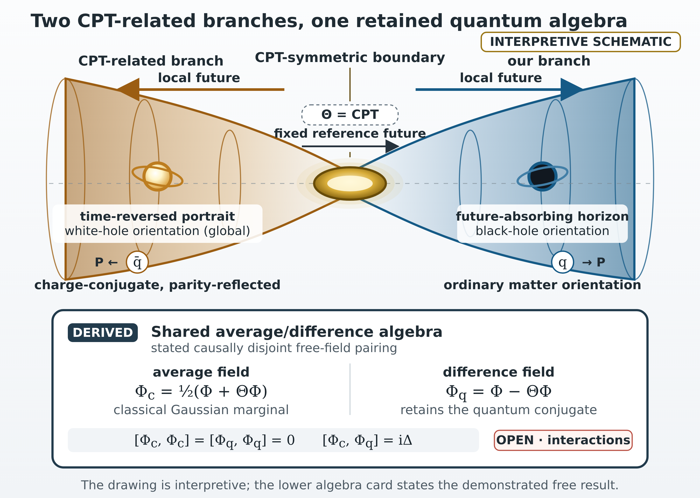
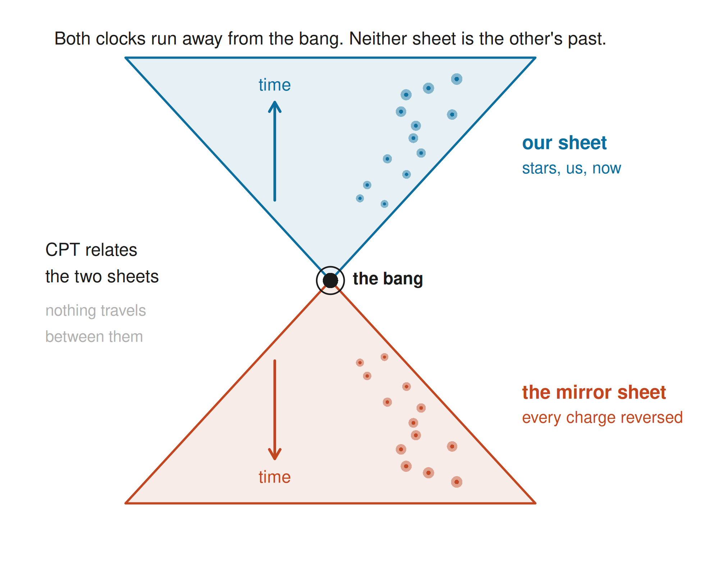
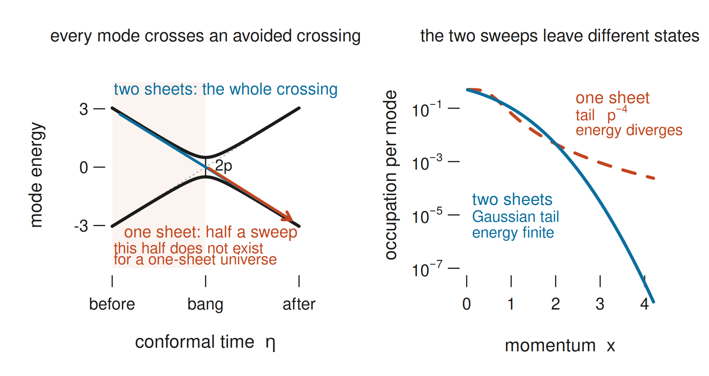
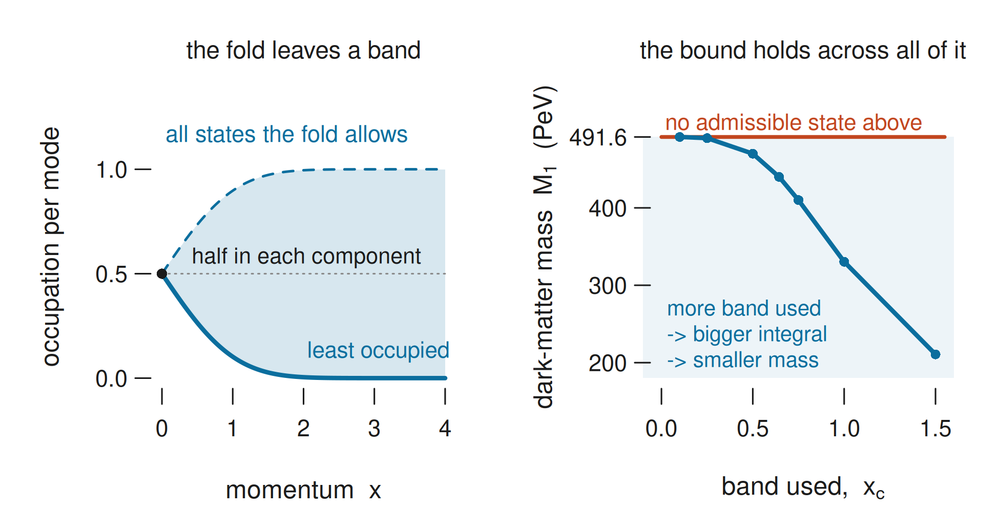
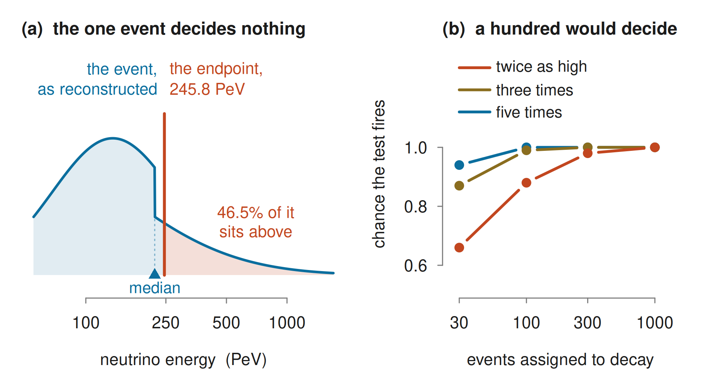
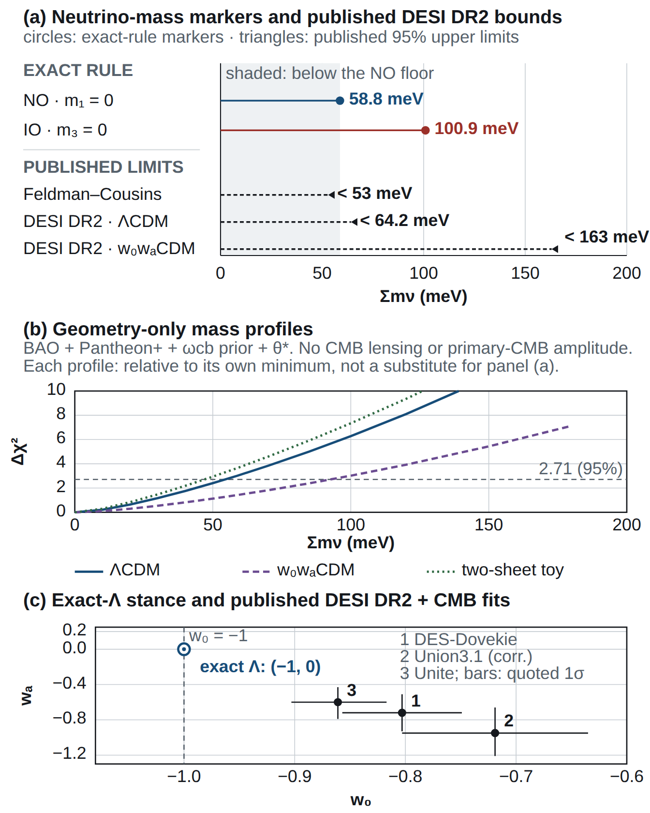
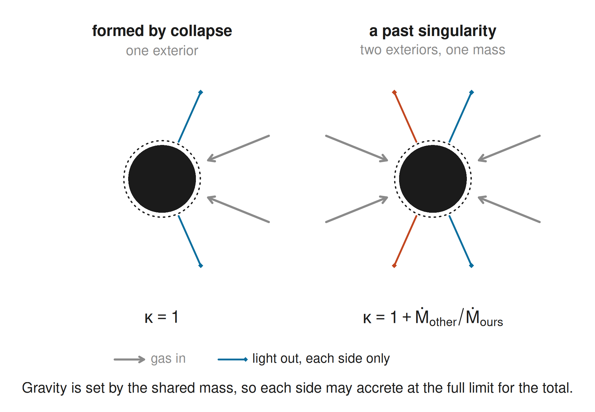

# Separate Ways and the Upside Down: a CPT fold, a ceiling on the dark matter, and the neutrino line that would break it

**B. H. Wiseman**

*Linnet Labs, Sydney, Australia*

*gr-qc (primary); astro-ph.CO, hep-th (cross-list).*

---

## Abstract

Two ways of thinking about a mirror-image universe had never been put together.
Cosmology gives the picture: treat CPT, which swaps matter for antimatter and reverses
time, as a property of the universe, not just of its laws, and the Big Bang has a far side,
a mirror universe running the other way. Algebraic quantum field theory says what such a map
can be, and which states it allows. Putting them together caps the
dark matter's mass at $491.6\pm2.0$ PeV.

This cap is derived not fitted, and holds for every state the symmetry permits. At the
bang each mode of the field has two states open to it and the mirror forces it exactly evenly
between them, an avoided crossing pinned by symmetry. That sets a
floor on how many particles come out, in pairs. The density is measured, so fewer particles means
a heavier one: the floor becomes a ceiling on mass. Both the cosmology and the candidate are earlier work; the ceiling is ours. The quoted widths carry measurement
error alone, at fixed production history. Theory error is larger and shifts the ceiling rather than blurring it: a
supersymmetric spectrum puts it at $530.5$ PeV.

The model is unusually easy to falsify. The particle's two-body decay gives a sharp neutrino line
at $245.8\pm1.0$ PeV, so one well-measured event above it refutes the model. It also forces the lightest neutrino to be massless, which puts the neutrino-mass sum on
its kinematic floor, $58.8$ meV.

The ceiling also closes the dark budget, so JWST's overmassive early black holes must come
from this relic, and the fold lets them grow faster than their own light allows: a hole with a
past singularity accretes from two exteriors at once. The same calculation over states with no entanglement lowers the cap to $270.30$ PeV, so a mass
above that means the universe made those pairs entangled. Given one premise the universe has no master clock at
all: physical states solve $H\psi=0$.

## 1. Introduction

Run the expansion of the universe backwards and it ends at a bang. What lies on the other side
is usually treated as unanswerable. One symmetry answers it: CPT, which swaps matter for
antimatter, reflects space and runs time backwards. No experiment has ever caught it failing.
That is a statement about the laws, and extending it to the universe
itself is a postulate, not a deduction. §3.6 lists everything that could contradict it. Suppose it holds of the
universe as a whole, the way it holds of every experiment inside it. Then the bang has a far side, and what is over there is our own universe with all three reversed.

Boyle, Finn and Turok built that cosmology [11,12,13]. Two sheets of spacetime meet at a bang
full of radiation, and CPT carries one sheet to the other. Their dark matter is a right-handed neutrino, a heavy and sterile particle that feels gravity and almost nothing else. Gravity alone
makes it at the bang. A quantum field stays empty only while spacetime changes slowly around it;
at the bang spacetime changes violently, and the field comes out populated. The number that comes out, set against how much dark matter we
measure, fixes the mass.

We keep both sheets, and call the map that carries one to the other the fold. It is antilinear,
which means it flips the sign of every $i$. That makes it a reversal of time, because a quantum state evolves by a factor
$e^{-iEt}$, so flipping the sign of $i$ does the same work as flipping
the sign of $t$. Time still runs forward for anyone living on either sheet. The far sheet is a mirror image, and nobody can go there, since nothing in the fold gives a route into our past.

To get a mass out of this picture you have to know how many of these particles the bang made. To
know that, you have to know what state the field was in when it happened, because the same
violent expansion acting on different states makes different numbers of particles. Boyle, Finn
and Turok chose the emptiest state, the one with the least energy. That is a reasonable choice
and it is still a choice: the mass they quote is the answer at one point in a space of
possibilities.

We leave the choice open and ask which states the fold permits at all. The answer is a whole
family of them, one free phase for every mode. The mass then comes out of the whole family at
once, because the argument is an operator inequality and covers every member without anyone
scanning through them.

The mechanism is an avoided crossing. At the bang every mode of the field obeys the same
equation a solid-state physicist meets when two energy levels sweep past one another. A state
that the fold maps to itself has to sit exactly half in each level as they cross, and that half-and-half occupancy floors the particle count. A pair can occupy four states: empty, one member, the other, or both.
Average the number operator over the two asymptotic regions, long before the bang and long after
it, and on those four states it cannot fall below
$n_*=(1-\sqrt{1-P})/2$, where $P$ is the chance that a mode jumps the gap as the levels cross.
This floor holds for every state the fold permits, pure or mixed, Gaussian or not. It holds too
when the pair is only part of a larger state entangled across different momenta, because a pair
taken out of such a state is still a state, and the bound covers all of them. The emptiest state reaches the floor exactly and nothing gets under it.

The same matrix yields a second result. Above $270.30$ PeV the produced pairs cannot have been
separable, so the mass and the entanglement are one statement (§3.1).

At fixed abundance, the more particles the bang makes, the lighter each one must be. The emptiest state therefore
returns the heaviest mass and every other permitted state returns a lighter one. Matching the
measured abundance then caps the dark-matter mass $M_1$, and with it the energy $E_\nu=M_1/2$ of
the neutrino released when one of these particles decays in two, and puts a floor under the sum
$\Sigma m_\nu$ of the ordinary neutrino masses:

$$
M_1\le491.6\pm2.0\ {\rm PeV},\qquad E_\nu\le245.8\pm1.0\ {\rm PeV},\qquad
\Sigma m_\nu\ge58.8\ {\rm meV}.
$$

Both of the other numbers carry a condition. The neutrino line at $E_\nu$ assumes the
particle can decay at all, which needs the sterile-species rule that keeps it stable to be
weakly broken (§2.4). We derive the floor under $\Sigma m_\nu$ in the exactly stable limit, with
the three neutrino masses normally ordered, and that derivation commits the model to dark energy
that is exactly constant.

That commitment costs the model its usual escape route. When neutrino-mass data push on a cosmology, the standard way to buy room is to loosen the expansion
history. The same DESI data allow $\Sigma m_\nu<64.2$ meV under $\Lambda$CDM but $<163$ meV once the dark energy is free to
evolve, a factor of two and a half [14]. We have given that up. One dataset now presses on the
expansion history and on the particle bound at once, and the model has nothing to trade.

The abundance match also spends the whole dark-matter budget on this one relic, whatever its
mass, and leaves nothing over for anything else dark. That is where JWST's overmassive early
black holes press. §3.4 quantifies the seeds those holes would need against the closed budget and
finds room for them, and it rules out the obvious way of making the seeds from the relic
itself, since statistical clumping falls twenty-four orders of magnitude short. A black-hole measurement and a
neutrino-telescope measurement are therefore tied together in principle, and in practice the tie is far too loose to pull
on.

Closing the budget also makes the model sensitive to a primordial population of those same
seeds, though not usefully. At the fractions observation still allows, a share $f<10^{-4}$ of
the dark budget, the ceiling moves by at most $0.02$ PeV, a hundredth of the quoted width
(§3.4).

Only the measured inputs go into those error bars, at fixed production history and particle
content. They are not a total theory error; §2.3 gives that budget and says what
it leaves out.

The mass is not all the fold does: it also fixes a direction of time between the two patches. Take
the algebra of observables in one observer's patch of spacetime. It carries its own notion of
time, the modular flow, which the state of the field picks out with no clock set by hand. Take the fold to be that algebra's modular conjugation, the reflection that comes paired with
that flow. Then the flow inside one patch runs opposite to the flow inside the patch on the far
side, measured against a single fixed direction of time. The two-sheet cosmology had to assume
exactly that. §2.1 derives it. Matching the patches to the two branches is an interpretation; we have not proved it. And the statement is about orientation; entropy does not enter it.

The fold ties the mass to one more thing. One integral does both jobs: it sets the ceiling,
and it sets when the two directions of time stop interfering at the bang. The decoherence time comes out as the two-thirds power of the dark-matter mass. That
power carries no free parameter, although its normalisation moves with the state (§3.5). So the same event fixes both a particle mass and the moment the two halves of time stop
reaching one another, and neither was chosen to suit the other.

§1.1 is the prior art: where each piece of the machinery comes from, and what is new here. It
is a credit section, and a reader who wants only the physics should go straight to §2. §2 builds the fold, the crossing and the abundance machinery in full; §3
the results and their tests; §4 what the assembly claims and where it can fail. Appendix A
carries the fold's algebra and the free-graviton sector, Appendix B the states at the bang,
Appendix C the quotient readings and two corrections to the literature, and Appendix D the
contact benchmark and the exact-$\Lambda$ derivation.

{width=100%}

*Graphical abstract: CPT-related branches and the retained quantum algebra. Widening lobes mark the adopted CPT-symmetric cosmology; each local future points away from the central
boundary, and the charge-conjugate, parity-reflected symbols imply no transport of matter between
branches. In the central panel sits the demonstrated algebra for the
causally disjoint free-field pairing. That panel marks an algebraic relation; it draws no physical
layer containing gravity. De Sitter space carries the physical free-graviton construction.
Horizon symbols illustrate orientation only. Relative to one fixed future the time-reversed portrait is white-hole oriented, while each
branch's observer uses a future-absorbing horizon. The minimal black-hole implementation retains ordinary absorbing
Kerr dynamics, and this model predicts no observable white-hole population, black-to-white transition or
traversable connection.*

### 1.1 The fold, and where each piece comes from

The fold is assembled from parts other
people made. This section names each part and says who owns it.

Embed de Sitter space in $\mathbb R^{1,4}$. There the antipodal map $\alpha$ sends every point to the one
diametrically opposite, which is total inversion, $X\mapsto-X$. Lift
total inversion antilinearly and it becomes the PCT prescription itself. Chang and Li use exactly
that to establish CPT invariance of the scalar theory on elliptic de Sitter [40], which is the
interpretation Gibbons introduced [2]. So the operator relating the two copies exists by the PCT
theorem and the geometry. We hypothesise something narrower: that the image under that operator
is the second leg of the closed time path, the contour that runs forward in time and then
back. This paper pairs the contour legs with that operator and keeps both sheets.
Others instead quotient spacetime by it, which is what the one-copy readings do and what the
companion tests, or impose a reality condition on the quotient, as Chang and Li do.

No one has put these two bodies of work together before. A citation count cannot prove that, and
we claim only what a search can show. On 22 September 2026, INSPIRE-HEP held 170 records citing the
papers that founded the CPT-symmetric programme [11,12,13]. None sets a CPT-related kernel joining
the two contour legs beside the symmetric thermal contour, and a full-text search of that set finds
no mention of modular conjugation. One of the 170 mentions Tomita-Takesaki, in an octonionic
unification programme that draws on Connes time and makes no such comparison. Searching the whole
of INSPIRE for "CPT-symmetric" together with "modular conjugation" returns one record, on the
Riemann hypothesis.

Every piece of the machinery does have an owner. The wedge-reflection theorems fix the involution. Sewell's theorem [4] and the de Sitter analysis of Borchers and Buchholz [5]
identify the modular conjugation of a static-patch vacuum algebra with a wedge reflection, and
Bisognano and Wichmann [42] supply the flat-space original. How that involution acts is fixed by two more results. Parikh, Savonije and Verlinde [3] show by parallel transport between antipodal points
that it acts on the tangent space by $PT$, and Chang and Li [40] give it at mode level: a phase
on the spherical harmonics, $Y_{\ell m}(\Omega_{\mathcal A})=(-1)^\ell Y^*_{\ell m}(\Omega)$;
the matching relation for the mode functions, $U(-\rho)=(-1)^\ell U^*(\rho)$; and a reality
condition on the field itself, $\phi(-x)=\phi^*(x)$.

Two others have related a pair of regions by a map of this kind, each for a different purpose.
Boyle and Deng [38] put fields on two sheets to attack fermion doubling: their Kähler-Dirac
field lives on a two-sheeted spacetime with the sheets related by $PT$ or by
$i\leftrightarrow-i$, and a reality condition pairs every particle on one sheet with a mirror
partner on the other. They note only that it may connect to CPT-symmetric universe models.
Bondarenko [41] relates the regions of an extended manifold by a CPT reversal and gives an
action equivalent to the Keldysh formalism, his section 8 comparing cross-region propagators
against Keldysh ones. That construction sits on the Kruskal extension, so it pairs the regions
of a black hole where this paper pairs the branches of a cosmology.

The contour itself is borrowed wholesale. Takahashi and Umezawa introduced thermofield
dynamics
[44], and
Israel and Maldacena put it to work at horizons [9,10]. The closed time path is Schwinger's and
Keldysh's [24,25]. Niemi and Semenoff [26] and Herzog and Son [27] gave the symmetric thermal
contour.

Harlow and Numasawa [39] set the precedent for Appendix A's moves. They argue that a spacetime
inversion in quantum gravity must be gauged, that the Hilbert space of a closed universe is real, and that
non-orientable manifolds must be admitted as configurations; we make the first two moves in
Appendix A and take their argument as motivation.
 

This assembly is new, and it secures one thing: the algebra and the cosmology stop being
independent. The wedge-reflection theorems fix the involution that the cosmological accounts
leave open. That involution, applied at the bang, returns the family of states the cosmology
needs. An operator inequality over that family turns the measured abundance into a bound. Boyle, Finn and Turok reach the saturating state by a minimum-energy prescription along a route
of their own, so the two derivations are independent.

**The horizon half.** The same involution can be carried to a black-hole horizon, and that half
of the work is in a companion paper, in preparation [48]. It tests three one-copy readings of the far side and
finds each fails on stated grounds, adopts an ordinary absorbing Kerr horizon with a transparent
seam, and sets out what a reflecting alternative would have to supply. The seam coefficient is an input there and not a derivation. None of the results below depend on any of it: the bound, the neutrino
line and the mass floor stand or fall on §§2 and 3 alone.

## 2. Methods

This section builds the fold as an operator, follows a single mode of the dark-matter field
through the bang, and turns the number of particles that come out into a mass. Nothing in §§2 and 3 depends on the companion: §3.5 reports one of its
results as context, and §4.3 is the only place one is used.

### 2.1 The fold as an antilinear structure on the algebra

**Figure 1.** The fold. Two copies of the universe meet at the bang, and CPT relates them.
Each copy has its own local arrow of time, and both run away from the bang, so neither sheet
lies in the other's past and the fold supplies no route between them. Everything in
this section is machinery for the operator $\Theta$ that implements the relation; a reader who
wants the result rather than the machinery can take this picture and go to §3.1.

Two maps do the work here, and they differ over whether anything stays put. Let $\alpha$ be the
free antipodal involution of the de Sitter cover, free meaning it maps no point to itself, and let
$J$ be the point map that the wedge reflection of Sewell [4] and Borchers and Buchholz [5]
implements; $J$ denotes the point map throughout, not the antiunitary. In the mode convention
used here

$$
\alpha=J\circ P_\perp,\qquad P_\perp Y_{\ell m}=(-1)^\ell Y_{\ell m}.
$$

$P_\perp$ reverses orientation on the bifurcation sphere and lies outside the connected de Sitter
group, so no rotation absorbs it. $J$ holds that sphere still, point by point, while $\alpha$
moves everything. That difference is the whole of the geometric proposal. On de Sitter the embedding fixes $\alpha$. At a
general bifurcate Killing horizon the bifurcation surface may carry several free involutive
isometries and nothing selects one, so there $P_\perp$ is an input (companion, A.10).

The one-copy readings take spacetime to be the quotient, the space got by declaring each point
and its antipode to be one point, and implement $\alpha$ linearly on fields. The fold keeps the
double cover instead, where the two stay distinct and a time orientation survives, and equips
its field algebra with an antilinear lift

$$
\Theta i\Theta^{-1}=-i,\qquad \Theta\phi(f)\Theta^{-1}=\phi(f\circ\alpha).
$$

The fold implies no trajectory through spacetime. The two readings need not share admissible states, global observables or
response laws.

Write the two fields as $\Phi$ and $\Theta\Phi$. Because $\Theta$ is an involution the pair
splits into parts even and odd under it. The fold offers exactly one such decomposition and this
is it: $\Theta$ fixes the even combination and flips the sign of the odd one. Those parts are the
Keldysh variables,

$$
\Phi_c=\frac{\Phi+\Theta\Phi}{2},\qquad \Phi_q=\Phi-\Theta\Phi.
$$

For real test functions supported in one static patch, with the antipodal partner causally
disjoint so that $\Delta(f,g\circ\alpha)=0$, time reversal changes the sign of the causal kernel
while antilinearity changes the sign of $i$. Each field's commutator with itself carries the opposite sign to the other's, the commutator
between the two fields vanishes, and

$$
[\Phi_c,\Phi_c]=[\Phi_q,\Phi_q]=0,\qquad [\Phi_c,\Phi_q]=i\Delta,
$$

the standard closed-time-path algebra, with $\Delta$ the causal commutator kernel. The doubled
algebra is Takahashi and Umezawa's [44]: for left and right multiplication $L_AX=AX$ and
$R_AX=XA$, one has $[L_A,L_B]=L_{[A,B]}$, $[R_A,R_B]=-R_{[A,B]}$ and $[L_A,R_B]=0$, which for
free fields with a central commutator give exactly the algebra above. The average has a
classical Gaussian distribution, but average and difference together remain a quantum system,
and keeping both retains the conjugate information that a projection onto the average alone
would discard.

The fold adds the spacetime involution, its state implementation, and its compatibility with the
free gravitational constraints (Appendix A).

One consequence converts an assumption of the cosmological accounts into a theorem.
Tomita-Takesaki supplies, for an algebra $A$, a modular operator $\Delta_A$ alongside $J$; the
subscript carries throughout and keeps it apart from the causal kernel above.
For a wedge the modular flow is the boost.
In the embedding that boost is $K=X_0\partial_1+X_1\partial_0$, so $dX_0/ds=X_1$, positive
throughout the right static patch and negative throughout its antipodal partner. Relative to one
fixed time orientation the two patch algebras' modular flows run oppositely, so the opposite time
orientation of the two copies follows from reading $\Theta$ as the modular conjugation. This claim has limits. It is a statement about orientation and not about entropy, since an equilibrium
modular flow does not grow entropy. And the relation at work is
$\Delta_{A'}=\Delta_A^{-1}$ between an algebra and its commutant, not a property of the conjugation, since conjugating the modular
flow leaves it where it was, $\Theta\Delta_A^{is}\Theta=\Delta_A^{is}$. Identifying the two patches with the expanding and contracting branches is a separate
interpretive step, and §3's numbers use none of the patch
algebra.

### 2.2 The bang as an avoided crossing

A mode crossing the bang does what a two-level system
does when its levels sweep past one another. That is the whole mechanism, and everything below
follows from it.

At a radiation bang the Ricci scalar vanishes and $a''=0$; massless free fields are conformal in
this background
while a mass term can distinguish the two orientations. With $a(\eta)=a_1\eta$ the conformal
mass term is $ma=\gamma\eta$, $\gamma=M_1a_1$, and a fermion mode of comoving momentum $p$
obeys

$$
i\,\partial_\eta\psi=\begin{pmatrix}\gamma\eta & p\\ p & -\gamma\eta\end{pmatrix}\psi.
$$

This is the Landau-Zener problem, with the momentum as the gap and $\gamma$ as the sweep rate.
The results below are checked by direct integration at $\gamma=1$.

*The fold on one mode.* $H$ is real and symmetric and $H(-\eta)=\sigma_xH(\eta)\sigma_x$, so
the antilinear map $\Theta:\psi(\eta)\mapsto\sigma_x\psi^*(-\eta)$ preserves the equation and
satisfies $\Theta^2=1$. Invariance as a ray requires $\sigma_x\psi^*(0)=e^{i\delta}\psi(0)$,
which forces $|\psi_1(0)|=|\psi_2(0)|=1/\sqrt2$: the mode is exactly half in each component at
the bang. One relative phase survives, $\psi(0)\propto(1,e^{i\mu})/\sqrt2$, and since
the minimising phase moves with $p$ it is a phase function $\mu(p)$ rather than a single number.

**Figure 2.** What the fold does to one mode. *(a)* The two components of a mode, integrated
through the bang. Before and after, each component goes its own way; at the bang
$\Theta$-invariance pins both to exactly one half. *(b)* Three members of the family. They agree
at the bang and nowhere else, which is the one free phase per mode that survives. Time here is
the conformal time $\eta$ of the mode equation above, in units of $\gamma^{-1/2}$, so the axis
runs over the few sweep times either side of the crossing rather than over any fixed physical
interval; the curves are drawn at $p=0.6$ in those units. They are a direct integration of that
equation, calculated in R, with the $\Theta$ relation, the norm and the half-and-half value all
verified before anything is drawn.

*What is prior.* Nadal-Gisbert, Navarro-Salas and Pla [31] give, for a fermion in a
CPT-invariant radiation-dominated universe, the mode relation $h^I_k(\tau)=h^{II*}_k(-\tau)$ as
the condition for a CPT-invariant vacuum (their eq. 66); the consequence
$|h^I_k(0)|=|h^{II}_k(0)|=1/\sqrt2$ at the bang (68); the one-parameter family
$h^I_k(0)=e^{+i\Theta_k}/\sqrt2$, $h^{II}_k(0)=e^{-i\Theta_k}/\sqrt2$ with $\Theta_k$ an
arbitrary angle in their notation and not the fold operator of §2.1 (69); and the ultraviolet decay $\Theta_k\sim-\gamma/4k^2+\dots$ that Hadamard
regularity requires of it (80). We impose the first as the condition defining the fold. This section reaches the next two
by a different route, and §4.1 reaches the fourth. We claim no priority for them, and the agreement is a check on both
derivations.

Boyle, Finn and Turok parametrise the same family as $|\hat\beta_\pm(p)|^2=[1-\cos2\eta(p)\cos\lambda(p)]/2$, in which $\eta(p)$ is
their mixing angle and not the conformal time of this section, so that
$n_\eta-n_0=\cos\lambda(p)\,\sin^2\eta(p)\ge0$ with $\cos\lambda>0$ on the established range
$-\pi/2<\lambda(p)<\pi/2$, and state that the particle number density is minimised at
$\eta(p)=0$, where their state has both minimum expected particle density and minimum energy
density [12]. That minimising state is one member of the family the fold permits, and this
paper keeps the family.

*Two sheets complete the crossing.* The Landau-Zener closed form applies to a sweep from
$\eta=-\infty$ to $+\infty$. Throughout, "in" means $\eta\to-\infty$ and "out" means $\eta\to+\infty$, and the in vacuum is the state with no particles in the $\eta\to-\infty$ region, so its out-region occupation is $|\beta|^2$. A single-sheet cosmology begins at the bang, so it gets only half a sweep.
The full sweep returns $|\beta|^2=e^{-\pi p^2/\gamma}=e^{-x^2}$, in the dimensionless momentum
$x=\sqrt\pi\,p/\sqrt\gamma$, to a maximum relative error
of $5\times10^{-3}$ across $p\in[0.1,1.4]$, the "in" vacuum of Appendix B.1. The sweep from
$\eta=0$ returns the $\gamma^2/16p^4$ tail of the bang-adiabatic state, the sweep giving ratio $1.1145$ and log-slope $-4.305$ at $p=2$ against
the $1.114$ and $-4.308$ that B.1 derives independently. $\Theta$-invariance alone does not separate the two, because the bang-adiabatic state
is itself in the family, at $\mu=\pi$. The energy integral separates them; it diverges logarithmically at $\mu=\pi$ and converges by $x\simeq3$ at the
minimising phase $\mu_*$. The fold supplies the family;
regularity excludes a member.

**Figure 3.** Every mode at a radiation bang passes through an avoided crossing; the gap at
closest approach is $2p$. A universe with one sheet begins at the bang and gets half the sweep.
A universe with two runs the whole way through. The right panel shows what each leaves behind: the
half sweep produces a $p^{-4}$ occupation tail whose energy integral diverges logarithmically,
and the whole crossing produces the Gaussian the observed abundance needs. The curves are the
closed forms; the one-sheet curve is drawn as an illustrative profile with the stated tail index
rather than a particular state.

*The adopted occupation.* In the dimensionless momentum $x=\sqrt\pi\,p/\sqrt\gamma$ the
least-occupied member of the family is

$$
n(x)=\frac{1-\sqrt{1-e^{-x^2}}}{2},
$$

Boyle, Finn and Turok's half-angle state. Two numbers come out of it: the production integral
$I$, which is the comoving number density the abundance match needs, and the ratio $R$, which
§3.5 uses as the branch-distinguishability exponent per produced particle. They are

$$
I=\frac{1}{\pi^2}\int_0^\infty x^2n(x)\,dx=0.0127597,\qquad
R=\frac{\int_0^\infty x^2[-\log(1-n(x))]\,dx}{\int_0^\infty x^2n(x)\,dx}=1.07037.
$$

Write $I_0$ for that value of $I$. Where a later section quantifies a different admissible state,
$I$ is that state's integral and $I_0$ the minimum profile's. The occupation function and $I$
come from BFT [12,13]; the companion retains
$I=0.0127596673634$ as a quadrature check for the fixed occupation function.

### 2.3 From abundance to mass

Divide how much dark matter there is by how many particles the
bang made and what is left is a mass. Two things make that division worth a section: one of the
standard inputs is usually quoted three and a half per cent too high, and the error that matters
is not the one the arithmetic propagates.

The small-Weyl-coupling abundance branch of BFT gives
$M_1\propto\rho_{\rm DM,0}^{2/5}s_0^{-2/5}I^{-2/5}\widehat\mu^{3/5}$. The reconstruction uses
$\rho_{\rm DM,0}=9.7\times10^{-48}$ GeV$^4$, $s_0=2.2215\times10^{-38}$ GeV$^3$,
$\widehat\mu=5.966\times10^{18}$ GeV for the Planck-scale mass parameter that branch carries,
numerically $\sqrt6$ times the reduced Planck mass, and $g_*=106.75$, all treated as exact, and
returns

$$
I\simeq0.01276,\qquad M_1=4.916\times10^8\ {\rm GeV}.
$$

One of those inputs is usually quoted wrongly. The entropy density is often given as
$2.3\times10^{-38}$ GeV$^3$, which is high by $3.5$ per cent; $s_0=2891.2$ cm$^{-3}$ is
$2.2215\times10^{-38}$ GeV$^3$. Since $M_1\propto s_0^{-2/5}$, the benchmark computed with the
higher value comes out at $484.8$ PeV and the half-mass energy at $242.4$ PeV, a shift of $6.8$
PeV against a propagated width of $2.0$. The digits in $491.6$ PeV record how the
arithmetic follows from the inputs; the physical scales are about $490$ and $245$ PeV. What stays an
input is the state, the radiation history and the branch, and the separate large-Weyl-coupling
branch changes the mass.

The width propagates the measured inputs. The abundance enters at the two-fifths power and is
known to one per cent from $\Omega_{\rm DM}h^2=0.1200\pm0.0012$, contributing $0.40$ per cent;
the entropy density is fixed by $T_{\rm CMB}$ to $0.07$ per cent and contributes $0.026$; the
production integral is a quadrature of a fixed function and the reduced Planck mass a CODATA
constant, both negligible. Almost all of that variance is the abundance's, giving $\pm2.0$ PeV on
the mass and $\pm1.0$ PeV on the half-mass energy.

This width contains no allowance for a different history or a wrong production model, and either moves the endpoint
by far more than $2$ PeV: a per cent of theory error anywhere in the reconstruction moves the
endpoint by about $2$ PeV on its own. Four terms shift the number rather than blur it: the Landau-Zener
treatment, $g_*=106.75$, the choice of branch and the radiation history.

The particle content is the largest of them and it can be quantified, since
$M_1\propto g_*^{1/10}$: Standard Model content at production gives the quoted $491.6$ PeV, a
supersymmetric spectrum $530.5$, a shift of $38.9$ PeV or nineteen times the propagated width,
and a further hidden copy of the Standard Model, four times its content, gives $564.8$. It does
not run away, because the exponent is a tenth and quadrupling the degrees of freedom moves the
mass by fifteen per cent. In that sense the ceiling is a narrow band rather than a number, and
$491.6$ is its value on Standard Model content. State freedom
is different: a different admissible state changes the abundance-matched mass below the ceiling
(§3.1) and does not move the ceiling.

### 2.4 The decay model

We adopt Boyle, Finn and Turok's particle content and sterile-species stabilising rule [12,13].
If the rule is exact the chosen sterile neutrino cannot decay, and one light neutrino is
massless in the stated seesaw approximation. A small added Yukawa column supplies a concrete
weakly broken example, with a hard two-body neutrino energy near half the heavy mass and
branching $h\nu:Z\nu:W\ell=1:1:2$ at tree level.

This $1{:}1{:}2$ split is not an extra input. The complex Higgs doublet has four real components, and for
$M_1\gg m_W$ the equivalence theorem turns the longitudinal gauge bosons into
the eaten Goldstones.
The open channels are therefore $\nu h$, $\nu G^0$, $\ell^-G^+$ and $\ell^+G^-$: two neutral and
two charged, hence $1:1:2$, and a hard-neutrino yield of $2/4$ per decay. Corrections go as
$O((m_V/M_1)^2)$, which is $3\times10^{-14}$ here. In that regime the particle decays to the Goldstones, whose coupling is the Yukawa itself, so the vector and axial conventions for
$Z\nu\nu$ never enter.

The lifetime and the flavour direction are further inputs, and radiation and propagation shape
any observed spectrum. In the companion we check that the induced changes to the light-neutrino mass and to the
abundance can both be negligible. The KM3NeT event [30] is observational context. We do not offer it as
evidence for this particle.

### 2.5 The tests

The endpoint test draws events from an $E^{-2}$ spectrum above 50 PeV, truncated at the true
endpoint, and smears them with a lognormal response of width $0.3$ in $\ln E$. The threshold is
set so that a population obeying the model fires the test with probability $0.05$ whatever the
sample size, and the power is the probability of firing when the true endpoint is $r$ times the
model's. A fixed per-event threshold
would not do, because its sample-wide false alarm grows with the sample; that is why the calibrated threshold climbs
with $N$ in Table 2.

That test assumes the events belong to the decay component in the first place. Deciding that is
a separate question, and direction answers it: a decaying halo traces the line-of-sight integral
of the dark-matter density, and an astrophysical population does not. The
numbers assume an NFW halo and uniform exposure, and are quoted both for a Galactic-only flux
and with the extragalactic component this model predicts alongside it.

For the neutrino-mass sum the floor is $\sqrt{\Delta m^2_{21}}+\sqrt{\Delta m^2_{31}}$, with
global-fit central values and symmetric one-sigma errors
$\Delta m^2_{21}=(7.53\pm0.18)\times10^{-5}$ eV$^2$ and
$\Delta m^2_{31}=(2.510\pm0.030)\times10^{-3}$ eV$^2$. That is the one set used wherever the
floor's width is quoted.

That floor has to be set against a measurement, and the measurement is DESI DR2. The comparison rests on an approximation that we make and the DESI authors do not make. Elbers et al. publish a profile likelihood for their BAO+CMB analysis [14], Gaussian with
$\mu_0=-0.036$ eV and $\sigma=0.043$ eV, obtained by maximising over the nuisance and
cosmological parameters at degenerate masses. We treat that profile as a proxy likelihood under
a flat non-negative-mass prior. A profile is not a marginalised
posterior, and matching one quantile does not reconstruct a distribution.

We can quantify the approximation's error. Truncate the profile at zero, renormalise, and it
returns a ninety-five per cent upper limit of $63.9$ meV against the $64.2$ meV DESI quote, a
difference under half a meV. And three toy
shapes matched to the published limit at the ninety-fifth percentile, an exponential from zero,
a half-Gaussian at zero and a flat posterior, bracket the shape dependence.

The floor is a point prediction and the DESI bound is one-sided, so the comparison needs a
method built for that pairing. We use a region of practical equivalence, a ROPE, the standard
treatment of a point prediction against a bounded measurement, borrowed here from Bayesian psychometrics. Its width is the floor's own
propagated width, fixed before the posterior is partitioned into mass inside and outside it, and
it replaces two one-sided constructions with one statement.

## 3. Results

This section turns the fold into numbers that can be measured. None of them uses an
input from the companion.

### 3.1 The mass is a ceiling over every admissible state

The crossing makes pairs, one particle at momentum $p$ and one antiparticle at $-p$. Its mass
is $M_1$, and on this model that one species is the whole of the dark
matter.

The two halves of the bang are $\eta<0$ and $\eta>0$. This paper calls them the sheets, and calls them the branches when the
direction of time is what matters. The in and out regions are their far ends, $\eta\to-\infty$ and $\eta\to+\infty$. Write $a$ and $b$ for the
operators that remove the two members long after the bang, and $a_-,b_-$ for the same two modes
long before it. Because the evolution is free, the two descriptions are related
by a rotation that mixes making a pair with destroying one, and the crossing fixes its angle.

Take the out operators $a,b$ of a pair and absorb phases so the in operators are
$a_-=c\,a+s\,b^\dagger$ and $b_-=c\,b-s\,a^\dagger$, with $c=\sqrt{1-P}$, $s=\sqrt P$ and
$P=|\beta|^2$ the production probability of the crossing, and with $\{a,b\}=\{a,b^\dagger\}=0$.
The subscript on $N_\pm$ labels the asymptotic region, not the mode: each counts both members of
the pair and halves, so
$N_+=\tfrac12(a^\dagger a+b^\dagger b)$ in the out region and
$N_-=\tfrac12(a_-^\dagger a_-+b_-^\dagger b_-)$ in the in region, and $Q=(N_++N_-)/2$. On the four-dimensional pair block, in the basis
$\{|00\rangle,|10\rangle,|01\rangle,|11\rangle\}$,

$$
Q=\begin{pmatrix} P/2 & 0 & 0 & \tfrac12\sqrt{P(1-P)}\\ 0&\tfrac12&0&0\\ 0&0&\tfrac12&0\\
\tfrac12\sqrt{P(1-P)} & 0 & 0 & 1-P/2\end{pmatrix}.
$$

Throughout, $|11\rangle\equiv a^\dagger b^\dagger|00\rangle$. The entries follow from the rotation
above, and a reader who takes them on trust can go straight to the eigenvalues. Acting on
$|00\rangle$, $a_-=ca+sb^\dagger$ leaves $s\,|01\rangle$ and $b_-=cb-sa^\dagger$
leaves $-s\,|10\rangle$ (noting $a^\dagger|00\rangle=|10\rangle$), so both number operators
contribute $s^2$ and $\langle00|N_-|00\rangle=s^2=P$; acting on $|11\rangle$ the creation
pieces annihilate and the annihilation pieces survive, giving $c^2$ each and
$\langle11|N_-|11\rangle=c^2=1-P$; the cross term is the $cs\,a^\dagger b^\dagger$ piece,
which carries $|00\rangle$ to $|11\rangle$ with coefficient $cs=\sqrt{P(1-P)}$. The ordering
convention fixes that sign: $|11\rangle\equiv b^\dagger a^\dagger|00\rangle$ would flip the
off-diagonal to $-cs$. The matrix is real and symmetric either way, so Hermitian either way,
and the two give identical eigenvalues. Adding $N_+=\mathrm{diag}(0,\tfrac12,\tfrac12,1)$ and halving
gives the matrix above. Pair creation mixes $|00\rangle$ with $|11\rangle$ and leaves the
single-particle states alone, so the odd-parity eigenvalues are exactly $\tfrac12$ and the rest is a two-by-two block of trace
$1$ and determinant $P/4$. Its eigenvalues are therefore $(1\pm\sqrt{1-P})/2$, and the spectrum
is $\{n_*,\tfrac12,\tfrac12,1-n_*\}$ with $n_*=(1-\sqrt{1-P})/2$, so

$$
Q\ \succeq\ n_*\,\mathbf 1.
$$

**Figure 4.** The floor under every admissible state. *(a)* The averaged number operator on the
pair block, in the four states of a produced pair, at $P=\tfrac12$. Pair creation mixes only the
empty and doubly occupied states, at this and every $P$, which is why the two single-particle
entries are left alone.
*(b)* Its four eigenvalues against the crossing's transition probability. Two sit at exactly
$\tfrac12$ whatever the bang does, and the lowest is $n_*$. No admissible state, pure or mixed,
reaches into the shaded region. That floor is what becomes the ceiling on the mass, since the
abundance match sends a larger production integral to a smaller $M_1$. Eigenvalues are computed
numerically and checked against the closed form at every $P$ tried.

Because the inequality is a statement about a matrix (Figure 4), it survives anything that keeps
the block a block. Suppose the two sheets decohere one another during the crossing, so that the
pair emerges mixed rather than pure. That is not an escape: a decohered state is still a state,
its occupation is still bounded below by $n_*$, and driving the populations toward equipartition
only raises the production integral. Since $M_1\propto I^{-2/5}$ the mass moves
down, so the ceiling holds a fortiori and decoherence at the bang cannot be used to lift it.

The inequality is tight, and that matters for how it should be read. A reader who takes it as a
relaxation of an optimisation over states, in the sense of the moment-matrix hierarchies used for quantum
bounds [55, 56, 57], which approximate an optimisation over states by a tower of ever-tighter
relaxations, will expect a higher level to return something stronger. They cannot
here: the minimising eigenvector satisfies the contact condition $\langle N_+\rangle=\langle
N_-\rangle$ to machine precision at every $P$ and attains $n_*$ exactly, so the infimum is
reached by an admissible state and there is nothing above it to find. That literature does supply the right name for the object, a positivity certificate over a
constrained set of states. It also explains why the separable competitor treated next reduces
so simply: minimising a linear functional over the separable set is settled by a bound on the even-block
coherence together with the contact condition.

At $P=0.05,0.2,0.5,0.8,0.95$ the least eigenvalue equals $n_*$ to machine precision and the
transformation is canonical to $10^{-16}$.
The spectrum is also built independently from the anticommutation relations, with the
Jordan-Wigner string written out, since the pair-creation terms in $N_-$ add rather than cancel
and a reader who treats the two modes as commuting will get a diagonal $N_-$ and a different
floor.
Every member of the family has equal in- and out-region occupations, and that is a consequence
rather than a further input. The fold exchanges the two asymptotic regions, so
$\Theta N_-\Theta^{-1}=N_+$; for a $\Theta$-invariant state and any hermitian $A$,
antilinearity conjugates the trace, giving
$\langle\Theta A\Theta^{-1}\rangle=\mathrm{Tr}(\rho A)^*=\langle A\rangle$ since
$\langle A\rangle$ is real, and $A=N_-$ then gives
$\langle N_+\rangle=\langle N_-\rangle$. The minimising state is obtained as the lowest
eigenvector of $Q$ with no such condition imposed and satisfies it to machine precision at
every $P$. One thing stays an input: that the fold exchanges the regions at all, which is what §2.1 takes it to be. Such a state
therefore satisfies $\langle N_+\rangle\ge n_*$, and integrating $n_*$ with $P=e^{-x^2}$ returns the $I=0.0127597$
of §2.2.

Nor does working one pair at a time restrict the class of transformations covered. Bloch-Messiah
makes any fermionic Bogoliubov transformation a direct sum of independent two-mode squeezings in
a suitable basis, so a transformation that couples different pairs is the same content in
another basis. The result is checked here, not taken from elsewhere: for cross-paired chain generators and for random
antisymmetric ones, with canonicity verified on the Fock space each time, the least eigenvalue
of $Q$ equals the mean of $n_*(P_k)$ over the canonical channels to $6\times10^{-16}$. The pairwise treatment is justified by Bloch-Messiah, not adopted as an
approximation. What reduces is the total number, and the bound needs nothing more. The basis change does not preserve entanglement relative to an
arbitrary original mode partition, and a fully general decomposition also carries blocked and
inert channels, so the reduction should not be carried over to the entanglement statements
below.

The inequality assumes no pure state, no Gaussian density matrix and no factorisation of the
global state over momenta: a block reduced from an entangled multimode state is still a density
operator and the inequality applies to it. It also survives the sum over modes, which is what the
abundance needs. $\langle Q_k\rangle$ depends on the reduced state $\rho_k$ alone, every reduced
state is a density operator however the global state is correlated, so
$\sum_k\langle Q_k\rangle\ge\sum_k n_*(p_k)$ with no factorisation assumed. Entanglement across
momenta cannot lower the production integral, checked against generic entangled multimode states
and against the state that saturates the bound exactly.

It does assume free Bogoliubov evolution, the stated asymptotic particle definitions and equal
in- and out-region number expectations. That last condition has a tolerance rather than being
all or nothing. Writing the asymmetry
$\delta=\langle N_+\rangle-\langle N_-\rangle$, the identity
$\langle N_+\rangle=\langle Q\rangle+\delta/2$ makes the degradation linear with coefficient
exactly one half, and it is one-sided: an out-region excess lowers the ceiling and leaves the
quoted figure conservative, while only a deficit raises the true ceiling above it. Two per cent of asymmetry moves the ceiling by its full quoted width.
Further out the degradation stays mild, because it is linear: a five per cent deficit gives
$496.6$ PeV, ten per cent $501.8$ and twenty per cent $512.8$. Ten widths of movement therefore requires twenty per cent of
asymmetry. It would have to be a deficit, and gravitational production cannot make one, because
it creates pairs rather than removing them.

The inequality is not a theorem about the interacting theory, and at $P=1$ the even block is degenerate, so the
zero-momentum limit is excluded from any uniqueness statement. Within those assumptions no
admissible state returns a smaller production integral than the least-occupied member. Since
$M_1\propto I^{-2/5}$, every other state returns a smaller mass, and

$$
M_1\le491.6\pm2.0\ {\rm PeV},\qquad E_\nu=M_1/2\le245.8\pm1.0\ {\rm PeV},
$$

with equality requiring $\eta(p)=0$ wherever $\cos\lambda$ and the integration weight are
nonzero. *The ceiling is also an entanglement witness.* If the pairs the bang makes carry no entanglement
the mass comes out lower, so a mass securely measured above $270.30$ PeV is evidence that they
carried some. The inequality holds over all admissible states.
Ask the narrower question of whether a *separable* out-pair marginal can match that production
integral. It cannot, and the proof needs no geometry of the separable set. Two facts suffice:
separability bounds the even-block coherence, $|\rho_{00,11}|\le n(1-n)$, in which $\rho$ is the
out-pair density matrix in the block spanned by $|00\rangle$ and $|11\rangle$ and $n$ its
occupation, and the contact condition forces $\mathrm{Re}\,\rho_{00,11}=P(n-\tfrac12)/\sqrt{P(1-P)}$. Saturating the first
against the second puts the separable floor at the root of

$$
\frac{P(\tfrac12-n)}{\sqrt{P(1-P)}}=n(1-n),
$$

which is $0.190983$ at $P=0.2$ and tends to $\sqrt P/2$ as $P\to0$, where the constraint
degenerates. Integrating it returns $I_{\rm sep}=0.0569210=4.4610\,I_0$, so

$$
\text{all out-pair marginals separable}\quad\Longrightarrow\quad M_1\le270.30\ {\rm PeV},
$$

with a half-mass line at $135.15$ PeV. A mass securely inferred above $270.30$ PeV therefore
requires entanglement in the pairs carrying weight in the integral.

*And the amount is fixed, not merely required.* Concurrence is the standard measure of how
entangled a two-state pair is, zero when it is not entangled and one when it is maximally so.
On the even block the contact condition forces
$\mathrm{Re}\,\rho_{00,11}=P(n-\tfrac12)/\sqrt{P(1-P)}$, so the concurrence
$C=2|\rho_{00,11}|$ obeys
$C\ge2|n-\tfrac12|\sqrt{P/(1-P)}$, and at the least-occupied state that floor is saturated. Since
$n_*(1-n_*)=P/4$ identically, both sides equal $\sqrt P$, giving

$$
C(x)=\sqrt{P}=e^{-x^2/2}.
$$

That equality belongs to the saturating state rather than to the family, and the difference
matters. The inequality $C\ge2|n-\tfrac12|\sqrt{P/(1-P)}$ holds on the even block, and only there: a separable contact-satisfying state at $P=0.2$ has $n=(3-\sqrt5)/4=0.190983$ and $C=0$ against the expression's $0.309017$, because its weight is not confined to that block. It also says nothing at $n=\tfrac12$, where the bound collapses to $C\ge0$ and the family contains admissible states of any concurrence at all: at $P=0.2$
both $(|00\rangle+i|11\rangle)/\sqrt2$, with $C=1$, and the mixture
$\tfrac12(|00\rangle\langle00|+|11\rangle\langle11|)$, with $C=0$, satisfy
$\langle N_+\rangle=\langle N_-\rangle$ to machine precision while $\sqrt P=0.447$. The
statement is therefore conditional, on the condition the ceiling already carries. If the mass
sits at its ceiling the state is the saturating one, and the entanglement is then the square root
of the crossing's transition probability mode by mode rather than a free parameter. It tends to
one in the deep infrared, so the longest-wavelength pairs are Bell states. Both
statements inherit the assumptions above, concern out-pair marginals rather than the two sheets,
and describe what a measured mass would certify rather than anything measured.

*How much entanglement, in a unit a person can hold.* All of what follows is the saturating state's, by the same conditional. Integrating the
pair entropy against the same weight as the production integral gives $3.58$ nats per pair, and since the occupation is counted per pair member, each relic particle carries $1.79$ nats,
or $2.58$ bits. At the number density the abundance match gives, $2.6$ particles per cubic
kilometre,
the dark matter carries about $6.6$ bits of pair entanglement per cubic kilometre, and $61$ per
cent of the production integral is carried by modes still more than half entangled. Every one of those particles is one
half of a pair whose partner has exactly opposite momentum.

*A wrong inference to head off.* This pattern invites a wrong inference. Two
copies related by an antilinear map is the structure of a thermofield double, whose partner
trace is a Gibbs state, so one might expect the relic to be thermal. It is not. Writing the
Fermi-Dirac form that matches the far tail, $n_{\rm FD}=C^{2}/(4+C^{2})$, which is a fugacity
$\tfrac14$ at temperature set by $x^{2}$, both it and $n_*$ are functions of the concurrence
alone, and they differ by

$$
n_*-n_{\rm FD}=\frac{1-\sqrt{1-C^{2}}}{2}-\frac{C^{2}}{4+C^{2}}=\frac{C^{4}}{8}+O(C^{6}).
$$

The relic is thermal exactly where it carries no entanglement and departs from thermality
exactly where it carries most: at $C=1$ it is occupied two and a half times as much as a
thermal state of the same fugacity. That matters for the abundance rather than being a curiosity, because $61$
per cent of the weighted occupation comes from modes with $C>\tfrac12$. The production integral is
dominated by the modes a thermal calculation would get wrong, so the mass here is not a
thermal-relic mass arrived at by another route. None of this sits against the modular account
of §4.1, where the KMS property returns the Gibbons-Hawking temperature: that belongs to the de
Sitter vacuum restricted to a static patch, where a horizon and a temperature are the point.
This is the pair block at a radiation crossing, a different region and a different state, and
what the fold supplies in both places is the map rather than a temperature.

The least-occupied member is the saturating case rather than a state a principle picks
out, and the selection criteria of BFT and of Nadal-Gisbert, Navarro-Salas and Pla remain what they were: additional inputs.

**Figure 5.** Why the mass is a ceiling. Left: $\Theta$-invariance forces every mode half into
each component at the bang, so the band of allowed occupations has zero width in the deep
infrared and opens with momentum; the solid curve is the least-occupied member and the dashed one
its particle-hole conjugate. Right: the mass each member of the family returns. Every excursion
into the band raises the production integral, and $M_1$ falls as $I^{-2/5}$, so the
least-occupied member sits at the top.

Unitarity makes the family symmetric about a half, $n_{\max}=1-n_{\min}$, checked to seven
figures. At $p=0$ the Hamiltonian is diagonal, no mixing occurs and $n=1/2$ for every $\mu$, so
the band has zero width in the deep infrared. The upper branch is inadmissible on its own, since
$n_{\max}\to1$ gives a divergent number density. Table 1 quantifies the worst admissible excursion,
a state at the band edge out to a dimensionless momentum $x_c$ and at the minimum beyond it.

**Table 1.** The mass lost to the surviving freedom.

| $x_c$ | $I/I_0$ | $M_1$ (PeV) | line (PeV) |
|---|---|---|---|
| 0.10 | 1.000 | 491.6 | 245.8 |
| 0.25 | 1.008 | 490.1 | 245.0 |
| 0.50 | 1.119 | 470.0 | 235.0 |
| 0.75 | 1.574 | 410.0 | 205.0 |
| 1.00 | 2.700 | 330.4 | 165.2 |
| 1.50 | 8.312 | 210.7 | 105.4 |

Every excursion raises $I$ and lowers the mass, and none can raise it, so $M_1\le491.6$ PeV is
the endpoint of the family the fold defines and not only of the family BFT parametrise. The
endpoint falls to KM3NeT's reconstructed $220$ PeV median at $x_c=0.644$. That value marks where the two coincide and does not bound $x_c$: the median assumes an incident $E^{-2}$ spectrum rather than a decay line,
the event's origin is not established, and the band-edge profile is a worst case no real state
need realise.

*The reach of regularity.* The Hadamard condition fixes the short-distance
structure of the state. In the seed convention used here, which writes the mode's ultraviolet
expansion with coefficients $c_\pm$, its leading large-momentum requirement is

$$
\frac{c_+(0)}{c_-(0)}\sim\frac{i\gamma}{4p^2},\qquad \gamma=ma_1,
$$

with higher terms fixed by the adiabatic expansion. The bang-adiabatic member misses it and has
an occupation tail proportional to $p^{-4}$ whose energy integral diverges logarithmically, so
it is excluded (Appendix B.1). Regularity does not select within what remains. For any smooth
$f$ that decays fast enough, replacing $\mu_*$ by $\mu_*+f$ preserves both the symmetry and every
ultraviolet asymptotic coefficient while raising the occupation by $\sqrt{1-P}\sin^2(f/2)$; the
freedom need not have compact support, only rapid decay, and the explicit CPT-invariant families
of [31] exhibit it. That is why the ceiling has to be an operator bound and cannot be a
selection. Among phases that do not depend on $p$, and among the special values, only $\mu_*(p)$ cancels
the boundary term of B.1, the $i\gamma/4p^2$ seed of the power-law tail, and leaves the Gaussian
(Appendix B.2).

*The ceiling does not depend on the state at large momentum.* The production integral runs to
infinite momentum and the state is specified there. Half of $I$ comes from below $x=1.03$ and
$99.9$ per cent from below $x=2.83$; truncating the state above $x=3$ moves the endpoint by
$0.076$ PeV and above $x=4$ by less than a thousandth of a PeV, against a quoted width of
$2.0$. The abundance is an infrared
quantity. That ultraviolet condition acts on a different moment of the same occupation. The
production integral is the $m=2$ moment and converges even for a $p^{-4}$ tail, since
$x^2x^{-4}$ is integrable. Energy is the $m=3$ moment and grows logarithmically for
that tail, from $0.21$ to $0.46$ as the cutoff runs from $10$ to $300$, against $0.1358$ for the
adopted state. The ultraviolet decides which family is admissible; the infrared decides the
number.

### 3.2 The neutrino line, the event, and the test that bites

The two-body line sits at $E_\nu\le245.8\pm1.0$ PeV. KM3NeT's reconstructed median of $220$
PeV [30] lies $25.8$ PeV below the endpoint, nearly twenty-six times the endpoint's width, so
the comparison is not lost in the error bar. That width is the endpoint's, not the event's.
KM3NeT quotes a 68 per cent interval of $110$–$790$ PeV about the median, wide and strongly
asymmetric in log energy. On the equal-mass split form $46.5$ per cent of that posterior lies
above $245.8$ PeV, and between $44$ and $47$ per cent across the other parametrisations of
the published interval: $47$ on a split form matched to the upper half and $44$ on the lower.

The comparison inherits KM3NeT's assumption of an incident $E^{-2}$ spectrum rather than a decay
line, and it is an approximate posterior tail under assumed shapes. It is not a likelihood
preference over an astrophysical population, which we do not calculate. The event neither
confirms the
endpoint nor refutes it: refutation needs an event confidently above the bound, and a posterior
this wide is confident about nothing. The median sits $10.5$ per cent inside an allowed range,
and a bound the data respects is a test that could have failed.

**Figure 6.** The line, the event, and what would settle it. *(a)* The endpoint at $245.8$ PeV
against KM3NeT's reconstructed posterior for KM3-230213A [30], drawn as the split-lognormal
matched to their published median and $68$ per cent interval. The two halves of that interval
each carry half the probability, which is the form the quoted percentage comes from and why the
density steps at the median. Because the endpoint is sharp and the
measurement is not, the posterior straddles it: $46.5$ per cent of the mass lies above, and
between $44$ and $47$ across every parametrisation of the published interval. The event neither
confirms the endpoint nor refutes it. *(b)* What a population would do instead, from Table 2:
the chance the calibrated test fires against an endpoint two, three and five times the model's,
at a five per cent false alarm. The comparison inherits KM3NeT's assumption of an incident
$E^{-2}$ spectrum rather than a decay line. Panel (b) is read from Table 2 by the plotting
script, so the two cannot disagree.

KM3NeT has since tested the decay interpretation itself, in a later analysis of the same event. Their analysis of KM3-230213A as
heavy dark-matter decay prefers a mass above roughly $100$ PeV at 95 per cent confidence in every
scenario they consider, with best-fit lifetimes of $10^{26}$ to $10^{27}$ s, and reports that
those preferred regions sit in tension with bounds from other neutrino telescopes and from
gamma-ray observations [47]. Their preferred scale is compatible with the endpoint here, a weak
agreement because the endpoint is a bound. The tension they report is with the decay
interpretation, which this paper does not adopt. Their channels are $\nu\bar\nu$, $\tau\bar\tau$
and $b\bar b$, and the mixed $h\nu/Z\nu/W\ell$ structure of §2.4 is not among them, so we make no claim either way. It is a live constraint on an interpretation
adjacent to ours.

Borah, Das, Okada and Sarmah [37] reach the same kinematics from the other side: they select a
heavy right-handed neutrino of $440$ PeV so that its decay reproduces the observed $220$ PeV,
and report that the required lifetime saturates existing gamma-ray bounds. Their mass differs
from $M_1$ by ten per cent. The decay interpretation is theirs and we claim no priority for it,
nor do we suggest they hold it exclusively among heavy dark-matter interpretations of the event. The direction of inference differs: they choose the mass to fit the measured energy, while
here the abundance bounds $M_1$ and the half-mass energy follows.

*What the test requires.* Shower energies at these scales are reconstructed to tens of per cent. At
thirty per cent the detector width at the endpoint is $73$ PeV against the model's $1.0$: the
test is resolution-limited, not theory-limited. A fixed per-event threshold lets the sample-wide
false alarm grow with the sample. Under the model's own endpoint the per-event crossing
probability is $3.2\times10^{-5}$, and a conforming population trips such a rule $0.3$ per cent
of the time at a hundred events, $1.3$ per cent at four hundred and $32$ per cent at the twelve thousand events an endpoint only $1.2$ times the model's would need.
Calibrated to a five per cent sample-wide false alarm, the operating characteristic is

**Table 2.** The calibrated endpoint test. The threshold is set so the whole sample raises a false alarm five per cent of the time, and the power is the chance of firing when the true endpoint is $r$ times the model's. Calculated in R by drawing events from the smeared spectrum at each sample size and counting.

| events | threshold (PeV) | power at $r=2$ | $r=3$ | $r=5$ |
|---:|---:|---:|---:|---:|
| 30 | 405 | 0.66 | 0.87 | 0.94 |
| 100 | 465 | 0.88 | 0.99 | 1.00 |
| 300 | 520 | 0.98 | 1.00 | 1.00 |
| 1000 | 580 | 1.00 | 1.00 | 1.00 |

A hundred reconstructed events at these energies separate this endpoint from one twice as high
nine times in ten, at a five per cent chance of a false alarm. The five per cent belongs to one
analysis of a sample of that size, since each row recalibrates. A programme that re-runs the
test as events accumulate is taking repeated looks, and holding five per cent across all of them
is a different construction, a confidence sequence or e-process rather than this table consulted
again [58]. That is worth saying because the events will arrive one at a time. The test counts events above a
calibrated threshold, so it uses only the tail. A likelihood ratio on the whole sample is the
most powerful test against a stated alternative, and asking what that would buy is a check on
the design rather than a replacement for it: at the same five per cent size it reaches this
table's power against a doubled endpoint with about forty-five events where the threshold test
needs a hundred. The endpoint information
sits in the tail, which is why the simple test is close to efficient, and the simple test is also
the conservative one, since the likelihood ratio needs the $E^{-2}$ shape and the response width
to be known where the threshold test needs neither. Neutrino telescopes have nothing
like those numbers at these energies, so the population test cannot be run at present
statistics.

The single-event test is the one that can fire now. For events drawn from a spectrum truncated
at the endpoint and smeared by the response, at ten, twenty and thirty per cent resolution, fewer than one in a
hundred members of a conforming sample reconstruct three resolution widths above the endpoint. One event clearly above the endpoint and securely assigned to the decay
component refutes the implementation, and the weak link is the assignment rather than the
energy.

*What "securely assigned" requires.* Flavour cannot do the assigning, since the matter rule leaves
the Yukawa structure and with it the flavour ratio free. Direction can. Averaged over solid
angle, the NFW column is $10.0$ GeV cm$^{-3}$ kpc in the hemisphere toward the Galactic Centre
against $4.3$ away from it, so decay places $69.9$ per cent of its events in the
near hemisphere against fifty for isotropy, and a binomial separation needs $57$ events at three
standard deviations and $159$ at five. Those
come from a normal approximation; the exact binomial gives $58$ and $157$, within one event and
two, so the approximation is adequate at this precision. The ratio
at exactly zero degrees is not quoted, since the NFW cusp makes it depend on the inner cutoff
rather than on the halo.

That pair of numbers assumes the decay flux is Galactic, and this model does not allow the
assumption. The same particle decays at the same rate everywhere, and the cosmological column is
comparable to the halo's, so $42.7$ per cent of the decay flux arrives from outside the Galaxy
and arrives isotropic. That pulls the near-hemisphere fraction from $69.9$ to $61.4$ per cent
and the number needed from $57$ and $159$ events to $174$ and $483$. Cutting the sample to within one
energy-resolution width of the line removes most of the contamination, because a redshifted line
is a line at lower energy: at ten to thirty per cent resolution the extragalactic share falls to
between $7$ and $28$ per cent and the three-sigma requirement to between $67$ and $110$ events. The correction is a factor of three at
worst and the conclusion is unchanged, since the requirement stays at $10^{2}$ to $10^{3}$ events.

This component doing the diluting is itself a prediction, and a cheap one. Its energy axis is a
redshift axis whose only unknown is the endpoint: the line sits at $E_\nu$, a redshifted decay
contributes at $E=E_\nu/(1+z)$, and $E_\nu$ is bounded by the abundance rather than fitted, so

$$
\frac{d\Phi}{dE}\propto\frac{1}{E\,H(z)},\qquad z=\frac{E_\nu}{E}-1,
$$

with the lifetime setting only the overall scale. It is tempting to treat the energy
axis as a redshift axis calibrated with nothing free in it, and that would overstate the case: §3.1 bounds
$E_\nu$ rather than measuring it, so the calibration carries one unknown. Even with that one unknown, the statement is unusual. $E_\nu$ is not a *new* parameter: it is the same quantity the rest
of the paper is about, so the axis introduces no freedom beyond the endpoint
itself. Other cosmological probes need an external calibration for their distance-redshift
relation, a sound horizon or a distance ladder; this one does not.

This consequence is a second use for the same events. Since the lifetime is an overall factor it
cancels from the ratio of two energy bins, so the continuum measures the *shape* of $H(z)$,
self-calibrating. Nor is the relevant energy band exotic: $49.2$ down to $24.6$ PeV is $z=4$ to $9$,
which is where the compact red sources of §3.4 sit, and $10$ PeV is $z=23.6$. A fifty per cent
reading of $H(z)$ across the $z=4$ to $9$ bin needs four events in that bin and about $130$
decay events in all, the same order the endpoint test needs; ten per cent needs $3.3\times10^{3}$, the top of the $10^2$ to $10^3$ range the
population test needs; one per cent needs $3.3\times10^{5}$ and
is out of reach. So the sample that fires
the falsifier also gives a first, coarse reading of the expansion history over exactly the epoch
the red sources occupy.

The axis has exactly one degeneracy. A wrong endpoint by a factor $r$ sends $1+z\to r(1+z)$, which for flat $\Lambda$CDM is the same
functional form with $\Omega_m\to\Omega_m r^3/(1-\Omega_m+\Omega_m r^3)$, so the shape
determines only the product $[\Omega_m/(1-\Omega_m)]E_\nu^{3}$ and nothing finer; two
independently constructed cosmologies built that way agree to $2\times10^{-15}$ at every
redshift. Breaking the degeneracy needs a measured endpoint rather than the ceiling this paper establishes. Given one known to the
$0.41$ per cent the width would allow, the propagation
$d\Omega_m/\Omega_m=3(dE/E)(1-\Omega_m)$ fixes $\Omega_m$ to $0.84$ per cent. That is what a
measurement would buy, not something in hand. We claim the structure, not a measurement: no such sample
exists.

The shape therefore accompanies the line with no parameter of its own beyond the endpoint,
and can be tested against it. It does not hide a flood at
energies already surveyed: $H(z)$ grows with redshift, so the tail is steep and $95.1$ per cent
of the whole decay component lies above 50 PeV. And because the shape carries no freedom, the
normalisation is the lifetime and nothing else. At the line,

$$
E^{2}\frac{d\Phi}{dE}\Big|_{\rm eg}=3.45\times10^{-8}\left(\frac{10^{28}\ {\rm s}}{\tau}\right)
\ {\rm GeV\,cm^{-2}\,s^{-1}\,sr^{-1}},
$$

so a flux limit at any single energy converts to a limit on $\tau$ with no spectral assumption
to argue about. For scale, and not as a
limit, IceCube's measured per-flavour astrophysical flux is $1.66\times10^{-8}$ in the same
units at 100 TeV [54], so the prediction sits in the range instruments already work in rather
than far outside it. Converting that into a bound needs the exposure at 245.8 PeV and is not
attempted here. Those numbers sit at the same scale as the endpoint test, so one
population of order $10^2$ to $10^3$ events supplies both the endpoint statistics and the
directional assignment. The event counts assume an $E^{-2}$ spectrum with a 50 PeV lower cutoff
and a lognormal response, and the diluted directional figures assume uniform
exposure; neither carries backgrounds or detector acceptance, so they set the
scale of what the falsifier requires and forecast nothing about when that will be reached. One per-event
discriminant exists and is weaker than it looks: an association with a transient by time and
direction excludes the decay component, since a halo has no transients, but a steady, obscured or
undetected source has no counterpart either, so non-association is necessary for the assignment
and nowhere near sufficient.

The endpoint bounds the modelled two-body decay component and not the neutrino sky. Unrelated
astrophysical events may exceed it at any energy, and testing it needs a specified lifetime,
flavour and flux with propagation and detector response. The remaining caveats are the family,
the radiation and entropy history, a stable decoupled sector and no later dilution.

### 3.3 The neutrino-mass floor, and the exit the model has shut

Exact stabilisation leaves one light neutrino massless in the stated seesaw approximation. With
normal ordering and $m_1=0$ the measured splittings fix

$$
\Sigma m_\nu=\sqrt{\Delta m^2_{21}}+\sqrt{\Delta m^2_{31}}=58.78\pm0.32\ {\rm meV},
$$

of which $\Delta m^2_{31}$ supplies $89$ per cent of the width; inverted ordering with $m_3=0$
gives $100.9$ meV on the same inputs, and $m_{\beta\beta}=1.5$–$3.7$ meV. The inverted
value uses the atmospheric splitting quoted above rather than the inverted-ordering global
fit's own, which differs, so it is internally consistent rather than sharpest. No absolute-mass measurement goes into
that sum. The kinematics and the model are easy to run together. Normal
ordering with any $m_1\ge0$ gives $\Sigma m_\nu\ge58.78$ meV whatever the cosmology, so the floor
itself is not a result.

This model adds that the floor is *saturated*. Exact stabilisation forces $m_1=0$, so the
prediction is an equality, and an equality can be refuted from above as well as from below. A
sum measured at $62$ meV would sit
inside the DESI limit and inside generic normal ordering, and outside this model. Weak breaking
does not soften it: eliminating the Yukawa gives an induced $m_1$ of
at most $2.1\times10^{-53}$ eV at $\tau=10^{26}$ s, forty-nine orders under the quoted width.

**Figure 7.** Neutrino mass and dark-energy context. *(a)* The massless-lightest-neutrino
markers in the exact stabilising-rule sector at 58.8 meV (normal ordering, $m_1=0$) and 100.9 meV
(inverted, $m_3=0$, on the same inputs), against DESI DR2 BAO + CMB bounds from Elbers et al. [14]: 64.2 meV for
$\Lambda$CDM, 163 meV for $w_0w_a$CDM, and the 53 meV Feldman-Cousins limit. The shaded region
below 58.8 meV is kinematically forbidden. *(b)* The three $\Delta\chi^2$ curves are a
geometry-only reproduction using BAO, Pantheon+, an $\omega_{cb}$ prior and $\theta_*$, with no
CMB lensing or primary-CMB amplitude; they show the relative shape of the three models and are
weaker than the published bounds in panel (a). *(c)* The adopted exact-$\Lambda$ commitment
$(w_0,w_a)=(-1,0)$ against three published fits incorporating DESI DR2 BAO and CMB with different
supernova samples and quoted $1\sigma$ uncertainties: DES-Dovekie
$(-0.803\pm0.054,-0.72\pm0.21)$ (arXiv:2511.07517), corrected Union3.1
$(-0.719\pm0.084,-0.95^{+0.29}_{-0.26})$ (arXiv:2601.19424), and Unite
$(-0.861^{+0.044}_{-0.042},-0.60^{+0.17}_{-0.19})$ (arXiv:2609.05053, which also includes DES
BAO), and the $w_0=-1$ phantom divide.

The bound on the sum depends on the dark-energy model assumed when deriving it. In Elbers et
al.'s DESI DR2 analysis the same data give $\Sigma m_\nu<64.2$ meV under $\Lambda$CDM and
$<163$ meV under $w_0w_a$CDM, because a relaxed expansion history can absorb the suppression a
neutrino mass would produce. That is the standard way a model under neutrino pressure buys room,
and this one cannot use it. For dark energy we adopt an exact cosmological constant, and for the
restricted metric-only action class of Appendix D.2 the closure conditions give $p_\Lambda=-\rho_\Lambda$ and a vanishing
matter-dark-energy exchange rate, $Q_{\rm ex}=0$, even in a decelerating matter-filled
background. The subscript keeps it apart from the pair-block operator $Q$ of §3.1. The
implementation is pinned by two separate commitments against one dataset: the floor cannot move
down, and the branch where the bound relaxes by a factor of two and a half is closed. Panels (a)
and (c) of Figure 7 are therefore not independent tests.

A referee will reach for the obvious escape, which is to break the stabilising rule harder: a
shorter lifetime gives a brighter line, and the same broken rule lifts the massless neutrino, so
perhaps the floor can be raised until the DESI bound is comfortable. It cannot, and the reason
needs no new input. One Yukawa column does both jobs, so it can be eliminated between them.
Summing the four channels of the $1:1:2$ structure gives $\Gamma=y^2M_1/8\pi$, and the seesaw
mass with $\langle H^0\rangle=174$ GeV is $m_1=y^2\langle H^0\rangle^2/M_1$, so

$$
m_1\le\frac{8\pi\langle H^0\rangle^{2}}{\tau M_1^{2}},
$$

an inequality rather than an equality, since a Yukawa column lying in the existing rank-two span
leaves the lightest mass zero despite a nonzero width. At $\tau=10^{26}$ s the induced mass is
at most $2.1\times10^{-53}$ eV at the $491.6$ PeV benchmark, some fifty-one orders below the floor, and reaching even $1$ meV
would need $\tau=2.1\times10^{-24}$ s, at which the particle decays long before one expansion
time and is not the dark matter. Across
the whole range in which it is the dark matter, the line and the floor are independent. The squeeze cannot be relieved by
turning up the decay.

Under $\Lambda$CDM the window between the floor and the bound is $58.8$ to $64.2$ meV, a width
of $5.4$ meV or nine per cent of the floor. The bound is a posterior upper limit and not a hard
edge. The three toy shapes of §2.5 put between $6.4$ and $13$ per cent of the posterior mass
above $58.8$ meV; the flat toy is calibrated at the ninety-fifth percentile.
Truncating the flat toy at the limit instead would put $64.2$ meV at its hundredth percentile,
and the top of the tail-fraction range at $8.4$ per cent. A spread this wide shows that one upper quantile does not pin a tail fraction. The
profile likelihood is sharper, and used as §2.5 describes it puts approximately $6.8$ per cent
above the floor, near the bottom of the toy range. So the floor is allowed, $5.4$ meV below the
limit, and it occupies the part of the posterior the data least prefer. Elbers et al.'s own
physical normal-ordering analysis quotes a considerably weaker bound than the degenerate-mass
baseline, so these percentages are not the probability that the model survives.

A point prediction against a bounded measurement wants a partition, and the profile makes one
computable. With two propagated widths as the half-width, on the ground that
a region of practical equivalence should hold values no measurement could separate from the
floor, the region is $[58.14,\,59.41]$ meV, and against the profile posterior

| region | posterior mass |
|---|---|
| below the equivalence region | $0.929$ |
| within it | $0.005$ |
| above it | $0.066$ |. Ninety-three per cent of the proxy
posterior lies below a region the floor cannot be distinguished from. The remaining $7$ per cent
is not the model's share: exact stabilisation predicts the sum at the oscillation minimum and not
every larger sum, so the $6.6$ per cent above the region belongs to no prediction made here, and
the $0.5$ per cent inside it is not a survival probability. No decision rule is attached to the
partition and none should be read into it. The half-width is a judgement, stated so it can be
disagreed with; anyone preferring one or three sigma can recompute it from the two numbers above.
The same partition of the survey's full posterior chain, which we do not hold, is what would
settle the comparison, and we record the method so that a reader holding the chain can apply it.

The Feldman-Cousins limit of $53$ meV sits $5.8$ meV below the floor, and on that construction
the prediction is already excluded. We do not read it as an exclusion. Because $58.8$ meV is the kinematic floor for normal
ordering whatever the cosmology, a frequentist limit below it is a statement about every
normally ordered spectrum, and so it conflicts with the oscillation measurements themselves. The tension is
shared with oscillation data, not removed by it, and it is currently read as a feature of the
data rather than of any one theory. We claim only that the conflict is not specific to this
cosmology and that the bound is conditional on the analysis that produced it.

On the dark-energy side the same data press the other wall. The three published fits in Figure 7(c) sit $3.2$ to $3.6$ standard deviations from $w_0=-1$ in the marginal $w_0$ direction. This implementation has no exit, and that puts a date on it. Elbers et al.'s $\Sigma m_\nu<64.2$ meV sits $5.4$ meV
above the $58.8$ meV floor, so the implementation is in tension once the published bound tightens
by more than $8.4$ per cent. On the crude scaling of a mass bound with the inverse square root of
effective volume at fixed systematics, that is a volume growing by a factor of about $1.19$. We offer no forecast: added data can move an
upper limit in either direction, and the realised bound depends on the dataset combination, the
priors and the systematic floor, none of which we model. The arithmetic supplies the size of the move that would settle it, and it is small. The pair is testable at the next DESI release
on quantities already published, while the horizon tests of the companion wait on a ringdown
measurement that does not yet exist at the required precision. If the paper is wrong about the
matter sector, that is where it will show first.

### 3.4 A closed dark sector

**Figure 8.** Why a competing dark component moves the ceiling rather than sitting beside it.
*(a)* The abundance assigns the whole dark budget to the relic, so a black-hole component takes
from that budget and the abundance-matched mass falls as $(1-f)^{2/5}$. *(b)* The ceiling against
that fraction, with the quoted $\pm2.0$ PeV width shaded. Even the weakest accretion limit in the
seed window holds $f$ below $10^{-4}$, which moves the ceiling by at most $0.02$ PeV, so everything
observation allows there sits inside the width and a primordial component can neither rescue the
model nor threaten it. At the larger fractions of panel (a) the ceiling moves a long way and
still contradicts nothing, because a ceiling is not a measurement. The figure recomputes the masses this section quotes and stops if they
disagree.

The abundance match assigns all of the dark matter to the relic, whatever its mass, so the budget
is closed: every gram is the sterile
neutrino, and anything else massive competes for the same total. At $491.6$ PeV each particle
weighs $8.764\times10^{-19}$ kg, so the cosmological mean dark-matter density is met by $2.6$
particles per cubic kilometre at a mean spacing of $730$ m, where a hundred-GeV WIMP at the same
density would sit $4.3$ m apart. The density an instrument sees is the local one, $0.4$ GeV cm$^{-3}$, and it is $3\times10^5$
times denser in number. Appendix D.1 uses it, and there the relic gives $8.1\times10^5$ particles per cubic kilometre at a spacing of $11$ m, against $6$ cm
for the WIMP. This dark matter is
not a fluid on any scale an instrument spans, and that is the picture behind the event count in
Appendix D.1.

JWST's compact red sources press hardest on the closed budget. They sit at $z\sim4$ to $9$ and
appear to host black holes heavy for their epoch. That field is busy and
unsettled. The sources are now modelled as black holes inside dense gas envelopes, argued from
single objects [49, 50] and from the population [51]. A census of Balmer absorption in their
spectra [52] feeds a live argument over whether the broad lines measure a black hole mass at all,
and simulations produce heavy seeds and obscured growth in metal-enriched clustered regions [53].
Every account of what these objects are has to fit inside the same budget, and what
follows quantifies it. This calculation is sharp here only because the dark sector is closed.

Growth is not the difficulty. Eddington-limited accretion from
$z=20$ to $z=7$ allows $12.9$ Salpeter e-folds, so a $24\,M_\odot$ remnant reaches
$10^{7}M_\odot$ if it accretes at the limit throughout; seeding at $z=10$ instead demands
$1.6\times10^{4}M_\odot$. The pressure in the
literature is on sustaining that accretion, and heavier seeds relieve it. The relic itself does
not help make seeds: shot noise from a discrete particle gives a fractional seed overdensity
$\sqrt{m/M}$, largest for a heavy particle and still only $2.1\times10^{-27}$ at $10^5M_\odot$.
A seed needs of order $10^{-3}$, so that route falls short by twenty-four orders of magnitude,
and by twenty-seven against an overdensity of order one. The seeds must be astrophysical or
primordial; what this closes is particle shot noise, not every primordial mechanism.

The budget can afford them, with margin. With one seed per host and a comoving host density of
$10^{-4}\,{\rm Mpc}^{-3}$, seeds of $10^{5}M_\odot$ carry a fraction $3\times10^{-10}$ of the
dark matter, and even generous variants stay below $10^{-5}$. Since $\rho\sim IM_1^{5/2}$ gives
$M_1\propto(1-f)^{2/5}$, a fraction $f=10^{-3}$ moves $M_1$ by $0.04\%$, well inside the
$\pm2.0$ PeV of §2.3. A seed population ample enough to account for every such source perturbs
the mass by far less than its own uncertainty, and the paper neither needs those sources nor is
troubled by them. What the fold can offer them is not a seed but a growth channel: a
hole with a past singularity accretes from two exteriors at once, and §4.3 quantifies that and
gives it a test.

A dark sector made of black holes is not excluded either; it moves the ceiling. At $f=0.1$ the mass falls to
$471.3$ PeV and the two-body line to $235.7$ PeV; at $f=0.5$, to $372.6$ and $186.3$ PeV; at
$f=0.9$, to $195.7$ and $97.9$ PeV. The line is the observable of §3.2, so a compact-object dark
sector displaces it from the energy KM3NeT reconstructed by more than the spread quoted there. A
JWST result and a neutrino-telescope result are formally linked, since a compact-object fraction
of the dark budget lowers the line as $(1-f)^{2/5}$, but the link is not reachable. To move the
line by its own width of $1.0$ PeV takes $f=0.01014$, $1.01$ per cent of the dark budget. At the
seed budget the little red dots imply, the line moves by $2.95\times10^{-8}$ PeV, seven and a half orders below
its own width; the aggregate seed mass would have to be $3.4\times10^{7}$ times larger, some
$3\times10^{3}$ seeds of $10^5M_\odot$ per Mpc$^3$ against the $10^{-4}$ observed, and even a
thousandth duty cycle leaves it four orders short. 

This closed sector gives a sensitivity, not an exclusion. A fraction $f$ in primordial black holes does not coexist with the sterile
neutrino: it takes the budget the abundance assigns to it and lowers the ceiling as
$(1-f)^{2/5}$, so $f=0.01014$ moves the endpoint by its full quoted width. That is not an
exclusion of $f>0.01014$, and calling it one would mistake a ceiling for a measurement. At
$f=0.1$ the ceiling is $471.3$ PeV, which is still a ceiling and still satisfied; nothing is
contradicted at any $f$, because no mass has been measured for the shifted ceiling to disagree
with. The fraction and the endpoint are degenerate, exactly as $\Omega_m$ and the endpoint are
in §3.2, and a measured endpoint would constrain $f$ where a bound cannot, though not determine it: with the state freedom retained, $(M/M_0)^{5/2}=(1-f)I_0/I$ with $M_0=491.6$ PeV the ceiling at $f=0$, so a measured $400$ PeV admits any $f$ from $0$ to $0.403$.

Run the comparison the other way and it becomes a robustness result rather than a constraint. Accretion limits in the seed window already give $f<10^{-4}$ at worst and
$3\times10^{-9}$ at best, so a primordial component moves the ceiling by at most $0.02$ PeV,
a hundredth of its quoted width. The $491.6$ PeV
figure is therefore safe from contamination by a dark compact-object component, which is what
one wants to know. Primordial black holes can neither rescue the model nor threaten it.
That is still not the same as excluding them as the little red dots' seeds: at the observed
abundance the seeds amount to $f=3.0\times10^{-10}$, an order below even the tightest accretion
limit, so observation permits them.

One route would couple them, and it is worth closing with a number rather than an opinion. If
the decay flux and the red sources both trace the same matter field, their sky maps should
correlate. For a linear cross-correlation of a Poisson event map against a template the
template's own amplitude cancels, leaving $S/N=f_z\,r_{\rm c}\,\sigma_\nu\sqrt N$. Every factor in it is
fixed by something already settled. $f_z=0.031$ is the share of decay flux from the $z=4$ to $9$
window, which is not the budget fraction $f$ above. $r_{\rm c}\le1$ is the correlation
coefficient, which is not the endpoint ratio $r$ of §3.2. And $\sigma_\nu=0.005$ at one degree,
from linear theory. Three
standard deviations then need $4.3\times10^{8}$ decay-component events, six orders past the
$10^{2}$ the endpoint test needs. Even at $\sigma_\nu=1$, which no linear field on these scales
approaches, the floor is $9.6\times10^{3}$. A hundredfold error in every input at once would not
change the answer, which is what makes the negative safe to state.
Baryonic seeds and envelopes are drawn from their own inventory and are not charged to it.

### 3.5 The decoherence time and the dark-matter mass are one number

The production integral does a second job. The fold relates two time orientations, and the
integral that fixes the mass also fixes when the two stop interfering at the radiation bang. In the adopted BFT massive-particle state, write $D_k$ for the overlap of the two branches in
mode $k$. For one produced pair with relative phase $\phi_k$,

$$
|D_k|^2=1-4n_k(1-n_k)\sin^2\phi_k,\qquad
-\langle\log|D_k|\rangle_{\phi_k}=-\log(1-n_k)
$$

for $n_k\le\tfrac12$. In general the phase-averaged exponent is $-\log\max(n_k,1-n_k)$, which is the order-infinity
Rényi entropy of the pair spectrum $\{n,1-n\}$, the min-entropy. So $R$ is the single-shot
distinguishability of the two branches summed over modes rather than an average over
repetitions, which is the right object for a threshold. It also sees the spectrum only through
its maximum, so it cannot tell $n$ from $1-n$, which is the same blindness that stops any
spectral measure selecting the state in §3.1 and that fixes the pair concurrence there. The phase average is Jensen's formula for the mean of
$\log|z_1+e^{i\varphi}z_2|$ over a period, $z_1$ and $z_2$ being the two transition amplitudes, and the two forms agree wherever $n_k\le\tfrac12$.

Thus $\overline\Gamma=-\sum_k\log(1-n_k)=RN$ with $N$ the produced-particle count, and in a Hubble
volume

$$
\overline\Gamma_H=\frac{4}{3\sqrt\pi}\,c_GRI\left(\frac{M_1}{H}\right)^{3/2},\qquad
t_{\rm dec}=\frac{1}{2M_1}\left(\frac{4}{3\sqrt\pi}\,c_GRI\right)^{-2/3},
$$

where $c_G$ counts internal states per momentum mode. It is a multiplicity on the mode sum and
enters nowhere else, so it scales $\overline\Gamma_H$ linearly and $t_{\rm dec}$ as
$c_G^{-2/3}$. Taking $c_G=1$, one channel per momentum-helicity pair $(p,h)$, puts $t_{\rm dec}$
at $1.417\times10^{-32}$ s; counting a Majorana pair once rather than twice, $c_G=1/2$, gives
$2^{2/3}$ times that, $2.249\times10^{-32}$ s. Only that factor separates the two
figures, so quoting one rather than the other is a choice about how $c_G$ is counted. The threshold $\overline\Gamma_H=1$ is
one nat of branch distinguishability in a Hubble volume, which is $1/\log2=1.44$ Bell pairs'
worth, and it is reached when the volume holds a produced-particle count of order
unity. It also removes an input rather than adding one:
setting $\overline\Gamma_H=1$ solves for $H$, so the absolute time follows from $M_1$, $c_G$,
$R$ and $I$ alone, with no scale factor or $\gamma=M_1a_1$ to supply, and reproduces both
quoted figures to $0.03$ per cent. Calling that
convention order one is not a precision claim. An
unaveraged exponent oscillates rather than saturates, so this is a phase-averaged comparison and
not a proof of irreversible branch selection.

Section 2.3 gives $M_1\propto I^{-2/5}$, so $I\propto M_1^{-5/2}$, and the crossing time is
$t_{\rm dec}\propto M_1^{-1}I^{-2/3}$. Elimination of $I$ between them leaves

$$
t_{\rm dec}\propto M_1^{2/3},
$$

a power carrying no free parameter, which holds to five decimal places across four decades in
$M_1$. A particle mass and the moment the two time directions stop interfering are set by the same
gravitational event at the bang. The normalisation is a separate matter. $R$ is a second
functional of the occupation and moves with the state freedom of §3.1, giving
$t_{\rm dec}\propto M_1^{2/3}R^{-2/3}$. Those numbers depend on how far the excursion runs, so the range has to be quoted with them. Over the range KM3NeT already allows, $x_c\le0.644$, $R$ falls by $24$ per cent, which on its own would raise the time
by $20$; the mass moves along the same excursion and offsets part of that, leaving a net rise of
$12$ per cent. Over the full range of Table 1, to $x_c=1.5$, $R$ falls to $0.12$ of its value
and the same two effects together raise the time by $133$ per cent instead. That is the variation along the band as
the state moves off the minimum.

The direction of that variation is not settled here. It is tempting to argue from §3.1 that
$\bar\Gamma$ inherits the occupation bound and so $t_{\rm dec}$ is a ceiling, and that
argument does not work: the exponent is not a function of the mean occupation. The odd-parity
state $\tfrac12(|10\rangle\langle10|+|01\rangle\langle01|)$ satisfies
$\langle N_+\rangle=\langle N_-\rangle=\tfrac12$ to machine precision and is fold-invariant,
yet both occupied states carry the same total number, so their relative phase cancels, $|D|=1$
and the exponent is zero, where substituting $n=\tfrac12$ would give $\log2$. The figure above
is therefore the value at the adopted state and not a bound over the family.

 At the endpoint there is no such freedom: the band has floor $n_{\min}$,
so the minimum profile is the unique admissible state with $I=I_0$, which fixes $R$ there. At a
fixed $I$ above the endpoint different admissible profiles give different $R$. Profiles built
inside the band as $n=n_{\min}+\Delta w(x)$ with $\Delta=n_{\max}-n_{\min}$ and $w\in[0,1]$ are
admissible at every momentum by construction, and two of them matched to the same $I$ differ in
the prefactor by about $9$ per cent at $I/I_0=1.15$ and $15$ at $1.30$. Those examples show the freedom exists;
they do not bound it, and no finite scan can. A measurement of either quantity constrains the
other only once $R$ and the counting convention are fixed. The relation inherits every assumption of §2.3 and of this section: BFT's production state and radiation history, the small-Weyl-coupling branch,
the phase averaging and $c_G$, which moves the prefactor but not the power. The power is the
robust part.

**Figure 9.** One gravitational event sets both numbers. The decoherence time against the
dark-matter mass, on logarithmic axes, where the two-thirds power is a straight line. That slope
is what eliminating $I$ between the abundance relation and the crossing time leaves, and
it carries no free parameter; the plotting script obtains it by composing those two relations
and fitting the result rather than assuming it. The height is a different matter and the figure
says so: counting a Majorana pair once rather than twice raises it by $2^{2/3}$, and the state
freedom of Table 1 raises it by up to $133$ per cent, so the band is where the normalisation
can sit rather than an uncertainty on the power.

*The fold leaves a crossover joined.* The produced pair is pure, so the entanglement
entropy between its two members, a particle at $p$ and an antiparticle at $-p$ in the out
region, is $S(n)=-n\ln n-(1-n)\ln(1-n)$ and the mutual information is $2S$. At $x\to0$ the
Hamiltonian is diagonal, $n=1/2$ exactly and $S=\ln2$, its largest value. At large $x$ the
occupation is Gaussian and $S$ collapses: $3.5\times10^{-4}$ at $x=3$ and $9.5\times10^{-11}$ at
$x=5$. Half the maximum is reached at $x=0.968$ and the mode-weighted total
$\int x^2S\,dx=0.4509$ converges. Production at the bang makes maximally
entangled pairs at long wavelength and unentangled ones at short, so what the fold leaves behind
is a crossover with a scale rather than a surface with a location. The scale is not a new input:
the transition probability $e^{-x^2}$ falls to $1/e$ at $x=1$, within three per cent of the
half-entanglement point, so the sheets stop being one object at the scale at which the crossing
stops being abrupt.

The two members of a pair are commuting subalgebras and tracing one out is
legitimate; the two sheets at the bang are not, since $\eta<0$ and $\eta>0$ are one free field
at two times, and no entropy between them is computed. At a horizon the two-subsystem treatment is
available because $J$ relates a wedge algebra to its commutant; at the bang it is not, and the
sheet statement that holds there is the symmetry of §3.1.

A different background gives a different clock. The closed-de Sitter throat is worked in the
companion. A real no-boundary
wavefunction contains expanding and contracting branches, and the companion obtains the reality
from $\Theta$-invariance rather than only from the no-boundary proposal. With one minimally
coupled scalar on closed de Sitter the overlap of the branch states reaches $e^{-1}$ when the
scale factor is about twice its throat value, after a time of order $H^{-1}$, which defines a
decoherence threshold rather than a discontinuous birth of time, in the sense branch decoherence
carries in quantum cosmology [17, 19, 45]. The gauged spacetime inversion
of Appendix A.3 does not delete the odd-parity oscillators from the mode sum, since the branch
states are Gaussian in each mode coordinate and so already invariant. The exponent carries the
multiplicity $N_f$ of identical minimally coupled scalar environments linearly, with threshold
$aH=1.954$ for one such scalar and $aH=1.093$ at a multiplicity of $106.75$. That multiplier is a
scalar toy and not a Standard Model result, since different spins and couplings give different
overlaps, and the $N_f^{-1/3}$ law is a large-$A$ approximation: direct summation gives
$N_f(A-1)$ flat at about $14.8$ across $N_f=10^4$ and $10^5$, so near $A=1$ the threshold
approaches as $N_f^{-1}$. A denser environment separates the branches sooner, which is the
standard behaviour of an environment in this setting [18]. The two
calculations use different backgrounds and different physical clocks.

### 3.6 The commitments

Eight commitments of the stated implementation could be contradicted by measurement: by a
neutrino telescope, a cosmological survey, a direct-detection experiment or a gravitational-wave
observation. Table 3 gives each one, where it comes from, and what a contrary result would
exclude. Several are inherited from BFT or shared with ordinary general relativity.

**Table 3.** Observational commitments of the minimal implementation.

| Quantity | Prediction and required assumptions | Origin | Test, and what a contrary result excludes |
|---|---|---|---|
| Light-neutrino masses | One massless light neutrino in the exact-stabilisation seesaw approximation. With normal ordering the inputs used here give $\Sigma m_\nu=58.8$ meV and $m_{\beta\beta}=1.5$–$3.7$ meV. | BFT [12,13]; values from the stated oscillation inputs. | Oscillation measurements test the ordering; cosmology tests the sum conditional on its model. A larger established absolute mass excludes the rank-deficient mass sector. Present null double-beta results do not confirm the narrow range. |
| Conditional decay-energy scale | Hard $h\nu$ and $Z\nu$ energies near $M_1/2$, $E_\nu\le245.8\pm1.0$ PeV. The weak Yukawa example has $h\nu:Z\nu:W\ell=1:1:2$ at tree level; lifetime and flavour are free; radiation and propagation determine the observed spectrum. | The abundance-to-mass machinery of BFT [12,13] fed by the family of §2.2, plus the added Yukawa model and two-body kinematics. | Neutrino and photon spectra test a specified lifetime and flavour direction. About $46$ per cent of KM3NeT's reconstructed posterior lies above the endpoint [30], so the event neither confirms nor refutes (§3.2). A channel exclusion does not exclude exact stabilisation, which predicts no decay signal. |
| Direct-recoil contact benchmark | $\sigma_n\lesssim1.293\times10^{-72}$ cm$^2$ under the contact-rate, scattering and radiation-history assumptions; about $2.2\times10^{-30}$ events in LZ's quoted exposure for the SI point-nucleus, unit-efficiency benchmark. | Appendix D.1. | A recoil incompatible with the estimate excludes the benchmark assumptions; other $\mathbb Z_2$-even portals remain allowed. This row is not a live test: the cross-section sits about twenty-four orders of magnitude below current sensitivity, and compounding six generous uncertainties in the same direction closes only five of them. |
| Primordial tensor component from the bang | Absent in the adopted bang model without an inflationary epoch. Tensor modes obey $v''+(k^2-a''/a)v=0$ for $v=ah$, and a radiation bang has $a''=0$, so the source vanishes at every $k$ and not only at small $k$. BFT state the long-wavelength case; later radiation-era sources are untouched by this argument. | BFT [12,13]; the all-$k$ extension of their mechanism here. | A securely identified primordial component incompatible with that bang calculation excludes this cosmological implementation. Because a phase transition or a string network after the bang is permitted, the discriminating signature is an inflationary one: a near scale-invariant tensor spectrum across decades. |
| Intrinsic black-hole horizon response | Ordinary absorbing Kerr dynamics, with no added horizon reflectivity or fold-induced quasinormal-mode shift at the order treated. | The adopted minimal black-hole implementation (companion). | A robust intrinsic departure excludes that implementation; it would not identify its cause or a quotient geometry. |
| Dark energy and matter exchange | $\rho_\Lambda$ constant, $p_\Lambda=-\rho_\Lambda$ and no matter-dark-energy exchange, $Q_{\rm ex}=0$, in the adopted minimal cosmology. | The restricted action analysis of Appendix D.2 and the continuity equation. | Expansion and growth data test this exact-$\Lambda$ cosmology. A robust need for evolving dark energy excludes the commitment. |
| Growth and lensing | Standard GR baseline for the same matter content, parameters and initial spectrum in the demonstrated regime. | The retained local dynamics (Appendix A.2). | A robust departure requiring added interactions or modified gravity challenges the baseline. No all-scale completion is proved by the free algebra alone. |
| Quantum gravitational mediation | The graviton retains its quantum commutator; the ordinary weak-field quantum-mediation calculation remains available. | The reduced free TT algebra (Appendix A.3); the exhibited physical quotient is one-dimensional. | A controlled gravitational-entanglement experiment tests quantum mediation. Agreement is shared with ordinary quantum gravity and does not identify the fold; the relational apparatus completion remains open. |

The tensor row is the one commitment whose test is currently being argued over in public. Pulsar
timing arrays have detected a nanohertz background [46], and its origin is contested between
supermassive black-hole binaries and a cosmological source. The fold does not forbid a
cosmological source as such: it permits a phase transition or a string network after the bang. It forbids the inflationary shape, so the interpretation that would hurt is one in which the
nanohertz signal is the low-frequency end of a near scale-invariant spectrum. The measured galaxy
and black-hole population sets how much of the amplitude the binary interpretation can supply, and §3.4
pushes the same way: if JWST's little red dots are accreting black holes, they raise that budget
and the astrophysical interpretation gets easier. The component separation has not been done, so this
is a test to watch and not a result.

The linear fold map adds no connected three-point function to the stated Gaussian free state.
That is a structural result and not a complete prediction for the observable bispectrum after
interactions and conversion to curvature perturbations. The fold supplies no mechanism to alter
the abundance of early galaxies, so an observed population is not by itself a falsifier: it needs
its astrophysical and initial-condition analysis before it tests anything here. A test passed in common with GR or $\Lambda$CDM does not identify the fold.

## 4. Discussion

### 4.1 What the assembly claims and where it can fail

Algebraic and thermal quantum field theory fix things the cosmological accounts leave open, in
the sector where the two overlap: geometry, states, horizons and correlators. The
wedge-reflection theorems select the involution, the involution at the bang returns the state
family, and the operator bound on that family turns the abundance into a ceiling. The traffic
runs both ways. Rather than only constraining what the cosmology had already chosen, the algebraic
side hands it a new input: the family of states. That is the sharpest form of the
claim that the algebra and the cosmology constrain each other, and it is the one a reader
should test.

The assembly makes a second claim, and it reaches further than the first. $\Theta$ is
antilinear, so it flips the sign in $e^{-iHt}$: a $\Theta$-invariant state evolves out of
invariance, and only a state solving $H\psi=0$ keeps it. So if physical states are required to be
$\Theta$-invariant at every external time, the formulation cannot carry an external time at all.
Appendix A.4 gives the argument and checks both halves at four Hilbert-space dimensions. The
antecedent there is a choice and not a consequence: nothing in the fold gauges the
antilinear $\Theta$, and the gauging discussed in Appendix C.2 is of the linear $P_\perp$. Under
that condition the claim is that the fold does not correct a theory that has a clock. It removes
the clock.

Three things would show the assembly is wrong, and their status differs.

*The seam coefficient.* The seam coefficient is a geometric quantity and the algebra ought to be
able to fix it. It cannot. The companion adopts the transparent value instead of deriving one,
having withdrawn two arguments that would have derived it, one circular and one empty.

That leaves a gap, and it is narrower than "undetermined" suggests, because the routes that might have
fixed the coefficient have all been closed off. Unitarity fixes only which branch of the solution is taken, and on that branch the seam's reflection and transmission
amplitudes are $r=(1-\kappa^2)/(1+\kappa^2)$ and $t=2\kappa/(1+\kappa^2)$ in terms of the seam
coefficient $\kappa$, whose transparent value is $\kappa=1$. They give $r^2+t^2=1$ at every
$\kappa$,
so the family is a rotation by $\theta=2\arctan\kappa$. That half-angle form is no evidence that
this angle is the crossing angle of §3.1; both are two-level problems, and that is what
two-level problems look like. Involutivity reaches further without fixing it either: acting on the
two legs the seam is either a reflection, for which $S^2=1$ at every $\kappa$, or a rotation,
for which $S^2=1$ only at $\theta=0$ or $\pi$, the two perfect mirrors. Adopting the transparent value therefore
commits the fold to the reflection realisation, and a demonstration that the seam acts as a rotation would
force a perfect mirror and rule transparent matching out. The modular flow
is blind here in any case: it acts as the boost and sees no seam whose response is stationary,
which covers a constant reflectivity, a frequency-dependent one and a memoryless non-linearity
alike, and symmetry under the fold and closure of the
constraint algebra leave the coefficient free.

One statement does survive. The corner term of the gravitational action is the only boundary term on the bifurcation
surface that carries a dimensionless coefficient and still has an effect, so it reaches every
scale-free seam. That holds at quadratic order and at the codimension-one interface the
companion specifies, and no wider. A seam that reflects
stays allowed; it needs an action carrying a scale, and then owes its own matching law. And the
modular data supplies two things: the map itself, since $J$ is what makes
$\alpha=J\circ P_\perp$ exist at all, and the Gibbons-Hawking temperature, which the KMS
property returns.

*The state.* If the algebra does not select the state §2.3 uses, it has failed on states, its
home turf. This one sits half open. The prescription asks two things of the state, that it
be symmetric between the sheets and that it minimise the occupation. The first is forced: a
Gaussian two-sheet state is $\Theta$-invariant exactly when the two occupations are equal, mode
by mode. So is the ultraviolet.
The difference from the vacuum is smooth at coincidence only if $\sum_kn_kk^m$ converges for
every $m$, which fails for any power law once $m$ passes its index and holds for exponential or
Gaussian decay at every $m$ tried. The
divergence that excludes the bang-adiabatic state is the $m=1$ case of that same sum, and the
adopted state's Gaussian tail converges at every $m$. For a massless field the permitted
power-law seed $i\gamma/4p^2$ vanishes with the mass, so a graviton occupation has no permitted power-law part at all.

The second is not forced outright. What remains imported is the phase $\mu(p)$ on a band of
momentum, and calling the band finite is too strong, since $\mu_*+0.1e^{-x^2}$ differs
from $\mu_*$ at every finite momentum while preserving the ultraviolet expansion.

This band can still be described. The phase is irrelevant in the infrared, where the family's spread has closed and
every $\mu$ returns $n=1/2$; it is pinned in the ultraviolet, where a phase error $\delta$ puts a
floor $\delta^2/4$ on the occupation, which makes $\int x^2n\,dx$ and with it the relic
abundance divergent for any $\delta\ne0$, the Gaussian surviving only to
$x=\sqrt{2\ln(1/\delta)}$. Exact coherence is
therefore a requirement, and the state's purity at the contact supplies it. What stays free is
the region between, where the phase is neither irrelevant nor protected. That freedom is real, and it
carries the same one-sidedness §3.1 establishes for every other admissible variation, so it
cannot lift the ceiling: profiles spending it as hard as the band allows run from $491.6$ PeV
down to tens of PeV and none exceeds it. What it leaves open is how far
below the ceiling the true mass sits, which is why §3.1 claims a bound and not a value.

No spectral quantity can close that freedom. On a fermionic mode the reduced spectrum is
$\{n,1-n\}$, and the map $n\mapsto1-n$ carrying one end of the band to the other is
particle-hole conjugation, which permutes the spectrum and leaves it fixed as a set. Every Rényi
entropy is therefore blind to the two ends, and so is any entanglement measure depending on the
spectrum alone: across indices $\alpha=\tfrac12,1,2,3,10$ and across the band the largest
difference is $4\times10^{-16}$. The degeneracy is generic to any
binary spectrum and is not supplied by the fold, and the residual freedom is the continuous
phase, of which the two ends are only the endpoints.

What does the selecting is energy, not entropy. The energy is linear in the occupation, the gap between the ends is $\sqrt{1-P}$ and widens with momentum, and
the upper branch is separately inadmissible. In the pairing's own variables the adopted state
says that the coherence within each produced pair, $\sqrt{n(1-n)}$ for the pure pair state
$\sqrt{1-n}\,|0,0\rangle+\sqrt n\,|1,1\rangle$, is Gaussian in momentum: $4n(1-n)=P=e^{-x^2}$, which is
the occupation formula of §2.2 rearranged and not a further assumption. The scale $\gamma$ is fixed by the mass the abundance
determines, so what is imported is a dimensionless shape. That shape sits inside
the class the ultraviolet condition leaves, but is not picked out of it: an exponential coherence
with the same second moment converges at every $m$ as well. Normalised, a Gaussian is the maximum-entropy profile at fixed second moment, so it assumes
least among the shapes the condition admits. That is a reason for the choice and not a
derivation of it. Any argument fixing the pair state variationally at fixed $\gamma$ would close
the question, and it would be a different variational principle from the minimum-energy one,
acting on the profile's shape where the other acts on its level; neither follows from the other. The residual phase is the falsifier a reader should press. The bound does not depend on closing it.

*The time orientations.* If the two sheets' modular flows do not run oppositely, the opposite
time orientation is assumed rather than supplied. Section 2.1 gets them from $\Delta_{A'}=\Delta_A^{-1}$.

### 4.2 Limits

The fold does not supply the stabilising rule. Nothing on the algebraic side refers to
generations: a spacetime symmetry acts identically on every member of a flavour multiplet, so no
involution on the cover distinguishes one sterile neutrino from another, whatever its charge or
its lift. This rule stays an input, and a derivation would require flavour itself to be a
spacetime label, which this paper neither asserts nor needs. Appendix C.2 shows that the
holonomy route to the rule is closed on the cover, and that a gauged $P_\perp$ carries a mode
parity where the rule needs a species parity.

Nor does the fold establish that a second sheet is the only possible ontology. That choice is not
free of consequences, and quantifying it is more useful than defending it. The partner sheet plays
two separate roles here and they pull in opposite directions. Kinematically it is
indispensable: the Landau-Zener form needs a sweep from $\eta=-\infty$ to $+\infty$, one sheet
supplies half of one, and the half-sweep returns the bang-adiabatic $p^{-4}$ tail whose energy
integral diverges, so without the partner the state a one-sheet cosmology reaches for is the one
regularity excludes. The production integral itself stays finite on that tail, as Appendix B.1
sets out; what fails is the energy, and with it the state's admissibility.
Dynamically it is silent: the second sheet is a copy rather than a second place, so the
expansion rate at the bang counts one sheet's content and $g_*=106.75$. Were that wrong, and
both sheets sourced the same Friedmann equation, $g_*$ would double and $M_1\propto g_*^{1/10}$
would put the ceiling at $526.9$ PeV and the line at $263.4$, a shift of $35.3$ PeV or
seventeen and a half times the quoted width. This assumption is therefore
testable by the same measurement that tests the line, which is a better position than an ontological
preference.

That indispensability is confined to deriving the state, once the state is in hand the arithmetic no
longer needs the second sheet. Restrict an admissible state on the CPT extension to $\eta>0$: the restriction of a Hadamard state to a
globally hyperbolic subregion is Hadamard, positivity survives restriction, and the correlation
functions on the expanding side are unchanged by construction. A one-sided formulation supplied
with those state data reproduces the production calculation exactly. What the fold does is
impose a relation between the in and out descriptions and so constrain which state families are
admissible at all; the bound tests that constrained preparation together with the stated
history. The ultraviolet failure of the instantaneous bang vacuum is a statement about which
state a one-sheet cosmology naturally reaches for, not a no-go theorem.

The algebra's causal splitting into a patch and its commutant and the cosmology's temporal
splitting into branches are different splittings of one state. The companion shows by direct
computation that they cross rather than coincide, and nothing here identifies them.

The contact condition reaches beyond radiation. Nothing in §2.2 used a linear sweep or anything
cosmological, only that $H$ is real, the diagonal odd across the contact and the off-diagonal
even; Appendix B.5 checks that across sweep laws. It does not reach the singular locus of a black
hole, where the interior is Kasner and even in $\tau$, and only the crossing type is treated
here.

The remaining mathematical tasks are specific: the interacting constraints, the joint
matter-and-apparatus construction, and a cover matter action and measure that enforce the
sterile-species rule from the proposed boundary data. A general rotating-horizon seam needs its
own matching law. No result here assumes any of them is already finished.

### 4.3 Two questions the fold raises

Not every black hole has a past. The fold's two-sided horizon results apply only to a hole with
a past singularity, and a hole formed by collapse has none, so for an astrophysical black hole
those results say nothing.

**Figure 10.** The two classes, and where the difference would show. A hole formed by collapse has
one exterior: gas falls in on the side its light escapes to. A hole with a past singularity has two,
and gravity is set by the mass they share, so each side may accrete at the full limit for the total
while neither side is lit by the other. The growth enhancement is $\kappa=1+\dot M_{\rm other}/\dot M_{\rm ours}$,
exactly one for the first class.

The fold therefore divides black holes into two classes, and the division is invisible in the
horizon's own dynamics: a transparent seam predicts ordinary Kerr behaviour either way, so anything that
separates the classes has to come from their history rather than their ringdown. The two sheets' algebras
commute everywhere outside a horizon and need not inside one, since for a wedge reflection
the separation between a point and its image is timelike exactly when $UV>0$, which is the
interior. In the s-wave
reduction that leaves a two-sided hole as the only place the two sheets fail to commute,
which is a statement about an interior algebra this paper does not build, and not about any
transport an outside observer could see. The companion audits which of its horizon
results lean on what, and the bill is smaller than it looks: exactly one claim needs the KMS
property and four need the two-sided structure, so evaporation, which is what breaks KMS,
threatens one line rather than the appendix. The quasi-static parameter it threatens by is
$(\kappa t_{\rm evap})^{-1}\sim(M_{\rm Pl}/M)^2$, between $10^{-77}$ and $10^{-94}$ across
astrophysical masses, and the violation is linear in it rather than discontinuous. What
collapse takes away is different and smallness does not repair it: such a hole has no
bifurcation surface for the reduction to sit on. If the overmassive early population
of §3.4 needs seeds that did not form by collapse, those seeds are the only objects in this
model that could be two-sided, and the budget affords them with seven and a half orders to
spare.

A two-sided hole would also carry a signature, and a sharp one. Such a hole has two exteriors; the
Eddington limit balances radiation against gravity, gravity is set by the shared total mass,
and radiation in one exterior cannot reach gas in the other, so each side may accrete at the full limit for the total mass. If the two rates are equal the object grows twice as fast as its own luminosity can power; in general the enhancement is $1+\dot M_{\rm other}/\dot M_{\rm ours}$ and the factor of two needs that extra assumption, against
the free factor of a few to tens the literature invokes for the JWST sources of §3.4. Whether the class is populated at
all is the open question, and the companion carries it.

A test does exist in principle. A collapse-formed hole has
$\dot M_{\rm other}=0$ exactly rather than approximately, so the two classes should appear as two
sequences in the black-hole-to-host residual rather than one broadened one, and a duty cycle
smears each sequence without merging them. On simulated catalogues at a duty cycle of a third, with the
far side supplying half our rate, a two-component mixture separates them in three hundred objects
when every object is measured equally well, with no false positive in two hundred null draws.

Real catalogues are not measured equally well, and that detracts from validity rather than
power: with per-object errors drawn from a realistic spread, a mixture fitted without them
reports two classes on one-class data in 89 per cent of draws at three hundred objects and in
every draw at a thousand. When the per-object errors vary, the population is a scale mixture of Gaussians and has heavier tails than any
single Gaussian. A two-component fit, a narrow core beside a broad one, matches those tails
better than one Gaussian can, so it fires on data that has only one class in it. A mixture fitted with the per-object
errors known does not fire on one-class data at all and reaches only moderate power by three
thousand objects. The test is real and it
requires the errors to be carried in the likelihood rather than absorbed.

The criterion used to choose between one component and two matters as much, and BIC is the wrong one: that choice puts the
mixture weight on the boundary of the parameter space, where the usual asymptotics do not hold.
Latent-class analysis handles it by bootstrapping the null distribution of the likelihood-ratio
statistic, and borrowing that test lifts the power from $0.36$ to $0.98$ at three thousand
objects and from $0.03$ to $0.57$ at one thousand, while firing on one-class data at $0.057$,
$0.057$ and $0.040$ against a nominal five per cent, so the gain is not bought by becoming
anticonservative. That brings the test within reach
of a few thousand objects rather than well beyond them.

Those figures hold every object at the mean duty cycle. The physics puts it per object, since the excess is exponential in the
integrated duty cycle. Letting it vary as the growth law requires makes the test easier rather
than harder: the power at three hundred objects rises from $0.25$ to $0.93$, because a spread of
duty cycles gives the second class a large width as well as a shifted mean. The
fixed-duty-cycle figure is the one quoted, because a width is less specific evidence than a
shift, and a subpopulation with larger intrinsic scatter or poorer measurements would produce
one too. It still fails at every size tried when
the far side supplies a fifth rather than a half, the $0.337$ dex separation sitting inside
$0.40$ dex of scatter, and that negative now comes from the stronger estimator rather than from
the one the deconvolution superseded. We do not carry out that catalogue
calculation; which black holes have a past is left open.

The fold reverses charge as well as time, so the mirror sheet carries the opposite sign of every
conserved charge this one does, and Boyle, Finn and Turok already read the cosmological baryon
asymmetry that way [12]. In the two-level reduction the two components a mode shares equally at
the contact are its positive- and negative-frequency amplitudes, so
$|\psi_1(0)|=|\psi_2(0)|=1/\sqrt2$ reads as exact particle-antiparticle balance at the bang, and
the band's two ends are particle-hole conjugates that no spectral measure tells apart. Identifying the components with particle and antiparticle content interprets the reduction
rather than following from it, and the freedom between the endpoints is a continuous phase, not
a two-element choice. Saying more needs the interacting theory this paper does not have.

The band's blindness to particle and antiparticle is exact, every entropy and entanglement functional used here reads the spectrum
$\{n,1-n\}$ as a set, so particle-hole conjugation only permutes its two members and the odd
part vanishes identically rather than numerically: the Rényi family, the min-entropy of §3.5
and the concurrence of §3.1 all return an odd part at machine epsilon. The occupation is the
exception, its odd part being $n-\tfrac12$.

That exception should not be read as a charge statement: charge conjugation
exchanges the two members of a pair, $a$ and $b$, which preserves $N=(n_a+n_b)/2$ exactly and
reverses $n_a-n_b$, so the abundance is charge-even and the charge is the odd quantity, while
$n\mapsto1-n$ is the different map relating the band's two ends. Nor does that odd part decompose the
production integral into an informative odd piece and an uninformative even one: both halves
diverge with the cutoff, as $\pm X^3/6$, and only their sum is finite, so the finite number is
a cancellation between two divergent halves and not the odd half alone. The fold does
reverse charge, since it is CPT, so a reading in which the observed matter excess is separated across
the fold rather than created within one sheet remains open; nothing here supplies an observable
that carries it.

### 4.4 What would refute it

One event securely assigned to the decay component above $245.8\pm1.0$ PeV refutes the
fixed-history implementation, the width quoted being the endpoint's and not the event's, and about a hundred assigned events give a calibrated population
test with power $0.88$ against an endpoint twice as high. A cosmological bound on $\Sigma m_\nu$
that tightens by more than $8.4$ per cent under $\Lambda$CDM excludes the exact-stabilisation
sector, and the model cannot move to evolving dark energy to escape it. The sector is also refuted
from the other side, by a falsifier independent of any cosmological bound: $m_1=0$ is forced
rather than permitted, so the prediction is the value
$\Sigma m_\nu=58.78\pm0.32$ meV, and a sum measured above that width refutes it while still sitting inside both the DESI
limit and generic normal ordering. The two halves of this paper are not equally exposed. Such a
measurement refutes the exact-stabilisation implementation and leaves $M_1\le491.6$ PeV standing,
because the ceiling comes from the operator inequality and the abundance alone and uses no
property of the light-neutrino sector. Separately, a near
scale-invariant primordial tensor spectrum would exclude the bang model outright.

A compact-object fraction above one per cent of the dark budget, two orders above what the
weakest accretion limit allows (§3.4), or a primordial seed population seven and a half orders
denser than observed, each move the line by more than its width. Moving
the line is not refuting the model: §3.1 establishes a ceiling, and a larger dark compact-object
fraction lowers it, contradicting nothing while no mass has been measured. Both are degeneracies
with the endpoint rather than tests of it, and they become tests only once an endpoint is measured.

The two open gaps are not falsifiers either. The seam coefficient and the residual phase are
where the algebra fixes nothing, and both are stated as open. Retaining the CPT-related copies
preserves both a classical field distribution and the conjugate information quantum physics needs, and the
adopted cosmology then supplies definite, conditional tests. That is the fold to assess and the
set of commitments to compare with observation.

## 5. Conclusions

Two ideas that had never been put together turn out, together, to do what neither does alone. Take
the mirror symmetry behind every particle experiment, the one that swaps matter for antimatter and
runs time backwards, and suppose it holds of the universe itself and not just of the physics going
on inside it. Then the Big Bang has a far side, a whole mirror universe running away from it the
other way. Ask which quantum states that mirror permits and a number falls out. The
reason is worth one sentence: the mirror forces every ripple in the dark-matter field to sit
evenly between the two states open to it, and a ripple split evenly cannot come out empty, since
empty would mean all of it sitting in one state. So the bang has to make particles, and there is a
floor under how many. How much dark matter there is has been measured, so fewer
particles means each one is heavier, and the floor turns into a ceiling. Dark matter can weigh no
more than $491.6\pm2.0$ PeV, about half a billion proton masses. Nobody fitted that to anything.
It is what the symmetry allows.

A feature of this model is that it's easy to falsify. The dark-matter particle decays in two, so it should leave a
sharp neutrino line at half its mass, $245.8\pm1.0$ PeV, and one well-measured neutrino above that
line ends it. It also forces the lightest neutrino to weigh nothing at all, which fixes the three
neutrino masses at $58.8$ meV between them, and it has given up the usual way of wriggling out of
that. Two more things come free. A black hole dating from the bang has two outsides and can feed
from both at once. What normally caps how fast a hole can eat is the glare of the stuff already
falling in, and each side only feels its own glare, so the hole grows at roughly twice the rate
either side thinks possible. That is the head start JWST's surprisingly heavy early black holes
look like they need. And on one further assumption the whole construction has no room for a
clock. Not the everyday kind, which still ticks for anyone inside it. What goes is any master time
the universe as a whole could be running in.

None of that is finished. The fold does not say why one neutrino species is stable, does not prove
a second sheet is the only way to read it, and leaves two coefficients open. Section 4.2 quantifies
each. What the model does is generate outcomes that follow the math rather than overfitting math to
outcomes.

## Appendix A. The fold's algebra

**A.1 The closed-time-path weight and the kernel dictionary.** With the variables of §2.1 the
action weight is

$$
\exp\!\left\{i\left[S\!\left(\Phi_c+\frac{\Phi_q}{2}\right)-S\!\left(\Phi_c-\frac{\Phi_q}{2}\right)\right]\right\},
$$

the relative sign following from exchanging the legs while conjugating $i$. One reading has to be
excluded because it would make the weight empty. If $\Phi_c$ and $\Phi_q$ are built from a single
history and its literal image under $\Theta$, then for a real matter action on a
$\Theta$-invariant domain $S[\Phi\circ\alpha]=S[\Phi]$ by change of variables, the exponent
vanishes identically, and no dynamics survives. That is a correct statement about histories and
not what is meant. The relation imposed is between the two observable algebras. An antiunitary
map relating left and right actions does not force their difference to vanish: on
Hilbert-Schmidt space with $\mathcal JX=X^\dagger$ one has $\mathcal JL_H\mathcal J=R_H$ for Hermitian $H$, with $\mathcal J$ the antiunitary of that space and not the point map $J$, while
$(L_H-R_H)X=[H,X]$ is not the zero operator, and the resulting evolution is ordinary. We read the
weight with $\Phi_c$ and $\Phi_q$ as independent integration variables carrying the algebraic
relation of §2.1. The dictionary fixes the free two-patch sign and the variables; it does not
establish a nonlinear measure, a general interacting state or a probability for choosing a sheet,
and it does not identify expectation prescriptions without their state, ordering and boundary
data. The Gaussian marginal of A.2 is an expectation in the positive cover state; an unshifted
trace contour and a symmetric thermal contour retain their own boundary conditions.

In the thermal construction the legs may be displaced by half the KMS period, as in the symmetric
contour of Niemi and Semenoff [26] and Herzog and Son [27]. In the stated de Sitter quasifree
state the geometric and contour cross-leg kernels are

$$
G_{12}^{\rm fold}(x,y)=W(x,\alpha y),\qquad G_{12}^{\beta/2}(x,y)=W(x,Jy),\qquad
\alpha=J\circ P_\perp.
$$

On the central worldline $P_\perp$ acts trivially and the two kernels agree. Away from it the
fold supplies a transverse parity, $(-1)^\ell$ mode by mode. A closed-time-path calculation can
incorporate that twist; the claim is that the stated geometry supplies it, not that it lies
outside the formalism. In the conformal-scalar control of the companion, $Z_\alpha-Z_J=-2r^2$.
Take both points to the horizon. The conformal scalar's kernel is $G\propto1/(1-Z)$; $J$ leaves
the transverse direction alone while $\alpha$ carries it to the antipode, so
$1-Z_J\to1-\cos\vartheta$ and $1-Z_\alpha\to1+\cos\vartheta$, and

$$
\frac{G_\alpha}{G_J}\longrightarrow\frac{1-\cos\vartheta}{1+\cos\vartheta}=\tan^2\frac\vartheta2.
$$

The two agree at $\vartheta=\pi/2$, where a point and an antipode are equidistant; the thermal
kernel is singular at $\vartheta=0$, where the points coincide, and the fold's at $\vartheta=\pi$,
where a point meets the antipode. Each is the ordinary short-distance singularity of a two-point
function at the angle its own identification selects. The closed form belongs to the de Sitter
conformal scalar and its maximal symmetry; at a general bifurcate Killing horizon only those
three features survive, and a near-horizon argument carrying the closed form to Schwarzschild
does not hold (companion, A.10).

**A.2 The fixed real algebra and the local dynamics.** The $\Theta$-fixed real algebra is
generated by the even fields $\Phi_c$ and by $i\Phi_q$. Their mutual commutator is nonzero, its
complexification reconstructs the generated quantum algebra, and projection onto $\Phi_c$ alone
discards the conjugate sector. With the normalisation of §2.1 the even covariance is
$\langle\Phi_c\Phi_c\rangle=(G_{\rm sym}+G_{\rm img})/2$, and the commuting even sector has a
Gaussian probability distribution given by the Bunch-Davies vacuum marginal in this polarisation.
A covariance is not a probability density and this marginal is not a complete classical
dynamical theory; the statement concerns the identified global algebra and does not make every
local algebra on every quotient spacetime classical.

The paper carries two invariant sets and only one of them is a complex algebra. Conjugation by
the antilinear $\Theta$ is antilinear on the algebra, so its fixed set is closed under real
combinations but not under multiplication by $i$: it is a real von Neumann algebra, Takesaki's
theorem does not apply to it, and no unital complex-linear expectation onto it exists, since
$E(i\mathbb1)=iE(\mathbb1)=i\mathbb1$ while $i\mathbb1$ is not $\Theta$-fixed. The subalgebra fixed by the linear $P_\perp$ is complex, for the mirror
reason: linearity gives $P_\perp(iA)=iP_\perp A$, so $iA$ is fixed whenever $A$ is. Transverse parity commutes with the boost, since they act on different factors, checked in static coordinates and in the $\mathbb R^{1,4}$
embedding where the boost mixes $(X_0,X_1)$ and $P_\perp$ is $-\mathbb1$ on $(X_2,X_3,X_4)$.
The $P_\perp$-fixed subalgebra is therefore invariant under the modular flow, so by Takesaki's
theorem a normal state-preserving conditional expectation onto it exists and its modular operator
is the restriction of the full algebra's. The fold does not disturb the modular structure: the
horizon's thermodynamic data is what it was, the local dynamics can be retained rather than
assumed, and no entropy built from the modular operator can depend on a seam coefficient.

The claim that the fold leaves local dynamics unchanged has explicit premises. Naturality makes
the relative $S$-matrices and Bogoliubov maps agree coefficient by coefficient [6,7] on a common
globally hyperbolic, causally convex patch, given the same locally covariant time ordering and
renormalisation prescription, compactly supported interactions and insertions, and equality of
the full smooth restricted two-point function. Sharing the Hadamard singularities is not enough. The smooth part has
to agree too, which is why the premise names the full two-point function. This rests on Hackl and Neiman's result that the antipodally even solution space is
Lagrangian and each observer's algebra is the ordinary static-patch algebra [6], and on Friedman
and Higuchi's restricted atlas [7]. Global state preparation, noncompact support, gauge and edge
sectors, and sums over saddles all sit outside the local statement, so we do not claim that the
fold is locally invisible unconditionally or to all orders.

**A.3 A nonzero group-averaged free-graviton sector.** This section builds a free-graviton
sector on the cover by averaging over the constraints. Harlow and Numasawa [39] argue that a
spacetime inversion cannot be a global symmetry of quantum gravity and must be gauged, and
averaging over the constraints is that gauging. Their setting is closed universes and the
Euclidean path integral; what follows is a different calculation on a different background. One
distinction carries through it: admitting a non-orientable manifold into a sum over topologies
is not the same as identifying spacetime with the quotient, because the sum contains the cover
as well.

For group averaging we use the standard global, temporal-gauge radiative TT Fock representation
of Marolf and Morrison [15]. We take its one-particle norm, invariant vacuum and compensated de
Sitter action together, not one without the others. Gérard and Wrochna [16] construct a positive
$O(4)$-invariant Hadamard state whose modified covariance is not invariant under the full de
Sitter group. That is the nearest thing in the literature to what we use, and nothing below rests on it.

Choose real spatial TT harmonics $T_{nA}$, $n\ge3$, whose spatial antipodal parity on either TT
type is $s_n=(-1)^{n+1}$. For future-increasing conformal time and the positive Klein-Gordon
convention, the canonically rescaled positive-frequency mode is

$$
u_n(\eta)=\frac{e^{-in\eta}(\tan\eta-in)}{\sqrt{2n(n^2-1)}},\qquad u_n(-\eta)=-\overline{u_n(\eta)},
$$

with $i(\overline u_nu_n'-u_n\overline u_n')=1$; an even scale factor converts back to the
metric field without changing the reflection identity. On one-particle coefficients define
$(\Theta_1c)_{nA}=(-1)^n\overline{c_{nA}}$, an antiunitary involution. Its bosonic Fock lift
fixes the vacuum, sends $a^\dagger_{nA}$ to $(-1)^na^\dagger_{nA}$ and implements
$\Theta h(p)\Theta^{-1}=h(\alpha p)$ with tensor pullback understood. Temporal gauge and the TT
conditions are preserved, and an isometry maps pure-gauge perturbations to pure-gauge
perturbations, so the map is well defined on the reduced classes. Since the antipode is central,
the lift and the compensated de Sitter action implement the same automorphism of the irreducibly
represented reduced CCR algebra, their scalar ambiguity fixed to one by the common invariant
vacuum. Hence $\Theta U(g)\Theta^{-1}=U(g)$.

The $O(4)$-invariant two-graviton seed $\Psi=\sum_{A=1}^{10}(a^\dagger_{3A})^2|0\rangle$ is the
unique parity-even quadratic creation-operator singlet in the real $n=3$ transverse-traceless
basis, with $\|\Psi\|^2=20$ and $\Theta\Psi=\Psi$. It is not already physical: the six rotation
charges annihilate it while the four boost charges obey $\sum_{a=1}^{4}\|Q_a\Psi\|^2=240$. The
full $SO_0(1,4)$ average is therefore required. In the spin-2 boost chain the adjacent-level
coefficient is $b_n=\tfrac12\sqrt{(n+3)(n-2)}$ and the bottom matrix coefficient is
$d(\lambda)=\operatorname{sech}^6(\lambda/2)$; the $KAK$ decomposition and $O(4)$ invariance
give $\langle\Psi,U(k_1b(\lambda)k_2)\Psi\rangle=20\operatorname{sech}^{12}(\lambda/2)$, with $k_1,k_2$
in the maximal compact $SO(4)$ and $b(\lambda)$ the boost of rapidity $\lambda$, so the integral reduces to one rapidity variable. Write $\eta_{\rm R}$ for the rigging map,
$\langle v,\eta_{\rm R}(w)\rangle=\int_{SO_0(1,4)}\langle v,U(g)w\rangle\,dg$, subscripted to keep it clear of the
conformal time of the modes above. With the Haar factor of [15],

$$
\langle\Psi,\eta_{\rm R}(\Psi)\rangle=\|\Psi\|^2\int_0^\infty\sinh^3\lambda\,\operatorname{sech}^{12}(\lambda/2)\,d\lambda
=20\left(\frac23\right)=\frac{40}{3},
$$

the substitution $u=\tanh(\lambda/2)$ giving $16\int_0^1u^3(1-u^2)^2du=2/3$. Convergence alone
does not prove positivity on an unspecified finite-particle domain, so we use the explicit cyclic
domain $\mathcal D_\Psi=\operatorname{span}_{\rm alg}\{U(g)\Psi:g\in SO_0(1,4)\}$. For
$v=\sum_ic_iU(g_i)\Psi$ and $w=\sum_jd_jU(h_j)\Psi$, invariance of Haar measure gives

$$
B(v,w)=\int_{SO_0(1,4)}dg\,\langle v,U(g)w\rangle=\frac{40}{3}\,\overline{\sum_ic_i}\sum_jd_j,
$$

so $B$ is positive semidefinite on the whole domain, its null space is $\sum_ic_i=0$, and its
completed quotient is one-dimensional with $B(\Psi,\Psi)=40/3$. The formula is independent of the
chosen finite orbit expansion: if $\sum_ic_iU(g_i)\Psi=0$, pairing that relation with $\Psi$
under the same absolutely convergent average gives $\sum_ic_i=0$.

This one-dimensionality is not the result. Group averaging the cyclic orbit of any seed gives a
one-dimensional quotient, since $\eta_{\rm R}U(g)\Psi=\eta_{\rm R}\Psi$ for every $g$; that is a property of
Haar averaging and carries no information about the fold. What is fold-specific is the step that
could have failed and did not. The averaging imposes the gravitational constraints, and an
antiunitary has no general right to survive one. It survives here because
$\Theta U(g)\Theta^{-1}=U(g)$, which needed the scalar ambiguity fixed to unity by the common
invariant vacuum, and because $\Theta\Psi=\Psi$ makes $\mathcal D_\Psi$ a $\Theta$-stable
domain. Given those, $B(\Theta v,\Theta w)=\overline{B(v,w)}$ and the lift descends to
conjugation on the physical sector. So the antilinear structure and the free gravitational
constraints are compatible, which is the claim at issue; it is a claim about $\Theta$ and not
about the dimension of the quotient. Had $\Theta$ failed to commute with the de Sitter action,
the fold would not have survived constraint imposition at all.

This establishes neither positivity on the full finite-particle space, nor a change to the
Keldysh algebra, nor an interacting gravitational theory, and a one-dimensional sector carries no
local observables, so nothing here is a physical prediction. The reduced free
transverse-traceless algebra retains its ordinary graviton commutator, so the standard weak-field
quantum-mediation calculation, including the Bose-Marletto-Vedral proposal, remains available
[22]. The result does not select a unique graviton vacuum: fold covariance leaves a curve in each
Bogoliubov disc, and the Euclidean cap supplies the additional state choice. Nor does it complete
the interacting gravitational constraints or the relational apparatus sector.

**A.4 The fold requires a constraint formulation, given one premise.** One requirement follows
from the fold's antilinearity together with a premise stated rather than derived: that physical
vectors are exactly $\Theta$-invariant at every external time. Ordinary CPT covariance,
$\Theta\psi(t)=\psi(-t)$, relates complete histories, is consistent with evolution in an external
time, and does not on its own force $H\psi=0$.

CPT covariance of the dynamics means $\Theta H\Theta^{-1}=H$,
and because $\Theta$ is antilinear it flips the sign in the exponent:
$\Theta\,e^{-iHt}\,\Theta^{-1}=e^{+iHt}$. A $\Theta$-invariant state therefore evolves to
$\Theta\lvert\psi(t)\rangle=\lvert\psi(-t)\rangle$ and stops being $\Theta$-invariant. Both halves
were checked at Hilbert-space dimensions $N=4,8,16,32$: the operator identity held exactly, and
a $\Theta$-invariant state picked up a discrepancy of order one by $t=0.9$.
Energy eigenstates retain invariance only up to a phase and a generic superposition loses it
outright. A state solving a constraint $H\psi=0$ carries no phase either, and its invariance is
preserved exactly, to $7\times10^{-16}$ at $t=0.9$ and $8\times10^{-16}$ at $t=5$. So if the
fold requires physical states to satisfy $\Theta\lvert\psi\rangle=\lvert\psi\rangle$, the
formulation cannot carry an external time evolution and the state must solve a constraint. Three
results in the companion depend on it: the reality of the wavefunction, and with it equal branch
weights, obtained from $\Theta$-invariance rather than from the no-boundary proposal; the
coincidence of the singularity condition's sector with the $\Theta$-invariant one, which holds
exactly when there is no evolution between the branches; and the self-adjointness of the
projector, which holds only in the same limit, the obliquity running from under a degree at
evolution parameter $0.01$ to $82^\circ$ at $2$. Nothing in §3 depends on them.

What is established is the conditional, and the antecedent is a choice. We gauge neither map. Appendix A.3
averages over the connected de Sitter group $SO_0(1,4)$, which imposes the constraints of
linearised gravity; $P_\perp$ lies outside that group (§2.1), so nothing there gauges it, and
C.2 sets out what gauging it would still demand. Gauging an antilinear map is a different
operation again, which we also do not perform. We adopt the antecedent instead.

Gauging the antilinear map instead has consequences: an antiunitary involution with $\Theta^2=1$ defines a real structure. Its
invariant vectors form a real Hilbert space $\mathcal H_{\mathbb R}$ with
$\mathcal H=\mathcal H_{\mathbb R}\otimes\mathbb C$, of half the real dimension, which we confirm directly.
To gauge $\Theta$ is to say the theory is real. For any Hermitian $\mathcal O$ with
$\Theta\mathcal O\Theta^{-1}=-\mathcal O$, antiunitarity gives $\langle\mathcal O\rangle=-\langle\mathcal O\rangle^*$ and hence
$\langle\mathcal O\rangle=0$ exactly in every gauged state, while $\Theta$-even observables are
unconstrained; tested on three thousand random Hermitian operators of each parity, identically
zero for the odd ones and order unity for the even. Since $\Theta$ is CPT the odd
observables are the CPT-odd ones, baryon number among them, so a $\Theta$-gauged theory carries
zero net baryon number across the pair while energy, being CPT-even, does not cancel. That is the
CPT theorem's ordinary consequence; what the fold adds is the reading of the pair as two physical
sheets, which turns a selection rule into a statement about where the balancing matter is. Harlow
and Numasawa do gauge an antiunitary inversion, which is what produces the real Hilbert space
above. This paper's choice differs: it gauges neither
map, and carries the antilinear one as a real structure on the algebra. The twisted sectors are
then open. Had a linear $\mathbb Z_2$ been gauged, its sectors would be classified by
$H^1(M;\mathbb Z_2)$, which Appendix C.2 shows vanishes on the cover; a gauging of the antilinear
map is not classified by that cohomology at all. We have not worked out what classifies a
construction that gauges neither.

**A.5 Complete histories and the return charge.** One such constraint can be checked directly.
Linearisation stability on a closed spatial slice requires the de Sitter charges of a complete perturbation to vanish. For a fold-invariant
complete stress history the antipode reverses the future cover normal, so $Q_\xi(-t)=-Q_\xi(t)$,
while stress-tensor conservation and Stokes' theorem give $Q_\xi(-t)=Q_\xi(t)$. All ten cover
charges therefore vanish: the image's contribution returns each charge to zero, which is what
the complete-history constraint requires. The restriction is essential: the antipode maps
$(t,\mathbf n)$ to $(-t,-\mathbf n)$, so the image lies on the same slice only at $t=0$. A finite
branch preparation still needs an apparatus Ward flux, and the joint matter-plus-gravity rigged
norm and the relational laboratory observable are open. This result balances the charges of a complete
history and does not remove the apparatus from a finite experiment.

## Appendix B. States at the bang

**B.1 The excluded state.** Two states are easy to mistake for the adopted one. The first is the
"in" vacuum, whose occupation is $|\beta|^2=e^{-x^2}$, giving
$I_b=\pi^{-2}\int x^2e^{-x^2}dx=1/(4\pi^{3/2})=0.0448968$. That is not the integral §2.3 uses:
the adopted half-angle state gives $I=0.0127597$, smaller by a factor $3.52$, and since $M_1\propto I^{-2/5}$ the two differ by a factor $0.605$ in the
mass. The "in" vacuum therefore returns about $297$ PeV, well under the ceiling, so mistaking it
for the saturating state yields a lighter particle and not the bound.

The second is the bang-adiabatic vacuum. It starts its evolution at $\eta=0$, so first-order
adiabatic perturbation theory retains a boundary term. With $\theta=\arctan(p/\gamma\eta)$ the adiabatic coupling is
$\theta'/2$, and integration by parts leaves $\tfrac12\cdot\theta'(0)/(2i\omega(0))=i\gamma/(4p^2)$,
whence $n_B\to\gamma^2/(16p^4)$. Numerically $n_B/(\gamma^2/16p^4)$ runs from $1.114$ to
$1.0010$ at $p/\sqrt\gamma=2\ldots6$, with log-slope from $-4.308$ to $-4.006$. A $p^{-4}$ tail leaves
$\int dp\,p^2n(p)$ convergent, while the relativistic energy measure
$\int dp\,p^2\omega_pn(p)\sim\int dp\,p^3n(p)$ is logarithmically divergent. This is the
mode-occupation statement, not a covariant point-split stress tensor.

The failure is a bulk divergence,
$\langle T_{\mu\nu}\rangle=(m^2H^2/16\pi^2)\ln\Lambda\,\operatorname{diag}(1,\tfrac13,\tfrac13,\tfrac13)$,
traceless, conserved, $\propto a^{-4}$ and non-zero at every $\eta>0$: a divergent amount of
radiation created at the bang and redshifting through the interior. A boundary counterterm's
stress tensor is $\delta(t)$-supported and $\delta(t)\ne\theta(t)f(t)$, so no boundary term
absorbs it. The log coefficient is $\gamma^2/16\pi^2=0.0063326$, and the tail
ratio above approaches it, reaching $1.0010$ by $p/\sqrt\gamma=6$. The obstruction is specific to $w=1/3$, the sudden-start
amplitude $\propto M'(0)$ vanishing for dust; Supplement §S11.8's equation-of-state ladder leaves
radiation as the saturating case at the bang.

The Hadamard condition on a fermion mode at a radiation bang fixes the ultraviolet expansion,
whose leading seed ratio is $c_+(0)/c_-(0)=i\gamma/4p^2=i(ma_1/4)(-\nabla^2)^{-1}$, nonlocal in
the spatial Laplacian. Nadal-Gisbert, Navarro-Salas and Pla parametrise CPT-invariant fermion
states with this requirement and obtain further Hadamard candidates by a low-energy selection
[31]. Boyle, Finn and Turok's half-angle vacuum has the required leading seed and cancels the
sudden-start amplitude ($\theta_0\to\pi/2-\gamma/4p^2$, $n(0)\to\gamma^2/16p^4$, verified to six
to nine digits). The asymptotic condition does not eliminate smooth finite-momentum changes, so
the ultraviolet test excludes the sudden-start alternative and does not select a unique member of
the CPT-invariant Hadamard family.

**B.2 The ultraviolet criterion picks the phase function.** Because $\mu_*$ moves with $p$,
what $\Theta$ leaves is a phase function, so the reduction is from a magnitude and a phase per
mode to a phase alone, and the ultraviolet criterion acts on that function. A phase held constant in $p$ leaves the occupation
tending to a constant, with log-slope falling only from $-0.56$ to $-0.20$ across $p\in[1,3]$.
The bang-adiabatic value $\mu=\pi$ gives log-slopes $-3.9$ to $-4.4$, the $p^{-4}$ tail whose
energy integral diverges. Only $\mu_*(p)$ cancels the boundary term down to the Gaussian: the
minimum over $\mu$ tracks $e^{-\pi p^2}$ with the ratio the half-angle relation predicts. That
ratio is not exactly $1/4$. Expanding $n_*=(1-\sqrt{1-P})/2$ gives $n_*/P=1/4+P/16+O(P^2)$, so
what is predicted is a falling sequence, $0.25276$, $0.25046$, $0.25005$ at $p=1.00,1.25,1.50$,
and the computed minima are $0.2524$, $0.2513$, $0.2519$, matching it to $0.002$. This comparison
stops there. At $p=1.75$ the computed ratio is $0.2321$, seven per cent below a prediction it
should now meet to five digits, and below is a direction the expansion does not permit, so that
value is already the integrator rather than the relation. The quantity being resolved shrinks fast: the Gaussian is
$6.6\times10^{-5}$ at $p=1.75$ and $5.3\times10^{-13}$ at $p=3$, and it has to be found under a
fixed-$\mu$ background of order $0.35$, so the range ends where double precision does and not
where the claim does. Within that range $\Theta$-invariance and Hadamard regularity
between them fix the ultraviolet behaviour of the state with no appeal to minimum energy.

**B.3 Dephasing can give one half, so the confound is not excluded.** A bang is a violent
environment, and a dephased two-level system loses its coherent transition probability, so the
half-and-half split might be an environmental artefact rather than a consequence of
$\Theta$-invariance. It is not excluded. Strong dephasing in the diabatic basis converges
slowly in the sweep window: at $\Gamma=200$ the transition probability is $0.156$, $0.358$ and
$0.411$ at windows $T=60$, $300$ and $900$, still climbing, and at five times the gap it is $0.500000$ by $T=300$. That is the known
strong-dephasing Landau-Zener result, half the coherent transition probability, tending to one
half as the coupling grows [59]. An environment can therefore produce the same split, and this
appendix does not claim otherwise. What it does establish is narrower: the two basis limits
differ, since adiabatic dephasing drives toward one rather than one half, so an environment
must act in the diabatic basis to imitate the fold. The $\Theta$-invariance argument of §2.2
gives the split as a consequence rather than a coincidence, and that is a claim about
derivation, not about uniqueness.

**B.4 Kramers, and the sign of the exchange.** An antiunitary CPT on fermions often squares to
$(-1)^F$, and Kramers' theorem would then forbid invariant states in the odd sector. In the
two-mode Fock space built explicitly, with
$\Theta c_1\Theta^{-1}=c_2$ and $\Theta c_2\Theta^{-1}=-c_1$, the map applied twice sends
$c_i\mapsto-c_i$, so $\Theta^2=(-1)^F$ exactly. The odd sector is Kramers-degenerate, the pair
states this paper uses are even, $\Theta^2=+1$ there, and no obstruction arises for them. Nor is
a Kramers degeneracy established by the square alone: that needs the relevant Hamiltonian to
commute with the antiunitary, which the history-reversing mode map does not by itself supply.

The sign of the exchange is not forced. With $\Theta c_2\Theta^{-1}=-c_1$ the invariant paired
state is $\sqrt{1-n}\,|00\rangle+\sqrt n\,|11\rangle$ at every $n$; with the opposite sign it is
$\sqrt{1-n}\,|00\rangle+i\sqrt n\,|11\rangle$, also at every $n$, and both produce, so requiring
production selects neither. The two full lifts are not related by a phase convention: a unitary
change of basis sends an antiunitary square to a unitarily conjugate square and cannot turn
fermion parity into the identity. They differ on the odd sector, where the minus-exchange lift
squares to $(-1)^F$ and the plus-exchange lift to $+1$, and this paper takes nothing from
either. What a phase convention can relate is the invariant even-sector pair amplitude.

**B.5 How far the contact condition reaches.** Nothing in §2.2 used radiation, a linear sweep
or anything cosmological, only that $H$ is real, that the diagonal is odd across the contact and
that the off-diagonal is even. For a crossing written as
$D(\tau)=A\,\mathrm{sgn}(\tau)|\tau|^{q}$, the identity $H(-\tau)=\sigma_xH(\tau)\sigma_x$
holds exactly for every $q$, at machine zero
across $q=0.25$ to $4$, so the conclusion
is insensitive to the sweep law and does not depend on the bang being radiation dominated.
Unitarity supplies the complement: $|z_1|^2+|z_2|^2=1$ makes the family symmetric about a half,
$n_{\max}=1-n_{\min}$, with phase average exactly $1/2$, both holding to nine figures at sweep
exponents $q=0.5$, $1$ and $2$. So at a
crossing of this type $\Theta$ fixes the magnitudes and unitarity fixes the phase-averaged
occupation, neither consulting the sweep law; what the geometry sets is the transmission through
the contact. $q=1$, the radiation value, is the single exponent at which the crossing is the
exactly solvable Landau-Zener problem, and it is the exponent B.1 argues is forced at the bang on
separate grounds. We have no closed form at other exponents, and a single stretched-exponential
fit is the wrong model there, since the transmission develops interference structure in $p$.

The condition does not follow at the singular locus of a black hole, and we do not claim it. The
oddness is the whole load, supplied at the bang by $a(\eta)=a_1\eta$ changing sign through the
contact. A Schwarzschild interior is Kasner with $r\propto|\tau|^{2/3}$, which is even, so
writing $\mathrm{sgn}(\tau)$ into $D$ there would put in the hypothesis. The companion gives that
locus a different structure: the two singular branches are exchanged rather than crossed, and the
consistency requirement is the global fixed-point equation $(JU)x=x$ on data traversing the
interior, not a local involution at a surface a mode passes through. Whatever contact a fold of
this kind makes, the condition it imposes there is fixed by the involution and not by the metric.

## Appendix C. The quotient readings

Two notes on notation, both following the papers this appendix examines. $A$ denotes the
antipodal map, written $\alpha$ everywhere else in this paper. And the $R$ of C.1 is the radius
of the sphere, not the ratio of §2.3.

**C.1 The projected prescription at one loop.** On $S^4$ of radius $R$ the conformal propagator is
$1/(4\pi^2d^2)$, where $d$ is the chordal distance: the straight line through the ball rather
than the arc across the surface. Antipodal points are a diameter apart, $d=2R$, so
$G(x,Ax)=1/(16\pi^2R^2)$. An Abel-summed spectral series returns the same number, with partial
sums $1.08033$, $1.00755$, $1.00075$, $1.000075$. That is a check on the implementation, not an
independent proof: the identity was fixed in advance. The projected propagator is $G_\eta=G+\eta G_{\rm image}$ with
$\eta=\pm1$ the choice of flat real line bundle, so the cover's Hadamard subtraction
leaves $\Delta\langle\phi^2\rangle=\eta/(16\pi^2R^2)$ and, for
$\lambda\phi^4/4!$, the 1PI tadpole $\Delta\Sigma=\eta\lambda/(32\pi^2R^2)$. The projected
prescription is not the physical observer state: a detector-response calculation rejects its
literal Lorentzian kernel, and the image term is neither the two-point function of any state on
the cover algebra [7] nor what a patch observer measures [6].

**C.2 The $\mathbb Z_2$ line bundle.** These are limitations of the quotient reading, set
out because the quotient is the first thing a reader will propose. *(i)* Both real flat line
bundles are allowed and geometry does not choose which species tensors with the non-trivial one;
calling it a Wilson line presupposes a $\mathbb Z_2$ gauge bundle, whereas a non-trivial
fundamental group supplies possible holonomies, not a dynamical gauge field. *(ii)* A descended
spinor in sign sector $\varepsilon$ obeys $\psi(Ax)=\varepsilon J_A\psi(x)$, with $J_A$ the Pin$^+$ lift
of $A$ to the spinor bundle and not the point map $J$ of §2.1, whence
$\psi=(\varepsilon J_A)^2\psi=J_A^2\psi$: the holonomy changes the equivariance eigenvalue and
cannot change the square of the spacetime lift. *(iii)* No fermion determinant for the full
Standard Model plus three neutrinos has been constructed on this non-orientable Lorentzian
quotient. The valid conditional statement is that a chosen compatible Pin$^+$ lift together with
a chosen non-trivial real line bundle for one species forbids odd operators in that species at
the quotient-bundle level.

The physical cover has $H^1(S^3\times\mathbb R;\mathbb Z_2)=0$ and the quotient bundle pulls
back trivially. Because the cover is simply connected its $H^1$ vanishes for every coefficient
group, so the two-sheet reading admits no holonomy sector, no bundle choice and no discrete
angle to fix; the choice in *(i)* is a freedom the quotient has and the fold does not, which
leaves the quotient needing a parameter that geometry does not supply. That negative is about holonomy only. A
$\mathbb Z_2$ can also arise as the matter representation of a gauged symmetry, and Harlow and
Numasawa's argument that a spacetime inversion must be gauged [39] supplies one. The fold has a
linear candidate: $\Theta$ and the antiunitary modular conjugation are both antilinear, so their
composition is linear and implements $P_\perp$, an involution with charge $(-1)^\ell$. To gauge
it one must assign each matter field a representation, and that assignment is what a species
rule is. This does not derive the stabilising rule, because the charge is a mode parity and the
rule is a species parity, and nothing forces the sterile sector into the odd representation. The
proposed Euclidean boundary condition has not been continued into a Lorentzian cover matter
action and measure that preserve the same odd-species selection rule, so BFT's stabilising
$\mathbb Z_2$ is retained as an additional assumption and the particle is not called stable
without qualification.

Even if a holonomy sector existed it could not reach the epoch that matters. The conformal time
from the bang to the future boundary at which a horizon identification would act is
$\eta_*=4.39/H_0$, while production happens at $\eta_{\rm prod}\simeq1/\sqrt\gamma$, earlier by
twenty-five orders of magnitude.

**C.3 Two corrections to the literature-facing reading, and the polarisation on the
quotient.** *(i)* Friedman and Higuchi's (3.22) is not an image state. At the two-point level
their antipodally symmetric object reads
$\tilde W(x,y)=\tfrac12[W_0(x,y)+\overline{W_0(Ax,Ay)}]=\tfrac12[W_0(x,y)+W_0(Ay,Ax)]$, a state
on the cover's global algebra containing no $G(x,Ay)$ anywhere and constraining a single-patch
observer's correlators not at all. It is not a state on any global algebra of the quotient,
because no such algebra exists (Kay's F-locality no-go); its content on the quotient is the
collection of restrictions to a lifted atlas, which is why their extra atlas condition, that the
closure of $U\cup V$ be time-orientable for every pair, is needed. Their own positivity failure is explicit in their notation: $\rho'_1(IO)=2c(c-1)/(1+c^2)$ goes
negative for $0<c<1$, reaching $1-\sqrt2$ at $c=\sqrt2-1$. It is a failure of positivity under
their prescribed gluing of the correlations rather
than a singularity of the antipodal image (a 12-level Fock truncation agrees with the closed form
to
$2.2\times10^{-16}$).

*(ii)* Dulac and Wei's no-boundary density matrix on elliptic de Sitter
[8] is neither a restriction nor an image state. Section 5 of their paper identifies creation and
annihilation operators and obtains a one-dimensional global Hilbert space; the quotient "does not
admit a global time orientation". Their construction contains the counterpart of A.2's
commutator theorem in its variables, while their observer Fock space uses static-patch operators
that are not $A$-even, and the two are never joined (section 6 of their paper).

*(iii)* The polarisation does not descend. In the normalisation of §2.1, $[\Phi_c,\Phi_q]=i\Delta$ with
$\Delta\circ(A\times A)=-\Delta$, so the sign of the canonical commutation relation is not
single-valued on a non-time-orientable quotient, and the $A$-even symplectic current is a twisted
3-form on $RP^3$: its integral depends on which fundamental domain is taken, so the current
does not descend. Elliptic dS$_4$ is non-orientable: $A$ reverses total orientation and time orientation
and preserves spatial orientation.

## Appendix D. Benchmarks and the exact-$\Lambda$ derivation

**D.1 A contact-rate and scattering benchmark.** The direct-detection estimate concerns one
heavy-contact benchmark and not a derived ultraviolet operator. Its order-of-magnitude rates are

$$
\Gamma_{\rm int}\sim\frac{T^5}{\Lambda_{\rm UV}^4},\qquad H(T)=1.66\sqrt{g_*}\frac{T^2}{M_{\rm Pl}},\qquad
\sigma_n\sim\frac{m_n^2}{\pi\Lambda_{\rm UV}^4},
$$

with $g_*=106.75$ and the non-reduced Planck mass. If this effective description remains valid at
bath temperature $T=M_1$, requiring the interaction rate there to lie below the expansion rate
gives $\Lambda_{\rm UV}\gtrsim9.588\times10^{10}$ GeV and $\sigma_n\lesssim1.293\times10^{-72}$ cm$^2$.
The coefficients and form-factor treatment are the conventions of this benchmark, so these are
order-of-magnitude estimates, not portal-independent limits, and the single-temperature check
does not establish nonthermalisation throughout the earlier radiation era. With the standard
radiation inputs, the epoch $H=M_1$ has bath temperature about $1.870\times10^{13}$ GeV, where the
ultraviolet portal must be specified.

For the isospin-conserving spin-independent contact benchmark the zero-momentum nuclear cross
section is $\sigma_A(0)=A^2(\mu_A/\mu_n)^2\sigma_n$, with $\mu_A$ and $\mu_n$ the dark-matter
reduced masses with the nucleus and nucleon, and nuclei rather than nucleons are counted in
converting flux to events. At $M_1=4.916\times10^8$ GeV, $\sigma_n=10^{-72}$ cm$^2$ and
$A=131$, a local density of 0.4 GeV cm$^{-3}$ and mean speed 230 km s$^{-1}$ give approximately
$2.2\times10^{-30}$ events in LZ's 2.84 tonne-year exposure with $F(q)=1$ and unit efficiency;
nuclear form factors, recoil thresholds and efficiencies reduce a physical count. One event at
this idealised rate corresponds to about $0.015$ Earth masses of xenon operating for 13.8 billion
years at today's assumed halo flux, or $0.012$ Earth masses at the calculated contact ceiling.
These are exposure-scale comparisons and not detector designs. Exact $\mathbb Z_2$ permits other
even portals, so a recoil incompatible with this estimate excludes this implementation of the
coupling and not the particle, the massless-neutrino result or the two-copy construction.

**D.2 Exact $\Lambda$ from the restricted action.** This pins one of the two commitments of
§3.3, so it is given here in full rather than by reference. Take a metric-only addition to the
action, with $K$ the expansion scalar and $s=\log(K_c/K)$,

$$
S_{\rm add}=\int dt\,d^3x\,N\sqrt h\,f(K),\qquad f(K)=-\rho_c W(s),
$$

whose homogeneous energy density is $\rho_c(W+W_s)$ rather than $\rho_cW$. For arbitrary spatial
lapse smearings the exact shear-retaining Hamiltonian bracket carries an anomalous piece,

$$
\{H[N],H[M]\}=H_i[\cdots]-\int d^3x\,\sqrt h\,\rho_c\,
\frac{W_s+W_{ss}}{K^{2}}\,(N D^iM-MD^iN)\,D_iK,
$$

so requiring off-shell closure across that whole class of refoliations forces $W_s+W_{ss}=0$ and
hence $W(s)=W_0+Ce^{-s}$. Since $e^{-s}=K/K_c$, the second term enters the action in proportion
to $\int dt\,d^3x\,N\sqrt h\,K$ and is a time-boundary term up to spatial boundary terms. What
survives in the bulk is a constant.

That constant is the whole of the claim, and the last step is one line. For a homogeneous
metric-only Lagrangian $a^3f(\theta)$ with $\theta=3H$,

$$
\rho=\theta f'(\theta)-f(\theta),\qquad \rho+p=-\dot\theta f''(\theta),
$$

so a constant $f=f_0$ gives $\rho=-f_0$ and $\rho+p=0$. Neither expression retains $\dot\theta$,
so $p_\Lambda=-\rho_\Lambda$ holds for any expansion history, a decelerating matter-filled
background included, and it is not a late-time or slow-roll statement. With separate
conservation the continuity equations then give $Q_{\rm ex}=0$ and $\rho_m\propto a^{-3}$.

The scope is narrow. Spatially constant lapse smearings, or a
constant-mean-curvature slice, make the anomalous term vanish for any $W$ at all, so the
conclusion rests on demanding closure for the full lapse class. Whether a reduced TDiff or
unimodular completion has to demand that is a separate constraint problem and is not settled
here. This is a restricted off-shell closure result for one metric-only action class, not a
theorem about every covariant dark-energy theory. A reader who declines the lapse class declines
the closure result with it. It loses the §3.3 squeeze: with evolving dark energy admitted, the DESI bound relaxes
to $163$ meV, the floor sits comfortably below it, and the neutrino sector stops pressing. It
loses nothing else. The mass ceiling, the two-body line and the closed dark budget use no
dark-energy assumption, so they are unaffected either way. The exact-$\Lambda$ commitment adds a
falsifiable prediction, and the results do not depend on it.

The local GR equations are unchanged in the sectors demonstrated here, so for the same
cosmological parameters and initial spectrum the baseline uses the standard growth and lensing
relations; any correction to the Poisson equation would have to be specified as part of a
different effective implementation and included in its predictions. A linear transformation of a
Gaussian free state preserves its vanishing connected three-point function, so the fold adds no
bispectrum in that calculation; a full primordial prediction also needs the interaction terms,
initial state and conversion to the observable curvature perturbation.

## References

Every entry below is cited in this paper or in its companion.

1\. E. Schrödinger, *Expanding Universes*, Cambridge University Press (1956).

2\. G. W. Gibbons, "The elliptic interpretation of black holes and quantum mechanics," Nucl. Phys. B 271 (1986) 497.

3\. M. K. Parikh, I. Savonije, E. Verlinde, "Elliptic de Sitter space: dS/Z$_2$," Phys. Rev. D 67 (2003) 064005, hep-th/0209120.

4\. G. L. Sewell, "Quantum fields on manifolds: PCT and gravitationally induced thermal states," Annals Phys. 141 (1982) 201.

5\. H. J. Borchers, D. Buchholz, "Global properties of vacuum states in de Sitter space," Ann. Inst. H. Poincaré A 70 (1999) 23, gr-qc/9803036.

6\. L. Hackl, Y. Neiman, "Horizon complementarity in elliptic de Sitter space," Phys. Rev. D 91 (2015) 044016, arXiv:1409.6753.

7\. J. L. Friedman, A. Higuchi, "Quantum field theory in Lorentzian universes from nothing," Phys. Rev. D 52 (1995) 5687, gr-qc/9505035.

8\. R. Dulac, Z. Wei, "No boundary density matrix in elliptic de Sitter dS/Z$_2$," JHEP 05 (2026) 022, arXiv:2512.00704.

9\. W. Israel, "Thermo field dynamics of black holes," Phys. Lett. A 57 (1976) 107.

10\. J. M. Maldacena, "Eternal black holes in anti-de Sitter," JHEP 04 (2003) 021, hep-th/0106112.

11\. L. Boyle, N. Turok, "Two-sheeted universe, analyticity and the arrow of time," arXiv:2109.06204.

12\. L. Boyle, K. Finn, N. Turok, "CPT-symmetric universe," Phys. Rev. Lett. 121 (2018) 251301, arXiv:1803.08928.

13\. L. Boyle, K. Finn, N. Turok, "The Big Bang, CPT, and neutrino dark matter," Annals Phys. 438 (2022) 168767, arXiv:1803.08930.

14\. W. Elbers et al. (DESI Collaboration), "Constraints on neutrino physics from DESI DR2 BAO and DR1 full shape," Phys. Rev. D 112 (2025) 083513, arXiv:2503.14744.

15\. D. Marolf, I. A. Morrison, "Group averaging for de Sitter free fields," Class. Quantum Grav. 26 (2009) 235003, arXiv:0810.5163.

16\. C. Gérard, M. Wrochna, "IR-fixed Euclidean vacuum for linearized gravity on de Sitter space," arXiv:2405.00866.

17\. C. Kiefer, "Quantum cosmology and the emergence of a classical world," gr-qc/9308025.

18\. C. Kiefer, "Decoherence in quantum electrodynamics and quantum gravity," Phys. Rev. D 46 (1992) 1658. *(Resolved by journal reference; the article itself was not consulted at source.)*

19\. J. J. Halliwell, S. W. Hawking, "The origin of structure in the universe," Phys. Rev. D 31 (1985) 1777.

20\. J. B. Hartle, S. W. Hawking, "Wave function of the universe," Phys. Rev. D 28 (1983) 2960.

21\. J. M. Weisberg, Y. Huang, "Relativistic measurements from timing the binary pulsar PSR B1913+16," Astrophys. J. 829 (2016) 55, arXiv:1606.02744.

22\. C. Marletto, V. Vedral, "Gravitationally induced entanglement between two massive particles is sufficient evidence of quantum effects in gravity," Phys. Rev. Lett. 119 (2017) 240402, arXiv:1707.06036.

23\. B. Allen, "Vacuum states in de Sitter space," Phys. Rev. D 32 (1985) 3136.

24\. J. Schwinger, "Brownian motion of a quantum oscillator," J. Math. Phys. 2 (1961) 407.

25\. L. V. Keldysh, "Diagram technique for nonequilibrium processes," Zh. Eksp. Teor. Fiz. 47 (1964) 1515 [Sov. Phys. JETP 20 (1965) 1018].

26\. A. J. Niemi, G. W. Semenoff, "Finite temperature quantum field theory in Minkowski space," Annals Phys. 152 (1984) 105. *(Not consulted at source.)*

27\. C. P. Herzog, D. T. Son, "Schwinger–Keldysh propagators from AdS/CFT correspondence," JHEP 03 (2003) 046, hep-th/0212072.

28\. P. Betzios, N. Gaddam, O. Papadoulaki, "Black hole S-matrix for a scalar field," arXiv:2012.09834.

29\. LIGO, Virgo and KAGRA Collaborations, "Tests of general relativity with GWTC-3," arXiv:2112.06861.

30\. KM3NeT Collaboration, "Observation of an ultra-high-energy cosmic neutrino with KM3NeT," Nature 638 (2025) 376; Erratum Nature 640 (2025) E3. Muon energy 120 (+110, −60) PeV; median neutrino energy 220 PeV, 68% interval 110–790 PeV.

31\. S. Nadal-Gisbert, J. Navarro-Salas, S. Pla, "Low Energy States and CPT invariance at the Big Bang," Phys. Rev. D 107 (2023) 085018, arXiv:2302.08812.

32\. A. Atre, T. Han, S. Pascoli, B. Zhang, "The Search for Heavy Majorana Neutrinos," JHEP 05 (2009) 030, arXiv:0901.3589.

33\. P. Ciafaloni et al., "Weak Corrections are Relevant for Dark Matter Indirect Detection," JCAP 03 (2011) 019, arXiv:1009.0224.

34\. K. Tzanavaris, L. Boyle, N. Turok, "Black Mirrors: CPT-Symmetric Alternatives to Black Holes," arXiv:2412.09558.

35\. P. Amaro Seoane, "Listening to black mirrors with gravitational radiation," arXiv:2508.13272.

36\. A. Duran, L. Morrison, S. Profumo, "Sterile neutrino dark matter from generalized CPT-symmetric early-Universe cosmologies," Phys. Rev. D 104 (2021) 023509, arXiv:2103.08626.

37\. D. Borah, N. Das, N. Okada, P. Sarmah, "Possible origin of the KM3-230213A neutrino event from dark matter decay," Phys. Rev. D (2025), arXiv:2503.00097.

38\. L. Boyle, W.-N. Deng, "CPT-Symmetric Kähler-Dirac Fermions," arXiv:2511.11548.

39\. D. Harlow, T. Numasawa, "Gauging spacetime inversions in quantum gravity," arXiv:2311.09978.

40\. Z. Chang, X. Li, "Towards a CPT invariant quantum field theory on elliptic de Sitter space," Int. J. Mod. Phys. A 23 (2008) 1821, arXiv:hep-th/0701068.

41\. S. Bondarenko, "CPTM symmetry, closed time paths and cosmological constant problem in the formalism of extended manifold," Eur. Phys. J. C 81 (2021) 253, arXiv:2010.01353.

42\. J. J. Bisognano and E. H. Wichmann, "On the duality condition for a Hermitian scalar field," J. Math. Phys. 16 (1975) 985, DOI 10.1063/1.522605; "On the duality condition for quantum fields," J. Math. Phys. 17 (1976) 303, DOI 10.1063/1.522898.

43\. J. A. Wheeler and R. P. Feynman, "Interaction with the absorber as the mechanism of radiation," Rev. Mod. Phys. 17 (1945) 157, DOI 10.1103/RevModPhys.17.157; "Classical electrodynamics in terms of direct interparticle action," Rev. Mod. Phys. 21 (1949) 425, DOI 10.1103/RevModPhys.21.425.

44\. Y. Takahashi and H. Umezawa, "Thermo field dynamics," Collective Phenomena 2 (1975) 55; reprinted in Int. J. Mod. Phys. B 10 (1996) 1755, DOI 10.1142/S0217979296000817. *(The 1975 original carries no catalogue record; the reprint is the record cited.)*

45\. J. J. Halliwell, "Decoherence in quantum cosmology," Phys. Rev. D 39 (1989) 2912, DOI 10.1103/PhysRevD.39.2912.

46\. G. Agazie et al. (NANOGrav Collaboration), "The NANOGrav 15 yr Data Set: Evidence for a Gravitational-wave Background," Astrophys. J. Lett. 951 (2023) L8, arXiv:2306.16213.

47\. KM3NeT Collaboration, "Testing Heavy Dark Matter Decay as the Origin of KM3-230213A," submitted 8 June 2026, arXiv:2606.09986.

48\. B. H. Wiseman, "The Far Side of the Horizon: what a CPT fold does at a black hole, and what it does not," companion paper to this one, in preparation.

49\. R. P. Naidu et al., "A 'Black Hole Star' Reveals the Remarkable Gas-Enshrouded Hearts of the Little Red Dots," arXiv:2503.16596.

50\. V. Rusakov et al., "Little red dots as young supermassive black holes in dense ionized cocoons," arXiv:2503.16595.

51\. F. Sun et al., "Little Red Dot − Host Galaxy = Black Hole Star: A Gas-Enshrouded Heart at the Center of Every Little Red Dot," arXiv:2601.20929.

52\. I. Juodžbalis et al., "An (in)complete NIRSpec census of Balmer absorption in Type 1 AGN," arXiv:2607.19057.

53\. S. Chon et al., "Formation of Heavy Seed Black Holes and Little Red Dots-like Compact Clusters in Metal-enriched Star-forming Regions," arXiv:2609.00437.

54\. IceCube Collaboration, "Characteristics of the diffuse astrophysical electron and tau neutrino flux with six years of IceCube high energy cascade data," arXiv:2001.09520.

55\. M. Navascués, S. Pironio, A. Acín, "Bounding the set of quantum correlations," Phys. Rev. Lett. 98 (2007) 010401.

56\. J. B. Lasserre, "Global optimization with polynomials and the problem of moments," SIAM J. Optim. 11 (2001) 796.

57\. A. C. Doherty, P. A. Parrilo, F. M. Spedalieri, "Complete family of separability criteria," Phys. Rev. A 69 (2004) 022308.

58\. S. R. Howard, A. Ramdas, J. McAuliffe, J. Sekhon, "Time-uniform, nonparametric, nonasymptotic confidence sequences," arXiv:1810.08240.

59\. K. Saito, Y. Kayanuma, "Nonadiabatic transitions in a driven two-level system with dissipation," cond-mat/0111420.

## Acknowledgements

I thank Debbie Guimarães, Will Gittoes, Julie Wood, Emily Fountain, Sophie Bordson, and Jared
Young, who did not let me give up, and Angela Spina, who encouraged me to follow this when the
idea of past and future as folds first arrived, and who has backed it at every point since. I
thank Patricia Karr for her love and support, always. Joe Hanna for encouraging me to get back
into writing and publishing. I also thank my friends at Kandi Luxe, who have listened to more cosmology
over a cocktail bar than anyone signed up for: Jamila, Te, Gigi, Layla, Claudia, James, Jay,
Michelle, Vesna, and everyone else who has lovingly engaged with, or endured, my tangents and
rabbit holes. Aroha ahau ki a koutou katoa.

The author is responsible for every claim and decision in this paper. Literature search, grammar,
proof reading, and automated tests, cross-checks, code revisions, and sanity checks used
contemporary research tools, large language models among them. Every number in both manuscripts
is produced by one of the 178 scripts. The cross-checking pass re-derives the numbers that
must follow from stated inputs and fails if any has drifted, and each of its checks was validated
by planting an error it had to catch, since a check that matches nothing reports success. Fourteen of them record a result withdrawn or superseded during preparation, with the reason kept
in the file.

## Code and data availability

Every quantitative claim in this paper and its companion is reproduced by a script in the release.
There are 178 of them, 12474 lines in total, and each names in its header the section and the
number it produces. They use base R and nothing else: no script loads a package, so a reader needs
only an R installation, and all 178 run to completion under R 4.5.2. A cross-checking pass runs
thirty-two checks over both manuscripts, among them that every number repeated between them
agrees, that every derived number obeys the law that derives it, and that every cross-reference
lands on a section that exists.

The release accompanying this version, with the manuscript and companion sources, the figure
assets and drawing code, those scripts and a SHA-256 manifest, is at
<https://github.com/BenWiseman/far-side-of-the-horizon> (tag RELEASE-TAG-PENDING). It is not the
complete private development history. The exploratory dark-energy fits and Kerr-barrier
calculations have separate Python sources and dependencies and are not among the R scripts
counted above. Pantheon+ data are external inputs, with acquisition instructions, provenance and
exact hashes in `data/README.md`. A dated deposit of this paper, without code, is at
ZENODO-DOI-PENDING; the companion paper is in preparation and will follow in a later deposit.

Passing these checks shows that the stated formulas and inputs give the quoted numbers. It does
not test the physical assumptions behind them.
