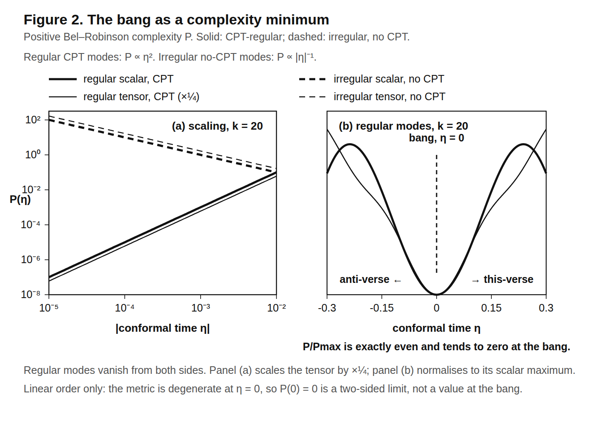
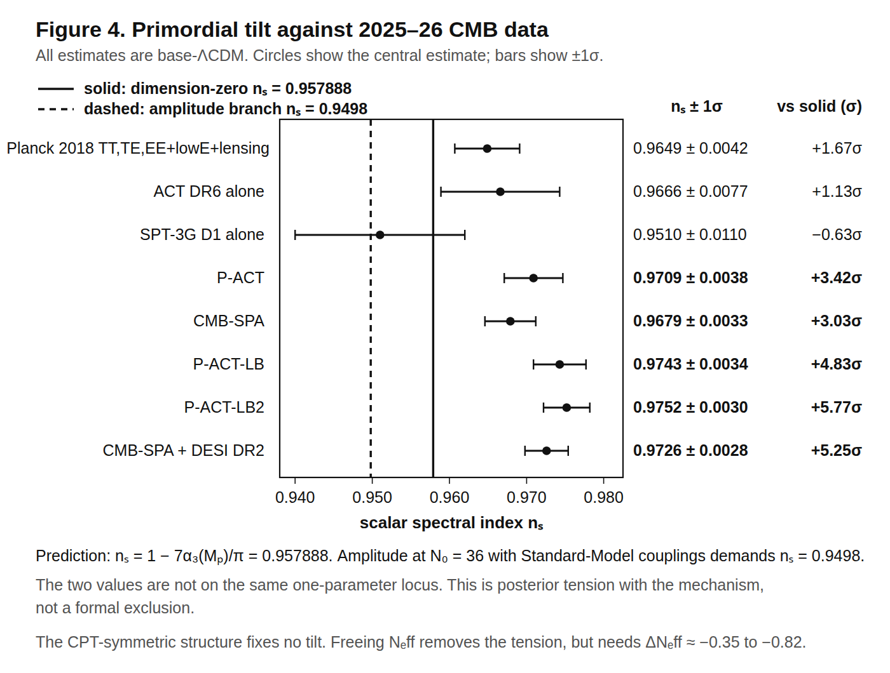

# Supplement to *Separate Ways*, V3

This document holds calculations the main argument does not need. Each section
states its own assumptions, and several of them assume more than the paper does.
Nothing here is a result of the Lorentzian two-copy construction: printing a
calculation beside that construction does not make it one.

V2's programme-comparison section is not part of this submission. It stays in the
working record.

One note on notation, following the papers these sections examine: $A$ is the antipodal map, which
the main paper writes $\alpha$ everywhere except its Appendix C.

## S1. Bilocal noise and the non-traversable bridge reading

In the free two-patch sector the partner correlation has a thermofield
interpretation. It does not come with a bridge. The fold adds no
interaction that would make the two exteriors traversable, and equality with the
ordinary restricted state uses the local premises of main Appendix A.1. On the
central worldline the conformal-scalar image kernel equals the half-KMS-period
cross-leg kernel; away from that worldline you have to keep the transverse
antipode as well. Nothing about interacting horizons or evaporation follows.

A normalised bilocal scalar-probe toy makes the noise split explicit. Let

$$
F_{\rm even}=\frac{F_1+F_2}{\sqrt2},\qquad
F_{\rm odd}=\frac{F_1-F_2}{\sqrt2}.
$$

On the central comoving worldline in the conformal Bunch-Davies state, with
the image frame carried by the antipode,

$$
N_I(t)=-N_0(t-i\beta/2),\qquad \beta=\frac{2\pi}{H}.
$$

The integrated coefficients are $A_0=H^3/(12\pi^2)$ and
$A_I=-H^3/(12\pi^2)$, so the normalised even port has zero integrated
noise and the odd port has $H^3/(6\pi^2)$. Both coefficients and both port
eigenvalues are computed in, and the
off-axis case in. Their spectra are

$$
S_{\rm even}=\frac{\omega(\omega^2+H^2)}{12\pi}
\tanh\!\left(\frac{\pi\omega}{2H}\right),\qquad
S_{\rm odd}=\frac{\omega(\omega^2+H^2)}{12\pi}
\coth\!\left(\frac{\pi\omega}{2H}\right),
$$

Equivalently,
$S_{\rm even}=\rho(1-2n_F)$ and
$S_{\rm odd}=\rho(1+2n_B)$ at temperature $H/\pi$. At
$\omega=H$ and $H/2$, the even port lies 8.285% and 34.421% below the
vacuum, while the odd port lies 9.033% and 52.487% above it. The main text's
average/difference variables have a different normalisation:
$F_c=F_{\rm even}/\sqrt2$ and $F_q=\sqrt2F_{\rm odd}$, so their spectra gain
factors $1/2$ and $2$.

This is a reading of a postulated bilocal probe, not a prediction. The action
contains no worldline-to-image coupling, and the central-worldline KMS identity
does not extend to an assertion that the full antipode is only a time shift.

## S2. The RP3 topology comparison

This comparison claims nothing about the existence of the branches or about their
decoherence, both of which are standard quantum cosmology. Identifying the contracting branch
with the CPT image of the expanding one is a further assumption, strictly stronger than reality
of $\Psi$, and it is named as one. What the comparison does supply is a number. The $RP^3$
quotient deletes the even-$n$ harmonics, and $n=2$ alone carries 76% of the exponent, so the
restriction raises $A_{dec}$ from 1.954 to 2.595, a change of 32.84%, and the proper time $Ht$
from 1.290 to 1.608, a change of 24.63%. All four amplitudes and both percentages come from. The folded saddle is tree-level degenerate with the
no-boundary cap, and the difference is one loop.

**Falsifiable content of the clock comparison: none.** Exactly one harmonic, $n=2$ on the cover
and $n=3$ on $RP^3$, leaves the horizon before the tick, and even at $|\Omega_K|=0.005$ its
wavelength is seven times the diameter of the observable universe. Every pre-tick mode is
super-horizon, so there is nothing here a measurement could catch. Adopting the $RP^3$ spatial
quotient on its own would instead face the standard cosmic-topology search, which only bites for
$\Omega_{\rm tot}>1.166$. The Lorentzian cover this paper defends does not acquire that topology
from the antilinear field relation alone.

Which fields contribute is worth stating, because most of the Standard Model does not. In the
free, unbroken, massless approximation the 90 fermionic and 24 transverse gauge degrees of freedom
are conformal and contribute nothing to this branch-overlap exponent. The four real Higgs
components depend on a curvature coupling that has to be chosen separately: massless conformal
coupling gives zero, minimal coupling gives four scalar contributions. Masses and interactions
break that idealisation and are not computed here. The tensor tower runs from $n\ge3$ with
multiplicity $2(n^2-4)$, so the graviton is not two scalar towers.

The mass dependence is exact. $A_{dec}(m/H)$ takes the values 1.954, 1.960, 2.011, 2.997, $\infty$
and 3.291 at $m/H=0$, 0.1, 0.3, 1, $\sqrt2$ and 3. The infinity is not a divergence but the
absence of an effect: a minimally coupled scalar of mass $m^2=2H^2$ is the conformal scalar, and it
makes no arrow at all. Below $m=\sqrt2 H$ the mass-dependent coefficient is
$(\pi/48)(m^2/H^2-2)^2$, which is why it vanishes there.

At large $A$ the massless-field decoherence law approaches
$-\log|D|\simeq(N_{\mathrm{eff}}/18)\mathcal N_H$, with
$\mathcal N_H=(3\pi/2)(aH)^3$ the number of Hubble volumes in a closed $S^3$. That asymptote is
not exact near the throat or at the first $e^{-1}$ crossing, which is where $A_{dec}$ sits.

---

## S3. Euclidean boundary conditions and the CP cost

This comparison imposes additional CP-sector and Euclidean boundary conditions.
Neither follows from the defended Lorentzian cover.

A bang mirror forbids the $\theta G\widetilde G$ term, which solves strong CP without an axion.
That is Boyle, Teuscher and Turok's result [1], and the *other* leg costs the same. Put the
Standard Model on the unorientable Euclidean section with a $\mathrm{Pin}^+$ structure and the
single reflection has to be a symmetry of the *Lagrangian* rather than of the spectrum alone, so
CP violation must be spontaneous. García-Etxebarria and Montero put it plainly: *"This theory
would then make sense in unorientable spacetimes, as long as these admit fermions"* [2], their
§3.4, which also establishes $\Omega_5^{\mathrm{Pin}^+}(BG_{\mathrm{SM}})=0$. Reading CP as a
discrete gauge symmetry on a nonorientable spacetime is Choi, Kaplan and Nelson's [3]. The sector
this needs is a generic one: vector-like quarks from 1.2 TeV to tens of TeV, with $\bar\theta$
near the present neutron-EDM limit in the maximal corners [4]. So n2EDM and nEDM@SNS test it.

The two legs then differ in a way a measurement could catch, and that part is new. On the bang
mirror a CT-odd CP scalar obeys $\varphi(-t)=-\varphi(t)$, so $\varphi(0)=0$: the wall *is* the
bang, and there is nothing in our sky. On the elliptic leg $\varphi(Ax)=-\varphi(x)$ makes
$\varphi$ odd on the late-time $S^3$, and Borsuk–Ulam then forces an antipodally symmetric zero
set separating every point from its antipode. So the elliptic and CT-odd conditions together force
one cosmological-scale CP wall, even if CP breaking precedes inflation.

That wall has a price. It is harmless only for
$\Lambda_{\mathrm{CP}}<\Lambda_*=(\rho_cR_H)^{1/3}=29.5\ \mathrm{MeV}$, computed in, which recovers the Zel'dovich–Kobzarev–Okun bound [5] (§S11.10).
Above that threshold the wall has to sit $(\Lambda_{\mathrm{CP}}/\Lambda_*)^3$ Hubble radii
beyond the horizon, which inflation must supply as

> $$
> \Delta N=3\ln\!\left(\frac{\Lambda_{\mathrm{CP}}}{29.5\ \mathrm{MeV}}\right)
> \quad\text{extra e-folds},
> $$

giving 10.6 extra e-folds at 1 GeV, 31.3 at 10³ GeV and 65.8 at 10⁸ GeV.

An elliptic fold with a Nelson–Barr scalar at 10⁸ GeV therefore needs about 126 e-folds of
inflation: the usual sixty, plus those 65.8. That is a bound on inflation, not on CP physics. The
CT-odd assumption, the generic wall position and the neglect of the wall's repulsive gravity are
all stated above. The alternative is not free either, since gauged and spontaneously broken CP has
a domain-wall problem [6], though no global anomaly [7].

## S4. CPT-regular modes and complexity

The bang of the two-sheeted radiation-plus-Λ solution [8] is an isotropic singularity in Goode
and Wainwright's sense [9–14], which the authors themselves note [15]. What this section adds is a
positive-definite invariant.

Build it from the electric and magnetic parts of the Weyl tensor, in the manner of Senovilla [16]
and of Clifton, Ellis and Tavakol [17], and the complexity 𝒫 vanishes at the bang like η² for the
CPT-regular modes and diverges like |η|⁻¹ for the irregular ones. **The bang is a complexity
minimum with the CPT condition and a maximum without it** (Figure 2; fitted exponents +1.9999989
and +1.9999975 against −0.999994 and −1.000000; §S11.9 and the companion calculations).

Two legs of Barbour, Koslowski and Mercati's Janus-point structure [18–20], still Newtonian in
2026 [21], transfer exactly at linear order. The third, *D* = 0, fails, so the full identification
stays an analogy. We found no cross-citation between the two literatures.

## S5. A discrete-curvature mechanism under test

*Whose claim this is.* What follows tests a proposal of Deng and Handley's, not a prediction of this
framework. Nothing here requires quantised curvature. The elliptic reading halves their allowed set and
the data then close what is left, and that is recorded because closing a line is worth more than leaving
it open. A reader who wants only this paper's own commitments can use the commitments table in main §3.6.

Deng and Handley impose CPT at the future conformal boundary as well as at the bang, which restricts
the allowed modes; in a closed universe the wavevectors are already integers, and matching the two
ladders quantises the curvature [22], building on Lasenby, Handley, Bartlett and Negreanu [23]. Their
2025 refit with matter and a Boltzmann hierarchy against a filtered Planck chain [24] gives
$\Omega_K\simeq-0.61/N^2$ for *N* = 3…7 as an asymptotic rule, accumulating at flatness; it matches their table from *N* = 5 up and misses the *N* = 3 entry by 12%; we reproduce it to 0–4%, and obtain a
closed form for their 2024 matching integral, checked against quadrature to 2.4 × 10⁻¹⁶
(§S11.7).

**The elliptic reading halves the set.** Degree-ℓ scalar harmonics on $S^3$ carry antipodal eigenvalue
(−1)^ℓ, so $RP^3$ keeps ν = ℓ+1 odd, while the periodic ladder runs over *N*, 2*N*, 3*N*, …; if *N* were
even the intersection would be empty, leaving no perturbations at all. Hence *N* is odd, deleting *N* = 4, the member their own χ² prefers. (This *N* is Deng and Handley's mode-ladder integer and is unrelated to the equation-of-state ladder's *N* in §S11.8, which is also required odd, for a different reason.)

**The confrontation.** Deng and Handley compare to Planck alone and defer a joint analysis, so this
comparison is ours. Against DESI DR2 BAO plus CMB, $\Omega_K=+0.0023\pm0.0011$ [25];
against Planck 2018 alone, −0.0106 ± 0.0065 [26]; our own refit of the DESI DR2 points with
compressed Planck priors reproduces the first, +0.00275 ± 0.00106 (2.55σ).

| *N* | $\Omega_K$ | vs Planck alone | vs DESI DR2 + CMB | in $RP^3$? |
|---|---|---|---|---|
| 3 | −0.076 | 10.1σ | 71.2σ | kept |
| **4** | **−0.039** | 4.4σ | **37.5σ** | **deleted** |
| 5 | −0.024 | 2.1σ | 23.9σ | kept |
| 6 | −0.016 | 0.8σ | 16.6σ | deleted |
| 7 | −0.012 | **0.22σ** | **13.0σ** | kept |
| ∞ | 0⁻ | 1.6σ | 2.09σ | limit, never attained |

Figure 3 plots the set against both datasets.

Their preferred *N* = 4 model, run against DESI DR2 with every calibration input profiled out so
that only the *shape* of the distance–redshift relation is tested, gives Δχ² = +221 on twelve shape
degrees of freedom. Its $H_0$ = 55.0 sits 15.6σ from SH0ES's $73.04\pm1.04$ km s$^{-1}$ Mpc$^{-1}$ [27], against 5.2σ for flat ΛCDM.

**And no reading can produce a positive $\Omega_K$**, because
$\Omega_K=-3\widetilde\kappa\sqrt{\Omega_\Lambda\Omega_r}$ with $\widetilde\kappa>0$ by
construction. The integer condition exists only for compact spherical sections, and $RP^3$ is one
of those, so the elliptic reading does not escape it either. Even exact flatness is 2.09σ from the
data.

Two caveats against us. The Planck-alone column summarises a strongly non-Gaussian posterior, so
Planck alone does genuinely prefer −0.039 over flatness. And the sparse branch might be thought
inadmissible for deleting most primordial modes, though their 2025 paper answers that. The
cheapest decisive test is to re-run their filtered-chain χ² at mode spacing 2*N* with *N* odd
inside the existing quantised-power-spectrum pipeline [28–29]. That needs their modified CLASS and
is not done here.

## S6. A primordial-tilt mechanism under test

*Whose claim this is.* The tilt formula below is Turok and Boyle's and contains nothing from the fold.
The tension the table reports is with their mechanism. The separately adopted BFT production and
mass-sector commitments do not go through it.

Turok and Boyle derive a primordial spectrum from dimension-zero scalar fields and obtain a tilt with
no free parameters, subject to two stated theoretical assumptions [30]. We reproduce the derivation
exactly. Their eq. 13 prefactor 3²5³/(7(2π)⁴) = 0.103118125 agrees to eight decimals, and the tilt
is

> **$n_s=1-7\alpha_3(M_P)/\pi=0.957888$.**

Four things fix that number: the QCD coefficient $11-2n_f/3=7$; $\alpha_3(M_P)=0.0189$ [31]; the
assumption *p* = 2, which the authors flag; and constancy of $n_s$ across 63.5 e-folds. The last of
those carries weight, because a running $\alpha_3$ reaches its Landau pole 47.5 e-folds below
$M_{P}$. recomputes the tilt from $\alpha_3(M_P)$ and every tension
in the table below from the quoted $n_s$ and $\sigma$.

| dataset | $n_s$ | $(n_s-0.957888)/\sigma$ |
|---|---|---|
| Planck 2018 TT,TE,EE+lowE+lensing | 0.9649 ± 0.0042 | 1.67σ |
| ACT DR6 alone | 0.9666 ± 0.0077 | 1.13σ |
| SPT-3G D1 alone | 0.9510 ± 0.0110 | −0.63σ |
| P-ACT | 0.9709 ± 0.0038 | 3.42σ |
| CMB-SPA | 0.9679 ± 0.0033 | 3.03σ |
| **P-ACT-LB** | **0.9743 ± 0.0034** | **4.83σ** |
| P-ACT-LB2 | 0.9752 ± 0.0030 | 5.77σ |
| CMB-SPA + DESI DR2 | 0.9726 ± 0.0028 | 5.25σ |

Figure 4 plots the displacements.

[26,32–34]. This is posterior tension, not formal exclusion: these are displacements between a
fixed prediction and marginal posteriors in base ΛCDM, not a likelihood ratio for a nested model.
This specified comparison uses base ΛCDM; the fold construction alone does not derive universal values of $N_{\mathrm{eff}}$ or the running.
Freeing $N_{\mathrm{eff}}$ removes the tension entirely, but the value needed is Δ$N_{\mathrm{eff}}$ ≈ −0.35 to −0.82,
*less* radiation than the Standard Model, which the dimension-zero scalars do not supply [35]. The mechanism is also over-constrained internally: requiring the measured amplitude at $N_0=36$
with Standard-Model couplings forces $n_s$ = 0.9498, 7.2σ on the other side of P-ACT-LB. As a
two-observable predictor it does not survive; as a one-observable fit it survives and predicts
nothing.

**Mechanism, not structure.** Nothing in the CPT-symmetric structure, and nothing in the fold, enters
the tilt formula: it is built from the high-temperature trace anomaly, the QCD β-function and an
assumption about which factor of α carries the scale dependence, as the authors say in their own
conclusion. The tension concerns this tilt mechanism. It does not change the separately adopted BFT
production calculation, its primordial-tensor commitment or the massless-neutrino consequence of
exact stabilisation. The 4.8 × 10⁸ GeV abundance-calibrated mass is likewise unaffected. We record that the dimension-zero
scalars are under independent theoretical dispute [36], unanswered at the time of writing, and we
found no second live test. Early-galaxy abundances require an explicit initial-condition,
growth and astrophysical model before they can test the specified cosmological implementation
[37–40].

---

## S7. A future-horizon low-quadrupole conjecture

The tensor response of §S9 has no scale at the bang. For the fixed Planck-like expansion history and
observer epoch used here, the remaining conformal distance from today is
$\eta_f=\int_1^\infty da/(a^2H)=1.14965\,c/H_0=5.114$ Gpc. Its inverse is
$k_c=1/\eta_f=1.96\times10^{-4}\ \mathrm{Mpc}^{-1}$, near the quadrupole scale. As a conditional
scalar-spectrum shape test, choose
$S(k)=(k\eta_f)^4/[1+(k\eta_f)^4]$; neither this scalar multiplier nor its future-boundary origin is
derived. A simplified Sachs–Wolfe plus late integrated-Sachs–Wolfe calculation gives TT ratios 0.734,
0.862, 0.936 and 0.969 at ℓ = 2–5, and 0.998 at ℓ = 10. The EE response has not been calculated.
Applied to the published Planck 2018 spectrum estimates [26], an idealised independent full-sky
cosmic-variance proxy gives $\Delta(-2\ln L)=-1.030$ and quadrupole lower-tail probabilities 0.0469
and 0.0884. These are not an evaluation of the official Planck likelihood. The chosen shape would
not account for the whole deficit, and it leaves the ℓ ≈ 20–30 dip untouched.

The radiation–Λ Baker–Akhiezer mode with its specified global sheet choice fails a global
remaining-distance-only law. The follow-up script propagates its fold data and samples its absolute
power; it does not construct the independent cap-local reference proposed in the earlier calculation.
Its reported 78%, 62% and 24% spreads used ±12% bins around nominal *q*. Comparisons matched exactly
at $q=0.3,0.6,1.0$ also fail to collapse, with spreads 66.6%, 64.8% and 23.0% on the six-κ audit grid.
Here $q=\kappa(T-x)$ measures conformal event-horizon distance; $q\simeq k/(aH)$ only near the cap.
The late normalised tensor power is $F=\kappa^2/\sqrt{1+\kappa^4}$, while the chosen scalar multiplier
uses its square. A physical scalar or final-state mechanism and the cap-local-reference calculation
remain unestablished. In a universe with matter, the corresponding transition is the matter–Λ
crossover, whose conformal scale is of order the horizon today; the crease law has not been
recomputed on that background here.

## S8. Restricted exact-$\Lambda$ analysis

This calculation supports the exact-$\Lambda$ baseline only within a stated
metric-only action class. Let $K$ be the expansion scalar and
$s=\log(K_c/K)$. The added action contribution is

$$
S_{\rm add}=\int dt\,d^3x\,N\sqrt h\,f(K),
\qquad f(K)=-\rho_c W(s).
$$

Its homogeneous energy density is $\rho_c(W+W_s)$, not $\rho_cW$.
For arbitrary spatial lapse smearings, the exact shear-retaining Hamiltonian
bracket contains

$$
\{H[N],H[M]\}=H_i[\cdots]
-\int d^3x\,\sqrt h\,\rho_c
\frac{W_s+W_{ss}}{K^2}
(N D^iM-MD^iN)D_iK.
$$

Requiring off-shell closure for this full class of refoliations gives
$W_s+W_{ss}=0$, hence

$$
W(s)=W_0+C e^{-s}.
$$

Because $e^{-s}=K/K_c$, the second term contributes to the action in proportion to
$\int dt\,d^3x\,N\sqrt h\,K$ and is a time-boundary term, up to spatial
boundary terms. The surviving bulk term is
constant. For a homogeneous metric-only Lagrangian $a^3f(\theta)$, with
$\theta=3H$,

$$
\rho=\theta f'(\theta)-f(\theta),\qquad
\rho+p=-\dot\theta f''(\theta).
$$

The constant term therefore has $p_\Lambda=-\rho_\Lambda$ even in a
matter-filled decelerating universe. With separate conservation, $Q=0$ and
$\rho_m\propto a^{-3}$.

The scope matters. Spatially constant lapse smearings or a constant-mean-
curvature slice make the displayed anomalous term vanish for any $W$.
Whether a reduced TDiff or unimodular completion requires the full lapse class
is a separate constraint problem. The result above is therefore a restricted
off-shell closure result, not a theorem about every covariant dark-energy
theory.

## S9. Tensor crease calculation

On the exactly solvable radiation–Λ background,
$y_x^2=1+y^4$ in conformal time $x$ (units of the radiation–Λ crossover time $\eta_*$), the tensor mode
equation is the $n=1$ Lamé system $u''+(\kappa^2-2y^2)u=0$, $\kappa=k\eta_*$, and the solution selected by
its future frozen branch has fold impedance $\Omega^2=z+z^{-1}$, $z=\kappa^2$, and late normalised
tensor power $F=z/\sqrt{1+z^2}$, reproduced by direct Wronskian-normalised integration. The
selecting condition is a Baker–Akhiezer one, imposed at the cap rather than at the crease.

That power is one logistic variable read several ways. With $s=\log z$ it is $F^2=\sigma(2s)$, the
associated response crossover is $\tanh s$, and the Fisher information is
$\operatorname{sech}^2s$. On the lemniscatic curve $j=1728$, which is what this background is, that
Fisher information is a regular degree-eight Belyi map, $64/u^4$ in the quotient coordinate
$u=p/z$, verified independently.

The result is exact, and it is also unobservable, which is worth saying in the same breath. At the
observed $\Lambda$ the amplitude it multiplies is
$2H_\Lambda^2/(\pi^2M_{\rm Pl}^2)\simeq5\times10^{-122}$, and the crossover
$k_c=\eta_*^{-1}=2\times10^{-5}\ \mathrm{Mpc}^{-1}$ lies beyond the horizon. Nothing observable
follows from it at the bang crease. The tensor shape follows from the stated background and the
future-branch condition; the action does not select that condition, and no observed-scale
realisation is derived here.

## S10. Detailed information-criterion and laboratory comparisons

The following accounting is supplementary. Information criteria organise tradeoffs but do not decide physical truth.

Give a model enough adjustable numbers and it will fit anything. A curve with ten free coefficients can be
made to pass through any ten points, exactly, every time; and the fact that it does tells you nothing
about the world. So agreement with data is never impressive by itself. What is impressive is agreement
bought cheaply, with few adjustments. Information criteria put a price on each adjustment and ask whether
the improvement in fit was worth what it cost.

There are two prices in common use and they answer different questions. Akaike's criterion asks whether
the model will predict the *next* measurement well, and charges 2 for each free parameter. Schwarz's,
usually written BIC, asks whether a parameter is *real* or is merely soaking up noise, and charges ln *n*
for each one, where *n* is the number of data points; with about 1600 points that is a rent of roughly
7.4 per parameter rather than 2. In both, a negative number favours the model being tested and a positive
number favours the simpler alternative it is being tested against.

Against ΛCDM with a free neutrino mass sum, the adopted exact-stabilisation BFT sector fixes the sum
from oscillation inputs once normal ordering is chosen. The absolute-mass likelihood below does not
fit that value. This comparison concerns the restricted cosmological submodel; it does not isolate
observational evidence for the geometric fold.

A parameter accounting, since "minimal" is a claim about parameters. Against ΛCDM with $\Sigma m_\nu$ free,
that sector fixes $\Sigma m_\nu$ at 58.8 meV and pays Δχ² = +3.0 on the geometry-only likelihood summarised in main §3.3
(1580 Pantheon+ supernovae with their full covariance, 13 DESI DR2 BAO points, two compressed Planck
priors), while $w_0w_a$CDM gains Δχ² = −9.1 for two more parameters. With
the Akaike penalty of 2 per parameter this is ΔAIC = +1.0 for the mass-restricted submodel against ΛCDM and −5.1
for $w_0w_a$CDM: a tie and a loss. With the Schwarz penalty ln *n* = 7.37 per parameter, the
criterion that asks whether a parameter is real, not whether it helps prediction, the order
reverses: ΔBIC = −4.4 for the mass-restricted submodel against ΛCDM and +5.6 for $w_0w_a$CDM, so on this
likelihood the submodel is preferred over both. Two caveats travel with the second number. The supernova points are
correlated, so ln *n* overstates the penalty by a factor the effective sample size would reduce,
moving the result toward the AIC end; and the CMB-inclusive likelihoods are harder on both sides.
With DESI+CMB, fixing $\Sigma m_\nu$ at the oscillation floor costs Δχ² = 7.2 [41], so the submodel's
ΔAIC against ΛCDM is +5.2 and BIC prefers it only if the effective number of independent data
points exceeds 1300; and $w_0w_a$CDM gains Δχ² = −10.7 to −21.0 depending on the supernova sample
[25], which BIC rewards only if that number is below 210 (Pantheon+) to 36,000 (DESY5). Since a
CMB-inclusive likelihood has no simple count of independent points, those break-even values are
reported rather than a verdict. The reference varies neither *r* nor *w*, so the adopted cosmology's *r* = 0 and Λ earn
nothing here; against models that vary them it earns more. The Turok–Boyle tilt mechanism, which
would fix $n_s$ as well, costs Δχ² = 23 against the P-ACT-LB tilt of §S6 and loses under either
penalty; the structure does not carry it.

## S11. Supporting calculations for supplementary mechanisms

These calculations support optional comparisons. None of them is a premise of the main argument.

**S11.1 Where a crease can sit, and what each position costs.** The classification is placed here because main §2.1 does the choosing. Which fold one
takes is fixed by the set of points the involution leaves alone, and that set is the crease.
The table below is the classification.

| position | involution | fixed set | what it costs | verdict |
|---|---|---|---|---|
| no crease | elliptic *A* on dS | empty (free) | nothing locally, under stated premises | conditionally silent (main Appendix A.2) |
| codim 1, spacelike | *t* → −*t* | the whole spatial slice | a mirror boundary condition; no tension | the best-studied fold |
| codim 2 | modular *J* | the bifurcation 2-sphere | the quotient-respecting state is Rindler at 2$T_{U}$ | dead as a smooth one-copy fold |
| codim 1, timelike | reflection in a bulk coordinate | a brane worldvolume | negative tension, and a ghost | not a healthy fold |
| two copies | antilinear pairing on the cover; $\alpha=J\circ P_\perp$ in the stated de Sitter construction | none | standard closed-time-path algebra with a specified global twist | compatible with the demonstrated physical free-graviton sector in main §2 |

**S11.2 The two involutions.** Sewell's theorem gives the modular reflection of a wedge as
(*t*,*w*;**y**) → (−*t*,−*w*;**y**) [42]; Borchers and Buchholz specialise it to de Sitter, where the
reflection reverses $X_0$ and $X_1$ and fixes the transverse coordinates [43]. The antipode reverses all
five. Hence *A* = *J* ∘ P⊥ with P⊥ acting on harmonics as $(-1)^\ell$. Chang and Li give that mode-level form directly, together with the reality condition it implies [44]. The elliptic interpretation is
Schrödinger's [45]; Gibbons applied it to black holes [46]; Folacci and Sánchez computed the elliptic
scalar field theory [47]; Parikh, Savonije and Verlinde gave dS/Z₂ its modern form [48]; 't Hooft made
the antipodal identification the centre of a black-hole S-matrix proposal [49–50].

**S11.3 The codimension classification.** Codimension one, timelike: in a de Sitter-sliced warp
respecting the null energy condition, Karch and Randall's inequality forces the crease tension
negative [51], and in the three-brane realisation of Kogan et al. [52] the crease carries the model's
ghost. These obstructions apply to the stated warped and three-brane constructions; higher-codimension de Sitter branes have separate no-go results [53]. Codimension one, spacelike: a time mirror has no tension.
Codimension two: the fixed set is the bifurcation sphere.

**S11.4 The 2$T_{U}$ crease state.** The state respecting a codimension-two identification is the even
Euclidean scalar on the π-angle Z₂ cone, whose Green function is π-periodic, giving
Δ⟨φ²⟩ = 1/(16π²$r^2$) and Δρ = 1/(32π²$r^4$); both coefficients are Moretti's [54]. Read Lorentzianly, the
crease state is the Rindler thermal state at *twice* the Unruh temperature, so it is non-integrable
at the horizon: singular exactly where it is a fold. Two independent checks: the conical formula
⟨φ²⟩ = ($N^2$−1)/(48π²$r^2$) [55] at *N* = 2, and the Rindler thermal density
ρ = [(*T*/$T_{U}$)⁴−1]/(480π²$d^4$) at *T* = 2$T_{U}$. Withdrawn in the same place: reading the deficit
angle π as a Lorentzian positive-tension defect; a Euclidean deficit is an SO(2) rotation while the
real Lorentzian action lies in a disconnected component of the Lorentz group.

**S11.5 Why four dimensions.** Fold the bulk in half and the graviton sits exactly on the
unitarity boundary, and it does so in four dimensions and no other.

For the Z₂-odd transverse-traceless graviton of a $\mathrm{dS}_d$-sliced $\mathrm{AdS}_{d+1}$ bulk,
$(\sinh^d u\,\psi')'+\epsilon\sinh^{d-2}u\,\psi=0$ with $\psi(L)=0$ at the crease and
$\psi'(w_0)=0$ at the brane, the Higuchi/partially-massless value $\epsilon_{\rm PM}=d-2$ [56] is
the lowest eigenvalue on the midpoint line $w_0=2L$ **only at *d* = 4**.

Two things have to line up, and only *d* = 4 makes both happen. The antiderivative
$(d-2)\int du/\sinh^{d-2}u$ must be degree one in $\coth u$, which holds at *d* = 4 alone; and the
boundary term $1/(\sinh^{d-3}L\cosh L)$ must be a sinh of the doubled position, which it is
(2/sinh 2*L*) only at *d* = 4. The condition then collapses to
2 sinh *X* cosh *Y* = 2 cosh *X* sinh *Y*. Writing each side as sinh(*X*+*Y*) ± sinh(*X*−*Y*) leaves
2 sinh(*X*−*Y*) = 0, so sinh($w_0$ − 2*L*) = 0 and the crease sits at the midpoint.

Numerically $\epsilon_1$ on the midpoint line at *L* = 0.5, 1 and 2 is 2.00000 three times at
*d* = 4, against 2.998/3.631/6.977 at *d* = 3, 1.291/1.033/0.480 at *d* = 5 and
0.806/0.502/0.102 at *d* = 6. solves the eigenvalue problem
by shooting and reproduces all twelve; the *d* = 4 row comes out on the partially-massless value
to a relative error of $3\times10^{-10}$ at every *L*.

The model in which this happens has a ghost at that point, so it is a fact about a sick model and
no observability claim is attached.

**S11.6 The RP⁴ one-loop invariant.** Conformal Laplacian *L* = −∇² + 2 at unit radius; eigenvalues
λ_ℓ = (ℓ+1)(ℓ+2) with degeneracy (ℓ+1)(ℓ+2)(2ℓ+3)/6; the antipodal map acts as $(-1)^\ell$.
*F* = −½ζ′(0) − ζ(0)ln μ*R*; the two parities' zeta functions add to the sphere's term by term, so
Δ*F*₊ + Δ*F*₋ = 0, and ζ(0) = −χ/180 in all three cases. Closed forms:
ζ′_{S⁴}(0) = 1/144 + ζ′(−1)/3 + 2ζ′(−3)/3 and ζ′₊(0) − ζ′₋(0) = 7ζ(3)/(4π²). The reference value is
*F*_{S⁴} = −1/288 − ζ′(−1)/6 − ζ′(−3)/3 + (1/90)ln μ*R*, its log coefficient checked against [57].
*Why no counterterm absorbs it:* every counterterm in the four-dimensional gravitational effective
action is the integral of a local curvature scalar, and RP⁴ is locally isometric to $S^4$ with
exactly half its volume, so each contributes exactly half its $S^4$ value; Gauss–Bonnet included,
since χ goes 2 → 1; and all of that sits inside ½*F*_{S⁴} and cancels in the difference. Seven numerical routes check these fixed spectral identities,
with $S^2$ and $S^3$ controls. Their high-precision agreement concerns the calculation, not the accuracy of a physical prediction.

**S11.7 The discrete-curvature reproduction.** The 2024 background is $\dot a^2=(\lambda/3)(a^4-2\widetilde\kappa a^2+1)$, with
$\widetilde\kappa=3\kappa/(2\lambda)$ and matching $G(\widetilde\kappa)=\sqrt{2\widetilde\kappa/3}\,I(\widetilde\kappa)=N\pi/2$ or $\pi/(2N)$; the closed form is
$I(\widetilde\kappa)=\pi/[2\operatorname{agm}(1,\sqrt{(1-\widetilde\kappa)/2})]$, with $I(0)=\Gamma(1/4)^2/(4\sqrt\pi)=1.854074677301$ and $I(-1)=\pi/2$.
Conversion $\Omega_K=-2\widetilde\kappa\sqrt{\Omega_\Lambda\Omega_r}$; the difference between the two 2024 arXiv versions is entirely in
that coefficient. The 2025 background has four components, $\widetilde\kappa_{25}=(2/3)\widetilde\kappa_{24}$ and matter $\rho_m\propto |a|^{-3}$, so the
background stays symmetric across the bang, conversion $\Omega_K=-3\widetilde\kappa_{25}\sqrt{\Omega_\Lambda\Omega_r}$; the matching tightens
from *n*π/2 to *n*π, and the two calibrations differ by 2/√3, decomposing as ×2 from symmetric-only
modes and ×1/√3 because the 2024 phase is acoustic and the 2025 phase free-streaming. The matter-free
limit of the 2025 integral reproduces the 2024 closed form to 4.4 × 10⁻¹⁶.

**S11.8 Three items deferred.** *(i)* Barbour's own proposed general-relativistic complexity, the
Yamabe invariant [20], does **not** detect the bang: it depends only on the conformal 3-geometry,
which is frozen there; over the super-horizon window the comoving curvature perturbation varies by
2.2 × 10⁻³ while 𝒫 changes by factors of 10³–10⁶. *(ii)* The linear ceiling: exactly, in the radiation
era, $\mathcal P_S=3\sqrt2\,\Phi_i|xj_1(x)|$, maximum $4.5104\,\Phi_i$ at $x=2.7437$, so at the measured amplitude
$\Phi_i\simeq2\times10^{-5}$ the complexity is capped at about $10^{-4}$; Barbour's unbounded growth is nonlinear and
invisible here. *(iii)* The equation-of-state ladder: with
$\rho_w\propto a^{-(2N+2)/N}$, the CPT-allowed
rungs are *N* = 3 ($w=-1/9$, $\rho\propto a^{-8/3}$),
*N* = 5 ($w=-1/5$, $\rho\propto a^{-12/5}$) and *N* = −1
(a cosmological constant); every rung is shallower than *a*⁻⁴.

**S11.9 The Bel–Robinson complexity.** With $E$ and $B$ the electric and magnetic parts of the Weyl
tensor and observer $u=a^{-1}\partial_\eta$,
$$
\mathcal P=\left[
\frac{8\langle E_{ab}E^{ab}+B_{ab}B^{ab}\rangle}
{(R_{ab}R^{ab})_0}
\right]^{1/2},
$$
normalised by $R_{ab}R^{ab}$ because the Ricci scalar is the exact constant $4\lambda$ for
radiation plus $\Lambda$.

The CPT condition on the tetrad [58] says, in conformal-Newtonian gauge, exactly that the Bardeen
potential is **even**. So regularity at the bang and evenness are the same condition. The
background is conformally flat, so the first-order Weyl tensor is gauge-invariant by Stewart and
Walker [59]. The regular modes give $\mathcal P_S=(\sqrt2/3)k^2|\Phi_i|\eta^2$ and
$\mathcal P_T=\sqrt{8/27}\,k^2|h_i|\eta^2$, exactly even on both sheets and vanishing at the bang
from either side. The irregular Bardeen solution goes as $\eta^{-3}$ and the irregular tensor mode
as $\eta^{-1}$, so both give $\mathcal P\propto|\eta|^{-1}$.

Two of Barbour's legs transfer. $E_{\mathrm{tot}}=0\leftrightarrow\kappa=0$ is an identity, since
$\kappa$ is minus the total energy per unit mass. $L_{\mathrm{tot}}=0$ corresponds to vanishing
primordial vorticity and is *derived* rather than assumed: the gauge-invariant vector perturbation
obeys $\sigma_g'+2\mathcal H\sigma_g=0$, so $\sigma_g\propto\tau_-^2$ is even, while $\sigma_g$
is also the derivative of an even tensor mode and hence odd. Both cannot hold unless the
coefficient vanishes.

The leg that fails is $D=0$: $\mathrm{d}(a^2)/\mathrm{d}t\to2\sqrt{r/3}$ at the bang, a non-zero
constant.

**S11.10 The CP-wall threshold and its e-fold cost.** Supplement §S3's 29.5 MeV and $\Delta N$, derived. A wall of
energy per unit area $\sigma=\Lambda_{\mathrm{CP}}^3$ crossing our Hubble volume contributes $\rho_{\mathrm{wall}}\sim\sigma/R_H$, and is
harmless only if that is far below the critical density:

> $$
> \sigma=\Lambda_{\mathrm{CP}}^3,\qquad
> \rho_{\mathrm{wall}}\sim\frac{\sigma}{R_H}\ll\rho_c
> \Longleftrightarrow
> \Lambda_{\mathrm{CP}}<(\rho_cR_H)^{1/3}.
> $$
> The inputs are $H_0=67.4\ \mathrm{km\,s^{-1}\,Mpc^{-1}}$,
> $c=2.99792458\times10^8\ \mathrm{m\,s^{-1}}$,
> $G=6.674\times10^{-11}$ SI, $\rho_c=3H_0^2/(8\pi G)$ and $R_H=c/H_0$,
> with $1\ \mathrm{Mpc}=3.0857\times10^{22}\ \mathrm m$,
> $\hbar c=1.9733\times10^{-16}\ \mathrm{GeV\,m}$ and
> $1\ \mathrm{kg}=5.6096\times10^{26}\ \mathrm{GeV}$. Thus
> $$
> \begin{aligned}
> \rho_c&=3.678\times10^{-47}\ \mathrm{GeV}^4,\\
> R_H&=6.955\times10^{41}\ \mathrm{GeV}^{-1},\\
> (\rho_cR_H)^{1/3}&=29.5\ \mathrm{MeV}.
> \end{aligned}
> $$
> Above that threshold the wall must sit at
> $$
> \frac{d}{R_H}=\frac{\sigma}{\rho_cR_H}
> =\left(\frac{\Lambda_{\mathrm{CP}}}{29.5\ \mathrm{MeV}}\right)^3,
> \qquad
> \Delta N=3\ln\!\left(\frac{\Lambda_{\mathrm{CP}}}{29.5\ \mathrm{MeV}}\right).
> $$

The threshold is the Zel'dovich–Kobzarev–Okun bound [5], recovered here from the wall required by
§S3's imposed odd CP-field condition, not from a Kibble network, and the e-fold cost is the arithmetic of pushing a
wall of that tension $(\Lambda_{\mathrm{CP}}/29.5\ \mathrm{MeV})^3$ Hubble radii outside the horizon: $d/R_H=3.91\times10^4$ at
$\Lambda_{\mathrm{CP}}=1$ GeV, $3.91\times10^{13}$ at $10^3$ GeV and $3.91\times10^{28}$ at $10^8$ GeV, hence $\Delta N=10.6$, 31.3 and 65.8
beyond the horizon-problem minimum, so that $N_{\mathrm{total}}=125.8$ at $10^8$ GeV against $N_{\min}=60$. Every
step is a statement about inflation and none of it is a statement about CP physics; the caveats stated in Supplement §S3 are the CT-odd assumption, the generic wall position, the neglected
repulsive gravity of the wall, and that the $\Lambda_{\mathrm{CP}}$ values are illustrative, not predicted.

---

## S12. Figures for supplementary mechanisms

**Figure 1: the crease dictionary.** The classification of §S11.1 drawn as a table: fold
position, involution, fixed set, price, verdict.

**Figure 2: the bang as a complexity minimum.** The Bel–Robinson complexity $\mathcal{P}$ of §S4 against
conformal time for the CPT-regular scalar and tensor modes ($\propto \eta^2$, vanishing at the bang from both
sides) and for the irregular modes ($\propto |\eta|^{-1}$), shown for the representative case $k=20$.
The fitted exponents at $k$ = 5, 20, 80 are reported in §S4 and §S11.9.

**Figure 3: the quantised curvature against 2026 data.** Deng and Handley's allowed $\Omega_K$ set for
$N$ = 3…7 [24], with the members the elliptic reading deletes marked, against Planck 2018 alone [26]
and DESI DR2 BAO + CMB [25]. Tensions as tabulated in §S5.

**Figure 4: the primordial tilt against 2026 data.** $n_s$ = 0.957888 from Turok and Boyle's
dimension-zero mechanism [30] against the eight datasets of §S6 [26,32–34], each shown with its
displacement in $\sigma$.

## S13. A weak Yukawa decay benchmark

The example in main §2.4 retains a fixed rank-two tree-level seesaw from two heavier, nondegenerate sterile neutrinos and adds only the small column $y_\alpha$ of $N_1$. Its free lifetime and flavour direction are not selected by geometry. All formulas below are at leading seesaw and decay order, with $H^0=(v+h+iG^0)/\sqrt2$, $v=246.22$ GeV and $q=y^\dagger y$.

For $r_b=m_b^2/M_1^2$, define $f_V(r)=(1-r)^2(1+2r)$ and $f_h(r)=(1-r)^2$. Averaging over the $N_1$ spin and summing over both light-neutrino helicities in the neutral channels and both charges in the $W\ell$ channel gives [60]

$$
\Gamma_0=\frac{qM_1}{32\pi}\{2f_V(r_W)+f_V(r_Z)+f_h(r_h)\}
\simeq\frac{qM_1}{8\pi}.
$$

These are Born hard-process fractions, not exclusive no-radiation fractions. Inclusive widths receive perturbative corrections, and electroweak showering must be included in an observed spectral calculation [61]. We use $\tau=\hbar/\Gamma_0$ only as a freely chosen leading-order lifetime parameter.

If $u_0$ is a unit null vector of the rank-two mass matrix $m_0$, the added complex symmetric matrix is $\delta m=-v^2yy^T/(2M_1)$, with spectral norm $v^2q/(2M_1)$. The Takagi masses are singular values, so

$$
s_{\min}(m_0+\delta m)\leq\|(m_0+\delta m)u_0\|
\leq\|\delta m\|_2=\frac{4\pi v^2\hbar}{M_1^2\tau}.
$$

Choosing $y=\sqrt q\,u_0^*$ attains this bound while leaving the two nonzero masses unchanged at this order. Choosing $u_0^Ty=0$ leaves a zero at this order. Thus the bound is not a flavour-independent nonzero prediction. Baseline radiative masses, running and matching corrections are outside this tree-level bound.

For $M_1=4.848\times10^8$ GeV and the illustrative $\tau=10^{28}$ s, $q\simeq3.4\times10^{-60}$. In standard radiation domination with $g_*=g_{*s}=106.75$, conserved entropy and no other portal, $H(T=M_1)\simeq0.33$ GeV and $\Gamma_0/H(T=M_1)\simeq2.0\times10^{-52}$. A perturbative relativistic scattering rate $CqT$ obeys $\Gamma_{\rm sc}/H\simeq5.0\times10^{-51}C$ at $T=M_1$ and falls as $1/T$ at higher temperatures. The integrated probability $\int_{T\geq M_1}(\Gamma_{\rm sc}/H)\,d\ln T$ is at most this value for bounded $C$; no ultraviolet power enhancement occurs in this renormalizable interaction.

An inverse-decay abundance check is stronger than nonthermalisation alone. In the Maxwell-Boltzmann approximation with $x=M_1/T$ and $g_N=2$,

$$
\frac{dY}{dx}=\frac{45g_N}{4\pi^4g_{*s}}\frac{\Gamma_0}{H(T=M_1)}x^3K_1(x),
\qquad
Y=\frac{135g_N}{8\pi^3g_{*s}}\frac{\Gamma_0}{H(T=M_1)}\simeq2.0\times10^{-54},
$$

using $\int_0^\infty x^3K_1(x)dx=3\pi/2$. The adopted present density and entropy inputs give $Y_{\rm DM}=\rho_{\rm DM,0}/(s_0M_1)\simeq9.0\times10^{-19}$. Thermal-mass and statistical corrections cannot compensate for this coupling suppression in the stated perturbative bath. For a scattering reaction density $C_{\rm prod}qT^4$, the relativistic yield is of order $10^{-52}C_{\rm prod}$ or smaller. The depletion over 13.8 Gyr is $1-e^{-t_0/\tau}\simeq4.4\times10^{-11}$.

These estimates exhibit an internally consistent, effectively unchanged abundance at the quoted accuracy. They do not construct the interacting BFT initial state or constrain unspecified additional portals. Setting $y=0$ restores the imposed species parity, explaining perturbative stability of a chosen tiny column without selecting its magnitude. If that parity is instead required to be an exact gauged symmetry, the added term needs a separate symmetry-breaking completion. The example assumes a weakly broken matter rule and makes no observational lifetime-bound or KM3NeT event-rate claim.

## References

The supplement compiles as its own document, so it carries its own list and its own
numbering. Neither follows the main paper's.

1\. L. Boyle, M. Teuscher, N. Turok, "The Big Bang as a mirror: a solution of the strong CP problem," arXiv:2208.10396.

2\. I. García-Etxebarria, M. Montero, "Dai-Freed anomalies in particle physics," JHEP 08 (2019) 003, arXiv:1808.00009.

3\. K. Choi, D. B. Kaplan, A. E. Nelson, "Is CP a gauge symmetry?," Nucl. Phys. B 391 (1993) 515, hep-ph/9205202.

4\. A. Valenti, L. Vecchi, "The CKM phase and $\bar\theta$ in Nelson–Barr models," JHEP 07 (2021) 203, arXiv:2105.09122.

5\. Ya. B. Zel'dovich, I. Yu. Kobzarev, L. B. Okun, "Cosmological consequences of the spontaneous breakdown of discrete symmetry," Zh. Eksp. Teor. Fiz. 67 (1974) 3 [Sov. Phys. JETP 40 (1975) 1].

6\. J. McNamara, M. Reece, "Reflections on parity breaking," arXiv:2212.00039.

7\. K. Yonekura, "The absence of global anomalies of CP symmetry," JHEP 05 (2026) 250, arXiv:2602.11475.

8\. L. Boyle, N. Turok, "Two-sheeted universe, analyticity and the arrow of time," arXiv:2109.06204.

9\. R. Penrose, "Singularities and time-asymmetry," in *General Relativity: An Einstein Centenary Survey*, eds. S. W. Hawking and W. Israel, Cambridge University Press (1979).

10\. S. W. Goode, J. Wainwright, "Isotropic singularities in cosmological models," Class. Quantum Grav. 2 (1985) 99.

11\. K. Anguige, K. P. Tod, "Isotropic cosmological singularities: I. Polytropic perfect fluid spacetimes," Annals Phys. 276 (1999) 257, gr-qc/9903008.

12\. K. Anguige, K. P. Tod, "Isotropic cosmological singularities II: the Einstein–Vlasov system," Annals Phys. 276 (1999) 294, gr-qc/9903009.

13\. R. P. A. C. Newman, "On the structure of conformal singularities in classical general relativity," Proc. Roy. Soc. Lond. A 443 (1993) 473 (and II, ibid. 493).

14\. K. P. Tod, "Isotropic cosmological singularities: other matter models," Class. Quantum Grav. 20 (2003) 521, gr-qc/0209071.

15\. N. Turok, L. Boyle, "Gravitational entropy and the flatness, homogeneity and isotropy puzzles," Phys. Lett. B 849 (2024) 138443, arXiv:2201.07279.

16\. J. M. M. Senovilla, "Super-energy tensors," Class. Quantum Grav. 17 (2000) 2799, gr-qc/9906087.

17\. T. Clifton, G. F. R. Ellis, R. Tavakol, "A gravitational entropy proposal," Class. Quantum Grav. 30 (2013) 125009, arXiv:1303.5612.

18\. J. Barbour, T. Koslowski, F. Mercati, "Identification of a gravitational arrow of time," Phys. Rev. Lett. 113 (2014) 181101, arXiv:1409.0917.

19\. J. Barbour, T. Koslowski, F. Mercati, "Janus points and arrows of time," arXiv:1604.03956.

20\. J. Barbour, T. Koslowski, F. Mercati, "A gravitational origin of the arrows of time," arXiv:1310.5167.

21\. J. Barbour, F. Lobo, M. Lourenço, "Structural morphology and the gravitational arrow of time," arXiv:2607.27526.

22\. W.-N. Deng, W. Handley, "Predicting spatial curvature Ω_K in globally CPT-symmetric universes," Phys. Rev. D 110 (2024) 103528, arXiv:2407.18225.

23\. A. N. Lasenby, W. J. Handley, D. J. Bartlett, C. S. Negreanu, "Perturbations and the future conformal boundary," Phys. Rev. D 105 (2022) 083514, arXiv:2104.02521.

24\. W.-N. Deng, W. Handley, "CMB constraints on quantized spatial curvature Ω_K in globally CPT-symmetric universes," Phys. Rev. D 113 (2026) 023546, arXiv:2509.10379.

25\. M. Abdul Karim et al. (DESI Collaboration), "DESI DR2 results. II. Measurements of baryon acoustic oscillations and cosmological constraints," Phys. Rev. D 112 (2025) 083515, arXiv:2503.14738.

26\. N. Aghanim et al. (Planck Collaboration), "Planck 2018 results VI: cosmological parameters," Astron. Astrophys. 641 (2020) A6, arXiv:1807.06209.

27\. A. G. Riess et al., "A comprehensive measurement of the local value of the Hubble constant with 1 km s$^{-1}$ Mpc$^{-1}$ uncertainty from the Hubble Space Telescope and the SH0ES team," Astrophys. J. Lett. 934 (2022) L7, arXiv:2112.04510.

28\. D. J. Bartlett, W. J. Handley, A. N. Lasenby, "Improved cosmological fits with quantized primordial power spectra," Phys. Rev. D 105 (2022) 083515, arXiv:2104.01938.

29\. M. Prathaban, W. Handley, "Rescuing palindromic universes with improved recombination modeling," Phys. Rev. D 105 (2022) 123508, arXiv:2111.14588.

30\. N. Turok, L. Boyle, "A minimal explanation of the primordial cosmological perturbations," arXiv:2302.00344.

31\. D. Buttazzo, G. Degrassi, P. P. Giardino, G. F. Giudice, F. Sala, A. Salvio, A. Strumia, "Investigating the near-criticality of the Higgs boson," JHEP 12 (2013) 089, arXiv:1307.3536.

32\. T. Louis et al. (ACT Collaboration), "The Atacama Cosmology Telescope: DR6 power spectra, likelihoods and ΛCDM parameters," JCAP 11 (2025) 062, arXiv:2503.14452.

33\. E. Calabrese et al. (ACT Collaboration), "The Atacama Cosmology Telescope: DR6 constraints on extended cosmological models," JCAP 11 (2025) 063, arXiv:2503.14454.

34\. E. Camphuis et al. (SPT-3G Collaboration), "SPT-3G D1: CMB temperature and polarization power spectra and cosmology from 2019 and 2020 observations of the SPT-3G main field," Phys. Rev. D 113 (2026) 083504, arXiv:2506.20707.

35\. L. Boyle, N. Turok, "Cancelling the vacuum energy and Weyl anomaly in the Standard Model with dimension-zero scalar fields," arXiv:2110.06258.

36\. J. M. Cline, M. Hell, "Pathologies of dimension-zero scalar fields," Phys. Rev. D 114 (2026) 045022, arXiv:2603.05683.

37\. M. Boylan-Kolchin, "Stress testing ΛCDM with high-redshift galaxy candidates," Nature Astron. 7 (2023) 731, arXiv:2208.01611.

38\. G. Sun, S. R. Furlanetto et al., "Bursty star formation naturally explains the abundance of bright galaxies at cosmic dawn," Astrophys. J. Lett. 955 (2023) L35, arXiv:2307.15305.

39\. D. D. Kocevski et al., "The rise of faint, red active galactic nuclei at z > 4: A Sample of Little Red Dots in the JWST Extragalactic Legacy Fields," Astrophys. J. 986 (2025) 126, arXiv:2404.03576.

40\. E. Di Valentino et al., "The CosmoVerse white paper: Addressing observational tensions in cosmology with systematics and fundamental physics," Phys. Dark Univ. 49 (2025) 101965, arXiv:2504.01669.

41\. W. Elbers et al. (DESI Collaboration), "Constraints on neutrino physics from DESI DR2 BAO and DR1 full shape," Phys. Rev. D 112 (2025) 083513, arXiv:2503.14744.

42\. G. L. Sewell, "Quantum fields on manifolds: PCT and gravitationally induced thermal states," Annals Phys. 141 (1982) 201.

43\. H. J. Borchers, D. Buchholz, "Global properties of vacuum states in de Sitter space," Ann. Inst. H. Poincaré A 70 (1999) 23, gr-qc/9803036.

44\. Z. Chang, X. Li, "Towards a CPT invariant quantum field theory on elliptic de Sitter space," Int. J. Mod. Phys. A 23 (2008) 1821, arXiv:hep-th/0701068.

45\. E. Schrödinger, *Expanding Universes*, Cambridge University Press (1956).

46\. G. W. Gibbons, "The elliptic interpretation of black holes and quantum mechanics," Nucl. Phys. B 271 (1986) 497.

47\. A. Folacci, N. G. Sánchez, "Quantum field theory and the 'elliptic interpretation' of de Sitter space-time," Nucl. Phys. B 294 (1987) 1111.

48\. M. K. Parikh, I. Savonije, E. Verlinde, "Elliptic de Sitter space: dS/Z₂," Phys. Rev. D 67 (2003) 064005, hep-th/0209120.

49\. G. 't Hooft, "Black hole unitarity and antipodal entanglement," Found. Phys. 46 (2016) 1185, arXiv:1601.03447.

50\. G. 't Hooft, "What happens in a black hole when a particle meets its antipode," arXiv:1804.05744.

51\. A. Karch, L. Randall, "Locally localized gravity," JHEP 05 (2001) 008, hep-th/0011156.

52\. I. I. Kogan, S. Mouslopoulos, A. Papazoglou, G. G. Ross, J. Santiago, "A three three-brane universe: new phenomenology for the new millennium?", Nucl. Phys. B 584 (2000) 313, hep-ph/9912552.

53\. F. Niedermann, A. Padilla, "Higher codimension de Sitter branes," Phys. Rev. D 112 (2025) L121505, arXiv:2506.19515.

54\. V. Moretti, "Zeta function renormalization of one-loop stress tensors in curved spacetimes," hep-th/9706191

55\. J. S. Dowker, "Casimir effect around a cone," Phys. Rev. D 36 (1987) 3095.

56\. A. Higuchi, "Forbidden mass range for spin-2 field theory in de Sitter space-time," Nucl. Phys. B 282 (1987) 397.

57\. S. Giombi, I. R. Klebanov, "Interpolating between *a* and F," JHEP 03 (2015) 117, arXiv:1409.1937.

58\. L. Boyle, K. Finn, N. Turok, "CPT-symmetric universe," Phys. Rev. Lett. 121 (2018) 251301, arXiv:1803.08928.

59\. J. M. Stewart, M. Walker, "Perturbations of spacetimes in general relativity," Proc. Roy. Soc. Lond. A 341 (1974) 49.

60\. A. Atre, T. Han, S. Pascoli, B. Zhang, "The Search for Heavy Majorana Neutrinos," JHEP 05 (2009) 030, arXiv:0901.3589.

61\. P. Ciafaloni et al., "Weak Corrections are Relevant for Dark Matter Indirect Detection," JCAP 03 (2011) 019, arXiv:1009.0224.
