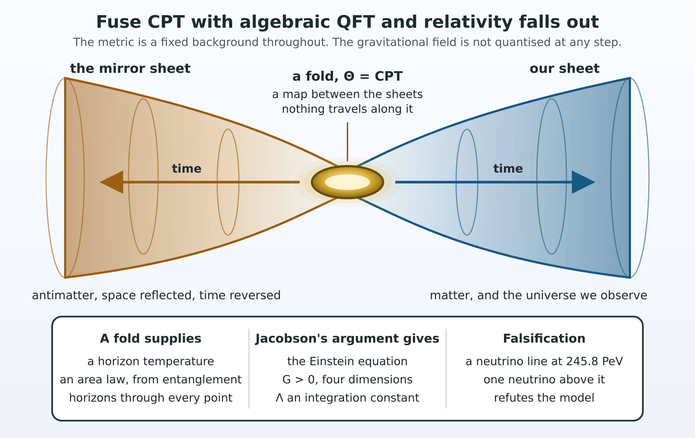
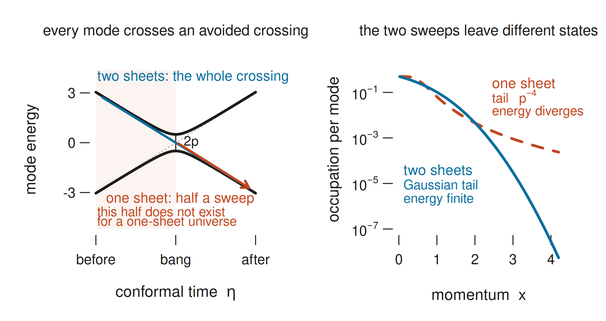
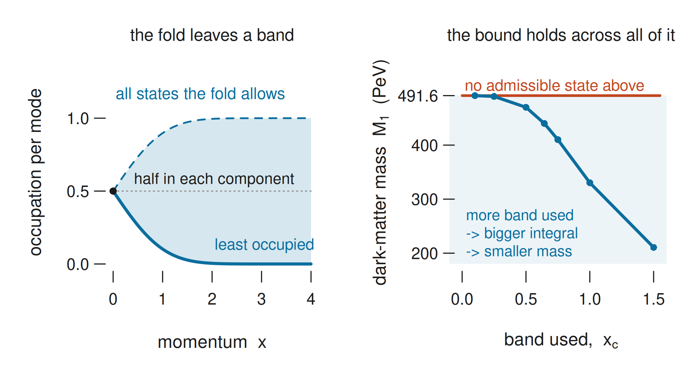
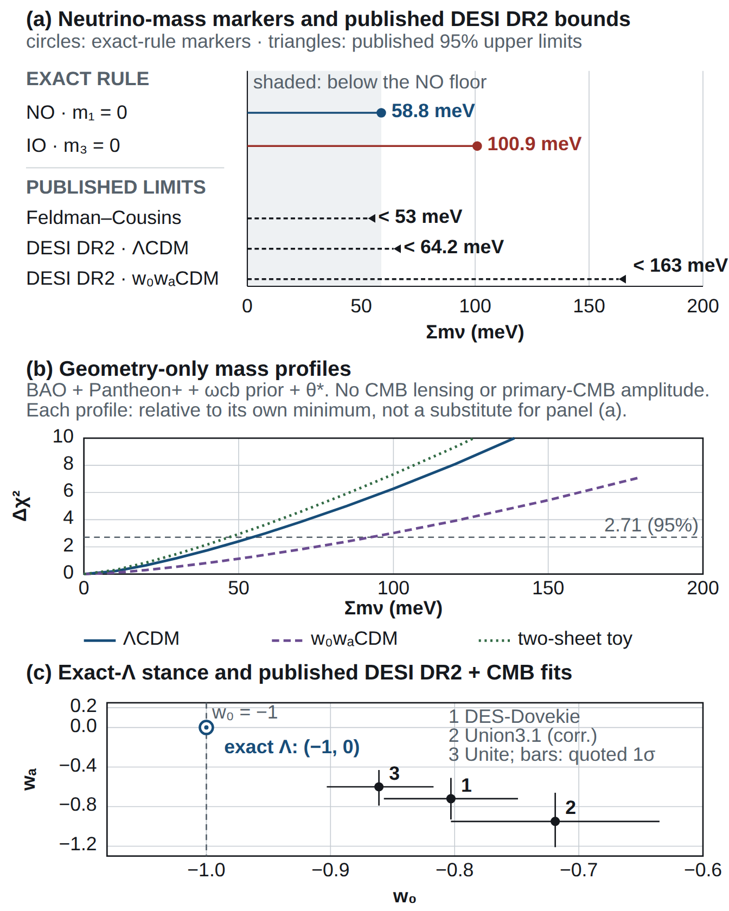
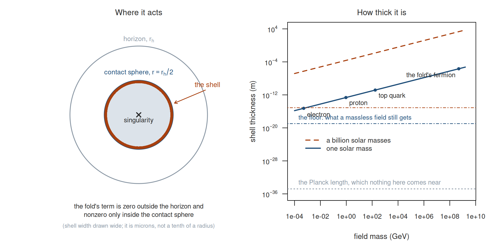
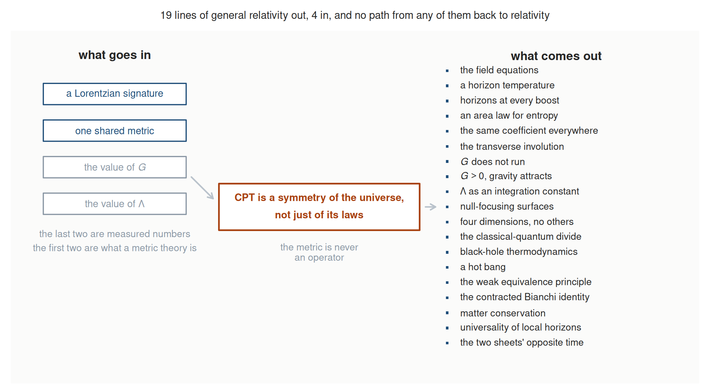

# Separate Ways and the Upside Down: the classical world and the field equations from a CPT fold, and the neutrino line that would break it

**B. H. Wiseman**

*Linnet Labs, Sydney, Australia (independent researcher; no external funding)*

*gr-qc (primary); astro-ph.CO, hep-th (cross-list).*

---

## Abstract

We study what follows if CPT is a symmetry of the universe itself and not only of its laws, as
Boyle, Finn and Turok proposed: the big bang is then a fold, with a mirror-image sheet on its far
side. We combine it with a standard result of algebraic quantum field theory, that the modular
conjugation of a wedge is a reflection, and find that each fills a gap in the other. Because the
fold is a reflection, every field splits into the average of its two copies and their difference,
and these behave as the classical and the quantum variable. At a horizon the fold relates the two
sides by half a thermal period, so the state across it is a thermofield double, pure as a whole,
thermal to each side. This supplies the three inputs Jacobson's 1995 derivation of Einstein's
equations takes beyond the Clausius relation, a horizon temperature, an entropy proportional to
area, and horizons through every point. The entropy is the entanglement entropy of that state and is
not taken from black-hole thermodynamics, so the argument does not assume its result; the dependency
graph of the derivation is given and checked. Nineteen properties of general relativity follow,
including $G>0$, four dimensions and $\Lambda$ as an integration constant, from four inputs: two
that define a metric theory and two measured constants. The gravitational field is not quantised at
any step. Applied at the bang, the same construction sets a minimum on particle production, and the
observed dark-matter abundance turns it into predictions that can fail: a dark-matter fermion of at
most $491.6\pm2.0$ PeV, a neutrino line from its decay at $245.8\pm1.0$ PeV, and a neutrino-mass sum
of at least 58.8 meV, which the model cannot relax because it keeps dark energy constant. The model
departs from general relativity only inside black holes, in a shell 2.1 microns thick at one solar
mass, where relativity predicts its own breakdown.

## 1. Introduction

{width=100%}
*Graphical abstract. One postulate goes in: CPT is a symmetry of the universe itself, not
just of the laws inside it. The fold relating the two sheets is an involution, a relation between the sheets with nothing travelling along it, so no matter crosses it and no white-hole population or traversable connection
is predicted. The classical-quantum split is §2.1, the horizon temperature §3.1, the field
equations §3.6, and the count line by line Appendix E.*

Boyle, Finn and Turok proposed that CPT, the combination of charge conjugation, spatial reflection
and reversal of time orientation, is a symmetry of the universe itself and not only of its laws
[9,10,11]. The Big Bang then has a far side, our own universe over again with matter swapped for
antimatter, space reflected and time running the other way. This paper adds one thing to their
proposal, a result from algebraic quantum field theory that fixes the map between the two sides, and
follows what comes out. What comes out includes Einstein's field equations, with the metric a fixed
background throughout, and an upper bound on the mass of their dark-matter particle. The map
relating the two sheets undoes itself when applied twice, which makes it an involution. Throughout
this paper *the fold* names that involution, and also the two-sheeted universe built on it.

Their cosmology needs no inflaton. Two sheets meet at a radiation bang, CPT relates them, and the
dark matter is a heavy right-handed neutrino produced gravitationally at the bang, its mass fixed by
the observed abundance. Two things in it are left open. The abundance calculation has to be given a
quantum state to start from, and the cosmology selects one by a minimum-energy condition brought in
from outside. The cosmology also says that some involution relates the sheets without saying which.

A second body of work, developed independently, answers both questions. Algebraic quantum field
theory, AQFT, describes a field by the algebra of observables in each region, and attaches to such
an algebra a mirror map called its modular conjugation. For the vacuum algebra of a static patch the
map is known: Sewell's theorem [2] and the de Sitter analysis of Borchers and Buchholz [3] identify
it with a reflection through the horizon, the wedge reflection, and Bisognano and Wichmann [28]
supply the flat-space original. Parikh, Savonije and Verlinde [1] show by parallel transport between
antipodal points that the map acts on the tangent space by $PT$. Chang and Li [26] give the
mode-level form and the reality condition.

Three older tools are used with it. Thermofield dynamics, due to Takahashi and Umezawa [29] and
applied at horizons by Israel and Maldacena [7,8], writes a thermal state as a pure state of two
copies of a system. The closed time path of Schwinger and Keldysh [16,17] calculates expectation
values by running time forward and then back along a second leg. The symmetric thermal contour of
Niemi and Semenoff [18] and Herzog and Son [19] puts that second leg half a thermal period away.
None of these ingredients is new here.

This paper joins the two bodies of work, and each fills a gap in the other. The wedge-reflection
theorems fix the involution the cosmology leaves undetermined. That involution, applied at the bang,
supplies the family of states the cosmology had to prescribe. The cosmology picked one state from
the family and got one value for the dark-matter mass; an operator inequality over the whole family
turns the observed abundance into an upper bound on it. Boyle, Finn and Turok reach the state that
saturates the bound by an independent minimum-energy route, so §2.3 does not have to take it on
their authority.

Two frameworks can fit together formally without the fit meaning anything, so the useful question is
what the combination predicts. The dark-matter results came first, and the gravitational results
came out of stress-testing them. General relativity is a demanding test. If CPT read through the
modular structure of a wedge is physics, the field equations should follow without being put in.

Three things usually expected of a quantum theory of gravity come out with the metric held fixed as
a background. First comes the divide between classical and quantum, which is whether a field is even
or odd under the fold and has nothing to do with scale. The second is a horizon temperature: the
fold relates the two sides of a horizon by half a thermal period, and that shift is what makes the
state on either side thermal. Third is the Einstein equation.

Jacobson showed in 1995 that a horizon temperature and an entropy proportional to area give the
field equations, and took both as inputs [33]. Here both come from the fold. The fold's map forces
the state across a horizon to be a thermofield double, a state that is pure taken whole and thermal
to either side alone, and the area law is the entanglement entropy of that state. It is not taken
from the Bekenstein-Hawking formula, so general relativity is not used in its own derivation; §4.1
checks the dependency graph for exactly that and names the four places the derivation could have
failed. Jacobson's remaining input, a horizon at every point in every null direction, is derived in
§3.6. Nothing gravitational is quantised at any step. Newton's constant and the cosmological
constant remain measured inputs.

§3.6 works the derivation through. Appendix E lists what comes out and what goes in, nineteen
properties of general relativity from four inputs, and a script produces the list so the count can
be checked.

The dark-matter results are what make the model falsifiable, and most of the arithmetic goes there.
At a radiation bang the equation for each field mode is an avoided crossing, the two-level problem a
solid-state physicist meets when levels sweep past one another. A state the fold leaves unchanged
must sit half in each component at the crossing, which leaves one free phase per mode. For every
such state, pure or mixed, Gaussian or not, the average of the particle numbers before and after the
crossing is bounded below on each pair of modes. A given abundance made of more particles means a
lighter particle, so a floor on production is a ceiling on mass. The abundance match therefore
returns

$$
M_1\le491.6\pm2.0\ {\rm PeV},\qquad E_\nu\le245.8\pm1.0\ {\rm PeV},\qquad
\Sigma m_\nu\ge58.8\ {\rm meV}.
$$

First is a ceiling on the dark-matter mass over every state the fold permits. The second is the
energy of the neutrino from the two-body decay in the model of §2.4, half the mass, and the line is
narrow enough that one securely assigned event above it refutes the model. Third is a floor on the
sum of the neutrino masses. A model usually relaxes such a floor by letting dark energy vary in
time, the $w_0w_a$ freedom; the fold is committed to constant dark energy and cannot. The quoted
widths propagate the measured inputs only, at fixed production history and particle content; §2.3
sets out what is included and what is left out.

The same involution can be carried to a black-hole horizon, and that work is in the companion paper
[32]. The results here do not need it, but §3.6 cites it for two things: that the surfaces where the
sheets touch are caustics, which is what lets the focusing argument of §3.6 act on them, and that
the sheets touch nowhere outside a horizon and only inside $r=M$ within one.

Section 2 gives the fold, the crossing and the abundance machinery, and section 3 the results and
their tests. Section 4 sets out what the fold claims, its limits, and what would refute it, and
section 5 concludes. The appendices carry the algebra, the states at the bang, the quotient
readings, the benchmarks, and the list of what goes in and what comes out.

## 2. Construction of the fold

A note on method comes first. Every number quoted in this paper is produced by a script, and each
script is named for the passage it supports. The calculations are in R 4.5.2 with no package loaded,
so base R runs all of them, and in Python 3.12.13 where a special function or a symbolic step is
wanted, using NumPy 2.5.3, SciPy 1.18.1, SymPy 1.14.0 and mpmath 1.3.0. A checking pass runs over
both manuscripts on every change and fails if a number in the text and the script named for it come
apart; the code and that pass are at <https://github.com/BenWiseman/separate-ways>.

### 2.1 Fold parity, and the classical-quantum split it makes

Let $\alpha$ be the antipodal map of de Sitter space, which sends each point to the one opposite it.
It is an involution and it is free, meaning it leaves no point where it was. In the embedding of de
Sitter in $\mathbb R^{1,4}$ it is total inversion, $X\mapsto-X$. Lifted antilinearly, so that the
lift conjugates the numbers as it carries a field across, total inversion is the PCT prescription
itself (PCT is Pauli's letter order for the CPT theorem), and Chang and Li use exactly that to
establish CPT invariance of the scalar theory on elliptic de Sitter [26]. So the operator relating
the two copies exists by the PCT theorem and the geometry. Call it $\Theta$. What is hypothesised is
narrower: that the image under that operator is the second leg of the closed time path, the return
leg along which the formalism runs time backwards. The same operator can be used in three different
ways. One can quotient spacetime by it, as the one-copy readings do and the companion tests; impose
a reality condition on the quotient, as Chang and Li do; or keep both sheets and use the operator to
pair the contour legs, which is what follows.

Where the second leg sits is not a further choice. For a state at inverse temperature $\beta$, the
real-time thermal formalism allows it anywhere in a one-parameter family, displaced downward in
imaginary time by any $\sigma$ between $0$ and $\beta$, and the physical in-in correlators come out
the same for every member, which is why the displacement is usually treated as a convention. The
fold cannot treat it as one. $\Theta$ is antilinear with $\Theta^2=1$, so exchanging the sheets is a
symmetry of the pair and the cross-sheet kernel has to come out the same either way round. A contour
carries two cross kernels, one per ordering of the legs. With $W$ the two-point function of a single
mode of frequency $\omega$, their difference is

$$
W(-t-i\sigma)-W(t-i\sigma)=\frac{i\sin\omega t\,
\sinh\!\big(\omega(\beta/2-\sigma)\big)}{\omega\sinh(\beta\omega/2)},
$$

checked to machine precision against the mode sum with the Bose factor put in by hand. It vanishes
for all $t$ at exactly one $\sigma$, and that is $\beta/2$. The two ends of the family are the
extremes. At $\sigma=0$ the orderings differ by the whole commutator $i\sin\omega t/\omega$, the
same at any temperature, and at $\beta/2$ they do not differ at all. So the hypothesis is only that
the legs are paired. An involution can pair one contour out of the family, and the symmetric one is
that contour. The selecting is done by the Kubo-Martin-Schwinger (KMS) condition, which is what
being thermal means for a state. It enters through $(1+n)e^{-\omega\sigma}=ne^{\omega\sigma}$, where
$n$ is the Bose factor, and with the Bose factor removed no $\sigma$ is preferred at all. Every mode
is sensitive to the displacement, most sharply those with $\beta\omega$ of order two.

Write $J$ for the point map that the wedge reflection of Sewell [2] and Borchers and Buchholz [3]
implements; $J$ here always means that map of points, and never the operator on states that
implements it. In the mode convention used here

$$
\alpha=J\circ P_\perp,\qquad P_\perp Y_{\ell m}=(-1)^\ell Y_{\ell m}.
$$

The bifurcation sphere is the two-sphere where the future and past horizons cross. $P_\perp$
reverses orientation on it and lies outside the connected de Sitter group, so no rotation absorbs
it; $J$ fixes that sphere pointwise while $\alpha$ is free. That difference is the whole of what is
proposed. On de Sitter the embedding fixes $\alpha$, and at a black hole the geometry fixes it too.
A free involutive isometry of a round bifurcation sphere is an element of $O(3)$ with no $+1$
eigenvalue, which leaves $-\mathrm{Id}$ and nothing else: a numerical search that builds involutive
isometries from random orthogonal frames finds $2506$ free ones, and every one is $-\mathrm{Id}$
exactly.

Kerr's surface is not round. Its dependence on $\theta$ runs through $\cos^2\theta$ alone,
and no two latitudes in the half range share both a Gaussian curvature and a circumference at any
spin up to $a/M=0.998$, so its isometry group is exactly $O(2)\times\mathbb Z_2$; of that group's
eight involutions exactly one has no fixed point, $\theta\mapsto\pi-\theta$ with
$\phi\mapsto\phi+\pi$. Those two cases exhaust the stationary vacuum holes in four dimensions.
Charge moves $r_+$ and nothing the argument uses, so the count is one at every charge admitting a
horizon, and on the round $S^{D-2}$ of a higher-dimensional hole the eigenvalue argument runs
unchanged, so it is one at every dimension as well. $P_\perp$ is a choice at none of them. Where it
fails is a bifurcation surface with no equatorial symmetry, and there no such map exists (companion,
A.10).

The one-copy readings take spacetime to be the quotient and implement $\alpha$ linearly on fields.
The fold keeps the time-orientable cover and equips its field algebra with an antilinear lift

$$
\Theta i\Theta^{-1}=-i,\qquad \Theta\phi(f)\Theta^{-1}=\phi(f\circ\alpha).
$$

No trajectory through spacetime is implied. Those two readings need not share admissible states,
global observables or response laws, which is why the companion's tests name the state or response
they test.

Write the two fields as $\Phi$ and $\Theta\Phi$ and define the Keldysh variables

$$
\Phi_c=\frac{\Phi+\Theta\Phi}{2},\qquad \Phi_q=\Phi-\Theta\Phi.
$$

For real test functions supported in one static patch, with the antipodal partner causally
disjoint so that $\Delta(f,g\circ\alpha)=0$, time reversal changes the sign of the causal kernel
while antilinearity changes the sign of $i$. The same-sheet commutators have opposite signs, the
cross-sheet commutators vanish, and

$$
[\Phi_c,\Phi_c]=[\Phi_q,\Phi_q]=0,\qquad [\Phi_c,\Phi_q]=i\Delta,
$$

the standard closed-time-path algebra, with $\Delta$ the causal commutator kernel. That doubled
algebra is Takahashi and Umezawa's [29]: for left and right multiplication $L_AX=AX$ and
$R_AX=XA$, one has $[L_A,L_B]=L_{[A,B]}$, $[R_A,R_B]=-R_{[A,B]}$ and $[L_A,R_B]=0$, which for free
fields with a central commutator give exactly the algebra above. The average has a classical
Gaussian distribution, but average and difference together remain a quantum system, and keeping
both retains the conjugate information that a projection onto the average alone would discard.
What the fold adds is the spacetime involution, its state implementation and its compatibility
with the free gravitational constraints (Appendix A).

The algebra above is standard. What the fold adds is a reading of it. Since $\Theta^2=1$, the
average is exactly the fold-even part of the field and the difference exactly the fold-odd part.
**On this reading the fold's parity is the classical-quantum split**: where the two sheets agree the
difference vanishes and the physics is classical, and where they disagree is where the commutator
lives. The doubling is sixty years old and has been used as a calculating device, with the second
copy not located anywhere. Here the second copy is a place, the other sheet, and that is what this
paper adds to the algebra.

One consequence is that the opposite time orientation of the two sheets, which the cosmological
accounts assume, can be derived. Tomita-Takesaki theory attaches to an algebra a modular operator
$\Delta$ alongside the conjugation $J$ (this $\Delta$ is not the commutator kernel above), and the
powers $\Delta^{is}$ generate a flow, the modular flow. For a wedge the modular flow is the boost.
In the embedding that boost is $K=X_0\partial_1+X_1\partial_0$, so $dX_0/ds=X_1$, positive
throughout the right static patch and negative throughout its antipodal partner. Relative to one
fixed time orientation the two patch algebras' modular flows run oppositely, so the opposite time
orientation of the two copies follows from reading $\Theta$ as the modular conjugation. Two limits
apply. It is a statement about orientation and not about entropy, since an equilibrium modular flow
does not grow entropy. And the relation at work is $\Delta_{A'}=\Delta_A^{-1}$ between an algebra
and its commutant rather than a property of $J$, since $J\Delta^{is}J=\Delta^{is}$.

The sign and both limits are calculated. Take four thousand points of the right static patch and
four thousand of its antipode. On the first $dX_0/ds$ is positive at every point, on the second
negative at every point. A rotation generator gives no sign at all, and points outside both patches
give both signs in nearly equal numbers. The definite sign therefore belongs to the patch and to the
boost, and the coordinate has no part in it. The two limits are checked in a finite-dimensional
Tomita-Takesaki model in which each modular operator is built from the defining relation
$S(a\Psi)=a^\dagger\Psi$ of its own algebra rather than written down: $S_L$ implements the adjoint
on the left algebra and fails on the commutant, each factors as $J\Delta^{1/2}$ with the same $J$,
and the two modular operators compose to the identity, which gives $\Delta_{A'}=\Delta_A^{-1}$.
Along the flow the entropy is constant to twelve figures, and $J$ commutes with the flow. The
identification of the two patches with the expanding and contracting branches is a separate
interpretation, and §3's numbers use none of the patch algebra.

### 2.2 A radiation bang as an avoided crossing

At a radiation bang the Ricci scalar vanishes, $R=0$, and so does $a''$, where $a$ is the scale
factor and a prime is a derivative in conformal time $\eta$. Massless free fields do not notice the
expansion in such a background, so only a mass term can tell the two time orientations apart. With
$a(\eta)=a_1\eta$ the conformal mass term is $ma=\gamma\eta$, $\gamma=M_1a_1$, and a fermion mode of
comoving momentum $p$ obeys

$$
i\,\partial_\eta\psi=\begin{pmatrix}\gamma\eta & p\\ p & -\gamma\eta\end{pmatrix}\psi.
$$

This is the Landau-Zener problem, with the momentum as the gap and $\gamma$ as the sweep rate. The
identification is a calculational handle and no priority is claimed for it. Direct integration
checks the results below at $\gamma=1$.

*The fold on one mode.* $H$ is real and symmetric and $H(-\eta)=\sigma_xH(\eta)\sigma_x$, so the
antilinear map $\Theta:\psi(\eta)\mapsto\sigma_x\psi^*(-\eta)$ preserves the equation and satisfies
$\Theta^2=1$. Invariance as a ray requires $\sigma_x\psi^*(0)=e^{i\delta}\psi(0)$, which forces
$|\psi_1(0)|=|\psi_2(0)|=1/\sqrt2$, the mode is exactly half in each component at the bang. What
survives is one relative phase, $\psi(0)\propto(1,e^{i\mu})/\sqrt2$, and since the minimising phase
moves with $p$ it is a function $\mu(p)$.

*What is prior.* Nadal-Gisbert, Navarro-Salas and Pla [22] give, for a fermion in a CPT-invariant
radiation-dominated universe, the mode relation $h^I_k(\tau)=h^{II*}_k(-\tau)$ as the condition
for a CPT-invariant vacuum (their eq. 66); the consequence $|h^I_k(0)|=|h^{II}_k(0)|=1/\sqrt2$ at
the bang (68); the one-parameter family $h^I_k(0)=e^{+i\Theta_k}/\sqrt2$,
$h^{II}_k(0)=e^{-i\Theta_k}/\sqrt2$ with $\Theta_k$ an arbitrary angle (69); and the ultraviolet
decay $\Theta_k\sim-\gamma/4k^2+\dots$ that Hadamard regularity requires of it (80). Those are the
three statements just derived, reached by a different route, and we claim no priority for any of
them. Boyle et al. parametrise the same family as
$|\hat\beta_\pm(p)|^2=[1-\cos2\eta(p)\cos\lambda(p)]/2$, so that
$n_\eta-n_0=\cos\lambda(p)\,\sin^2\eta(p)\ge0$ with $\cos\lambda>0$ on the established range
$-\pi/2<\lambda(p)<\pi/2$, and state that the particle number density is minimised at $\eta(p)=0$,
where their state has both minimum expected particle density and minimum energy density [10].

Figure 1 draws the crossing and what the second sheet does to it.

*Two sheets complete the crossing.* The Landau-Zener closed form applies to a sweep from
$\eta=-\infty$ to $+\infty$. A single-sheet cosmology begins at the bang and gets half of one. A
full sweep returns $|\beta|^2=e^{-\pi p^2/\gamma}=e^{-x^2}$ to a maximum relative error of
$5\times10^{-3}$ across $p\in[0.1,1.4]$, the "in" vacuum of Appendix B.1. The sweep from $\eta=0$
returns the $\gamma^2/16p^4$ tail of the bang-adiabatic state, with ratio $1.1145$ at $p=2$ and
log-slope $-4.305$ against the independently derived $1.114$ and $-4.308$. The second of these is
the bang-adiabatic state, the one obtained by starting each mode in its adiabatic vacuum at the bang
itself. $\Theta$-invariance alone does not separate the two, because the bang-adiabatic state is
itself in the family, at $\mu=\pi$. What separates them is the energy integral, which diverges
logarithmically at $\mu=\pi$ and converges by $x\simeq3$ at $\mu_*$. So the fold supplies the
family, and regularity excludes a member.

**Figure 1.** Every mode at a radiation bang passes through an avoided crossing; the gap at
closest approach is $2p$. A universe with one sheet begins at the bang and gets half the sweep. A
universe with two runs the whole way through. The right panel is what each leaves behind: the half
sweep produces a $p^{-4}$ occupation tail whose energy integral diverges logarithmically, and the
whole crossing produces the Gaussian the observed abundance needs. Both curves are the closed
forms, and the one-sheet curve is drawn as an illustrative profile with the stated tail index
rather than a particular state.

*The adopted occupation.* In the dimensionless momentum $x=\sqrt\pi\,p/\sqrt\gamma$ the
least-occupied member of the family is

$$
n(x)=\frac{1-\sqrt{1-e^{-x^2}}}{2},
$$

Boyle, Finn and Turok's half-angle state. Its production integral, and the ratio §3.5 uses, are

$$
I=\frac{1}{\pi^2}\int_0^\infty x^2n(x)\,dx=0.0127597,\qquad
R=\frac{\int_0^\infty x^2[-\log(1-n(x))]\,dx}{\int_0^\infty x^2n(x)\,dx}=1.07037.
$$

The occupation function and $I$ come from Boyle et al. [10,11]; the release retains
$I=0.0127596673634$ as a quadrature check on the fixed occupation function.

### 2.3 From abundance to mass

Their small-Weyl-coupling abundance branch gives $M_1\propto\rho_{\rm
DM,0}^{2/5}s_0^{-2/5}I^{-2/5}\widehat\mu^{3/5}$. Here $\rho_{\rm DM,0}$ is the present dark-matter
density, $s_0$ the present entropy density, $\widehat\mu=(4\pi G/3)^{-1/2}$ a Planck-scale mass and
$g_*$ the number of relativistic species at production. The reconstruction uses $\rho_{\rm
DM,0}=9.7\times10^{-48}$ GeV$^4$, $s_0=2.2215\times10^{-38}$ GeV$^3$,
$\widehat\mu=5.966\times10^{18}$ GeV and $g_*=106.75$, treated as exact, and returns

$$
I\simeq0.01276,\qquad M_1=4.916\times10^8\ {\rm GeV}.
$$

The entropy density needs one remark. A value of $2.3\times10^{-38}$ GeV$^3$ is often quoted and
is high by $3.5$ per cent; $s_0=2891.2$ cm$^{-3}$ is $2.2215\times10^{-38}$ GeV$^3$, and since
$M_1\propto s_0^{-2/5}$ the benchmark with the higher value is $484.8$ PeV and the half-mass
energy $242.4$ PeV, a shift of $6.8$ PeV against a propagated width of $2.0$. Those digits record
how the arithmetic follows from the inputs; the physical scales are about $490$ and $245$ PeV.
State, radiation history and branch remain inputs, and the separate large-Weyl-coupling branch
changes the mass.

That width propagates the measured inputs. The abundance enters at the two-fifths power and is known
to one per cent from $\Omega_{\rm DM}h^2=0.1200\pm0.0012$, contributing $0.40$ per cent; the entropy
density is fixed by the cosmic microwave background temperature $T_{\rm CMB}$ to $0.07$ per cent and
contributes $0.026$; the production integral is a quadrature of a fixed function and the reduced
Planck mass a recommended constant of the Committee on Data of the International Science Council,
both negligible. Nearly all the variance comes from the abundance, giving $\pm2.0$ PeV on the mass
and $\pm1.0$ PeV on the half-mass energy. It contains no allowance for the history being different
or for the production model being wrong, and either moves the endpoint by far more than $2$ PeV. A
per cent of theory error anywhere in the reconstruction moves the endpoint by about $2$ PeV on its
own. The Landau-Zener treatment, $g_*=106.75$, the choice of branch and the radiation history each
shift the number without widening it, and that is the list. State freedom is different: a different
admissible state changes the abundance-matched mass below the ceiling (§3.1) and does not move the
ceiling.

### 2.4 Decay model

We adopt Boyle, Finn and Turok's particle content and their stabilising rule, a $\mathbb Z_2$
symmetry under which one sterile neutrino is odd and so cannot decay [10,11]. If the rule is exact
the chosen sterile neutrino cannot decay and one light neutrino is massless in the stated seesaw
approximation. A small added Yukawa column supplies a concrete weakly broken example with a hard
two-body neutrino energy near half the heavy mass, with $h\nu:Z\nu:W\ell=1:1:2$ at tree level; its
lifetime and flavour direction are further inputs, and radiation and propagation shape any observed
spectrum.

The first question about a decaying relic is why it is still present. The lifetime is an input here
and it is not an unconstrained one. Appendix C.2 keeps the stabilising $\mathbb Z_2$ as an
assumption, after showing it cannot be derived as a holonomy of the fold's topology.

An assumed global symmetry is not
expected to survive quantum gravity, so if it is broken by Planck-suppressed operators and by
nothing else, an operator of dimension $4+k$ with an order-one coefficient gives
$\Gamma\sim(c^2/P)M_1(M_1/M_{\rm Pl})^{2k}$ on dimensions alone, with $c$ the coefficient and $P$ a
phase-space factor, $1$ or $16\pi$ according to convention. The mass is already fixed, so the
operator dimension is the only discrete freedom left, and it is strongly selected: at $k=3$ the
estimate brackets the $10^{29}$ to $10^{31}$ s window left by external bounds, returning
$1.58\times10^{31}$ s at $P=16\pi$ and $3.14\times10^{29}$ s at $P=1$, while $k=2$ gives a particle
gone long ago and $k=4$ one that never decays, each missing under both conventions by about twenty
orders. That is dimensional analysis and no more, no dimension-seven operator is written down here
and none of its coefficients is computed. It also turns on the suppression scale being the ordinary
Planck mass, since the reduced one puts the same estimate two orders below the window, and that
choice is a convention. None of it touches the line's energy, which is kinematic. The companion
checks that the induced light-neutrino mass and abundance change can be negligible. The KM3NeT event
[21] is observational context, not evidence for this particle.

### 2.5 Tests

The endpoint test draws events from an $E^{-2}$ spectrum above 50 PeV, truncated at the true
endpoint, and smears them with a lognormal response of width $0.3$ in $\ln E$. The threshold is
set so that a population obeying the model fires the test with probability $0.05$ whatever the
sample size, and the power is the probability of firing when the true endpoint is $r$ times the
model's. A fixed per-event threshold would not do, because its sample-wide false alarm grows with
the sample; that is why the calibrated threshold climbs with $N$ in Table 2.

Assignment of an event to the decay component uses direction. A decaying halo traces the
line-of-sight integral of the dark-matter density and an astrophysical population does not. The numbers assume a Navarro-Frenk-White (NFW) halo, pure Galactic decay and uniform exposure.

For the neutrino-mass sum the floor is $\sqrt{\Delta m^2_{21}}+\sqrt{\Delta m^2_{31}}$, with
global-fit central values and symmetric one-sigma errors $\Delta
m^2_{21}=(7.53\pm0.18)\times10^{-5}$ eV$^2$ and $\Delta m^2_{31}=(2.510\pm0.030)\times10^{-3}$
eV$^2$, the one set used wherever the floor's width is quoted. The comparison with the second data release of the Dark Energy Spectroscopic Instrument, DESI
DR2, uses the parabolic profile likelihood Elbers et al. publish for their baryon-acoustic-oscillation and microwave-background (BAO+CMB) analysis [12], Gaussian
with $\mu_0=-0.036$ eV and $\sigma=0.043$ eV, obtained by maximising over nuisance and
cosmological parameters with degenerate masses, as a proxy likelihood under a flat
non-negative-mass prior. A profile is not a marginalised posterior, matching one quantile does not
reconstruct a distribution, and this is an approximation they do not make. Its warrant is that
truncating at zero and renormalising returns a ninety-five per cent upper limit of $63.9$ meV
against the $64.2$ meV they quote, a difference under half a meV. Three toy shapes matched to the
published limit at the ninety-fifth percentile, an exponential from zero, a half-Gaussian at zero
and a flat posterior, bracket the shape dependence. A region of practical equivalence around the
floor, fixed by the floor's own propagated width before the partition is looked at, is the
standard treatment of a point prediction against a bounded measurement in Bayesian psychometrics
and replaces two one-sided constructions with one statement.

## 3. Matter sector and field equations

### 3.1 A ceiling over every admissible state

This section shows that the mass of §2.3 is the largest that any fold-invariant state allows. Each
mode pairs a particle with an antiparticle of opposite momentum. Write $a,b$ for the pair's
operators long after the crossing, the out operators, and absorb phases so that the operators long
before it, the in operators, are $a_-=c\,a+s\,b^\dagger$ and $b_-=c\,b-s\,a^\dagger$, with
$c=\sqrt{1-P}$, $s=\sqrt P$ and $P=|\beta|^2$ the production probability of the crossing. Let
$N_\pm$ be the number per pair member in each asymptotic region and $Q=(N_++N_-)/2$. On the
four-dimensional pair block $Q$ has eigenvalues $\{n_*,\tfrac12,\tfrac12,1-n_*\}$ with
$n_*=(1-\sqrt{1-P})/2$, the two middle values belonging to the odd-parity states, so

$$
Q\ \succeq\ n_*\,\mathbf 1.
$$

At $P=0.05,0.2,0.5,0.8,0.95$ the least eigenvalue equals $n_*$ to machine precision and the
transformation is canonical to $10^{-16}$.
Every member of the family has equal in- and out-region occupations, which is what the contact condition of §2.2, each mode half in each component where the sheets meet, requires on a symmetry-complete block, so such a state satisfies $\langle N_+\rangle\ge
n_*$. That equality reaches well past the family, and a short argument establishes it. $\Theta$ is antiunitary
and exchanges the two regions, so $\Theta N_+\Theta^{-1}=N_-$; for an antiunitary map
$\operatorname{Tr}(\Theta A\Theta^{-1})=\overline{\operatorname{Tr}A}$; and a $\Theta$-invariant
state has $\Theta\rho\Theta^{-1}=\rho$. Then
$$
\langle N_-\rangle=\operatorname{Tr}(\rho N_-)
=\operatorname{Tr}\!\left(\Theta\rho\Theta^{-1}\,\Theta N_+\Theta^{-1}\right)
=\operatorname{Tr}\!\left(\Theta\,\rho N_+\,\Theta^{-1}\right)
=\overline{\langle N_+\rangle}=\langle N_+\rangle,
$$
the last step because $\langle N_+\rangle$ is real. So $\langle N_+\rangle=\langle
N_-\rangle=\langle Q\rangle$ for every $\Theta$-invariant state, mixed, entangled or non-Gaussian,
and the step from
the operator bound to the observable needs nothing beyond invariance. Integrating $n_*$ with
$P=e^{-x^2}$ returns the $I=0.0127597$ of §2.2. The operator bound and the equality both hold on three hundred random mixed states and fail as soon as invariance is dropped.

The identity also has a limit, and the limit is informative. It works because $\Theta$ *exchanges*
two things, so there is a second operator for the identity to equate. Where $\Theta$ *fixes* the
object instead, the same identity constrains nothing: a squeezed vacuum with real $r$ has real Fock
amplitudes and is $\Theta$-invariant at every $r$, while its occupation $\sinh^2r$ runs freely, and
only giving those amplitudes a phase makes the invariance bite. So the fold selects where it
exchanges and not where it fixes, and the bang is the first case because the two branches are two
things. Checked both ways on explicit states, at $10^{-16}$ against $0.155$.

One consequence carries further than this section. A squeeze is measured by its occupation,
$\langle N\rangle=\sinh^2r$, so a selected occupation is a selected squeeze, at the crossing
$r=\mathrm{arcsinh}\sqrt{n_*}$, running from $0.112$ at $P=0.05$ to $0.658$ at $P=1$. Since
$n_*\leq\tfrac12$,

$$r\;\leq\;\mathrm{arcsinh}\frac{1}{\sqrt2}=0.6585,$$

a pure number with no parameter in it, and overshooting it would need $n_*>\tfrac12$, which
$(1-\sqrt{1-P})/2$ reaches only at $P=1$. Reading that as a ceiling on the fold's two-sheet
correlation at any later epoch needs two things this paper does not establish: that the crossing's
invariance reaches the mode in question, and that its squeeze is inherited rather than regenerated.
What does not depend on either is that the occupation the fold selects and the squeeze are one
quantity, so the amplitude is not a free parameter.

At the other end of the fold, a horizon, the squeeze comes out determined, and the step that does it
is §2.1's. Because the fold's map is the square root of the thermal transformation at the primitive
period, a state in equilibrium at a bifurcate horizon has its cross-sheet correlator equal to the
direct one shifted by half a period. A hole formed by collapse has no such horizon, so the statement
covers the cosmological horizon and the two-sided class only. For one mode that shift gives
$W(t-i\beta/2)=\cos\omega t/[2\omega\sinh(\beta\omega/2)]$, real and even, the two exponentials
collapsing because $(1+n)e^{-\beta\omega/2}$ and $ne^{\beta\omega/2}$ are equal. The state carrying
that correlator is the thermofield double, a two-mode squeezed vacuum with $\tanh
r=e^{-\beta\omega/2}$ and $\sinh^2 r=1/(e^{\beta\omega}-1)$ exactly. So the squeeze at a horizon is
fixed by the mode frequency and the surface gravity, with nothing left to choose, subject to the
fold being $J\circ P_\perp$, which leaves each sheet's own statistics alone and puts $(-1)^\ell$ on
the cross term.

Equilibrium does not have to be assumed separately. A state can be built with no KMS property at a
horizon, so nothing here shows that every state is thermal. What the Hadamard condition gives, and
the fold has it already since §3.6 computes the image stress from the Hadamard parametrix, is that
the state-dependent part of a two-point function is smooth while the singular part is fixed by the
geometry alone. The temperature comes from the singular part. On a patch of proper size $r$ the
state-dependent part reaches the ratio $W_{\rm reg}/W_{\rm sing}$ only at order $r^2$, which holds
on two unrelated families. A thermal state at temperature $T$ gives $\pi^2r^2T^2/3$ with the
exponent fitted at $2.000000$ over five decades of $r$, and a classical background field gives
$4\pi^2r^2\phi_{\rm cl}^2$ with the same exponent. The balance is already the leading order in $r$,
so a relative error of order $(rT)^2$ in the temperature sits one order below the field equation the
balance returns, in the same way that the local fold of §3.6 is an isometry to second order and
fails at third. Alter the singular coefficient instead, which is what a state outside the Hadamard
class does, and the ratio stops vanishing, it goes to the alteration, at exponent zero.

The limit applies only for small $r$: a stellar-mass horizon sitting in the present microwave
background has $rT$ of order $3\times10^6$, so the expansion says nothing about a whole
astrophysical horizon and everything about the shrinking patch the balance actually uses. What is
assumed is the Hadamard condition, and equilibrium follows from it to the order used. The transverse
parity is not an assumption of the same kind, because §2.1's map is forced: $J\circ
P_\perp=-\mathrm{Id}$ exactly on the embedding, while $J$ alone fixes a whole two-sphere and a
rotation put in place of the parity fixes two points, so the $(-1)^\ell$ on the cross term is
forced.

The two ends meet at one frequency. The crossing's ceiling $\mathrm{arcsinh}(1/\sqrt2)$ is exactly
the horizon's own value at $\beta\omega=\ln3$, because $\sinh r=1/\sqrt2$ gives $\cosh r=\sqrt{3/2}$
and hence $\tanh r=1/\sqrt3=e^{-\ln3/2}$. Modes softer than $T\ln3$ sit above the ceiling and harder
ones below it.

The inequality assumes no pure state, no Gaussian density matrix and no factorisation of the
global state over momenta: a block reduced from an entangled multimode state is still a density
operator and the inequality applies to it. It also survives the sum over modes, which is what the
abundance needs. $\langle Q_k\rangle$ depends on the reduced state $\rho_k$ alone, every reduced
state is a density operator however the global state is correlated, so $\sum_k\langle
Q_k\rangle\ge\sum_k n_*(p_k)$ with no factorisation assumed. Entanglement across momenta cannot
lower the production integral, checked against generic entangled multimode states and against the
state that saturates the bound exactly. What it does assume is free Bogoliubov evolution, the
stated asymptotic particle definitions and equal in- and out-region number expectations; it is not
a theorem about the interacting theory, and at $P=1$ the even block is degenerate, so the
zero-momentum limit is excluded from any uniqueness statement. Within those assumptions no
admissible state returns a smaller production integral than the least-occupied member. Since
$M_1\propto I^{-2/5}$, every other state returns a smaller mass, and

$$
M_1\le491.6\pm2.0\ {\rm PeV},\qquad E_\nu=M_1/2\le245.8\pm1.0\ {\rm PeV},
$$

with equality requiring $\eta(p)=0$ wherever $\cos\lambda$ and the integration weight are nonzero.
The least-occupied member is the case that saturates the bound, and no principle picks it out, and
the selection criteria of Boyle, Finn and Turok and of Nadal-Gisbert, Navarro-Salas and Pla remain
the additional input they were. Figure 2 shows the band, the floor under it, and how the abundance
match reads the two.

**Figure 2.** Why the mass is a ceiling. Left: $\Theta$-invariance forces every mode half into
each component at the bang, so the band of allowed occupations has zero width in the deep infrared
and opens with momentum; the solid curve is the least-occupied member and the dashed one its
particle-hole conjugate. Right: the mass each member of the family returns. Every excursion into
the band raises the production integral, and $M_1$ falls as $I^{-2/5}$, so the least-occupied
member sits at the top.

Unitarity makes the family symmetric about a half, $n_{\max}=1-n_{\min}$, checked to seven
figures. At $p=0$ the Hamiltonian is diagonal, no mixing occurs and $n=1/2$ for every $\mu$, so
the band has zero width in the deep infrared. The upper branch is inadmissible on its own, since
$n_{\max}\to1$ gives a divergent number density. Table 1 quantifies the worst admissible excursion, a
state at the band edge out to $x_c$ and at the minimum beyond.

**Table 1.** The size of the surviving freedom.

| $x_c$ | $I/I_{\min}$ | $M_1$ (PeV) | line (PeV) |
|---|---|---|---|
| 0.10 | 1.000 | 491.6 | 245.8 |
| 0.25 | 1.008 | 490.1 | 245.0 |
| 0.50 | 1.119 | 470.0 | 235.0 |
| 0.75 | 1.574 | 410.0 | 205.0 |
| 1.00 | 2.700 | 330.4 | 165.2 |
| 1.50 | 8.312 | 210.7 | 105.4 |

Every excursion raises $I$ and lowers the mass, and none can raise it, so $M_1\le491.6$ PeV is the
endpoint of the family the fold defines and not only of the family Boyle, Finn and Turok
parametrise. The endpoint falls to KM3NeT's reconstructed $220$ PeV median at $x_c=0.644$. That sets
a scale for $x_c$ without limiting it. The median assumes an incident $E^{-2}$ spectrum rather than
a decay line, the event's origin is not established, and the band-edge profile is a worst case no
real state need realise.

*What regularity does and does not do.* The Hadamard condition fixes the short-distance structure
of the state. In the seed convention used here its leading large-momentum requirement is

$$
\frac{c_+(0)}{c_-(0)}\sim\frac{i\gamma}{4p^2},\qquad \gamma=ma_1,
$$

with higher terms fixed by the adiabatic expansion. The bang-adiabatic member misses it and has an
occupation tail proportional to $p^{-4}$ whose energy integral diverges logarithmically, so it is
excluded (Appendix B.1). Regularity does not select within what remains. For any smooth $f$ that
decays fast enough, replacing $\mu_*$ by $\mu_*+f$ preserves both the symmetry and every
ultraviolet asymptotic coefficient while raising the occupation by $\sqrt{1-P}\sin^2(f/2)$; the
freedom need not have compact support, only rapid decay, and the explicit CPT-invariant families
of [22] exhibit it. That is why the ceiling has to be an operator bound and cannot be a selection.
Among constant phases and the special values, only $\mu_*(p)$ cancels the boundary term down to
the Gaussian (Appendix B.2).

*The ceiling does not depend on the state at large momentum.* The production integral runs to
infinite momentum, and the state has to be specified there too. Half of $I$ comes from below
$x=1.03$ and $99.9$ per cent from below $x=2.83$; truncating the state above $x=3$ moves the
endpoint by $0.076$ PeV and above $x=4$ by less than a thousandth of a PeV, against a quoted width
of $2.0$. The abundance is an infrared quantity. An ultraviolet condition acts on a different moment
of the same occupation: the production integral is the $m=2$ moment and converges even for a
$p^{-4}$ tail, since $x^2x^{-4}$ is integrable, while the energy is the $m=3$ moment and grows
logarithmically for that tail, from $0.21$ to $0.46$ as the cutoff runs from $10$ to $300$, against
$0.1358$ for the adopted state. The ultraviolet decides which family is admissible; the infrared
decides the number.

### 3.2 Neutrino line, the event, and the test that bites

The two-body line sits at $E_\nu\le245.8\pm1.0$ PeV. KM3NeT's reconstructed median of $220$ PeV [21]
lies $25.8$ PeV below the endpoint, nearly twenty-six times the endpoint's width, so the comparison
is not lost in the error bar. That width is the endpoint's, and the event's is far larger. KM3NeT
quotes a 68 per cent interval of $110$–$790$ PeV about the median, wide and strongly asymmetric in
log energy, and roughly $46$ per cent of that posterior lies above $245.8$ PeV: $47$ per cent on a
split form matched to the upper half, $44$ on the lower, and every intermediate choice between. That
comparison inherits KM3NeT's assumption of an incident $E^{-2}$ spectrum rather than a decay line,
and it is an approximate posterior tail under assumed shapes, not a likelihood preference over an
astrophysical population, which we do not calculate. The event neither confirms the endpoint nor
refutes it: refutation needs an event confidently above the bound, and a posterior this wide cannot
supply one. The median sits $10.5$ per cent inside an allowed range, and a bound the data respects
is a test that could have failed.

KM3NeT has since tested the decay reading itself. Their analysis of KM3-230213A as heavy
dark-matter decay prefers a mass above roughly $100$ PeV at 95 per cent confidence in every
scenario they consider, with best-fit lifetimes of $10^{26}$ to $10^{27}$ s, and reports that
those preferred regions sit in tension with bounds from other neutrino telescopes and from
gamma-ray observations [31]. Their preferred scale is compatible with the endpoint here, a weak
agreement because the endpoint is a bound. What they report a tension with is the decay
interpretation, which this paper does not adopt. Their channels are $\nu\bar\nu$, $\tau\bar\tau$
and $b\bar b$, and the mixed $h\nu/Z\nu/W\ell$ structure of §2.4 is not among them, so we neither
claim their result transfers nor claim it does not. It is a live constraint on a reading adjacent
to ours.

Borah, Das, Okada and Sarmah [23] reach the same kinematics from the other side. They select a
heavy right-handed neutrino of $440$ PeV so that its decay reproduces the observed $220$ PeV, and
report that the required lifetime saturates existing gamma-ray bounds. Their mass differs from
$M_1$ by ten per cent. The decay interpretation is theirs and we claim no priority for it, nor do
we suggest they hold it exclusively among heavy dark-matter readings of the event. What differs is
the direction of inference: they choose the mass to fit the measured energy, while $M_1$ is fixed
by the abundance and the half-mass energy follows.

*What the test assumes.* Shower energies at these scales are reconstructed to tens of per cent. At
thirty per cent the detector width at the endpoint is $73$ PeV against the model's $1.0$, the test
is limited by detector resolution. A fixed per-event threshold lets the sample-wide false alarm grow
with the sample. Under the model's own endpoint the per-event crossing probability is
$3.2\times10^{-5}$, and a conforming population trips such a rule $0.3$ per cent of the time at a
hundred events, $1.3$ per cent at four hundred and $32$ per cent at the twelve thousand the weakest
case would need. Calibrated to a five per cent sample-wide false alarm, the operating characteristic
is in Table 2.

**Table 2.** The calibrated endpoint test.

| events | threshold (PeV) | power at $r=2$ | $r=3$ | $r=5$ |
|---:|---:|---:|---:|---:|
| 30 | 405 | 0.66 | 0.87 | 0.94 |
| 100 | 465 | 0.88 | 0.99 | 1.00 |
| 300 | 520 | 0.98 | 1.00 | 1.00 |
| 1000 | 580 | 1.00 | 1.00 | 1.00 |

A hundred reconstructed events at these energies separate this endpoint from one twice as high
nine times in ten, at a five per cent chance of a false alarm. Neutrino telescopes have nothing
like those numbers at these energies, so the population test cannot be run at present statistics.

The single-event test is the one that can fire now. For events drawn from a spectrum truncated at
the endpoint and smeared by the response, the chance that a member of a conforming sample
reconstructs three resolution widths above the endpoint is below one per cent at ten, twenty and
thirty per cent resolution. One event clearly above the endpoint and securely assigned to the decay
component refutes the implementation, and the weak link is the assignment.

*What "securely assigned" requires.* Flavour cannot do the assigning, since the matter rule leaves
the Yukawa structure and with it the flavour ratio free. Direction can. Averaged over solid angle,
the NFW column is $10.0$ GeV cm$^{-3}$ kpc in the hemisphere toward the Galactic Centre against
$4.3$ away from it, so decay places $69.9$ per cent of its events in the near hemisphere against
fifty for isotropy, and a binomial separation needs $58$ events at three standard deviations and
$159$ at five. A ratio at exactly zero degrees is not quoted, since the NFW cusp makes it depend on
the inner cutoff rather than on the halo. Those numbers sit at the same scale as the endpoint test,
so one population of order $10^2$ to $10^3$ events supplies both the endpoint statistics and the
directional assignment. Event counts assume an $E^{-2}$ spectrum with a 50 PeV lower cutoff and a
lognormal response, and the directional figure assumes pure Galactic decay with uniform exposure;
neither carries backgrounds, extragalactic flux or detector acceptance, so they set the scale of
what the falsifier demands and do not forecast when it will be met. One per-event discriminant
exists and is weaker than it looks: an association with a transient by time and direction excludes
the decay component, since a halo has no transients, but a steady, obscured or undetected source has
no counterpart either, so non-association is necessary for the assignment and nowhere near
sufficient.

The endpoint bounds the modelled two-body decay component and not the neutrino sky. Unrelated
astrophysical events may exceed it at any energy, and testing it needs a specified lifetime,
flavour and flux with propagation and detector response. What remains uncertain is the family, the
radiation and entropy history, a stable decoupled sector and no later dilution.

The last of those has a number, and it is about as tight as the compact-object one above. Since
$M_1\propto(\rho_{\rm DM,0}/s_0)^{2/5}$, a late release multiplying the comoving entropy by
$\gamma$ dilutes the produced ratio by $\gamma$, so matching the observed abundance needs a
production $\gamma$ times larger and the line rises as $\gamma^{2/5}$. The direction is opposite
to a compact-object fraction, which lowers it. A release of $1.02$ per cent moves the line by its
own width, against the $1.01$ per cent of the dark matter in compact objects that does the same,
and a release by a factor of two would put the line at $324.3$ PeV. The two heavier right-handed
neutrinos are where such a release would come from, and the asymmetry they drive is ordinary
thermal leptogenesis rather than anything the fold supplies, so their masses and lifetimes are
not fixed here and neither is the size of any release. The line as quoted assumes none.

Nothing in the decay model reaches the ultra-high-energy cosmic rays, and the reason is kinematic. A
decay product cannot exceed its parent, the whole dark-matter mass is $491.6$ PeV, and Amaterasu was
recorded at $244\pm29$ EeV [36], about five hundred times that. The same holds for every event at
$10^{20}$ eV and above. Those arrivals are not this particle's and the fold says nothing about them.
The ultra-high-energy neutrino is a different object at a different energy, and it is the one the
model speaks to.

### 3.3 Neutrino-mass floor, and the exit the model has shut

Exact stabilisation leaves one light neutrino massless in the stated seesaw approximation. With
normal ordering and $m_1=0$ the measured splittings fix

$$
\Sigma m_\nu=\sqrt{\Delta m^2_{21}}+\sqrt{\Delta m^2_{31}}=58.78\pm0.32\ {\rm meV},
$$

of which $\Delta m^2_{31}$ supplies $89$ per cent of the width; inverted ordering with $m_3=0$
gives $100.9$ meV, and $m_{\beta\beta}=1.5$–$3.7$ meV. The sum is obtained without fitting to any
absolute-mass measurement, and it is a floor, it cannot be lowered without giving up the rank
deficiency that produces it. Figure 3 places it against the cosmological bounds and the
dark-energy constraint the same commitment carries.

**Figure 3.** Neutrino mass and dark-energy context. *(a)* The massless-lightest-neutrino markers
in the exact stabilising-rule sector at 58.8 meV (normal ordering, $m_1=0$) and 100.9 meV
(inverted, $m_3=0$), against DESI DR2 BAO + CMB bounds from Elbers et al. [12]: 64.2 meV for $\Lambda$CDM, the cold-dark-matter cosmology with a constant $\Lambda$, and 163 meV
for $w_0w_a$CDM, the same with dark energy allowed to evolve, and the 53 meV Feldman-Cousins limit. Below 58.8 meV the
shaded region is kinematically forbidden. *(b)* The three $\Delta\chi^2$ curves are a
geometry-only reproduction using BAO, Pantheon+, an $\omega_{cb}$ prior and $\theta_*$, with no
CMB lensing or primary-CMB amplitude; they show the relative shape of the three models and are
weaker than the published bounds in panel (a). *(c)* The adopted exact-$\Lambda$ commitment
$(w_0,w_a)=(-1,0)$ against three published fits incorporating DESI DR2 BAO and CMB with different
supernova samples and quoted $1\sigma$ uncertainties: DES-Dovekie $(-0.803\pm0.054,-0.72\pm0.21)$
(arXiv:2511.07517), corrected Union3.1 $(-0.719\pm0.084,-0.95^{+0.29}_{-0.26})$
(arXiv:2601.19424), and Unite $(-0.861^{+0.044}_{-0.042},-0.60^{+0.17}_{-0.19})$
(arXiv:2609.05053, which also includes DES BAO), and the $w_0=-1$ phantom divide.

A floor on the neutrino mass constrains structure growth as well as cosmology. Free-streaming
neutrinos suppress
small-scale power by about $8f_\nu$, with $f_\nu=\Sigma m_\nu/(93.14h^2\Omega_m)$, which at the
floor is $f_\nu=0.0044$ and $1.76$ per cent in $S_8$. None of that separates the fold from
$\Lambda$CDM, because the same sum in $\Lambda$CDM does the same thing. The fold fixes the value
of $\Sigma m_\nu$ and does not change what a given value does. Against the baseline anyone
quotes the difference is smaller still, since the standard $S_8$ is reported for a fit already
assuming $60$ meV, so the comparison is $58.8$ against $60$ and moves $S_8$ by $0.036$ per cent.
The fold therefore makes no $S_8$ prediction distinguishable from $\Lambda$CDM at the same
neutrino mass, and it does not bear on the $S_8$ tension in either direction. Solving instead for
the sum that would cancel a model excess measured against a massless baseline returns something
near the floor, and that comparison is invalid whatever it returns, since the same neutrinos
lower the baseline by the same amount.

Any bound on the sum depends on the dark-energy model assumed when deriving it. In Elbers et al.'s
DESI DR2 analysis the same data give $\Sigma m_\nu<64.2$ meV under $\Lambda$CDM and $<163$ meV under
$w_0w_a$CDM, because a relaxed expansion history can absorb the suppression a neutrino mass would
produce. That is the standard way a model under neutrino pressure makes room, and this one cannot
use it. For dark energy we adopt an exact cosmological constant, and for the restricted metric-only
action class of Appendix D.2 the closure conditions give $p_\Lambda=-\rho_\Lambda$ and no exchange
of energy with matter, $Q=0$, even in a decelerating matter-filled background. The implementation is
pinned by two separate commitments against one dataset: the floor cannot move down, and the branch
where the bound relaxes by a factor of two and a half is closed. Panels (a) and (c) of Figure 3 are
therefore not independent tests.

Under $\Lambda$CDM the window between the floor and the bound is $58.8$ to $64.2$ meV, a width of
$5.4$ meV or nine per cent of the floor. That bound is a posterior upper limit, with a tail above
it. Three toy shapes from §2.5 put between $6.4$ and $13$ per cent of the posterior mass above
$58.8$ meV; truncating the flat toy at the limit instead of calibrating it at the ninety-fifth
percentile would make $64.2$ meV its hundredth and put the top of the range at $8.4$ per cent. A
spread this wide shows that one upper quantile does not pin a tail fraction. The profile likelihood
is sharper, and used as §2.5 describes it puts approximately $6.8$ per cent above the floor, near
the bottom of the toy range. So the floor is allowed, $5.4$ meV below the limit, and it occupies the
part of the posterior the data least prefer. Elbers et al.'s own physical normal-ordering analysis
quotes a considerably weaker bound than the degenerate-mass baseline, so these percentages are not
the probability that the model survives.

The comparison a point prediction against a bounded measurement wants is a partition, and with the
profile it is computable. With two propagated widths as the half-width, on the ground that a
region of practical equivalence should hold values no measurement could separate from the floor,
the region is $[58.14,\,59.41]$ meV. Table 3 partitions the profile posterior against it.

**Table 3.** Where the DESI DR2 profile posterior sits relative to the floor's region of
practical equivalence.

| region | posterior mass |
|---|---|
| below the equivalence region | $0.929$ |
| within it | $0.005$ |
| above it | $0.066$ |

Ninety-three per cent of the proxy posterior lies below a region the floor cannot be
distinguished from. That remaining $7$ per cent
is not the model's share: exact stabilisation predicts the sum at the oscillation minimum and not
every larger sum, so the $6.6$ per cent above the region belongs to no prediction made here, and
the $0.5$ per cent inside it is not a survival probability. No decision rule is attached to the
partition and none should be read into it. The half-width is a judgement, stated so it can be
disagreed with; anyone preferring one or three sigma can recompute it from the two numbers above.
What would settle the comparison is the same partition of the survey's full posterior chain, which we do not hold, and the method is recorded here so that anyone holding the chain can apply it.

The Feldman-Cousins limit of $53$ meV sits $5.8$ meV below the floor, and on that construction the
prediction is already excluded. We do not read it as an exclusion. A frequentist limit below the
oscillation minimum is a statement about every normally ordered spectrum, since $58.8$ meV is the
kinematic floor for normal ordering whatever the cosmology, and such a construction is in conflict
with the oscillation measurements whatever cosmology accompanies them. That tension is shared with
oscillation data, not removed by it, and it is currently read as a feature of the data rather than
of any one theory. We claim only that the conflict is not specific to this cosmology and that the
bound is conditional on the analysis that produced it.

On the dark-energy side the same data press the other wall. Three published fits in Figure 3(c)
sit $3.2$ to $3.6$ standard deviations from $w_0=-1$ in the marginal $w_0$ direction. What is
specific to this implementation is the absence of an exit.

A timescale follows. Elbers et al.'s $\Sigma m_\nu<64.2$ meV sits $5.4$ meV above the $58.8$ meV
floor, so the implementation is in tension once the published bound tightens by more than $8.4$ per
cent. On the crude scaling of a mass bound with the inverse square root of effective volume at fixed
systematics, that is a volume growing by a factor of about $1.19$. We offer no forecast: added data
can move an upper limit in either direction, and the realised bound depends on the dataset
combination, the priors and the systematic floor, none of which we model. What the arithmetic
supplies is the size of the move that would settle it, and it is small. This pair is testable at the
next DESI release on quantities already published, while the horizon tests of the companion wait on
a ringdown measurement that does not yet exist at the required precision: GWTC-3's damping-time
constraint [20] admits the companion's prediction of zero deviation under one reading of its
posterior and not the other, and roughly twice the present exposure separates them. If the paper is
wrong about the matter sector, that is where it will show first.

### 3.4 A closed dark sector

The relic abundance, once it fixes $M_1$, leaves no room in the dark matter: every gram is the sterile
neutrino, and anything else massive competes for the same total. At $491.6$ PeV each particle
weighs $8.764\times10^{-19}$ kg, so the measured dark-matter density is met by $2.6$ particles per
cubic kilometre at a mean spacing of $730$ m, where a hundred-GeV WIMP at the same mass density
would sit $4.3$ m apart. This dark matter is not a fluid on any scale an instrument spans, and
that is the picture behind the event count in Appendix D.1.

What presses on that closed sector is the population of compact red sources the James Webb Space
Telescope (JWST) has found at $z\sim4$ to $9$, which appear to host black holes heavy for their
epoch and which little of the literature is yet fitted to. Growth is not the difficulty.
Eddington-limited accretion from $z=20$ to $z=7$ allows $11.6$ Salpeter e-folds, so an $88\,M_\odot$
remnant reaches $10^{7}M_\odot$ if it accretes at the limit throughout; seeding at $z=10$ instead
demands $3.1\times10^{4}M_\odot$. The pressure in the literature is on sustaining that accretion,
and heavier seeds relieve it. The relic itself does not help make seeds. Shot noise from a discrete
particle gives a fractional seed overdensity $\sqrt{m/M}$, largest for a heavy particle and still
only $2.1\times10^{-27}$ at $10^5M_\odot$. A seed needs of order $10^{-3}$, so that route falls
short by twenty-four orders of magnitude, and by twenty-seven against an overdensity of order one.
The seeds must be astrophysical or primordial; what this closes is particle shot noise alone.

There is room for them, with margin. With one seed per host and a comoving host density of
$10^{-4}\,{\rm Mpc}^{-3}$, seeds of $10^{5}M_\odot$ carry a fraction $3\times10^{-10}$ of the dark
matter, and even generous variants stay below $10^{-5}$. Since $\rho\sim IM_1^{5/2}$ gives
$M_1\propto(1-f)^{2/5}$, a fraction $f=10^{-3}$ moves $M_1$ by $0.04\%$, well inside the $\pm2.0$
PeV of §2.3. A seed population ample enough to account for every such source perturbs the mass by
far less than its own uncertainty, and the paper neither needs those sources nor is troubled by
them.

What there is no room for is a dark sector made of black holes. At $f=0.1$ the mass falls to $471.3$
PeV and the two-body line to $235.7$ PeV; at $f=0.5$, to $372.6$ and $186.3$ PeV; at $f=0.9$, to
$195.7$ and $97.9$ PeV. The line is the observable of §3.2, and the direction runs the way one would
not guess. A compact-object fraction lowers the line, and KM3NeT's reconstructed energy is below the
$f=0$ prediction, so such a fraction moves the line *towards* the measurement. Solving
$245.8(1-f)^{2/5}=220$ gives $f=0.242$: a quarter of the dark matter in compact objects would put
the line exactly on the reconstructed energy. We record that as arithmetic only, and the constraints
that bear on a compact fraction that large at these masses are somebody else's to apply.

A JWST result and a neutrino-telescope result are formally linked, since a compact-object fraction
of the dark matter lowers the line as $(1-f)^{2/5}$, but the link is not reachable. To move the line
by its own width of $1.0$ PeV takes $f=0.01014$, $1.01$ per cent of the dark matter. At the seed
density the little red dots imply, the line moves by $3\times10^{-8}$ PeV, seven orders below its
own width; the aggregate seed mass would have to be $3.4\times10^{7}$ times larger, some
$3\times10^{3}$ seeds of $10^5M_\odot$ per Mpc$^3$ against the $10^{-4}$ observed, and even a
thousandth duty cycle leaves it four orders short. What the closed sector does give is a ceiling on
a primordial dark seed component, $nM_{\rm seed}\le\rho_{\rm DM}=3.3\times10^{10}M_\odot\,{\rm
Mpc}^{-3}$, nine orders above the observed seeds. Baryonic seeds and envelopes are ordinary matter
and do not count against it.

### 3.5 Decoherence time and dark-matter mass are one number

The fold relates two time orientations, and the production integral that fixes the mass also fixes
when the two stop interfering at the radiation bang. In the adopted massive-particle state, for
one produced pair with relative phase $\phi_k$,

$$
|D_k|^2=1-4n_k(1-n_k)\sin^2\phi_k,\qquad
-\langle\log|D_k|\rangle_{\phi_k}=-\log(1-n_k)
$$

for $n_k\le\tfrac12$. In general the phase-averaged exponent is $-\log\max(n_k,1-n_k)$, Jensen's
formula for the mean of $\log|a_1+e^{i\varphi}a_2|$ over a period, and the two forms agree
wherever $n_k\le\tfrac12$. Thus $\overline\Gamma=-\sum_k\log(1-n_k)=RN$ with $N$ the
produced-particle count, and in a Hubble volume

$$
\overline\Gamma_H=\frac{4}{3\sqrt\pi}\,c_G\,R\,I\left(\frac{M_1}{H}\right)^{3/2},\qquad
t_{\rm dec}=\frac{1}{2M_1}\left(\frac{4}{3\sqrt\pi}\,c_G\,R\,I\right)^{-2/3},
$$

where $c_G$ is the mode-counting factor and the threshold $\overline\Gamma=1$ is reached when a
Hubble volume contains a particle count of order unity. With the adopted mass and $c_G=1$ per
$(p,h)$ mode the crossing is at $1.417\times10^{-32}$ s; counting a Majorana pair with $c_G=1/2$
gives $2.249\times10^{-32}$ s. That factor-of-order-one convention is not a precision claim. The
unaveraged exponent oscillates rather than saturates, so this is a phase-averaged comparison and
not a proof of irreversible branch selection.

Section 2.3 gives $M_1\propto I^{-2/5}$, so $I\propto M_1^{-5/2}$, and the crossing time is
$t_{\rm dec}\propto M_1^{-1}I^{-2/3}$. Elimination of $I$ between them leaves

$$
t_{\rm dec}\propto M_1^{2/3},
$$

a power with no free parameter. Given the two laws it is exact, eliminating $I$ leaves
$-1+\tfrac53=\tfrac23$. Composing the two laws numerically over four decades in $M_1$ returns the
same exponent to better than $10^{-15}$, which checks that they are implemented as stated and not
that the power is right. So one production integral at the bang sets both the particle mass and the
time at which the two time directions stop interfering. Normalisation is a separate matter. $R$ is a
second functional of the occupation and moves with the state freedom of §3.1, giving $t_{\rm
dec}\propto M_1^{2/3}R^{-2/3}$.

Table 1 shows how large that dependence is. At its $x_c=0.644$ row, the one that reproduces KM3NeT's
reconstructed energy, $R$ falls by $24$ per cent, the prefactor rises by $20$, and the net
decoherence time rises by $12$. Table 1 runs further, and at its far edge, $x_c=1.50$, $R$ falls by
$88$ per cent, the prefactor rises by a factor of $4.1$, and the net time is up by $133$ per cent.
Its state dependence is an order of magnitude larger than the row we quote, and we quote that row
because it is the one the measurement picks out.

That is the variation along the band as the state moves off the minimum. At the endpoint there is
none: the band has floor $n_{\min}$, so the minimum profile is the unique admissible state with
$I=I_0$, which fixes $R$ there. At a fixed $I$ above the endpoint different admissible profiles give
different $R$. Profiles built inside the band as $n=n_{\min}+\Delta w(x)$ with
$\Delta=n_{\max}-n_{\min}$ and $w\in[0,1]$ are admissible at every momentum by construction, and two
of them matched to the same $I$ differ in the prefactor by about $9$ per cent at $I/I_0=1.15$ and
$15$ at $1.30$. Those examples show the freedom exists; they do not bound it, and no finite scan
can. A measurement of either quantity constrains the other only once $R$ and the counting convention
are fixed. The relation inherits every assumption of the two sections it joins: the production state
and radiation history of [10,11], the small-Weyl-coupling branch, the phase averaging and $c_G$,
which moves the prefactor but not the power. Only the power is independent of those choices.

The closed-de Sitter throat is a separate clock, worked in the companion. A real no-boundary
wavefunction contains expanding and contracting branches, and the companion obtains the reality from
$\Theta$-invariance rather than only from the no-boundary proposal. With one minimally coupled
scalar on closed de Sitter the overlap of the branch states reaches $e^{-1}$ when the scale factor
is about twice its throat value, after a time of order $H^{-1}$, which defines a decoherence
threshold, with no discontinuous birth of time. Appendix A.3's gauged spacetime inversion does not
delete the odd-parity oscillators from the mode sum, since the branch states are Gaussian in each
mode coordinate and so already invariant. The exponent carries the multiplicity $N_f$ of identical
minimally coupled scalar environments linearly, with threshold $aH=1.954$ for one such scalar and
$aH=1.093$ at a multiplicity of $106.75$. That multiplier is a scalar toy and not a Standard Model
result, since different spins and couplings give different overlaps, and the $N_f^{-1/3}$ law is a
large-$A$ approximation. Direct summation gives $N_f(A-1)$ flat at about $14.8$ across $N_f=10^4$
and $10^5$, so near $A=1$ the threshold approaches as $N_f^{-1}$. A denser environment separates the
branches sooner. Those two calculations use different backgrounds and different physical clocks.

*What the fold leaves joined is a crossover.* The produced pair is pure, so the entanglement
entropy between its two members, a particle at $p$ and an antiparticle at $-p$ in the out region,
is $S(n)=-n\ln n-(1-n)\ln(1-n)$ and the mutual information is $2S$. At $x\to0$ the Hamiltonian is
diagonal, $n=1/2$ exactly and $S=\ln2$, its largest value. At large $x$ the occupation is Gaussian
and $S$ collapses, $3.5\times10^{-4}$ at $x=3$ and $9.5\times10^{-11}$ at $x=5$. Half the maximum
is reached at $x=0.968$ and the mode-weighted total $\int x^2S\,dx=0.4509$ converges. Production
at the bang makes maximally entangled pairs at long wavelength and unentangled ones at short, so
what the fold leaves behind is a crossover with a scale rather than a surface with a location. Its
scale is not a new input: the transition probability $e^{-x^2}$ falls to $1/e$ at $x=1$, within
three per cent of the half-entanglement point, so the sheets stop being one object at the scale at
which the crossing stops being abrupt. The two members of a pair are commuting subalgebras and
tracing one out is legitimate; the two sheets at the bang are not, since $\eta<0$ and $\eta>0$ are
one free field at two times, and no entropy between them is calculated. At a horizon the
two-subsystem reading is available because $J$ relates a wedge algebra to its commutant; at the
bang it is not, and the sheet statement that holds there is the symmetry of §3.1.

### 3.6 Einstein's equations from the fold, with nothing quantised

Two of the fold's results have been carried separately and are one result. The fold's parity is the
classical-quantum split, $\Phi_c$ being the fold-even half and $\Phi_q$ the fold-odd one. And at a
bifurcate Killing horizon, one whose generator vanishes on a surface, the fold's map is the
half-period shift, so the cross-sheet correlator is the direct one at $t-i\beta/2$. Those two facts
together fix the weight of the quantum half and give it a value.

For a single mode, $\langle\Phi_c^2\rangle=\tfrac12[W(0)+W_{\rm cross}]$ and
$\langle\Phi_q^2\rangle=2[W(0)-W_{\rm cross}]$, with $W(0)=\coth(\beta\omega/2)/2\omega$ and the
half-period shift giving $W_{\rm cross}=1/2\omega\sinh(\beta\omega/2)$ from the KMS condition
alone. The ratio collapses,

$$
\frac{\langle\Phi_q^2\rangle}{\langle\Phi_c^2\rangle}=4\tanh^2\!\frac{\beta\omega}{4}.
$$

So the weight of the quantum half is set by a temperature. Below the horizon temperature the ratio
falls as $(\beta\omega)^2/4$ and the quantum half switches off, which is the classical limit reached
in temperature rather than in $\hbar$; above it the ratio saturates at $4$. The two halves carry
equal weight where $\tanh(\beta\omega/4)=1/2$, that is at

$$
\beta\omega=4\,\mathrm{artanh}\tfrac12=2\ln 3,
$$

exactly twice the frequency at which §3.1's crossing ceiling $\mathrm{arcsinh}(1/\sqrt2)$ meets the
horizon squeeze, and at a squeeze $\tanh r=1/3$ which is the square of the $1/\sqrt3$ there. Both
are the same statement about occupancy. Moving the fold's shift off a half period moves the
equal-weight point off $2\ln3$, so the number belongs to the fold and not to thermality alone.

Everything above treats the metric as a fixed background. That is usually a limitation. Here it is
what is being shown: the field equations governing that background can be obtained from the same
fold without the metric ever becoming an operator.

*Jacobson's argument.* Jacobson derives the Einstein equation from the Clausius relation, $\delta
Q=T\,dS$, applied to local Rindler horizons, the horizons an accelerated observer sees [33]. Because
that step carries the whole of what follows, it is re-derived here. It rests on four things: the
Clausius relation itself, a temperature at every such horizon, an entropy proportional to that
horizon's area with a universal coefficient $\eta$, and a horizon of the kind at every point in
every null direction. The first is the thermodynamic postulate the argument is made of. The fold has
to supply the other three.

Raychaudhuri's equation tracks how a bundle of null rays converges. Integrating it near the
bifurcation surface, where the expansion and shear are first order so their squares are second,
gives $\theta=-\lambda R_{kk}$ to within $4\times10^{-4}$ at $\lambda=0.05$ and visibly worse
further out, as a first-order expansion should. The heat flux carries the same
$\int\lambda\,d\lambda\,dA$, and the surface gravity cancels between the two sides, which is what
lets a statement about one accelerated observer become a field equation. What is left is $2\pi
T_{kk}=\eta R_{kk}$ for every null $k$.

That a symmetric tensor annihilating
every null vector must be a multiple of the metric is linear algebra, and the check is: the constraint map built from sixty random null vectors has a one-dimensional kernel, its
ninth and tenth singular values differing by $3\times10^{15}$, and that kernel is $g_{ab}$ to
$9\times10^{-16}$. Timelike vectors leave no kernel at all, so nullity is doing the work. The
contracted Bianchi identity and $\nabla^aT_{ab}=0$ then fix the remaining function, and the balance
is $R_{ab}-\tfrac12Rg_{ab}+\Lambda g_{ab}=(2\pi/\eta)T_{ab}$ with $\Lambda$ an integration
constant of the derivation rather than a prediction of it.

*Two objections.* Two objections to the 1995 argument have to be met here. Eling, Guedens and
Jacobson showed that the equilibrium Clausius relation fails once the entropy is not proportional to
area with a universal coefficient, and that an entropy-production term is needed in its place [34];
their worked case is $f(R)$. In the fold $\eta$ is not available to choose. It comes out of the
transverse mode count with the surface gravity cancelling, which the entropy paragraphs below
compute, so the derivation is shown to sit in the case the equilibrium relation was written for.

Chirco and Liberati showed that the shear supplies an internal production term of its own, which
they identify with tidal heating [35]. That term is second order at the bifurcation surface, where
the expansion and the shear are both first order, and the Raychaudhuri measurement above says how
far out that survives, the linear behaviour holds to $4\times10^{-4}$ at $\lambda=0.05$ and visibly
worse beyond. What is still assumed is the equilibrium reading itself, taken near the bifurcation
surface of each local wedge, and that is the first of the four things listed above, the one the fold
does not supply. The fold removes the freedom in $\eta$ and in the temperature and leaves that
assumption standing.

*The temperature.* The temperature comes first, and nothing in it is left to choose. §2.1's map is
an involution and its action at a bifurcate Killing horizon is the half-period shift, so the
equilibrium cross-sheet correlator is the direct one displaced by $i\beta/2$, which is a thermofield
double at $\tanh r=e^{-\beta\omega/2}$. No temperature is put in by hand; what the fold supplies is
that the map is a half-period shift rather than a whole one, which makes it the square root of the
thermal transformation and lets primitivity pick the fundamental period.

What the step establishes turns on a distinction the companion draws and this section needs too.
Squaring the map gives $\alpha^2=1$, which reads $W(t-i\beta)=W(t)$, the KMS condition, and
sweeping the shift period the companion finds it fails by $O(25)$ at every value tried and holds
only at $\beta=2\pi/\kappa$ and its multiples, the minimised residual returning $6.2831853072$
against $2\pi/H=6.2831853072$. That match is a consistency check and not a second derivation of
the temperature, since a $\operatorname{csch}^2$ kernel carries period $2\pi i/H$ however it was
obtained. What it does establish is the half stated above, that the fold's map is the square root
of the thermal transformation.

That the condition admits no near misses is a separate point, and it is the one Jacobson's argument
uses. Written as detailed balance the condition is $\widetilde W(-\omega)=e^{-\beta\omega}\widetilde
W(\omega)$, and an occupation departing from the Bose factor violates it at first order in the
departure, so no window of nearly-thermal states passes. The horizon temperature the Clausius
relation is handed is therefore exact or absent, with nothing in between for an approximate state to
occupy.

*The horizons.* The horizons come next, and all of them at once instead of a preferred family. In
any orthonormal frame the reflection of a Rindler wedge is $\mathrm{diag}(-1,-1,+1,+1)$ and the
transverse antipode is $\mathrm{diag}(+1,+1,-1,-1)$. Neither factor is frame-independent and their
composition $-\mathrm{Id}$ is, so a single map is the fold of every Rindler wedge through its fixed
point, at every boost and every orientation. Composing the two in two hundred randomly boosted and
rotated frames returns $-\mathrm{Id}$ to $3\times10^{-14}$, while the reflections themselves move by
order unity.

The surfaces Raychaudhuri acts on are the fold's own. A conjugate locus is a surface where a whole
family of rays leaving one point refocuses. In the companion, the region where a point can reach
its own fold image is bounded by one, at every charge and in every spacetime dimension. The fold's
own contact surfaces are therefore null-focusing surfaces, the class of object Raychaudhuri and so
Clausius act on.

*The entropy.* The entropy law decides whether any of this is circular. If $S\propto A$ were taken
from Bekenstein-Hawking it would have come out of general relativity and been fed back into a
derivation of it. It is not taken from there. Tracing out one wedge of the thermofield double the
fold forces leaves an occupation $\sinh^2r$, and with $\tanh r=e^{-\beta\omega/2}$ that is exactly
the Bose factor, so the entanglement entropy of a wedge is the thermal entropy of its modes,
$s=(1+n)\ln(1+n)-n\ln n$. A horizon's modes carry a transverse momentum, the transverse directions
are translation invariant, and the mode count of a patch is therefore proportional to its area,
which factors straight out and is flat-space field theory with nothing gravitational in it. The
dependency graph is in §4.1, and beside it the four places this derivation could have failed.

Proportionality is half of what Jacobson asks for. He needs the same $\eta$ at every horizon, and
$\beta=2\pi/\kappa$ differs from one to the next, so the occupation visibly carries the surface
gravity. It cancels. In the observer's own proper frequency the Wentzel-Kramers-Brillouin (WKB) mode
count below $\omega$ is $(1/\pi)\int_\epsilon^{\omega/\kappa
k}\sqrt{\omega^2/\kappa^2\rho^2-k^2}\,d\rho$, which carries $\kappa$ in three places, and the
Jacobian $d\omega=\kappa\,d\Omega$ cancels the $1/\kappa$ the density carries. Calculated with
$\kappa$ kept throughout, $S/A$ does not move to one part in $10^9$ while $\beta$ runs from $251$ to
$0.025$, four decades. This follows from the theorem that gives the fold its map. The wedge metric
in boost coordinates contains no $\kappa$, and Bisognano-Wichmann makes the modular temperature
$2\pi$ in boost time at every wedge, so $\beta\omega=2\pi\Omega$ identically. Let the modular
temperature depend on $\kappa$ instead and $S/A$ spreads by a factor of $21.6$.

What $S/A$ does depend on is the cutoff, as $1/\epsilon^2$ to four figures, and that joins two
statements this section had been making separately: the coefficient is universal and it is
divergent, of mass dimension two, which is exactly the object no structural input of dimension
zero could return. 

The cutoff dependence also attaches one condition, found by trying to break the result. Because of
that $1/\epsilon^2$, a cutoff allowed to track the surface gravity as $1/\kappa$ moves the answer by
a factor of $52$ over the same range, so $\eta$ is the same at every horizon provided the
ultraviolet cutoff is one length and not one per horizon, which is what a cutoff is. The mode count
is not a condition: weighting the transverse density by $e^{-k\epsilon}$ or by $1/(1+k^2\epsilon^2)$
moves $S/A$ from $2.137$ to $1.629$ and $1.931$ and leaves the $\kappa$ independence at four parts
in $10^{10}$, so the cancellation belongs to the boost structure and not to one prescription. The
fold fixes that $\eta$ is the same everywhere. What it is remains measured.

That last sentence separates this from induced gravity, which uses the same object. Induced gravity
computes $1/G$ from a given matter content and cutoff, and stands or falls on whether the species
count comes out; walked as a route to $\eta$ here, it does not, and no such claim is made here. The
argument needs only that the coefficient is the same at every horizon, which is the previous
paragraph, and takes its value from experiment, which is what $8\pi G=2\pi/\eta$ then reads as.
Jacobson's step requires only the weaker claim, and only the weaker claim is made.

Because $\eta$ is fixed by the modular temperature and a transverse mode count, and neither is
cosmological, it carries no dependence on epoch or location, so nothing in the fold can make
Newton's constant run. That is a commitment of the same kind as $w_0=-1$, arrived at the same way,
and a securely measured variation in $G$ would end this reading of the fold with nothing available
to absorb it.

The sign of Newton's constant comes with it. Since $8\pi G=2\pi/\eta$ and $\eta$ is an entropy
per unit area, which is positive at every frequency, $G>0$, so gravity attracts here because entanglement entropy is positive. A priori that sign is free.

*A horizon at every point.* That leaves the fourth input. Jacobson needs a horizon at every point in
every null direction, and the fold's own fixed points are isolated, so at a generic point there is
no global fold to act. What the balance needs there is weaker than a global symmetry. It needs a map
whose differential is $-\mathrm{Id}$, and it needs that map to be an isometry to the order the
balance is computed at.

The geometry supplies both, everywhere. The geodesic symmetry $\exp_pv\mapsto\exp_p(-v)$ has
differential $-\mathrm{Id}$ by construction, so it is the fold's own local model at any point of any
spacetime. In normal coordinates the metric's quadratic term is built from $R$ and its cubic term
from $\nabla R$, which makes that symmetry exact through second order with a third-order failure.
Cartan's theorem says the failure is real wherever $\nabla R\ne0$, so what has to be settled is how heavy it is.

Measured on a two-dimensional surface with Gaussian curvature $K$ and $\nabla K\ne0$, the residual
$G_{\mu\nu}(v)-G_{\mu\nu}(-v)$ has exponent $2.9994$ against $3$, and a coefficient agreeing to five
figures with the closed form $\tfrac13(\nabla K\cdot v)(|v|^2\delta_{\mu\nu}-v_\mu v_\nu)$. On a
surface whose cubic part is harmonic, so that the curvature varies while $\nabla K$ vanishes at the
point, the cubic disappears and the exponent moves to $5.04$, what the residual tracks is $\nabla R$
at the point and nothing else. Set against the second-order term the balance uses, the ratio is
$1.4435$ times the patch size and vanishes with it. The field equation is that limit.

The parity gives a second reason the balance cannot feel the failure. A map with differential
$-\mathrm{Id}$ multiplies a rank-$n$ tensor by $(-1)^n$, and the balance contains $R_{kk}$, $T_{kk}$
and a transverse area element, every one of them even. The boost field is rank one and flips. That
flip is the wedge swap, the modular generator is $H_R-H_L$, and $\beta=2\pi/|\kappa|$ does not move.
An odd-rank quantity would break, and the balance holds none.

*The fold's own term.* Running the balance on the fold's own horizons puts one further term into it,
and whether that term is local decides whether the result is general relativity or something more.
The fold's image contribution to the stress enters the flux alongside ordinary matter, so

$$
G_{ab}+\Lambda g_{ab}=8\pi G\left(T_{ab}^{\rm matter}+T_{ab}^{\rm img}[g,\Theta]\right).
$$

If the second source were a local curvature polynomial it would renormalise $G$ and nothing else,
and this would be general relativity with a shifted coupling. It is not local. The image stress
depends on the world function between a point and its fold image, half the squared geodesic interval
between the two, which is a function of two points and not of one, and the companion's exact case
makes the failure explicit. On the Einstein static universe every local invariant is a constant,
because the space is homogeneous, while $\rho_{\rm img}=(6\xi-1)/16\pi^2 a^2(1+\cos\eta)$ runs with
the separation $\eta$ to the image. The best local fit leaves a residual of $139$ per cent of
itself, and the same fitter reproduces a genuinely local stress exactly.

That term carries no free parameter. Away from a caustic its size is fixed by the matter's departure from conformal invariance and
by nothing else. It is proportional to $1-6\xi$ and vanishes for conformally invariant matter,
and the same slot in the Hadamard coefficient carries $m^2$ for massive fields. That second
slot is calculated here: at conformal coupling with a mass the null-null component is negative at
every mass and close to proportional to $m^2$, so the sign the companion's A.15 needs holds
through both slots rather than through the coupling alone. 

The two slots also diverge at different rates as the caustic is approached, and the difference has a
reason. In the distance to the caustic the coupling slot goes as $\delta^{-4.010}$, which is what
the caustic-order rule stated below and two derivatives predict, and the mass slot as
$\delta^{-2.037}$. It is one power softer because a mass carries one power of the world function,
and one more because the conformal coupling is, on that geometry, exactly the value at which the
leading mass parts cancel.

Outside every horizon the image term is suppressed to nothing that could be measured, by three
separate mechanisms, since no theorem covers it. The companion's silence theorem says the
cross-sheet commutator vanishes there, and the companion says in its own words that the theorem does
not extend to the stress tensor. What does the work is that a point and its image are spacelike
separated there.

A massive field's image correlator then carries $e^{-md}$, with $md$ above $10^{16}$ for an electron
at a stellar horizon and $10^9$ for the lightest neutrino anyone proposes. A field light enough to
escape that is light enough for the $m^2$ in the Hadamard slot to finish it, the worst case across
the whole range sitting at $3\times10^{-34}$ of the dark energy. And a massless conformal field has
an empty slot and a Weyl-suppressed remainder falling as $r^{-5}$, which is integrable and leaves no
deficit angle. Inside a horizon the term lives on the inner half of the interior and nowhere else.
At the boundary of that region, the contact sphere at $r=r_h/2$, the companion finds it diverges as
$\delta^{-3/2}$, and inside, where the interval is no longer spacelike, it continues to
$i|\sigma|^{-3/2}$ and turns imaginary. An imaginary energy is a decay rate, and a decaying vacuum
makes pairs, so the region where the two sheets touch makes matter and antimatter out of the causal
structure with nothing added. That is the companion's result and not used here.

The sign there follows through, because for a null $k$ the trace term and $\Lambda$ drop out of
the field equations, so $R_{ab}k^ak^b=8\pi G\,T_{ab}k^ak^b$ with no residue and the two signs are
locked together. A negative $R_{ab}k^ak^b$ is a failure of the null convergence condition, which is
the hypothesis Penrose's argument uses to turn a trapped surface into an incomplete geodesic. So the
one region where general relativity predicts its own breakdown is the one region where the fold departs from it, and which way that departure runs is settled below. 

§4.2 gives the answer: the fold's term defocuses the congruence along which the two sheets would touch and focuses the radial one
Penrose's argument follows, so the null convergence condition holds where he uses it and fails only
along the contact direction. How far the departure reaches is a definite number too. An ingoing radial null congruence in the
Schwarzschild interior is shear-free, focuses on its own, and saturates Penrose's bound exactly,
reaching infinite convergence at affine parameter $2/|\theta_0|$ with no stress at all; it enters
the contact region with $\theta=-4/r_h$, and the level the fold's term has to reach to bring that
expansion back to zero inside the region is $11.5/r_h^2$, from
$\mathrm{artanh}(1/u)=u$ at $u=1.1997$.

*How thick the shell is.* The fold's term is not constant across the region, and it diverges on the
contact sphere, which is the region's outer edge and therefore where an ingoing congruence enters.
What takes a number is a thickness, the shell in which the fold's term is the larger of the two.
Dimensions leave one combination of the two lengths available, $T_{ab}k^ak^b=\kappa
m^2D^{-p}r_h^{p-2}$, and the shell is $D_*/r_h=\big(8\pi\kappa(m/m_P)^2/11.5138\big)^{1/p}$,
proportional to $r_h$ and to nothing else.

The power decides everything about that thickness and $\kappa$ almost nothing, since $\kappa$ enters
as its $p$-th root. That power is $5/2$, and it follows from three things each measured on the one
geometry where every quantity is a closed-form mode sum. The image Green function at a caustic of
order $n$ in $D$ dimensions goes as $\delta^{-(D-2+n)/2}$ in the distance to it, which is the
caustic-order rule, so a stress built from two derivatives goes as $\delta^{-(D+2+n)/2}$. That
predicts $\delta^{-4}$ there and the computation gives $\delta^{-3.95}$, which tests the rule on a
stress.

The mass-dependent part of every quantity comes out one power softer than its massless counterpart,
at $0.956$, $0.976$ and $0.968$ of a power for the correlator and its two second derivatives, and
the reason is the proper-time representation. A mass is a phase in the proper time, so to first
order the mass part is the same integral with one extra power of $s$, and one extra power of $s$
raises the world-function exponent by exactly one, checked against quadrature at six pairs $(D,n)$
and against the exact massive integral as $m\to0$.

What differs between a caustic and open space is how the world function vanishes. At a caustic of
this kind it vanishes linearly in the distance, $\pi a\delta$ on that geometry and proportional to
$M-r$ at a hole, so one power of the world function is one power of the distance. In flat space it
vanishes as $r^2$ instead, so the same statement reads there as two powers and a log, which is the
familiar flat-space answer.

The further power the mass slot appeared to lose belongs to the coupling. Where the Ricci tensor
vanishes the null stress is $(1-4\xi)P-Q$ and the leading mass parts cancel only when $1-4\xi$
equals $dQ/dP$ at the caustic. On a conformally flat geometry that ratio is $1/3$ and the cancelling
coupling is therefore the conformal one, which is why the mass slot on that geometry sits two powers
soft; at $\xi=0$, $1/12$, $0.2$ and $0.25$ it keeps its own power of $3$, and $\xi=1/6+0.02$ already
gives $3.01$. So the caustic at a hole being order one, the leading stress is $\delta^{-7/2}$ and
the mass part, which is the part that acts where the Ricci tensor vanishes, is $\delta^{-5/2}$.

At $p=5/2$ the thickness is a definite length far above the Planck scale, and $\kappa$ is no longer
an unknown either. Figure 4 draws both halves of that, where the term acts, and how thick the shell
is against the field's mass. Every ingredient of it is already here.

The caustic amplitude is $\Delta^{1/2}\to3.9004\,M\,s^{-1/2}$, and it is settled: moving the Jacobi
profile at fixed length and family volume on a non-symmetric surface of revolution leaves the heat
kernel where it was, which leaves the length. That length is the arc of the geodesic's projection
onto the sphere the caustic lives in, $\int r\,d\varphi=M(\pi+2)$ along $r=M(1+\sin\varphi)$, so
$c_1=\sqrt\pi\,M(\pi+2)$. Three more go in: the two proper-time integrals, with the mass as one
extra power of $s$; the world function's linear vanishing, with the coefficient
$\tau^2/(M-r)\to34.85$; and a contraction factor that is exactly one on the ingoing radial
congruence, because $dr/d\lambda=-1$ there.

Assembled, $\kappa=0.0039$, which shrinks the shell to $0.109$ of its width at $\kappa=1$, since the
thickness goes as $\kappa^{2/5}$. At a solar-mass hole that gives $2.1$ microns for the $491.6$ PeV
fermion of §3.1, $1.5\times10^{-11}$ m for a top quark, $2.3\times10^{-13}$ m for a proton and
$5.5\times10^{-16}$ m for an electron.

The order-unity factor that used to stand beside $\kappa$, from keeping only the leading derivative
pairing, is measured at one. With $G=F(\sigma)$ the null-null second derivative is
$F''(k\cdot\nabla\sigma)^2+F'k^ak^b\nabla_a\nabla_b\sigma$, and the second piece carries two fewer
powers of $\sigma$, so it cannot reach the leading coefficient. Setting the leading pairing against
the companion's exact tower, in the geometry where its amplitude rule leaves nothing to choose, the
two agree to twelve digits for the massless part and to $0.2$ per cent for the mass part at the
closest offset reached. So $2.1$ microns is the number, with no decade of slack around it; reaching
$5.3$ would need $\kappa$ inflated tenfold.

So the region where the fold parts company with general relativity is, for ordinary matter, a shell
of nuclear thickness around the contact sphere, and for the fold's own dark-matter fermion a shell
you could see. It widens as the hole does, since $D_*$ is proportional to $r_h$, which puts the
effect at its largest in the largest holes.

What it does not do is thin away to nothing as the mass falls, and saying why corrects the
$1-6\xi$ law two paragraphs above. That law is exact where the parametrix holds and on the
conformally flat geometry it was calibrated on, and it fails at a null caustic in a spacetime that
is not conformally flat, which is what a contact sphere is. 

There the coupling cancels outright: with $k\cdot k=0$ the metric terms of the point-split stress drop, the leading behaviour of the
image term is $C\sigma^{-3/2}$ so both second derivatives are dominated by the $\nabla\sigma$
pairing with $\nabla_{b'}\sigma$ minus the transport of $\nabla_b\sigma$, and
$(1-2\xi)(-X)-2\xi X=-X$ at every $\xi$. The mass and the curvature coupling both multiply the
image term itself, two powers softer. Summing the tower at five couplings and four masses returns
one coefficient, $-0.0592$, with a spread of $1\times10^{-5}$ across couplings and no zero at
$\xi=1/6$.

So a massless conformal field, for which the $1-6\xi$ law predicts nothing at all, has a shell of
its own, and it is the floor under every other. Two derivatives on the companion's amplitude give
$T_{kk}=-3.19\times10^{-3}M^{-1/2}(M-r)^{-7/2}$, and setting that against the same $11.5138/r_h^2$
leaves $D_{\rm floor}=(9.85\times10^{-3})^{2/7}\,\ell_P^{4/7}r_h^{3/7}$, a geometric mean of the
Planck length and the horizon radius carrying no matter content at all. At a solar mass it is
$1.1\times10^{-19}$ m and at a billion solar masses $7.8\times10^{-16}$ m, sixteen orders above the
Planck length. It moves nothing above, because two extra powers of divergence arrive with a
coefficient the mass beats by $3\times10^{46}$ at the fermion's own shell and by $10^{13}$ at the
electron's. What it changes is the shape of the claim. The shell has a floor, and nothing the fold
can be made of falls through it.

**Figure 4.** Where the fold leaves general relativity, and how thick that place is. Left:
the fold's extra term is suppressed to nothing measurable outside the horizon and acts only inside the contact
sphere at $r=r_h/2$, and the shell drawn in at the edge of that region is where it is the larger of
the two terms acting on an infalling congruence. The shell is drawn wide to be visible; its true width is microns. Right: that thickness against the field's mass, at one solar mass
and at a billion, with the Planck length marked. Nothing on the plot comes near it, which is the
result: the departure is a real length for every field there is. The two dashed horizontals are the
floor the mass-independent part of the same stress leaves, $1.1\times10^{-19}$ m and
$7.8\times10^{-16}$ m, which the sloping curves meet only for a field lighter than anything in the
Standard Model and below which nothing goes. Both curves are
$D_*/r_h=(8\pi\kappa(m/m_P)^2/11.5138)^{2/5}$ with $\kappa=0.0039$, recomputed in the figure's own
code and asserted against the file that supplies the coefficient.

None of that resolves the singularity: the contraction along Penrose's own congruence comes out
positive, so his hypothesis holds where he uses it and the theorem stands untouched. The two
contractions are orthogonal combinations of the stress, and §4.2 separates them and says which one
carries the sign.

*The cosmological constant.* One region is still unaccounted for, the interior of a cosmological
horizon, and it is where a contribution to $\Lambda$ would have to live. The turning is the angle a
causal curve can sweep round the sphere on its way, and there it is exactly marginal. Beyond $r=L$
the turning available is $\int_L^\infty dr/(r\sqrt{|f|})=\pi/2$ per leg, so two legs supply exactly
the $\pi$ the antipodal map asks for and supply it only as $r\to\infty$; at finite radius they fall
short by $L/r$.

That marginality holds in every dimension, since $f=1-r^2/L^2$ does not know $D$, and it sits alongside the black hole's $\pi/(D-3)$, which meets the same requirement at $D=4$
alone. Compactifying the extra dimensions does not change that: a hole larger than the
compactification scale has exactly the four-dimensional turning, since motion in the compact
directions only eats into the angular progress left to a causal curve, and a hole smaller than it is
Tangherlini in $4+n$ supplies $2\pi/(n+1)$ against a half turn that does not move. 

Adding a mass changes that. The horizon comes in to $r_c<L$, the run begins where $|f|$ is smallest,
and the turning per leg becomes $\pi/2+2M/L$, which opens contact at $r_*=L^2/2M$. The proper time
to reach that radius is $L\ln(L/2M)$, between $27$ and $50$ Hubble times for holes from
$6.6\times10^{10}$ solar masses down to ten. So the fold's extra term reaches nothing in the
observable universe or its past. What it leaves there is the de Sitter scale $1/16\pi^2L^2$, small
and nonzero, which is $2\times10^{-71}$ of the dark energy, and no part of $\Lambda$ is sourced by
it. That density is hard to picture and its total is not. Over the comoving volume inside the
particle horizon it sums to $4.07\times10^{-17}$ kg, forty-one femtograms, which is $46.4$ times the
mass ceiling of §3.1 and more than that if the fermion is lighter. Everything the fold adds to the
universe we can see weighs about what fifty of its own particles weigh. The value of $\Lambda$ is a
boundary datum, and the computation forces that reading.

Under the fold, then, the field equations follow from the Clausius relation, the fold and one
measured constant, where they had followed from the Clausius relation, a temperature, an entropy law
and a constant. What they follow as is general relativity plus one non-local term, which carries no
free parameter and which no observation to date could have reached. Outside a horizon the largest
value it takes anywhere is $3\times10^{-34}$ of the dark energy.

*What the fold cannot supply.* The fold cannot produce a scale, and the reason is dimensional. In
$\hbar=c=1$ every structural input here carries mass dimension zero: that CPT is a symmetry of the
universe, that $\Theta^2=1$, that the map is antilinear, that it is free at a horizon, that its
transverse part is the antipodal one. It produces dimensionless numbers, eight of them: $w_0=-1$ and
$w_a=0$ exactly, the two-body line at exactly half the mass, the exponent $2/3$ tying the
decoherence time to that mass, the half-period shift that makes a horizon thermal, the equal-weight
frequency $2\ln3$, four large dimensions and no others, and the sign of $G$.

The fold takes two dimensionful constants, $G$ and $\Lambda$, where one would do if the
ratio between them were derivable. That ratio is a pure number, $G\Lambda\approx3\times10^{-122}$,
and nothing here produces it.

What the derivation does say about $\Lambda$ is a statement about what kind of quantity it is. The
divergence step leaves $f+\eta R/2$ constant across the whole spacetime, so $\Lambda$ enters as an
**integration constant** and not as a coupling. Nothing local fixes an integration constant; a
boundary condition does. That is the same fact Appendix D.2 reaches from the other direction, where
the restricted action gives $w_0=-1$ and $w_a=0$ exactly, an integration constant cannot evolve, so
those are one result. It is also testable, since a robust detection of evolving dark energy would
end both readings at once.

It survives a test it could have failed. If $\Lambda$ were a coupling fixed by the theory's
content, its rate $H_\Lambda=c\sqrt{\Lambda/3}=1.81\times10^{-18}$ s$^{-1}$ would sit at some
simple ratio to a scale the fold carries. Against the dark-matter mass, the two-body line,
the neutrino sum and the Planck rate, the ratios are $10^{-50.6}$, $10^{-50.3}$, $10^{-31.7}$ and
$10^{-61.0}$, none commensurate with another. 

Finding nothing is what a boundary datum should look like and is awkward for a coupling. So the fold
does not derive $\Lambda$. It says where the value is set: the value is a fact about the fold's
global state rather than about the local physics, which moves the cosmological constant problem to
the bang and out of the field equations. That one number is what separates two measured constants
from one.

The bang is the next place to look. The fold's condition on a cosmology is that
$\Theta:\eta\to-\eta$ be an isometry of $a(\eta)^2(-d\eta^2+dx^2)$, which needs $a$ odd in $\eta$,
and then $a''=(K/2)\sum_ic_i(1-3w_i)a^{-3w_i}$ admits a fluid only where $-3w$ is an odd integer,
radiation being exempt because its coefficient vanishes. Dust has $-3w=0$ and is excluded, so a cold
component at $\eta=0$ breaks the parity. Read forwards that says the bang must be hot, which §2.2
assumed and now does not need to. For $\Lambda$ the rule is permissive: $w=-1$ gives the odd power
$3$, so the bang admits every value and fixes none.

One route past that remains, and it closes on a number. Away from a caustic the image stress
vanishes for conformally invariant matter, and the bang carries no caustic; but the Hadamard slot
carrying $(\xi-1/6)R$ carries $m^2$ as well, so the bang's massive content feels it. Rescaling $\eta=s/\sqrt\gamma$ and $p=q\sqrt\gamma$ removes
$\gamma=M_1a_1$ from §2.2's crossing entirely, which fixes the form to
$\rho_{\rm img}=\gamma^2H(s)/a^4$ with $s\propto a$. A cosmological constant does not depend on
$a$, and that needs $H\propto s^4$, whereupon every factor of the scale factor cancels and the
answer is $cM_1^4$. Against the observed $\rho_\Lambda=2.52\times10^{-11}$ eV$^4$ that is $81.4$
orders of magnitude too large.

Read the other way round, an $a^{-4}$ density is radiation
and a radiation component at the bang is what $N_{\rm eff}$ measures. The ratio to the radiation
already there carries no cosmology at all. With $a_1^2/a^4=8\pi G\rho_r/3$ in a radiation bang,
the $a_1$ and the $a^4$ cancel and $\rho_{\rm img}/\rho_r=(8\pi/3)cH(s)(M_1/m_P)^2$, about
$10^{-22}$ at a loop factor and $10^{-20}$ of what $N_{\rm eff}$ can resolve. 

Only the massive content contributes, since radiation is conformally invariant and the bang carries
no caustic, so the scale is the fermion mass and not the bath temperature, which at the epoch
$H=M_1$ would have been nine orders larger. The mass that would move $N_{\rm eff}$ by its own error
bar is $7.5\times10^{18}$ GeV, ten orders above the ceiling §3.1 derives, so the same bound that
fixes the dark matter is what keeps the fold's own term out of the radiation density. So the bang
cannot supply $\Lambda$ either, and no part of the fold carries a scale near $2.2$ meV. So $\Lambda$
is a boundary datum, and no part of the fold could have set it.

Beyond it the remaining inputs are what it means to
write a metric theory at all: a Lorentzian signature, and one metric carrying both the fold's
horizons and a covariant matter action. Matter conservation is not among
them, since Noether's second
theorem gives $\nabla^aT_{ab}=0$ from diffeomorphism invariance for any matter whatever.

### 3.7 Commitments

Table 4 lists every observational commitment, its origin, and what a contrary observation would
exclude. Most belong to the stated implementation, and several of those are inherited from
[10,11] or shared with ordinary general relativity. One belongs to the structural half instead
and holds whatever the implementation is: $G$ does not run, and that follows from the same
cancellation that makes the entropy coefficient universal.

**Table 4.** Observational commitments of the minimal implementation.

| Quantity | Prediction and required assumptions | Origin | Test, and what a contrary result excludes |
|---|---|---|---|
| Light-neutrino masses | One massless light neutrino in the exact-stabilisation seesaw approximation. With normal ordering the inputs used here give $\Sigma m_\nu=58.8$ meV and $m_{\beta\beta}=1.5$–$3.7$ meV. | Refs. [10,11]; values from the stated oscillation inputs. | Oscillation measurements test the ordering; cosmology tests the sum conditional on its model. A larger established absolute mass excludes the rank-deficient mass sector. Present null double-beta results do not confirm the narrow range. |
| Conditional decay-energy scale | Hard $h\nu$ and $Z\nu$ energies near $M_1/2$, $E_\nu\le245.8\pm1.0$ PeV. The weak Yukawa example has $h\nu:Z\nu:W\ell=1:1:2$ at tree level; lifetime and flavour are free; radiation and propagation determine the observed spectrum. | The abundance-to-mass machinery of [10,11] fed by the family of §2.2, plus the added Yukawa model and two-body kinematics. | Neutrino and photon spectra test a specified lifetime and flavour direction. About $46$ per cent of KM3NeT's reconstructed posterior lies above the endpoint [21], so the event neither confirms nor refutes (§3.2). A channel exclusion does not exclude exact stabilisation, which predicts no decay signal. |
| Direct-recoil contact benchmark | $\sigma_n\lesssim1.293\times10^{-72}$ cm$^2$ under the contact-rate, scattering and radiation-history assumptions; about $2.2\times10^{-30}$ events in the LUX-ZEPLIN experiment's quoted exposure for the spin-independent point-nucleus, unit-efficiency benchmark. | Appendix D.1. | A recoil incompatible with the estimate excludes the benchmark assumptions; other $\mathbb Z_2$-even portals remain allowed. This row is not a live test: the cross-section sits about twenty-four orders of magnitude below current sensitivity, and compounding six generous uncertainties in the same direction closes only five of them. |
| Primordial tensor component from the bang | Absent in the adopted bang model without an inflationary epoch. Tensor modes obey $v''+(k^2-a''/a)v=0$ for $v=ah$, and a radiation bang has $a''=0$, so the source vanishes at every $k$ and not only at small $k$. Boyle et al. state the long-wavelength case; later radiation-era sources are untouched by this argument. | Refs. [10,11]; the all-$k$ reading of their mechanism here. | A securely identified primordial component incompatible with that bang calculation excludes this cosmological implementation. Because a phase transition or a string network after the bang is permitted, the discriminating signature is an inflationary one: a near scale-invariant tensor spectrum across decades. |
| Intrinsic black-hole horizon response | Ordinary absorbing Kerr dynamics, with no added horizon reflectivity or fold-induced quasinormal-mode shift at the order treated. | The adopted minimal black-hole implementation (companion). | A robust intrinsic departure excludes that implementation; it would not identify its cause or a quotient geometry. |
| Newton's constant does not run | $G$ is constant in epoch and location, with no admissible variation at any level. $\eta=1/4G$ is fixed by a modular temperature and a transverse mode count, and §3.6 shows the surface gravity cancels out of both, so neither carries an epoch or a position. | §3.6; the same calculation that makes the entropy coefficient universal. | Any securely measured variation in $G$ excludes the fold outright. This is the one row that tests the structural half rather than the matter sector or the implementation, and it needs no threshold, since the commitment is to no running at all rather than to a rate below a bound. |
| Dark energy and matter exchange | $\rho_\Lambda$ constant, $p_\Lambda=-\rho_\Lambda$ and $Q=0$ in the adopted minimal cosmology. | The restricted action analysis of Appendix D.2 and the continuity equation. | Expansion and growth data test this exact-$\Lambda$ cosmology. A robust need for evolving dark energy excludes the commitment. |
| Growth and lensing | Standard GR baseline for the same matter content, parameters and initial spectrum in the demonstrated regime. | The retained local dynamics (Appendix A.2). | A robust departure requiring added interactions or modified gravity challenges the baseline. No all-scale completion is proved by the free algebra alone. |
| Quantum gravitational mediation | The graviton retains its quantum commutator; the ordinary weak-field quantum-mediation calculation remains available. | The reduced free transverse-traceless (TT) algebra (Appendix A.3); the exhibited physical quotient is one-dimensional. | A controlled gravitational-entanglement experiment tests quantum mediation. Agreement is shared with ordinary quantum gravity and does not identify the fold; the relational apparatus completion remains open. |

The tensor row is the one commitment whose test is currently being argued over in public. Pulsar
timing arrays have detected a nanohertz background [30], and its origin is contested between
supermassive black-hole binaries and a cosmological source. The fold does not forbid a cosmological
source as such, since a phase transition or a string network after the bang is allowed. It forbids
the inflationary shape, so the reading that would hurt is one in which the nanohertz signal is the
low-frequency end of a near scale-invariant spectrum. The measured galaxy and black-hole population
sets how much of the amplitude the binary reading can supply, and §3.4 pushes the same way: if
JWST's little red dots are accreting black holes, they raise that population and the astrophysical
reading gets easier. Component separation has not been done, so this is a test to watch.

The linear fold map adds no connected three-point function to the stated Gaussian free state. That
is a structural result and not a complete prediction for the observable bispectrum after
interactions and conversion to curvature perturbations. The fold supplies no mechanism to alter
the abundance of early galaxies, an observed galaxy population is not by itself a falsifier, and
early-galaxy abundances need their astrophysical and initial-condition analysis before they test
the implementation. A test passed in common with GR or $\Lambda$CDM does not identify the fold.

## 4. Claims, limits and falsifiers

### 4.1 What the fold claims and where it can fail

AQFT and its thermal side fix things the cosmological accounts leave open, in the sector where the
two overlap, geometry, states, horizons and correlators. The wedge-reflection theorems select the
involution, the involution at the bang returns the state family, and the operator bound on that
family turns the abundance into a ceiling. The influence runs both ways. Algebra contributes an
input to the cosmology, the family, and not only a constraint on what the cosmology had already
chosen, which is what it means to say the two legs constrain each other.

The structural
result of §3.6 and the matter results of §2 and §3.1 to §3.5 share the fold and share nothing else.
§3.6 uses no abundance, no dark-matter mass, no neutrino datum and no cosmological history; it uses
the involution, its action at a bifurcate Killing horizon, and the geometry of a local Rindler
wedge. So doubting the $491.6$ PeV ceiling, or the identification of the dark matter, or
the decay channel, can reject all of it and leave the derivation of the field equations standing.
The dependence runs the other way too, §3.6 gives the matter sector no support it would not have
without it.

Whether the derivation assumes its conclusion can be checked mechanically. Writing every derived
line with what it rests on gives a graph of thirty derived nodes and fifty-seven edges over six
declared roots: CPT as a symmetry of the universe, the Lorentzian signature, the one shared metric,
the Hadamard condition, and the measured values of $G$ and $\Lambda$. It is acyclic, so nothing
proves itself at any distance; every leaf is one of the declared roots, so nothing enters the
argument unnamed; and no path from the field equations reaches general relativity or
Bekenstein-Hawking entropy, which is the loop §3.6 says is shut. Quoting the area law from
Bekenstein-Hawking instead puts a forbidden ancestor in at once, and making the thermofield double
depend on the field equations leaves eleven of the thirty-five nodes, roots included, unorderable,
so both ways of failing are detected. The longest path from an assumption to the field equations is
seven steps. One declared root appears in no edge at all, the measured value of $\Lambda$ enters the
cosmology and never the derivation. Tracing the field equations back reaches four of the six roots,
and neither measured constant is among them: what the balance rests on is CPT, the signature, the
one shared metric and the Hadamard condition. So the form of the equations is settled before either
number is supplied, and $G$ and $\Lambda$ enter only where the numbers do.

One root, the Hadamard condition, is named separately, since a leaf test cannot find it. The
Hadamard condition on states is what the equilibrium paragraph of §3.1 rests on and what the
thermofield double uses, and a leaf test only covers what is in the graph. It is a regularity
condition, the one under which a renormalised stress tensor exists at all, so it is not a property
of general relativity and it does not belong in the count of nineteen against four. It is an input
all the same, and it is named here.

That graph answers whether a result of general relativity was used to derive general relativity. It
leaves a second question open, whether the machinery was built backwards from a destination already
known. That one is about how the work went. The work did not start from the field equations. It
started from the question whether CPT taken of the universe, read through the modular structure of a
wedge, is a real piece of physics or a formal coincidence. The way to find out is to ask what it is
obliged to produce. If it is real, what a quantum theory of gravity has been wanted for should
follow without being put in.

So §3.6 was run as a test of the premise, and the test had four places it could have failed. The
surface gravity had to cancel between the occupation and the mode density. A modular temperature
carrying $\kappa$ spreads $S/A$ by $21.6$ and leaves no universal coefficient, so no Einstein
equation. Composing the wedge reflection with the transverse antipode had to leave something
frame-independent, since otherwise the balance gives one equation of state per observer and no
field equation at all. The geodesic symmetry's third-order failure had to vanish with the patch,
since at order unity there is no local horizon at a generic point. And the coefficient had to
survive a single ultraviolet cutoff, where one tracking the surface gravity moves it by $52$.
Each is measured in §3.6, and none was available to adjust: every structural input carries mass
dimension zero, so the fold has no free parameter with which it could have been tuned to
pass.

Three things would show the fold is wrong. Their status differs.

*The seam coefficient.* The seam is the surface along which the two sheets join, and its coefficient
says how much of a wave reaching it is reflected. If the modular structure does not fix that
coefficient, the algebra leaves open a geometric quantity it ought to determine. It does not fix it.
The companion adopts the transparent value rather than deriving it, and closes three routes to a
derivation: one circular, one that fails whichever way the mode sum is counted, and the fold's own
sheet symmetry, which the whole family of seams satisfies. What picks out the transparent point is
soft and variational, the maximum of the entanglement across the seam, which locates it without
excluding its neighbourhood.

One structural point survives all three closures. Seams in series
compose, so the family is a one-parameter group, and the transparent value is its identity, adopting
it adds no boundary term at all. That is the choice the minimal implementation makes everywhere
else, in taking a linear fold map and a Gaussian free state, so a reflecting seam is the option that
would need a reason. That shifts the burden of argument and is still not a derivation. The modular
flow acts as the boost and is blind to any seam whose response is stationary, which covers a
constant reflectivity, a frequency-dependent one and a memoryless non-linearity alike, and symmetry
under the fold and closure of the constraint algebra leave the coefficient free. What survives is
narrower. At quadratic order, at the specified codimension-one interface, the corner term is the
only boundary term on the bifurcation surface that carries a dimensionless coefficient and still
acts, so it reaches every scale-free seam. A reflecting seam remains possible, though it needs an
action carrying a scale and then its own matching law. What the modular data supplies is the map,
since $J$ is what makes $\alpha=J\circ P_\perp$ exist, and the KMS property returns the
Gibbons-Hawking temperature.

*The state.* If the algebra does not select the state §2.3 uses, it has failed on states, which are
its own subject. This question is half open. The prescription asks two things of the state, that it
be symmetric between the sheets and that it minimise the occupation. The first is forced: a Gaussian
two-sheet state is $\Theta$-invariant exactly when the two occupations are equal, mode by mode. So
is the ultraviolet. The difference from the vacuum is smooth at coincidence only if $\sum_kn_kk^m$
converges for every $m$. A power law fails that once $m$ passes its index, while exponential or
Gaussian decay holds at every $m$ tried. The divergence that excludes the bang-adiabatic state is
the $m=1$ case of the same sum, and the adopted state's Gaussian tail converges at every $m$. For a
massless field the permitted power-law seed $i\gamma/4p^2$ vanishes with the mass, so a graviton
occupation has no permitted power-law part at all. What remains imported is the phase $\mu(p)$ on a
band of momentum, and calling the band finite is too strong, since $\mu_*+0.1e^{-x^2}$ differs from
$\mu_*$ at every finite momentum while preserving the ultraviolet expansion. That band has a
description. The phase is irrelevant in the infrared, where the family's spread has closed and every
$\mu$ returns $n=1/2$; it is pinned in the ultraviolet, where a phase error $\delta$ puts a floor
$\delta^2/4$ on the occupation, which makes $\int x^2n\,dx$ and with it the relic abundance
divergent for any $\delta\ne0$, the Gaussian surviving only to $x=\sqrt{2\ln(1/\delta)}$. Exact
coherence is therefore a requirement, and the state's purity at the contact supplies it. What stays
free is the region between, where the phase is neither irrelevant nor protected.

No spectral quantity can close that freedom. On a fermionic mode the reduced spectrum is
$\{n,1-n\}$, and the map $n\mapsto1-n$ carrying one end of the band to the other is particle-hole
conjugation, which permutes the spectrum and leaves it fixed as a set. Every Rényi entropy is
therefore blind to the two ends, and so is any entanglement measure depending on the spectrum
alone, across indices $\alpha=\tfrac12,1,2,3,10$ and across the band the largest difference is
$4\times10^{-16}$. The degeneracy is generic to any binary spectrum and is not supplied by the
fold, and the residual freedom is the continuous phase, of which the two ends are only the
endpoints.

Selection is dynamical. Energy is linear in the occupation, the gap between the ends is
$\sqrt{1-P}$ and widens with momentum, and the upper branch is separately inadmissible. In the
pairing's own variables the adopted state says that the coherence within each produced pair,
$\sqrt{n(1-n)}$ for the pure pair state $\sqrt{1-n}\,|0,0\rangle+\sqrt n\,|1,1\rangle$, is
Gaussian in momentum, their occupation satisfies $4n(1-n)=e^{-x^2}$ exactly. The scale $\gamma$
is fixed by the mass the abundance determines, so what is imported is a dimensionless shape,
and the shape lies inside the class the ultraviolet condition leaves without being picked out
of it, since an exponential coherence with the same second moment converges at every $m$ as
well.

The band does exclude something, and the clearest case is the rival the fold itself suggests. Take
the thermal occupation $n=1/(e^{x/\tau}+1)$, the shape the fold's own map produces at a horizon.
Matched to the adopted second moment of the pair coherence it needs
$\tau=\sqrt3/\sqrt2\,\pi=0.3898$, and at that scale it runs below the band's floor from the infrared
out to $x=1.81$, worst at $x=1.11$ where it sits $31$ per cent under. The band closes at $x=0$, so
what decides admissibility is the slope with which an occupation leaves one half: the floor leaves
at $-1/2$ and the thermal state at $-1/4\tau$, which makes the thermal family admissible exactly for
$\tau\ge1/2$, the cubic terms leaving $1/24$ to spare there. At that boundary the production
integral has the closed form $3\zeta(3)/16\pi^2=0.02284$, so the whole thermal family returns
$M_1\le389.5$ PeV and $E_\nu\le194.7$ PeV, which puts its line below KM3NeT's median.
$\Theta$-invariance therefore throws out the nearest alternative to the adopted state at the adopted
momentum scale, and quantifies what is left of it.

A Gaussian is the least committed profile at fixed second moment, and any argument fixing the pair
state variationally at fixed $\gamma$ would close the question; that is a different variational
principle from the minimum-energy one, acting on the profile's shape where the other acts on its
level, and neither follows from the other. The residual phase is the falsifier, and its effect is
bounded on one side only. Table 1 measures the excursion against a cutoff $x_c$, and $x_c$ is a
scale the adopted state does not have. The Hadamard tail does not remove it, because a polynomial
prefactor keeps the $e^{-x^2}$ exponent while moving the excursion's peak out to any momentum, so
the production integral has no maximum and the mass no floor. What the tail does fix is the shape at
infinity, and the widest excursion carrying no scale beyond the state's own, $n_{\rm
min}+e^{-x^2}(n_{\rm max}-n_{\rm min})$, returns $I/I_{\rm min}=3.75$ and $M_1=289.7$ PeV, which is
$x_c=1.14$ in the table. That is a benchmark, and it bounds nothing. None of the ceiling depends on
any of it being closed.

*The time orientations.* If the two sheets' modular flows do not run oppositely, the opposite time
orientation is assumed rather than supplied. Section 2.1 shows they follow from $\Delta$.

### 4.2 Limits

The fold does not supply the stabilising rule. Nothing on the algebraic side refers to
generations. A spacetime symmetry acts identically on every member of a flavour multiplet, so no
involution on the cover distinguishes one sterile neutrino from another, whatever its charge or
its lift. The rule stays an input, and a derivation would require flavour itself to be a spacetime
label, which this paper neither asserts nor needs. Appendix C.2 shows that the holonomy route to
the rule is closed on the cover, and that a gauged $P_\perp$ carries a mode parity where the rule
needs a species parity. The lift is not a way round it either, and the lift is where a species parity would most plausibly hide. Writing the fold on a mode as
$\psi\mapsto e^{i\alpha}M\psi^*(-\eta)$ gives $\Theta^2=M\overline M$, in which the phase has
met its own conjugate and cancelled, so a Majorana phase is no handle. And $M$ is not free:
preserving §2.2's mode equation needs $MH(\eta)M^{-1}=H(-\eta)$ with $M$ real, which among the
Pauli matrices only $\sigma_x$ satisfies, giving $\Theta^2=+1$. Change the equation so its odd
part sits off-diagonal and the requirement picks $\sigma_z$ instead, so the matrix is read off
the dynamics rather than chosen. Every species obeying the same equation therefore carries the
same lift, and the limit above is a checked statement.

Nor does the fold establish that a mirror sheet is the only possible ontology. Restrict an
admissible state on the CPT extension to $\eta>0$: the restriction of a Hadamard state to a
globally hyperbolic subregion is Hadamard, positivity survives restriction, and the correlation
functions on the expanding side are unchanged by construction. A one-sided formulation supplied
with those state data reproduces the production calculation exactly. What the fold does is impose
a relation between the in and out descriptions and so constrain which state families are
admissible at all; the bound tests that constrained preparation together with the stated history.
The ultraviolet failure of the instantaneous bang vacuum is a statement about which state a
one-sheet cosmology naturally reaches for, not a no-go theorem.

The algebra's causal splitting into a patch and its commutant and the cosmology's temporal splitting
into branches are different splittings of one state. By direct calculation the companion shows that
they cross, and nothing here identifies them.

The contact condition reaches beyond radiation. Nothing in §2.2 used a linear sweep or anything
cosmological, only that $H$ is real, the diagonal odd across the contact and the off-diagonal
even; Appendix B.5 checks that across sweep laws. It does not reach the singular locus of a black
hole, where the interior is Kasner and even in $\tau$, and only the crossing type is treated here.

The interior sign is placed in this section because half of it rests on a model geometry, and the
reduction that gets it there is set out in full. A stress invariant under the interior's isometries
has only $T^t{}_t$, $T^r{}_r$ and $T^\theta{}_\theta=T^\varphi{}_\varphi$, and contracting with a
null vector gives $|f|(k^t)^2(T^t{}_t-T^r{}_r)+r^2(k^\theta)^2(T^\theta{}_\theta-T^r{}_r)$. The fold
joins a point to its image at fixed Schwarzschild $t$, so the contact geodesic has $E=0$ and no $t$
component, and its contraction is the second term alone. Penrose's congruence is radial and its
contraction is the first. The two are orthogonal, so a sign computed along one does not transfer to
the other, and that is the whole of why §3.6 stops where it does.

What can be said about the combination that is needed follows from conservation and the trace.
With $X=T^t{}_t-T^r{}_r$, $Y=T^r{}_r$ and $A=T^\theta{}_\theta-T^r{}_r$, the trace is $X+4Y+2A$
and conservation is $Y'=(f'/2f)X+2A/r$, so $X=T-2A-4Y$. Which term leads near the contact
sphere is settled by the coupling, because the trace is
$(6\xi-1)\tfrac12\Box\langle\phi^2\rangle-m^2\langle\phi^2\rangle$ and those two pieces sit on
either side of the anisotropy, $A$ carries $D^{-5/2}$, the $m^2$ piece $D^{-3/2}$ and the
$\Box$ piece $D^{-7/2}$. At $\xi=1/6$ the $\Box$ piece is absent, $Y$ integrates to $D^{-3/2}$,
and $X\to-2A$ with ratios of $1.056$, $1.005$, $1.0005$ and $1.00005$ as $D$ falls through four
decades, $X$ and the anisotropy then carry opposite signs. At any other coupling the $\Box$
piece leads and $X$ follows the trace instead, tracked to $1.00005$ of it over the same range,
with the contact value not reaching the leading behaviour at all.

Nothing in that is chosen. Writing the three as powers of $D$, conservation matches them as
$c+1=\max(a,b)$, and the two unequal orderings each leave the trace with a single leading term
whose coefficient would then have to vanish. So $a=b$ with $Y$ one power softer is the only
consistent scaling, and the trace's leading cancellation is $X+2A=0$. Integrating the system
confirms it at four different powers, the ratio sitting at $-2$ to within $1.1\times10^{-6}$
and independently of the anisotropy's size, and the power itself never enters, whatever the
caustic's exponent turns out to be, the ratio is the same. The division of labour is easy to get backwards. The trace supplies the factor of two, since
$X+2A\to0$ follows the moment $Y$ is subleading; conservation supplies that $Y$ is subleading.
Free $Y$ to be $\lambda A$ instead and the trace gives $X/A=-4\lambda-2$, which is anything,
and vanishes at $\lambda=-1/2$.

What the computed sign belongs to is then settled by a symmetry, and the answer is that the
calibration geometry cannot tell the two combinations apart. On $\mathbb R\times S^3$ the rotations
fixing a point also fix its antipode, since a rotation about an axis fixes both of its ends, so the
isotropy group there is the whole of $SO(3)$ and it fixes the image point. A symmetric spatial tensor
invariant under $SO(3)$ is a multiple of the identity, which the twenty-four octahedral rotations
already enforce exactly, so the image stress there is isotropic and its anisotropy vanishes
identically. Inside a hole the isotropy at a point is only the $SO(2)$ about its radial direction,
which fixes the contact image as well but leaves the radial and transverse pressures free. Averaged
over that $SO(2)$ a tensor keeps its two transverse entries equal and its radial one distinct.

So the calibration carries one combination where a hole carries two, and the combination that
distinguishes them is identically zero there. Its negative value therefore says that some $\rho+p$
is negative at a hole without saying which, while conservation says that at conformal coupling
exactly one of them is. What decides which is the image stress's own decomposition at the caustic,
and the companion's A.18 computes it: summing the tower rather than expanding a parametrix returns
every component, and the leading divergence is exactly traceless with its $T^r{}_r$ vanishing,
leaving $T^t{}_t:T^r{}_r:T^\theta{}_\theta=2:0:-1$ and a coefficient $15/32\pi\sqrt{2\pi}=0.059525$
on the offset's $-7/2$ power. Neither sign moves with the coupling or the mass, where the flat
calibration's sign flips as $\xi$ crosses $1/6$.

That pattern has a second derivation on this side of the transfer, which is stronger than the transfer would have been. Three statements force it: the leading divergence is traceless, the
transverse pressures are equal by the interior's $SO(2)$, and $T^r{}_r$ vanishes at leading order,
which is what $Y'=(f'/2f)X+2A/r$ gives by putting $Y$ one power below $X$ and $A$. The trace then
reads $T^t{}_t+2T^\theta{}_\theta=0$ and nothing is left free. So both geometries empty the same
slot, for reasons with nothing in common. In the model the radial direction is not in the
connecting tangent at all, and at a hole the tangent runs through it and conservation empties it
anyway.

One of the two contractions carries over to a hole and the other does not, and causal character
decides which. Inside a horizon $f<0$, so $r$ is timelike and $t$ spacelike, and the same three
components mean different things. The contact geodesic has $E=f\dot t=0$ with $f$ nonzero inside,
so its tangent is a timelike direction plus a transverse one, which is what the contact direction
is in the model geometry as well. In the model the radial direction is the spacelike one, and its
transverse sphere has constant radius, so it carries no tidal field there. The contact contraction
therefore carries over, and it is negative: the anisotropy at a hole
is negative, conservation puts $X=-2A$ above zero, and $T_{ab}k^ak^b$ along Penrose's ingoing radial
congruence is positive, so the null convergence condition holds there.

Carrying a sign between two geometries is the step to distrust, so the companion settles it on the
one quantity that can be computed both ways. The image term at a caustic follows from A.19's rule,
which replaces the divergent Van Vleck factor, the measure of how geodesics from one point spread,
by an arc length and a Gaussian, and it follows independently from A.18's mode sum, which carries no
Van Vleck factor at all. Applied to A.18's own geometry the rule has nothing left to choose, because
the non-degenerate transverse direction there is flat and its reduced factor is exactly one, and it
returns the mode sum's coefficient to sixteen digits. So the image term is the same positive
expression in both, for the same reason, a reduced Van Vleck factor is a square root, an arc length
is positive. A residual phase between the two would have to be a multiple of $\pi$, since a Wightman
function at spacelike separation is real, and a multiple of $\pi$ would flip a sign that is the same
in both.

The two halves come out with opposite signs. The image stress defocuses the congruence that would
bring the two sheets into contact, delaying the conjugate point the contact requires, and focuses
the one Penrose's argument runs on. So the fold censors its own closed causal curves and leaves the
singularity theorem's hypothesis where it found it. What is still held by conservation rather than
by a sum done in the interior is the radial sign itself, and the same sum on Schwarzschild would
remove that step. Its hardest ingredient is in hand: the interior's zero-frequency radial modes are
Jacobi polynomials, $r^2P^{(2,0)}_{\ell-1}(1-2r)$ with $2M=1$, whose phase is $2\nu\arcsin\sqrt
r-5\pi/4$ with the variable part equal to the companion's own contact leg, from $r$ out to the
horizon.

The magnitude does not depend on any of this. The shell thickness rests on the coefficient and the
power, and neither cares which combination carries the sign.

One limit applies to the whole of §3.6. What a Clausius argument returns is an
equation of state. The field equations hold at every point and in every null direction, and no
gravitational action is produced along the way. So nothing here supplies a path integral, a
graviton propagator, or a route to quantising gravity, and §3.6 shows the field equations do not need one, not that one has been found. The image term carries the same point, since
it is non-local and a local gravitational action would not have produced it in any case.

The remaining mathematical tasks are specific: the interacting constraints, the joint
matter-and-apparatus construction, and a cover matter action and measure that enforce the
sterile-species rule from the proposed boundary data. A general rotating-horizon seam needs its
own matching law. None of the present results requires those objects to be silently assumed
complete.

### 4.3 Two questions the fold raises

The fold's two-sided horizon results need a hole with a past singularity to be identified with,
which a hole formed by collapse does not have, so for an astrophysical black hole they say
nothing. That divides black holes into two classes, and the division is not observational, a
transparent seam predicts ordinary Kerr dynamics either way. If the overmassive early population
of §3.4 needs seeds that did not form by collapse, those seeds are the only objects in this
framework that could be two-sided, and there is room for them with nine orders to spare. We have
no test that separates the classes and do not propose one; which black holes have a past is left
open and named.

The fold reverses charge as well as time, so the mirror sheet carries the opposite sign of every
conserved charge this one does, and Boyle et al. already read the cosmological baryon asymmetry
that way [10]. In the two-level reduction the two components a mode shares equally at the contact
are its positive- and negative-frequency amplitudes, so $|\psi_1(0)|=|\psi_2(0)|=1/\sqrt2$ reads
as exact particle-antiparticle balance at the bang, and the band's two ends are charge conjugates
that no spectral measure tells apart. The identification of the components with particle and
antiparticle content is a reading of the reduction, the freedom between the endpoints is a
continuous phase and not a two-element choice, and saying more needs the interacting theory this
paper does not have.

### 4.4 What the fold takes and what it returns

A claim to unify is easy if the model is allowed to overfit. Here is the parameter count. The rule used
throughout is that a quantity is free if the theory permits a range and observation picks a point
in it, and fixed if the theory returns a number that was not chosen. Postulates are counted apart
from parameters, since removing one is a different kind of gain.

Take the baseline to be general relativity with $\Lambda$CDM, a dark-matter particle and massive
neutrinos. In the sector this paper touches, six things are free and settled by fitting: Newton's
constant, the value of the cosmological constant, $w_0$ and $w_a$, the dark-matter particle mass,
and the neutrino mass scale. The fold returns four of them. The dark-matter mass is $491.6\pm2.0$
PeV, a ceiling the abundance saturates. The neutrino mass scale is $\Sigma m_\nu=58.8$ meV, from one
massless light neutrino. And $w_0=-1$ with $w_a=0$ exactly, from the restricted action of Appendix
D.2. What remains taken from experiment is Newton's constant and the value of $\Lambda$, which is
two dimensionful constants, the same two any formulation of gravity needs.

Counted as prior volume the dark-matter row dominates. The literature searches that mass from fuzzy
dark matter near $10^{-22}$ eV to the GUT scale, fifty decades, and the fold returns it to four
parts in a thousand. The neutrino row spans fewer decades, about half of one, and more in sharpness:
the prediction is that the sum sits exactly on the oscillation floor, at the edge of the allowed
band, and one established absolute mass ends it. And $w_0$, $w_a$ collapse from a plane to a point.

The other half of the count is postulates. Three things usually put in by hand come out. The Unruh
temperature at a horizon, because the fold's map is the half-period shift and the cross-sheet
correlator is therefore a thermofield double. The divide between classical and quantum behaviour,
because $\Theta^2=1$ makes the sheet average the fold-even part and the difference the fold-odd
part, which are the Keldysh classical and quantum variables. And the field equations themselves, by
§3.6. All three come from the one supposition, that CPT is a symmetry of the universe itself, not
just of the laws inside it.

Counted line by line, nineteen separate properties of general relativity come out and four go in;
Appendix E is the list. Each of the nineteen names the file in the release that produces it. Three
of the four name the file that examines them rather than one that derives them, and the fourth is
the value of $G$, which no script can supply. The script that produces the list stops without
printing if a named file is absent. Those four are a Lorentzian signature, one metric carrying both
the fold's horizons and a covariant matter action, and the values of $G$ and $\Lambda$. The first
two are what writing a metric theory means; the last two are the dimensionful constants no symmetry
argument can supply, since every structural input here carries mass dimension zero.

Two entries one might expect are absent, and in each case what the argument uses is narrower
than the name. The equivalence principle is not assumed. Its weak form is what the eikonal limit of
any field on the shared metric does, the characteristics of the wave equation agreeing with the
Christoffel system to $2\times10^{-12}$ with the mass cancelling out of the path, and a matter
action built from a different metric sends the rays along that metric's geodesics instead.
Diffeomorphism invariance is not assumed either, because its two uses have different status. The
contracted Bianchi identity, which is what leaves exactly one integration constant, is a theorem
about the Levi-Civita connection of any metric: measured on a generic curved metric it sits at
$2\times10^{-5}$ of the Einstein tensor's own size and falls as $h^2$, while a connection with
torsion breaks it at order unity. The covariance of the matter action, which is what
$\nabla^aT_{ab}=0$ comes from, is part of the metric postulate already listed, since $T_{ab}$
means the variation of that action against that metric and has no other meaning. What is left on
the assumed side is nothing substantive about gravity. Figure 5 draws the whole count.

**Figure 5.** What goes in and what comes out. On the left is everything the fold is given: a Lorentzian
signature and one metric carrying both the fold's horizons and a covariant matter action, which
between them are what writing a metric theory means, and the measured values of $G$ and $\Lambda$.
In the middle is the single postulate, that CPT is a symmetry of the universe and not only of its
laws. On the right are the nineteen properties of general relativity that follow, the metric
staying a fixed background throughout. The dependency graph behind the two columns is acyclic and
no path from the field equations reaches general relativity or Bekenstein-Hawking entropy, which
is what stops the argument assuming its own conclusion. The labels are the list's own lines and their counts are read from it, so the figure cannot drift from the text, and Appendix E gives
the same lines at full wording. What the figure does not
draw, because it is not a property of general relativity, is the Hadamard condition on states,
which §4.1 names as a root of the dependency graph.

The signature entry deserves more than a line saying the fold is built on a spacetime that has one,
because the fold is not indifferent to it. Everything the fold takes from $\Theta$ comes from its
being a discrete symmetry with a parity, and a parity is invariant only if the map cannot be
deformed continuously to the identity. In four Euclidean dimensions it can: rotating by $\theta$ in
the $1$-$2$ plane and by $\theta$ in the $3$-$4$ plane at once is an isometry at every $\theta$ and
reaches $-\mathrm{Id}$ at $\theta=\pi$, so the fold would be a rotation, removable, with no
fold-even and fold-odd sectors to speak of. In Lorentzian signature it cannot, because every
$\Lambda\in O(1,3)$ satisfies $|\Lambda^0{}_0|\ge1$, confirmed over twenty thousand sampled boosts
and rotations with a smallest value of $1.0000001$ against a largest of $4969$, while the same entry
in $SO(4)$ passes freely through zero. A continuous path of isometries cannot carry $+1$ to $-1$, so
$-\mathrm{Id}$ is $PT$ and sits in a component of its own. The check does not refuse everything, a
spatial rotation by $\pi$, which has $\Lambda^0{}_0=+1$, is reached by an explicit path.

That comparison is two-way and the question is not. A four-dimensional manifold can carry
$(0,4)$, $(1,3)$, $(2,2)$, $(3,1)$ or $(4,0)$, and the count runs over all five. $O(t,s)$ has four
components labelled by the signs of the determinants of its timelike and spacelike blocks, neither
sign changes along a path of isometries, and $-\mathrm{Id}$ carries $(-1)^t$ and $(-1)^s$. So it
sits in the identity component exactly when $t$ and $s$ are both even. Pairing like-signature
directions and rotating both pairs through $\pi$ builds the path explicitly at $(0,4)$, $(2,2)$
and $(4,0)$, and at $(1,3)$ and $(3,1)$ there is no path of any kind: three thousand sampled
elements of each identity component keep both block determinants positive, while $-\mathrm{Id}$
has one negative. What separates the two cases is the difference between a rotation and a boost.
Like-signature directions rotate into each other and reach $-1$ on both at $\pi$; a timelike and
a spacelike direction only boost, and the boost's diagonal entry is $\cosh$, which is never below
one. An unpaired time direction has nothing to pair with.

So the fold keeps a parity exactly when the number of time directions is odd, which in four
dimensions leaves $(1,3)$ and $(3,1)$, one signature written two ways. None of this says a
Lorentzian manifold has to exist. It says that among the arenas one could have written the fold
on, it has content in exactly one, which is a different kind of assumption from a convenience.
The dimension selection of §5.2 in the companion and this one are not independent, since a causal
comparison already presumes a signature to be causal in, and together they say only that the pair
$(4,\ \text{one time direction})$ is the one the fold can live on.

Two coefficients are open, the seam coefficient and the state's residual phase $\mu(p)$, and §4.1 assesses both. They
are structural and are fitted to nothing, so they are not free parameters in the sense counted
here. The entropy coefficient $\eta$ is likewise not an extra input, since $\eta=1/4G$ and a theory
of gravity cannot avoid one dimensionful constant.

The count, then, is this. One symmetry assumption goes in. Four numbers that used to be fitted and
three postulates come out, the dark-matter mass alone narrowing from fifty decades to four parts in
a thousand. Nothing is added in their place. That is the sense in which this paper claims to unify.

### 4.5 What would refute it, and what no test can take away

One event securely assigned to the decay component above $245.8\pm1.0$ PeV refutes the
fixed-history implementation, and about a hundred assigned events give a calibrated population
test with power $0.88$ against an endpoint twice as high. A cosmological bound on $\Sigma m_\nu$
that tightens by more than $8.4$ per cent under $\Lambda$CDM excludes the exact-stabilisation
sector, and the model cannot move to evolving dark energy to escape it. A compact-object fraction
above one per cent of the dark matter moves the line by more than its width, and a primordial seed
population nine orders denser than observed would leave none for the sterile neutrino. A near scale-invariant
primordial tensor spectrum excludes the bang model.

The two dimensionful constants are both frozen, and that is a single commitment. $\Lambda$ is an
integration constant of the derivation, so it does not run by construction, and the fold cannot add
a running piece because its own extra term reaches $2\times10^{-71}$ of the dark energy where the
universe has been observed. $\eta$ is fixed by a modular temperature and a transverse mode count,
neither of which depends on epoch or location, so $G$ cannot run either. The fold takes two numbers
from experiment and holds both fixed. A secure measurement of either varying ends it, with nothing
available to absorb the result. The seam coefficient and the state's residual phase are the two
things the algebra leaves undetermined, and both are stated as open.

One structural consequence does not depend on any of those tests. Since $\Theta^2=1$, the average of
a field's two sheet readings is exactly its fold-even part and the difference exactly its fold-odd
part, so the fold's parity is the classical-quantum split itself: where the sheets agree the
difference vanishes and the physics is classical, and where they disagree is where the commutator
lives. Nothing is laid over the Keldysh algebra to get that. It is what the algebra says once the
second contour leg is a place.

The amplitude of the quantum half is then not free either. Fold-invariance forces $\langle\Theta
A\Theta\rangle=\langle A\rangle$ for Hermitian $A$, so where $\Theta$ exchanges two things their
expectations are equal, which is why Section 3.1's contact condition is a consequence; and where
$\Theta$ fixes the object, the identity says nothing. At a horizon the selection arrives from the
other direction and arrives complete, because the fold's map being the half-period shift makes the
equilibrium cross-sheet correlator the direct one shifted by $i\beta/2$, hence a thermofield double
with $\tanh r=e^{-\beta\omega/2}$. That same squeeze is the crossing's ceiling
$\mathrm{arcsinh}(1/\sqrt2)$, at $\beta\omega=\ln3$. A second relation comes out of the same matrix.
Its eigenvectors are the fold-even and fold-odd combinations, with eigenvalues
$\coth(\beta\omega/4)$ and $\tanh(\beta\omega/4)$ in units of $1/2\omega$, and their product is $1$
at every frequency and every temperature, so the geometric mean of the classical and quantum weights
is the zero-temperature amplitude. Nothing in the normalisations above disturbs that, since
$\langle\Phi_c\Phi_c\rangle$ is half the first eigenvalue and $\langle\Phi_q\Phi_q\rangle$ is twice
the second, and the two halves carry equal weight at $\beta\omega=2\ln3$. The two ends of the fold
meet at one frequency, and the transverse parity is carried through because the map has no fixed
points.

Those are the commitments, and they are what observation has to be set against.

## 5. Conclusions

The structural half of this paper was not what the work set out to find. Suppose the mirror symmetry
behind every particle experiment, the one that swaps matter for antimatter and runs time backwards,
is a symmetry of the universe itself and not just of the physics going on inside it. Three things
usually expected of a quantum theory of gravity then come out without anything gravitational being
quantised.

Where the classical world comes from. The two mirror copies of a field have an average and a
difference, and those are exactly the classical and quantum variables physics already uses, so the
divide between them is the mirror's own parity and not a scale that anything has to cross. Why a
horizon is hot: the mirror's map at a horizon is a shift by half the thermal period, which makes the
correlation between the copies a thermal one, and no temperature was put in anywhere. Those two turn
out to be one fact. The weight the quantum half carries is $4\tanh^2(\beta\omega/4)$, so it fades
out for modes softer than the horizon's own temperature, and the classical world is a horizon seen
from below.

Third, the field equations themselves. Jacobson's 1995 argument gets Einstein's equations out of
thermodynamics, provided someone hands it a horizon temperature and an entropy proportional to
horizon area. Someone has always had to. Here the mirror supplies both, and supplies the horizons as
well, at every point and in every direction, so the argument runs with nothing borrowed from
relativity in order to prove relativity. What comes out is listed in §4.4; what goes in is two
statements about what a spacetime theory is and the two numbers, Newton's constant and the
cosmological constant, that every theory of gravity has to be told. Four large dimensions, one time
direction and a single shared metric are on the output side of that list, and §4.4 gives each its
own line. The metric is a fixed background on every page of this paper.

Now the matter half, where two ideas that had never been set side by side do what neither does
alone. If the mirror is a symmetry of the universe itself, the Big Bang has a far side, a whole
mirror universe running away from it the other way, and asking which quantum states that mirror
permits makes a number fall out. The mirror forces every ripple in the dark-matter field to sit
evenly between the two states open to it, and a ripple split evenly cannot come out empty, since
empty would mean all of it sitting in one state. So the bang has to make particles, and there is a
floor under how many. How much dark matter there is has been measured, so fewer particles means each
one is heavier, and the floor turns into a ceiling. Dark matter can weigh no more than $491.6\pm2.0$
PeV, about half a billion proton masses. No fit produced that number; it is what the symmetry
allows.

Breaking the model is easy. The dark-matter particle decays in two, so it should leave a sharp
neutrino line at half its mass, $245.8\pm1.0$ PeV, and one well-measured neutrino above that line
ends it. It also forces the lightest neutrino to weigh nothing at all, which fixes the three
neutrino masses at $58.78\pm0.32$ meV between them, and it has given up the usual way of wriggling
out of that. Two more things come free. A black hole dating from the bang has two outsides and can
feed from both at once, and since each side only feels the glare of its own infalling matter, the
hole grows at roughly twice the rate either side thinks possible, the head start JWST's surprisingly
heavy early black holes look like they need. And on one further assumption the fold has no room for
a master time the universe as a whole could be running in, though the everyday kind still ticks for
anyone inside it.

The field equations do not come out as general relativity exactly. Running the balance on the fold's
own horizons puts the image stress into it, and that term is not a local curvature polynomial, so it
cannot be absorbed into Newton's constant and this is not general relativity with a shifted
coupling. It carries no free parameter: away from the contact sphere its size is set by the matter's
departure from conformal invariance and by nothing else. Outside a horizon a point and its image are
spacelike separated, which gives not a zero but a suppression, exponential in the mass for anything
heavy, quadratic for anything light, Weyl-suppressed for a massless conformal field, with the worst
case anywhere in that range thirty-four orders below the dark energy. So the fold diverges from
relativity only where relativity already predicts its own breakdown, on the inner half of a black
hole's interior, and agrees with it everywhere else.

That divergence has a size. The single region where general relativity predicts its own breakdown is
the single region where the fold leaves it, and the departure runs in the direction that keeps the
sheets from touching. The region is a shell around the contact sphere whose thickness follows from
the order of the caustic there. At a hole of one solar mass, half a femtometre for an electron, a
seventieth of a nanometre for a top quark, and two microns for the dark-matter particle the rest of
this paper is about. It widens as the hole does, so the place to look is the largest holes. Nothing
in the coefficient is fitted, and the order-unity factor that used to stand beside it is measured at
one.

The shell does not thin away to nothing as the mass falls, which is the last thing the calculation
had to say. At the contact sphere the coupling cancels out of the leading term, so a massless
conformal field feels it too, and what is left is a floor at $\ell_P^{4/7}r_h^{3/7}$ up to a number:
$1.1\times10^{-19}$ m at a solar mass, sixteen orders above the Planck length, with no matter
content in it at all. Nothing the fold can be made of falls through that.

The departure does not touch the singularity, and that is computed here. The fold joins a point to
its image at the same Schwarzschild time, so the direction in which the two sheets touch carries no
time component, while the congruence Penrose's argument follows is the radial one. Conservation and
the trace tie the two contractions together at conformal coupling with a minus sign, so exactly one
of them is negative, and the companion's A.18 computes the whole tensor at the caustic and says
which. The contact contraction comes out negative. The null convergence condition therefore fails
along the direction in which the sheets would touch and holds along the one Penrose uses: the fold
defocuses its own closed causal curves and leaves his theorem where it found it.

Here the metric is a spectator, so none of this shows that a quantum theory of it does not exist or
is not needed elsewhere. The entropy coefficient is not part of that limit: it is $1/4G$, of mass
dimension two, and every structural input of the fold has mass dimension zero, so no argument from a
symmetry could ever have returned it. What a symmetry returns is relations and dimensionless
numbers, and this one returns both, none of it finished. The fold does not say why one neutrino
species is stable, does not prove a mirror sheet is the only way to read it, and leaves two
coefficients open, each quantified in §4.2.

One result is left for last. Einstein's equations came out of a symmetry, with the metric a fixed
background at every step and no gravitational field ever promoted to an operator. Neither constant's
measured value enters that derivation, as §4.1's dependency graph shows by tracing the balance back
to four of its six roots; $G$ and $\Lambda$ are needed where the numbers are and nowhere before.
Read that way, general relativity is what the two-sheet construction looks like from one sheet. This
derivation of the field equations did not need a quantum theory of gravity. Whether the metric
admits a quantum theory of its own is a separate question, and this paper leaves it open.

## Appendix A. The fold's algebra

**A.1 The closed-time-path weight and the kernel dictionary.** With the variables of §2.1 the
action weight is

$$
\exp\!\left\{i\left[S\!\left(\Phi_c+\frac{\Phi_q}{2}\right)-S\!\left(\Phi_c-\frac{\Phi_q}{2}\right)\right]\right\},
$$

the relative sign following from exchanging the legs while conjugating $i$. One reading has to be
excluded because it would make the weight empty. If $\Phi_c$ and $\Phi_q$ are built from a single
history and its literal image under $\Theta$, then for a real matter action on a
$\Theta$-invariant domain $S[\Phi\circ\alpha]=S[\Phi]$ by change of variables, the exponent
vanishes identically, and no dynamics survives. That is a correct statement about histories and
not what is meant. The relation imposed is between the two observable algebras. An antiunitary map
relating left and right actions does not force their difference to vanish. On Hilbert-Schmidt
space with $JX=X^\dagger$ one has $JL_HJ=R_H$ for Hermitian $H$ while $(L_H-R_H)X=[H,X]$ is not
the zero operator, and the resulting evolution is ordinary. The weight is read with $\Phi_c$ and
$\Phi_q$ as independent integration variables carrying the algebraic relation of §2.1. That
dictionary fixes the free two-patch sign and the variables; it does not establish a nonlinear
measure, a general interacting state or a probability for choosing a sheet, and it does not
identify expectation prescriptions without their state, ordering and boundary data. The Gaussian
marginal of A.2 is an expectation in the positive cover state; an unshifted trace contour and a
symmetric thermal contour retain their own boundary conditions.

In the thermal construction the legs may be displaced by half the KMS period, as in the symmetric
contour of Niemi and Semenoff [18] and Herzog and Son [19]. In the stated de Sitter quasifree
state the geometric and contour cross-leg kernels are

$$
G_{12}^{\rm fold}(x,y)=W(x,\alpha y),\qquad G_{12}^{\beta/2}(x,y)=W(x,Jy),\qquad
\alpha=J\circ P_\perp.
$$

On the central worldline $P_\perp$ acts trivially and the two kernels agree. Away from it the fold
supplies a transverse parity, $(-1)^\ell$ mode by mode. A closed-time-path calculation can
incorporate that twist; the claim is that the stated geometry supplies it, not that it lies
outside the formalism. In the conformal-scalar control of the companion, $Z_\alpha-Z_J=-2r^2$.
Take both points to the horizon. The conformal scalar's kernel is $G\propto1/(1-Z)$; $J$ leaves
the transverse direction alone while $\alpha$ carries it to the antipode, so
$1-Z_J\to1-\cos\gamma$ and $1-Z_\alpha\to1+\cos\gamma$, and

$$
\frac{G_\alpha}{G_J}\longrightarrow\frac{1-\cos\gamma}{1+\cos\gamma}=\tan^2\frac\gamma2.
$$

The two agree at $\gamma=\pi/2$, where a point and an antipode are equidistant; the thermal kernel
is singular at $\gamma=0$, where the points coincide, and the fold's at $\gamma=\pi$, where a
point meets the antipode. Each is the ordinary short-distance singularity of a two-point function
at the angle its own identification selects. The closed form belongs to the de Sitter conformal
scalar and its maximal symmetry; at a general bifurcate Killing horizon only those three features
survive, and a near-horizon argument carrying the closed form to Schwarzschild does not hold
(companion, A.10).

**A.2 The fixed real algebra and the local dynamics.** The $\Theta$-fixed real algebra is
generated by the even fields $\Phi_c$ and by $i\Phi_q$. Their mutual commutator is nonzero, its
complexification reconstructs the generated quantum algebra, and projection onto $\Phi_c$ alone
discards the conjugate sector. With the normalisation of §2.1 the even covariance is
$\langle\Phi_c\Phi_c\rangle=(G_{\rm sym}+G_{\rm img})/2$, and the commuting even sector has a
Gaussian probability distribution given by the Bunch-Davies vacuum marginal in this polarisation.
A covariance is not a probability density and this marginal is not a complete classical dynamical
theory; the statement concerns the identified global algebra and does not make every local algebra
on every quotient spacetime classical.

The paper carries two invariant sets and only one of them is a complex algebra. Conjugation by the
antilinear $\Theta$ is antilinear on the algebra, so its fixed set is closed under real
combinations but not under multiplication by $i$: it is a real von Neumann algebra, Takesaki's
theorem does not apply to it, and no unital complex-linear expectation onto it exists, since
$E(i\mathbb1)=iE(\mathbb1)=i\mathbb1$ while $i\mathbb1$ is not $\Theta$-fixed. The subalgebra
fixed by the linear $P_\perp$ is complex. Transverse parity commutes with the boost, since they
act on different factors, checked in static coordinates and in the $\mathbb R^{1,4}$ embedding
where the boost mixes $(X_0,X_1)$ and $P_\perp$ is $-\mathbb1$ on $(X_2,X_3,X_4)$. The
$P_\perp$-fixed subalgebra is therefore invariant under the modular flow, so by Takesaki's theorem
a normal state-preserving conditional expectation onto it exists and its modular operator is the
restriction of the full algebra's. The fold does not disturb the modular structure: the horizon's
thermodynamic data is what it was, the local dynamics can be retained rather than assumed, and no
entropy built from the modular operator can depend on a seam coefficient.

Unchanged local dynamics has explicit premises. On a common globally hyperbolic, causally convex
patch, with the same locally covariant time ordering and renormalisation prescription, compactly
supported interactions and insertions, and equality of the full smooth restricted two-point
function, naturality makes the relative $S$-matrices and Bogoliubov maps agree coefficient by
coefficient [4,5]. Equality of Hadamard singularities alone is insufficient. The supporting
results are Hackl and Neiman's, that the antipodally even solution space is Lagrangian and each
observer's algebra is the ordinary static-patch algebra [4], and Friedman and Higuchi's restricted
atlas [5]. Global state preparation, noncompact support, gauge and edge sectors, and sums over
saddles remain outside this local statement, so no unconditional or all-orders local invisibility
is asserted.

**A.3 A nonzero group-averaged free-graviton sector.** Harlow and Numasawa [25] argue that a
spacetime inversion cannot be a global symmetry of quantum gravity and must be gauged; averaging
over the constraints is that gauging. Their setting, closed universes and the Euclidean path
integral, differs from the free linearised field on de Sitter treated here, so what follows is not
their computation, and admitting a non-orientable manifold into a sum over topologies is not the
same as identifying spacetime with the quotient, since the sum contains the cover as well.

For group averaging we use the standard global, temporal-gauge radiative TT Fock representation of
Marolf and Morrison [13], importing its one-particle norm, invariant vacuum and compensated de
Sitter action together. Gérard and Wrochna [14] separately construct a positive $O(4)$-invariant
Hadamard state whose modified covariance is not invariant under the full de Sitter group; we do
not identify that state with the representation used here.

Choose real spatial TT harmonics $T_{nA}$, $n\ge3$, whose spatial antipodal parity on either TT
type is $s_n=(-1)^{n+1}$. For future-increasing conformal time and the positive Klein-Gordon
convention, the canonically rescaled positive-frequency mode is

$$
u_n(\eta)=\frac{e^{-in\eta}(\tan\eta-in)}{\sqrt{2n(n^2-1)}},\qquad u_n(-\eta)=-\overline{u_n(\eta)},
$$

with $i(\overline u_nu_n'-u_n\overline u_n')=1$; an even scale factor converts back to the metric
field without changing the reflection identity. On one-particle coefficients define
$(\Theta_1c)_{nA}=(-1)^n\overline{c_{nA}}$, an antiunitary involution. Its bosonic Fock lift fixes
the vacuum, sends $a^\dagger_{nA}$ to $(-1)^na^\dagger_{nA}$ and implements $\Theta
h(p)\Theta^{-1}=h(\alpha p)$ with tensor pullback understood. Temporal gauge and the TT conditions
are preserved, and an isometry maps pure-gauge perturbations to pure-gauge perturbations, so the
map is well defined on the reduced classes. Since the antipode is central, the lift and the
compensated de Sitter action implement the same automorphism of the irreducibly represented reduced canonical-commutation-relation algebra, their scalar ambiguity fixed to one by the common invariant vacuum. Hence
$\Theta U(g)\Theta^{-1}=U(g)$.

The $O(4)$-invariant two-graviton seed $\Psi=\sum_{A=1}^{10}(a^\dagger_{3A})^2|0\rangle$ is the
unique parity-even quadratic creation-operator singlet in the real $n=3$ transverse-traceless
basis, with $\|\Psi\|^2=20$ and $\Theta\Psi=\Psi$. It is not already physical, the six rotation
charges annihilate it while the four boost charges obey $\sum_{a=1}^{4}\|Q_a\Psi\|^2=240$. The
full $SO_0(1,4)$ average is therefore required. In the spin-2 boost chain the adjacent-level
coefficient is $b_n=\tfrac12\sqrt{(n+3)(n-2)}$ and the bottom matrix coefficient is
$d(\lambda)=\operatorname{sech}^6(\lambda/2)$; the $KAK$ decomposition and $O(4)$ invariance give
$\langle\Psi,U(k_1b(\lambda)k_2)\Psi\rangle=20\operatorname{sech}^{12}(\lambda/2)$, so the
integral reduces to one rapidity variable. With the Haar factor of [13],

$$
\langle\Psi,\eta(\Psi)\rangle=\|\Psi\|^2\int_0^\infty\sinh^3\lambda\,\operatorname{sech}^{12}(\lambda/2)\,d\lambda
=20\left(\frac23\right)=\frac{40}{3},
$$

the substitution $u=\tanh(\lambda/2)$ giving $16\int_0^1u^3(1-u^2)^2du=2/3$. Convergence alone
does not prove positivity on an unspecified finite-particle domain, so we use the explicit cyclic
domain $\mathcal D_\Psi=\operatorname{span}_{\rm alg}\{U(g)\Psi:g\in SO_0(1,4)\}$. For
$v=\sum_ic_iU(g_i)\Psi$ and $w=\sum_jd_jU(h_j)\Psi$, invariance of Haar measure gives

$$
B(v,w)=\int_{SO_0(1,4)}dg\,\langle v,U(g)w\rangle=\frac{40}{3}\,\overline{\sum_ic_i}\sum_jd_j,
$$

so $B$ is positive semidefinite on the whole domain, its null space is $\sum_ic_i=0$, and its
completed quotient is one-dimensional with $B(\Psi,\Psi)=40/3$. The formula is independent of the
chosen finite orbit expansion. If $\sum_ic_iU(g_i)\Psi=0$, pairing that relation with $\Psi$ under
the same absolutely convergent average gives $\sum_ic_i=0$.

The one-dimensionality is not the result. Group averaging the cyclic orbit of any seed gives a
one-dimensional quotient, since $\eta U(g)\Psi=\eta\Psi$ for every $g$; that is a property of Haar
averaging and carries no information about the fold. What is fold-specific is the step that could
have failed and did not. The averaging imposes the gravitational constraints, and an antiunitary
has no general right to survive one. It survives here because $\Theta U(g)\Theta^{-1}=U(g)$, which
needed the scalar ambiguity fixed to unity by the common invariant vacuum, and because
$\Theta\Psi=\Psi$ makes $\mathcal D_\Psi$ a $\Theta$-stable domain. Given those, $B(\Theta
v,\Theta w)=\overline{B(v,w)}$ and the lift descends to conjugation on the physical sector. So the
antilinear structure and the free gravitational constraints are compatible, which is the claim at
issue; it is a claim about $\Theta$ and not about the dimension of the quotient. Had $\Theta$
failed to commute with the de Sitter action, the fold would not have survived constraint
imposition at all.

This establishes neither positivity on the full finite-particle space, nor a change to the Keldysh
algebra, nor an interacting gravitational theory, and a one-dimensional sector carries no local
observables, so nothing here is a physical prediction. The reduced free transverse-traceless
algebra retains its ordinary graviton commutator, so the standard weak-field quantum-mediation
calculation, including the Bose-Marletto-Vedral proposal, remains available [15]. The result does
not select a unique graviton vacuum: fold covariance leaves a curve in each Bogoliubov disc, and
the Euclidean cap supplies the additional state choice. Nor does it complete the interacting
gravitational constraints or the relational apparatus sector.

**A.4 The fold requires a constraint formulation, given one premise.** One requirement follows
from the fold's antilinearity together with a premise stated rather than derived, that physical
vectors are exactly $\Theta$-invariant at every external time. Ordinary CPT covariance,
$\Theta\psi(t)=\psi(-t)$, relates complete histories, is consistent with evolution in an external
time, and does not on its own force $H\psi=0$.

The requirement is elementary. $\Theta$ is antilinear, so if the dynamics is CPT-covariant, $\Theta
H\Theta^{-1}=H$, antilinearity flips the sign in the exponent and
$\Theta\,e^{-iHt}\,\Theta^{-1}=e^{+iHt}$. A $\Theta$-invariant state therefore evolves to
$\Theta\lvert\psi(t)\rangle=\lvert\psi(-t)\rangle$ and stops being $\Theta$-invariant: the identity
holds exactly at four dimensions tested, while a $\Theta$-invariant state acquires a discrepancy of
order one within $t\sim1$. Energy eigenstates retain invariance only up to a phase and a generic
superposition loses it outright. A state solving a constraint $H\psi=0$ carries no phase either, and
its invariance is preserved exactly, to $7\times10^{-16}$ at $t=0.9$ and $8\times10^{-16}$ at $t=5$.
So if the fold requires physical states to satisfy $\Theta\lvert\psi\rangle=\lvert\psi\rangle$, the
formulation cannot carry an external time evolution and the state must solve a constraint. Three
results in the companion depend on it. The reality of the wavefunction, and with it equal branch
weights, obtained from $\Theta$-invariance rather than from the no-boundary proposal; the
coincidence of the singularity condition's sector with the $\Theta$-invariant one, which holds
exactly when there is no evolution between the branches; and the self-adjointness of the projector,
which holds only in the same limit, the obliquity running from under a degree at evolution parameter
$0.01$ to $82^\circ$ at $2$. Nothing in §3 depends on them.

What is established is the conditional, and the antecedent is a choice. Appendix A.3 gauges the
linear involution $P_\perp$, following Harlow and Numasawa; gauging an antilinear map is a
different operation, which we do not perform, and we adopt the antecedent. That other operation
carries consequences. An antiunitary involution with $\Theta^2=1$ defines a real structure: its
invariant vectors form a real Hilbert space $H_{\mathbb R}$ with $H=H_{\mathbb R}\otimes\mathbb
C$, of half the real dimension, which we confirm directly. To gauge $\Theta$ is to say the theory
is real. For any Hermitian $A$ with $\Theta A\Theta^{-1}=-A$, antiunitarity gives $\langle
A\rangle=-\langle A\rangle^*$ and hence $\langle A\rangle=0$ exactly in every gauged state, while
$\Theta$-even observables are unconstrained; tested on three thousand random Hermitian operators
of each parity, identically zero for the odd ones and order unity for the even.

Since $\Theta$ is CPT the odd observables are the CPT-odd ones, baryon number among them, so a $\Theta$-gauged
theory carries zero net baryon number across the pair while energy, being CPT-even, does not
cancel. That is the CPT theorem's ordinary consequence; what the fold adds is the reading of the
pair as two physical sheets, which turns a selection rule into a statement about where the
balancing matter is. Harlow and Numasawa do gauge an antiunitary inversion, which is what produces
the real Hilbert space above. What differs is this paper's choice: A.3 gauges the linear $P_\perp$
and carries the antilinear map as a real structure on the algebra. The twisted sectors are then
open. A gauged linear $\mathbb Z_2$ has sectors classified by $H^1(M;\mathbb Z_2)$, which Appendix
C.2 shows vanishes on the cover, while a gauging of the antilinear map is not classified by that
cohomology and we have not worked out what classifies it.

**A.5 Complete histories and the return charge.** Linearisation stability on a closed spatial
slice requires the de Sitter charges of a complete perturbation to vanish. For a fold-invariant
complete stress history the antipode reverses the future cover normal, so $Q_\xi(-t)=-Q_\xi(t)$,
while stress-tensor conservation and Stokes' theorem give $Q_\xi(-t)=Q_\xi(t)$. All ten cover
charges therefore vanish, and in this limited sense the image supplies the return the
complete-history constraint requires. The restriction is essential: the antipode maps $(t,\mathbf
n)$ to $(-t,-\mathbf n)$, so the image lies on the same slice only at $t=0$. A finite branch
preparation still needs an apparatus Ward flux, and the joint matter-plus-gravity rigged norm and
the relational laboratory observable are open. The result balances a complete history and does not
remove the apparatus from a finite experiment.

## Appendix B. States at the bang

**B.1 The excluded state.** Two states are easy to mistake for the adopted one. The "in" vacuum's
occupation is $|\beta|^2=e^{-x^2}$, giving $I_b=\pi^{-2}\int
x^2e^{-x^2}dx=1/(4\pi^{3/2})=0.0448968$. That is not the integral §2.3 uses. The adopted
half-angle state gives $I=0.0127597$, smaller by a factor $3.52$, and since $M_1\propto I^{-2/5}$
the two differ by a factor $0.605$ in the mass. $\Theta$-invariance settles it before any
integral is done. At zero momentum the sweep is perfectly diabatic, so the in vacuum's
occupation there is $1$, where the fold forces exactly $1/2$ and the band has zero width, the
miss is the whole of the available range. It re-enters the band at an algebraic point, since
$e^{-x^2}=n_{\max}$ gives $4u^2-3u=0$ with $u=e^{-x^2}$, so $u=3/4$ and
$x=\sqrt{\ln(4/3)}=0.5364$, outside below and inside above. The comparison of integrals records
the difference; the symmetry is what excludes the state.

The bang-adiabatic vacuum starts its evolution at $\tau=0$, so first-order adiabatic perturbation
theory retains a boundary term. With $\theta=\arctan(p/\gamma\tau)$ the adiabatic coupling is
$\theta'/2$, and integration by parts leaves
$\tfrac12\cdot\theta'(0)/(2i\omega(0))=i\gamma/(4p^2)$, whence $n_B\to\gamma^2/(16p^4)$.
Numerically $n_B/(\gamma^2/16p^4)$ runs from $1.114$ to $1.0010$ at $p/\sqrt\gamma=2\ldots6$, with
log-slope from $-4.308$ to $-4.006$. A $p^{-4}$ tail leaves $\int dp\,p^2n(p)$ convergent, while
the relativistic energy measure $\int dp\,p^2\omega_pn(p)\sim\int dp\,p^3n(p)$ is logarithmically
divergent. This is the mode-occupation statement, not a covariant point-split stress tensor.

The failure is a bulk divergence, $\langle
T_{\mu\nu}\rangle=(m^2H^2/16\pi^2)\ln\Lambda\,\operatorname{diag}(1,\tfrac13,\tfrac13,\tfrac13)$,
traceless, conserved, $\propto a^{-4}$ and non-zero at every $\eta>0$, a divergent amount of
radiation created at the bang and redshifting through the interior. A boundary counterterm's
stress tensor is $\delta(t)$-supported and $\delta(t)\ne\theta(t)f(t)$, so no boundary term
absorbs it. The log coefficient is reproduced at $\eta=0.5,1,2,5$ as $0.006330$ against the
predicted $\gamma^2/16\pi^2=0.0063326$. That obstruction is specific to $w=1/3$, the sudden-start
amplitude $\propto M'(0)$ vanishing for dust, and §3.6's parity rule reaches the same place from
the other side: $\Theta$ admits a fluid only where $-3w$ is an odd integer, which excludes dust and
leaves radiation as the case the bang saturates.

The Hadamard condition on a fermion mode at a radiation bang fixes the ultraviolet expansion,
whose leading seed ratio is $c_+(0)/c_-(0)=i\gamma/4p^2=i(ma_1/4)(-\nabla^2)^{-1}$, nonlocal in
the spatial Laplacian. Nadal-Gisbert, Navarro-Salas and Pla parametrise CPT-invariant fermion
states with this requirement and obtain further Hadamard candidates by a low-energy selection
[22]. Boyle, Finn and Turok's half-angle vacuum has the required leading seed and cancels the
sudden-start amplitude ($\theta_0\to\pi/2-\gamma/4p^2$, $n(0)\to\gamma^2/16p^4$, verified to six
to nine digits). The asymptotic condition does not eliminate smooth finite-momentum changes, so
the ultraviolet test excludes the sudden-start alternative and does not select a unique member of
the CPT-invariant Hadamard family.

**B.2 The ultraviolet criterion acts on the phase function.** Because $\mu_*$ moves with $p$, what
$\Theta$ leaves is a phase function, so the reduction is from a magnitude and a phase per mode to a
phase alone, and the ultraviolet criterion acts on that function. A phase held constant in $p$
leaves the occupation tending to a constant, with log-slope falling only from $-0.56$ to $-0.20$
across $p\in[1,3]$. The bang-adiabatic value $\mu=\pi$ gives log-slopes $-3.9$ to $-4.4$, the
$p^{-4}$ tail whose energy integral diverges. Only $\mu_*(p)$ cancels the boundary term down to the
Gaussian: the minimum over $\mu$ sits at a ratio $0.2524,0.2513,0.2519,0.2321$ to $e^{-\pi p^2}$ at
$p=1.00,1.25,1.50,1.75$, the factor $1/4$ the half-angle relation predicts. Past $p\simeq2.25$ the
ratio is numerical noise: the cancellation needed is $6\times10^{-10}$ at $p=3$ and $10^{-18}$ at
$p=4$, below what double precision holds, so the range ends where the integrator does and not where
the claim does. Within that range $\Theta$-invariance and Hadamard regularity between them fix the
ultraviolet behaviour of the state with no appeal to minimum energy.

**B.3 Dephasing does not give one half.** A bang is a violent environment, and a dephased
two-level system loses its coherent transition probability, so $n=1/2$ might be an environmental
artefact. The two strong-dephasing limits go to opposite ends. Lindblad dephasing added to the
swept Hamiltonian in the diabatic basis freezes the populations, the quantum Zeno effect, and
drives $n\to0$. At $\Delta=0.4$ it falls $0.225\to0.181\to0.122\to0.045$ as $\Gamma$ runs
$0,10,50,200$ in units of the sweep rate. In the adiabatic basis the same dephasing enforces
following instead and drives $n\to1$, reaching $0.96$ at $\Gamma=50$. One half is the single value
neither limit reaches, and it is not approached from either side, and the coherent limit
reproduces $1-e^{-\pi\Delta^2/2\gamma}$ to the truncation error of the sweep. This rules out the
easy confound; it does not show that no environment produces one half by some other route, and the
dephasing rate is phenomenological rather than derived from the cosmological environment.

**B.4 Kramers, and the sign of the exchange.** An antiunitary CPT on fermions often squares to
$(-1)^F$, and Kramers' theorem would then forbid invariant states in the odd sector. In the
two-mode Fock space built explicitly, with $\Theta c_1\Theta^{-1}=c_2$ and $\Theta
c_2\Theta^{-1}=-c_1$, the map applied twice sends $c_i\mapsto-c_i$, so $\Theta^2=(-1)^F$ exactly.
The odd sector is Kramers-degenerate, the pair states this paper uses are even, $\Theta^2=+1$
there, and no obstruction arises for them. Nor is a Kramers degeneracy established by the square
alone: that needs the relevant Hamiltonian to commute with the antiunitary, which the
history-reversing mode map does not by itself supply.

The sign of the exchange is not forced. With $\Theta c_2\Theta^{-1}=-c_1$ the invariant paired
state is $\sqrt{1-n}\,|00\rangle+\sqrt n\,|11\rangle$ at every $n$; with the opposite sign it is
$\sqrt{1-n}\,|00\rangle+i\sqrt n\,|11\rangle$, also at every $n$, and both produce, so requiring
production selects neither. The two full lifts are not related by a phase convention: a unitary
change of basis sends an antiunitary square to a unitarily conjugate square and cannot turn
fermion parity into the identity. They differ on the odd sector, where the minus-exchange lift
squares to $(-1)^F$ and the plus-exchange lift to $+1$, and this paper takes nothing from either.
What a phase convention can relate is the invariant even-sector pair amplitude.

**B.5 How far the contact condition reaches.** Nothing in §2.2 used radiation, a linear sweep or
anything cosmological, only that $H$ is real, that the diagonal is odd across the contact and that
the off-diagonal is even. For a crossing written as $D(\tau)=A\,\mathrm{sgn}(\tau)|\tau|^{n}$, the
identity $H(-\tau)=\sigma_xH(\tau)\sigma_x$ holds exactly for every $n$, at machine zero across
$n=0.25$ to $4$, so the conclusion is insensitive to the sweep law and does not depend on the bang
being radiation dominated. Unitarity supplies the complement: $|a_1|^2+|a_2|^2=1$ makes the family
symmetric about a half, $n_{\max}=1-n_{\min}$, with phase average exactly $1/2$, both holding to
nine figures at sweep exponents $n=0.5$, $1$ and $2$. So at a crossing of this type $\Theta$ fixes
the magnitudes and unitarity fixes the phase-averaged occupation, neither consulting the sweep
law; what the geometry sets is the transmission through the contact. $n=1$, the radiation value,
is the single exponent at which the crossing is the exactly solvable Landau-Zener problem, and it
is the exponent B.1 argues is forced at the bang on separate grounds. We have no closed form at
other exponents, and a single stretched-exponential fit is the wrong model there, since the
transmission develops interference structure in $p$.

The condition does not follow at the singular locus of a black hole, and we do not claim it. The
oddness is the whole load, supplied at the bang by $a(\eta)=a_1\eta$ changing sign through the
contact. A Schwarzschild interior is Kasner with $r\propto|\tau|^{2/3}$, which is even, so writing
$\mathrm{sgn}(\tau)$ into $D$ there would put in the hypothesis. The companion gives that locus a
different structure. The two singular branches are exchanged rather than crossed, and the
consistency requirement is the global fixed-point equation $(JU)x=x$ on data traversing the
interior, not a local involution at a surface a mode passes through. Whatever contact a fold of
this kind makes, the condition it imposes there is fixed by the involution and not by the metric.

## Appendix C. The quotient readings

**C.1 The projected prescription at one loop.** On $S^4$ of radius $R$ the conformal propagator is
$1/(4\pi^2d^2)$ in chordal distance and the antipodal chordal separation is $d=2R$, so
$G(x,Ax)=1/(16\pi^2R^2)$, obtained also as an Abel-summed spectral series with partial sums
$1.08033$, $1.00755$, $1.00075$, $1.000075$; the agreement checks the implementation of a fixed
identity and is not an independent proof. With the cover's Hadamard subtraction this leaves
$\Delta\langle\phi^2\rangle=\eta/(16\pi^2R^2)$ and, for $\lambda\phi^4/4!$, the 1PI tadpole
$\Delta\Sigma=\eta\lambda/(32\pi^2R^2)$. The projected prescription is not the physical observer
state: a detector-response calculation rejects its literal Lorentzian kernel, and the image term
is neither the two-point function of any state on the cover algebra [5] nor what a patch observer
measures [4].

**C.2 The $\mathbb Z_2$ line bundle.** These are limitations of the quotient reading, which is the natural first proposal. *(i)* Both real flat line
bundles are allowed and geometry does not choose which species tensors with the non-trivial one;
calling it a Wilson line presupposes a $\mathbb Z_2$ gauge bundle, whereas a non-trivial
fundamental group supplies possible holonomies, not a dynamical gauge field. *(ii)* A descended
spinor in sign sector $\varepsilon$ obeys $\psi(Ax)=\varepsilon J_A\psi(x)$, whence
$\psi=(\varepsilon J_A)^2\psi=J_A^2\psi$: the holonomy changes the equivariance eigenvalue and
cannot change the square of the spacetime lift. *(iii)* No fermion determinant for the full
Standard Model plus three neutrinos has been constructed on this non-orientable Lorentzian
quotient. The valid conditional statement is that a chosen compatible Pin$^+$ lift together with a
chosen non-trivial real line bundle for one species forbids odd operators in that species at the
quotient-bundle level.

The physical cover has $H^1(S^3\times\mathbb R;\mathbb Z_2)=0$ and the quotient bundle pulls back
trivially. Because the cover is simply connected its $H^1$ vanishes for every coefficient group,
so the two-sheet reading admits no holonomy sector, no bundle choice and no discrete angle to fix;
the choice in *(i)* is a freedom the quotient has and the fold does not, which leaves the quotient
needing a parameter geometry does not supply. That negative is about holonomy only.

A $\mathbb Z_2$ can also arise as the matter representation of a gauged symmetry, and Harlow and Numasawa's
argument that a spacetime inversion must be gauged [25] supplies one. The fold has a linear
candidate: $\Theta$ and the antiunitary modular conjugation are both antilinear, so their
composition is linear and implements $P_\perp$, an involution with charge $(-1)^\ell$. To gauge it
one must assign each matter field a representation, and that assignment is what a species rule is.
This does not derive the stabilising rule, because the charge is a mode parity and the rule is a
species parity, and nothing forces the sterile sector into the odd representation. The proposed
Euclidean boundary condition has not been continued into a Lorentzian cover matter action and
measure that preserve the same odd-species selection rule, so the stabilising $\mathbb Z_2$ of
[10,11] is retained as an additional assumption and the particle is not called stable without
qualification. Production happens at conformal time $\tau_*\simeq1/\sqrt\gamma$ while the future
boundary at which a horizon identification would act is at $\eta_*=4.39/H_0$, giving
$\tau_*/\eta_*=1.6\times10^{-25}$, and the largest conceivable holonomy-sector differential in
$n_{dm}/s$ is $5.8\times10^{-26}$.

**C.3 Two corrections to the literature-facing reading, and the polarisation on the quotient.**
*(i)* Friedman and Higuchi's (3.22) is not an image state. At the two-point level their
antipodally symmetric object reads $\tilde
W(x,y)=\tfrac12[W_0(x,y)+\overline{W_0(Ax,Ay)}]=\tfrac12[W_0(x,y)+W_0(Ay,Ax)]$, a state on the
cover's global algebra containing no $G(x,Ay)$ anywhere and constraining a single-patch observer's
correlators not at all. It is not a state on any global algebra of the quotient, because no such
algebra exists (Kay's F-locality no-go); its content on the quotient is the collection of
restrictions to a lifted atlas, which is why their extra atlas condition, that the closure of
$U\cup V$ be time-orientable for every pair, is needed. Their own positivity failure,
$\rho'_1(IO)=2c(c-1)/(1+c^2)$, is negative for $0<c<1$ with minimum $-0.4142135624$ at
$c=\sqrt2-1$, and is a positivity failure under the prescribed gluing of the correlations rather
than a singularity of the antipodal image (a 12-level Fock truncation agrees with the closed form
to $2.2\times10^{-16}$). *(ii)* Dulac and Wei's no-boundary density matrix on elliptic de Sitter
[6] is neither a restriction nor an image state. Section 5 of their paper identifies creation and
annihilation operators and obtains a one-dimensional global Hilbert space; the quotient "does not
admit a global time orientation". Their construction contains the counterpart of A.2's commutator
theorem in its variables, while their observer Fock space uses static-patch operators that are not
$A$-even, and the two are never joined (§6 of their paper). *(iii)* The polarisation does not
descend. In the normalisation of §2.1, $[\Phi_c,\Phi_q]=i\Delta$ with $\Delta\circ(A\times
A)=-\Delta$, so the sign of the canonical commutation relation is not single-valued on a
non-time-orientable quotient, and the $A$-even symplectic current is a twisted 3-form on $RP^3$
(four fundamental domains of one involution give $-0.63$, $-2.64$, $-4.17$, $+3.18$). Elliptic
dS$_4$ is non-orientable, $A$ reverses total orientation and time orientation and preserves
spatial orientation.

## Appendix D. Benchmarks and the exact-$\Lambda$ derivation

**D.1 A contact-rate and scattering benchmark.** The direct-detection estimate concerns one
heavy-contact benchmark and not a derived ultraviolet operator. Its order-of-magnitude rates are

$$
\Gamma_{\rm int}\sim\frac{T^5}{\Lambda^4},\qquad H(T)=1.66\sqrt{g_*}\frac{T^2}{M_{\rm Pl}},\qquad
\sigma_n\sim\frac{m_n^2}{\pi\Lambda^4},
$$

with $g_*=106.75$ and the non-reduced Planck mass. If this effective description remains valid at
bath temperature $T=M_1$, requiring the interaction rate there to lie below the expansion rate
gives $\Lambda\gtrsim9.588\times10^{10}$ GeV and $\sigma_n\lesssim1.293\times10^{-72}$ cm$^2$. The
coefficients and form-factor treatment are the conventions of this benchmark, so these are
order-of-magnitude estimates, not portal-independent limits, and the single-temperature check does
not establish nonthermalisation throughout the earlier radiation era. With the standard radiation
inputs, the epoch $H=M_1$ has bath temperature about $1.870\times10^{13}$ GeV, where the
ultraviolet portal must be specified.

For the isospin-conserving spin-independent contact benchmark the zero-momentum nuclear cross
section is $\sigma_A(0)=A^2(\mu_A/\mu_n)^2\sigma_n$, with $\mu_A$ and $\mu_n$ the dark-matter
reduced masses with the nucleus and nucleon, and nuclei rather than nucleons are counted in
converting flux to events. At $M_1=4.916\times10^8$ GeV, $\sigma_n=10^{-72}$ cm$^2$ and $A=131$, a
local density of 0.4 GeV cm$^{-3}$ and mean speed 230 km s$^{-1}$ give approximately
$2.2\times10^{-30}$ events in LZ's 2.84 tonne-year exposure with $F(q)=1$ and unit efficiency;
nuclear form factors, recoil thresholds and efficiencies reduce a physical count. One event at
this idealised rate corresponds to about $0.015$ Earth masses of xenon operating for 13.8 billion
years at today's assumed halo flux, or $0.012$ Earth masses at the calculated contact ceiling.
These are exposure-scale comparisons and not detector designs. Exact $\mathbb Z_2$ permits other
even portals, so a recoil incompatible with this estimate excludes this implementation of the
coupling and not the particle, the massless-neutrino result or the two-copy construction.

**D.2 Exact $\Lambda$ from the restricted action.** For the restricted metric-only action class
used in the companion derivation, with expansion scalar $\theta=3H$,

$$
\rho=\theta f'(\theta)-f(\theta),\qquad \rho+p=-\dot\theta f''(\theta).
$$

The stated off-shell closure conditions leave a constant term plus a boundary term. For the
constant term $p_\Lambda=-\rho_\Lambda$ even in a decelerating matter-filled background, and the
continuity equations then give $Q=0$ and $\rho_m\propto a^{-3}$. This is a result for that
restricted action and closure problem, not a theorem about every covariant dark-energy theory. The
local GR equations are unchanged in the sectors demonstrated here, so for the same cosmological
parameters and initial spectrum the baseline uses the standard growth and lensing relations; any
correction to the Poisson equation would have to be specified as part of a different effective
implementation and included in its predictions. A linear transformation of a Gaussian free state
preserves its vanishing connected three-point function, so the fold adds no bispectrum in that
calculation; a full primordial prediction also needs the interaction terms, initial state and
conversion to the observable curvature perturbation.

## Appendix E. The count, line by line

§3.6 counts nineteen properties of general relativity out and four in, and Figure 5 draws the
count with the lines compressed to labels. Here they are at full wording, so the count can be checked without the release. Each derived line also names, in the release, the file that
produces it; the checking pass fails if this list and that file's list come apart.

**E.1 The nineteen that come out.**

1. **The form of the field equations,** $R_{ab}-\tfrac12Rg_{ab}+\Lambda g_{ab}$ proportional to
   $T_{ab}$. Clausius run on the fold's own horizons, with Raychaudhuri integrated, the null-vector algebra checked, and the Bianchi step written out.

2. **A temperature at every local Rindler horizon.** The fold's map is the half-period shift, so
   the cross-sheet correlator is a thermofield double.

3. **Those horizons, at every boost and orientation.** The wedge reflection and the transverse
   antipode are each frame-dependent and their composition $-\mathrm{Id}$ is not.

4. **An entropy proportional to the horizon area.** The entanglement entropy of the state the
   fold forces, with flat-space transverse mode counting. Bekenstein-Hawking is never invoked,
   which is what keeps the argument out of a loop.

5. **The same entropy coefficient at every horizon,** which is what makes the result Einstein's
   rather than one equation of state per observer. The surface gravity cancels between the
   occupation and the WKB mode density, because the wedge metric in boost coordinates carries
   none and Bisognano-Wichmann fixes the modular temperature at $2\pi$. $S/A$ holds to $10^{-9}$
   while $\beta$ runs over four decades, and the cancellation survives three different transverse
   weightings. One condition attaches. The cutoff must be a single proper length, since one
   tracking $\kappa$ moves $S/A$ by a factor of fifty.

6. **The transverse involution $P_\perp$ at a black hole.** The only free involutive isometry of
   a round bifurcation sphere is $-\mathrm{Id}$, and of Kerr's axisymmetric surface the antipodal
   map; the uniqueness theorems make those the whole stationary vacuum case.

7. **That Newton's constant does not run** with epoch or location. $\eta$ is fixed by the modular
   temperature and a transverse mode count, neither of them cosmological, so the fold has
   no dial that could make $G$ vary.

8. **The sign of Newton's constant,** so that gravity attracts. $8\pi G=2\pi/\eta$ and $\eta$ is
   an entropy density, which is positive.

9. **$\Lambda$ appearing at all, as an integration constant.** The contracted Bianchi identity
   and matter conservation leave exactly one constant of integration, and both of those are
   themselves derived, at lines 16 and 17.

10. **Null-focusing surfaces for Raychaudhuri to act on.** Contact is conjugacy, so the fold's own
    contact surfaces are caustics, at every charge and in every dimension.

11. **Four large spacetime dimensions and no others.** The turning available for contact closes only
    at $D=4$: a half turn is required because the antipode is an involution of a sphere, and the
    interior supplies $\pi/(D-3)$ per leg, which at $D=5$ reaches it only in a limit that is no
    point of the spacetime and from $D=6$ falls short outright. What is derived is that four is
    the only dimension in which the sheets touch anywhere, so a higher-dimensional fold is
    allowed and has nothing to add.

12. **The classical-quantum divide, and its amplitude.** The fold's own parity, carrying weight
    $4\tanh^2(\beta\omega/4)$.

13. **Black-hole thermodynamics.** The same half-period shift, read at a bifurcate Killing
    horizon.

14. **The opposite time orientation of the two sheets,** which the cosmological accounts assume.
    The modular flow of a wedge is the boost, whose generator gives $dX_0/ds=X_1$, positive at
    every point of the right static patch and negative at every point of its antipode. Two limits
    hold with it: the flow preserves the state, so no arrow of time is derived, and the relation
    doing the work is $\Delta_{A'}=\Delta_A^{-1}$ between an algebra and its commutant rather
    than any property of $J$.

15. **A hot bang, with no cold component at the fold's fixed slice.** $\Theta$ invariance needs
    $a$ odd in conformal time, which admits a fluid only where $-3w$ is an odd integer and
    excludes dust, so the bang must be hot. §2.2 assumed that and no longer needs to.

16. **The contracted Bianchi identity,** which is what leaves exactly one integration constant. A
    theorem about the Levi-Civita connection of any metric, measured at $2.2\times10^{-5}$
    relative on a generic curved metric and falling as $h^2$; a connection with torsion breaks it
    at order unity.

17. **Matter conservation,** $\nabla^aT_{ab}=0$. Noether's second theorem applied to a covariant
    matter action. The divergence of the stress tensor is the matter field equation contracted
    with the field, checked off shell in a generic curved metric.

18. **Matter following the metric's geodesics,** the weak equivalence principle. The eikonal
    characteristics of a field on that metric are its geodesics, checked against the Christoffel
    system to $2.4\times10^{-12}$, with the mass cancelling out of the path.

19. **Local Rindler horizons away from the fold's own fixed locus.** The geodesic symmetry at any
    point has the fold's differential $-\mathrm{Id}$ and is an isometry through second order,
    which is the order the balance is computed at. Its failure is third order in $\nabla R$ and
    its weight against the balance vanishes linearly in the patch size.

**E.2 The four that go in.**

1. **The value of Newton's constant.** Dimensionally impossible for a symmetry to supply: every
   structural input of the fold has mass dimension zero and $\eta=1/4G$ has dimension
   two.

2. **The value of $\Lambda$.** An integration constant of the derivation, and both places it
   could have come from are closed. The turning available is short at every finite radius in the
   late universe, and at the bang an $a$-independent image stress would be of order $M_1^4$,
   some $81.4$ orders above the observed value.

3. **Lorentzian signature.** The fold is built on a spacetime that already has one, and no other signature gives the fold content: $-\mathrm{Id}$ sits in the identity component of
   $O(t,s)$ exactly when $t$ and $s$ are both even, so the fold keeps a parity exactly when the
   number of time directions is odd. Over the five four-dimensional signatures that leaves
   $(1,3)$ and $(3,1)$ and excludes Euclidean, $(2,2)$ and $(4,0)$ alike.

4. **One metric, carrying both the fold's horizons and the matter action.** The Clausius step
   needs it already, since $T_{ab}$ means the variation of the matter action with respect to that
   metric and has no other meaning. Not a convenience either: with a second metric, conservation
   holds against the wrong connection and the mismatch is $4\times10^5$ times the numerical
   floor, while a constant rescaling, which changes no connection, leaves $7\times10^{-15}$.

Two of the four are what writing a metric theory means and two are units. Two entries that used
to sit on this side have moved across. The equivalence principle went, because its weak form is
what the eikonal limit of a field on the shared metric does, and diffeomorphism invariance went
because its two uses have different status. The contracted Bianchi identity is a theorem about
any metric, and the covariance of the matter action is part of the metric postulate rather than
beside it. What this list does not touch: special relativity is input rather than output, and
nothing here bears on the gauge structure of matter. Those are not gaps in the derivation, they
are what it is a derivation from.

## References

Every entry below is cited in this paper or in its companion.

1\. M. K. Parikh, I. Savonije, E. Verlinde, "Elliptic de Sitter space: dS/Z₂," Phys. Rev. D 67
(2003) 064005, hep-th/0209120.

2\. G. L. Sewell, "Quantum fields on manifolds: PCT and gravitationally induced thermal states,"
Annals Phys. 141 (1982) 201.

3\. H. J. Borchers, D. Buchholz, "Global properties of vacuum states in de Sitter space," Ann.
Inst. H. Poincaré A 70 (1999) 23, gr-qc/9803036.

4\. L. Hackl, Y. Neiman, "Horizon complementarity in elliptic de Sitter space," Phys. Rev. D 91
(2015) 044016, arXiv:1409.6753.

5\. J. L. Friedman, A. Higuchi, "Quantum field theory in Lorentzian universes from nothing," Phys.
Rev. D 52 (1995) 5687, gr-qc/9505035.

6\. R. Dulac, Z. Wei, "No boundary density matrix in elliptic de Sitter dS/Z₂," JHEP 05 (2026)
022, arXiv:2512.00704.

7\. W. Israel, "Thermo field dynamics of black holes," Phys. Lett. A 57 (1976) 107.

8\. J. M. Maldacena, "Eternal black holes in anti-de Sitter," JHEP 04 (2003) 021, hep-th/0106112.

9\. L. Boyle, N. Turok, "Two-sheeted universe, analyticity and the arrow of time,"
arXiv:2109.06204.

10\. L. Boyle, K. Finn, N. Turok, "CPT-symmetric universe," Phys. Rev. Lett. 121 (2018) 251301,
arXiv:1803.08928.

11\. L. Boyle, K. Finn, N. Turok, "The Big Bang, CPT, and neutrino dark matter," Annals Phys. 438
(2022) 168767, arXiv:1803.08930.

12\. W. Elbers et al. (DESI Collaboration), "Constraints on neutrino physics from DESI DR2 BAO and
DR1 full shape," Phys. Rev. D 112 (2025) 083513, arXiv:2503.14744.

13\. D. Marolf, I. A. Morrison, "Group averaging for de Sitter free fields," Class. Quantum Grav.
26 (2009) 235003, arXiv:0810.5163.

14\. C. Gérard, M. Wrochna, "IR-fixed Euclidean vacuum for linearized gravity on de Sitter space,"
arXiv:2405.00866.

15\. C. Marletto, V. Vedral, "Gravitationally induced entanglement between two massive particles
is sufficient evidence of quantum effects in gravity," Phys. Rev. Lett. 119 (2017) 240402,
arXiv:1707.06036.

16\. J. Schwinger, "Brownian motion of a quantum oscillator," J. Math. Phys. 2 (1961) 407.

17\. L. V. Keldysh, "Diagram technique for nonequilibrium processes," Zh. Eksp. Teor. Fiz. 47
(1964) 1515 [Sov. Phys. JETP 20 (1965) 1018].

18\. A. J. Niemi, G. W. Semenoff, "Finite temperature quantum field theory in Minkowski space,"
Annals Phys. 152 (1984) 105. *(Not consulted at source.)*

19\. C. P. Herzog, D. T. Son, "Schwinger–Keldysh propagators from AdS/CFT correspondence," JHEP 03
(2003) 046, hep-th/0212072.

20\. LIGO, Virgo and KAGRA Collaborations, "Tests of general relativity with GWTC-3,"
arXiv:2112.06861.

21\. KM3NeT Collaboration, "Observation of an ultra-high-energy cosmic neutrino with KM3NeT,"
Nature 638 (2025) 376; Erratum Nature 640 (2025) E3. Muon energy 120 (+110, −60) PeV; median
neutrino energy 220 PeV, 68% interval 110–790 PeV.

22\. S. Nadal-Gisbert, J. Navarro-Salas, S. Pla, "Low Energy States and CPT invariance at the Big
Bang," Phys. Rev. D 107 (2023) 085018, arXiv:2302.08812.

23\. D. Borah, N. Das, N. Okada, P. Sarmah, "Possible origin of the KM3-230213A neutrino event
from dark matter decay," Phys. Rev. D (2025), arXiv:2503.00097.

24\. L. Boyle, W.-N. Deng, "CPT-Symmetric Kähler-Dirac Fermions," arXiv:2511.11548.

25\. D. Harlow, T. Numasawa, "Gauging spacetime inversions in quantum gravity," arXiv:2311.09978.

26\. Z. Chang, X. Li, "Towards a CPT invariant quantum field theory on elliptic de Sitter space,"
Int. J. Mod. Phys. A 23 (2008) 1821, arXiv:hep-th/0701068.

27\. S. Bondarenko, "CPTM symmetry, closed time paths and cosmological constant problem in the
formalism of extended manifold," Eur. Phys. J. C 81 (2021) 253, arXiv:2010.01353.

28\. J. J. Bisognano and E. H. Wichmann, "On the duality condition for a Hermitian scalar field,"
J. Math. Phys. 16 (1975) 985, DOI 10.1063/1.522605; "On the duality condition for quantum fields,"
J. Math. Phys. 17 (1976) 303, DOI 10.1063/1.522898.

29\. Y. Takahashi and H. Umezawa, "Thermo field dynamics," Collective Phenomena 2 (1975) 55;
reprinted in Int. J. Mod. Phys. B 10 (1996) 1755, DOI 10.1142/S0217979296000817. *(The 1975
original carries no catalogue record; the reprint is the record cited.)*

30\. G. Agazie et al. (NANOGrav Collaboration), "The NANOGrav 15 yr Data Set: Evidence for a
Gravitational-wave Background," Astrophys. J. Lett. 951 (2023) L8, arXiv:2306.16213.

31\. KM3NeT Collaboration, "Testing Heavy Dark Matter Decay as the Origin of KM3-230213A,"
submitted 8 June 2026, arXiv:2606.09986.

32\. B. H. Wiseman, "Somewhere Over the Horizon: causal contact under the antipodal identification of
horizons, and why it needs four dimensions," preprint, Zenodo (2026),
https://doi.org/10.5281/zenodo.23030633.

33\. T. Jacobson, "Thermodynamics of Spacetime: The Einstein Equation of State," Phys. Rev.
Lett. **75** (1995) 1260, arXiv:gr-qc/9504004.

34\. C. Eling, R. Guedens and T. Jacobson, "Nonequilibrium thermodynamics of spacetime," Phys.
Rev. Lett. **96** (2006) 121301, arXiv:gr-qc/0602001.

35\. G. Chirco and S. Liberati, "Non-equilibrium thermodynamics of spacetime: the role of
gravitational dissipation," Phys. Rev. D **81** (2010) 024016, arXiv:0909.4194.

36\. Telescope Array Collaboration, "An extremely energetic cosmic ray observed by a surface
detector array," Science **382** (2023) 903.

## Acknowledgements

I thank Debbie Guimarães, Will Gittoes, Julie Wood, Emily Fountain, Sophie Bordson, and Jared
Young, and Nita Mannering who did not let me give up, and Angela Spina, who encouraged me to
follow this when the idea of past and future as folds first arrived, and who has backed it at
every point since. I thank Patricia Karr for her love, support, and always having my back. Ambre
Hammond for being the best cheerleader I could ask for. Joe Hanna for encouraging me to get back
into writing and publishing. I also thank my friends at Kandi Luxe, who have listened to more
cosmology over a cocktail bar than anyone signed up for: Jamila, Te, Gigi, Tuna, Layla, Claudia,
James, Pat, Jay, Michelle, Vesna, Amy, Adam, Mish, Bri, Hetti, Mehreen, Charlie, Petros, Blue,
Noah, Leah, Leyre, Hannah, and everyone else who has lovingly engaged with, or endured, my tangents and
rabbit holes. Aroha ahau ki a koutou katoa. And to Winston, fat and shameless as you are: there
is no more loyal configuration of matter in the cosmos. You are a good dog.

**AI disclosure.** The author originated the central ideas, directed the work, and is responsible
for the writing, claims, and decisions in this paper. Anthropic's Claude Opus 5, Claude Opus 5.5 and
Claude Sonnet 5 were used under the author's direction to edit drafts, correct spelling and grammar,
format references, perform general edits from the author's outlines, to write and revise the
graphical and numerical code in R and Python in the release, and to run repeated fact and
consistency checking passes over both manuscripts. MiniMax-M3, DeepSeek-V4-Pro, DeepSeek-Reasoner,
Alibaba's Qwen3.8-Max, Moonshot's Kimi K3 and OpenAI's GPT-5.6 (Sol, Terra and Luna) were used as
independent readers, to search the literature and to list objections and alternatives to work
through. These are large language models, nothing a model proposed was kept until it had been redone
in a script and/or checked against a source, and no model is an author. Every number in this paper
is produced by one of the 175 calculation files or 22 figure generators in the release.

## Code and data availability

Every quantitative claim in this paper is reproduced by a script in the release. There are 197 of
them, 24903 lines in total: 175 calculations and 22 figure generators, each naming in its header
what it computes and what it does not settle. 5 of those files carry a banner at both ends saying
the result they compute has been superseded, and print it when run, with the reason kept in the
file. 19 of the generators and 149 of the calculations are R, and none of them loads a package, so
base R is enough; they run to completion under R 4.5.2, one taking several minutes. The remaining 26
calculations and 3 generators are Python, run under 3.12. 7 use only the standard library and the
rest import numpy, scipy, sympy or mpmath, at the versions the release records. A checking pass runs
28 gates over both manuscripts and fails if a quoted number has drifted from the script that
produces it, if a cross-reference points at a section that does not exist, if a figure is absent or
unused, if a label runs off the edge of its panel, or if a position stated in one place is
contradicted in another. Each gate carries a planted case it has to catch, because a check that
matches nothing reports success.

The release accompanying this version, with the manuscript source, the figure assets and drawing
code, those scripts and a SHA-256 manifest, is at <https://github.com/BenWiseman/separate-ways> (tag v5.5), archived at
<https://doi.org/10.5281/zenodo.23034297>, the concept DOI of the code deposit, which covers
every release. It is not the complete private development history. The exploratory dark-energy fits
and Kerr-barrier calculations have separate Python sources and dependencies and are not among the
R scripts counted above, and Appendix C.1's antipodal series is checked in the companion's release
rather than this one, since that is where the rest of the antipodal-propagator work sits.
Pantheon+ data are external inputs, with acquisition instructions,
provenance and exact hashes in `data/README.md`. The manuscript has a separate Zenodo record at
<https://doi.org/10.5281/zenodo.22888119>, again a concept DOI, which covers every version and
always resolves to the most recent; each individual deposit also carries its own version DOI, and that is
the one to cite when a specific set of numbers matters. The companion paper, *Somewhere Over the
Horizon*, has its own Zenodo record at <https://doi.org/10.5281/zenodo.23030633>, also a concept
DOI.

Passing these checks shows that the stated formulas and inputs give the quoted numbers. It does
not test the physical assumptions behind them. The scripts and the checks over them were written
with the help of the language models named in the acknowledgements. That is the reason for the
discipline above: every script states in its header what it settles and what it does not, and
every check carries a case it has to fail on.
